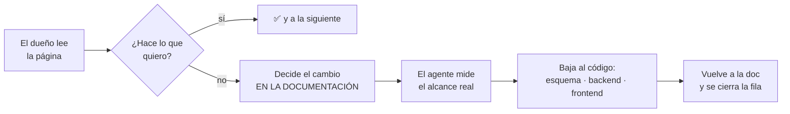

# Auditoría del modelo de negocio, dirigida por el dueño — desde la documentación

> **Qué es.** El dueño recorre la sección [`/modelo/`](http://localhost:4321/modelo/) del sitio,
> página por página, y decide si **el modelo hace lo que él quiere que haga**. Cuando algo no
> encaja, el cambio se decide **en la documentación** y baja al código; al cerrarlo, la
> documentación se vuelve a poner al día.
>
> **Quién decide.** El dueño. El agente **mide, propone y ejecuta lo aprobado**. Ninguna tarea de
> aquí se cierra sin una decisión suya escrita.

---

## §0 · Control de ejecución

Una fila por página del recorrido, en el orden en que se leen. **Los identificadores no se
renumeran**: se citan en commits y en la bitácora.

Estados: `⬜` sin empezar · `🟡` a medias (di **dónde te quedaste**) · `⛔` bloqueada (di **por qué
y por quién**) · `✅` cerrada, con evidencia y fecha. **Un `✅` con la evidencia vacía no vale.**

| Tarea | Qué entrega | Estado | Evidencia | Fecha |
|---|---|:--:|---|---|
| **AM-00** | `/modelo/` — la lectura de entrada revisada: las dos mitades, la cadena y «de dónde sale cada cosa» dicen lo que el dueño quiere que digan | ⬜ | | |
| **AM-01** | `/modelo/siembra/` — de qué parte un sistema vacío: los siete pasos del arranque son los que deben ser | ⬜ | | |
| **AM-02** | `/modelo/organizacion/` — unidad, cargo, puesto y ocupación: la silla y quien se sienta | ⬜ | | |
| **AM-03** | `/modelo/proceso/` — proceso, configuración versionada y sus tres coordenadas | ⬜ | | |
| **AM-04** | `/modelo/reparto/` — alcance × política: ¿se expresa lo que la universidad necesita? | ⬜ | | |
| **AM-05** | `/modelo/entregable-y-ediciones/` — el libro y sus impresiones; ámbito, campos y semilla | ⬜ | | |
| **AM-06** | `/modelo/vinculo/` — los tres modos (`single` · `replicated` · `routed`) | ⬜ | | |
| **AM-07** | `/modelo/disparo/` — cuándo la declaración se convierte en trabajo, e idempotencia | ⬜ | | |
| **AM-08** | `/modelo/entregable-concreto/` — la unidad de trabajo real y su identidad de tres patas | ⬜ | | |
| **AM-09** | `/modelo/tenencias-y-relevo/` — quién lo debe, y qué pasa cuando cambia | ⬜ | | |
| **AM-10** | `/modelo/documento/` — rondas, correcciones y anexos | ⬜ | | |
| **AM-11** | `/modelo/flujo-de-entrega/` — quién lo rellena y quién lo revisa | ⬜ | | |
| **AM-12** | `/modelo/flujo-de-firma/` — quién firma, en qué orden y en qué sitio del papel | ⬜ | | |
| **AM-13** | `/modelo/cierre/` — el archivo sellado y lo que se dijo por el camino | ⬜ | | |
| **AM-14** | `/modelo/vocabularios-de-estado/` — qué estados existen y cuáles protege la base | ⬜ | | |
| **AM-15** | `/modelo/mapa-completo/` — el mapa refleja el modelo ya revisado | ⬜ | | |
| **AM-16** | `/modelo/lo-que-no-cierra/` — las deudas conocidas, con la decisión del dueño sobre cada una | ⬜ | | |

**16 tareas + la de entrada = 17.** `AM-15` y `AM-16` van **al final a propósito**: el mapa y las
deudas solo se pueden dar por buenos cuando los trece eslabones están revisados.

> **Al cerrar una tarea se actualiza esta tabla EN EL MISMO COMMIT** que el cambio que la cierra, y
> se enseña el avance en ese mismo turno con las dos tablas de
> [§6 de `CLAUDE.md`](./CLAUDE.md). No al cerrar la fase; en el turno.

---

## 1 · Qué NO es esto

**No es** [`plan_data/auditoria-modelo-2026-08.md`](./plan_data/auditoria-modelo-2026-08.md), que
ya existe y sigue viva. Aquélla es la **bitácora técnica** del frente 9 · D7: agentes buscando
**contradicciones** entre lo que el esquema declara y lo que el código hace. Es trabajo de máquina
sobre hechos comprobables.

Ésta pregunta otra cosa, que ninguna máquina puede contestar: **¿es esto lo que el negocio
quiere?** Un modelo puede ser perfectamente coherente —esquema, código y documentación de acuerdo—
y aun así modelar mal la universidad.

**Las dos conviven y se alimentan.** Si al revisar una página aparece una contradicción técnica, va
a la bitácora de D7, no aquí. Si en D7 aparece una pregunta de negocio, viene aquí.

---

## 2 · El bucle de trabajo



**El orden importa y no es negociable:** la documentación es donde se decide, no donde se apunta lo
ya hecho. Un cambio que empieza por el código deja la página mintiendo hasta que alguien se acuerda
— y este repositorio tiene medido lo que eso cuesta: el sitio se escribió con `develop` en
`427ecd5`, y **333 commits después había unas 60 afirmaciones falsas**.

---

## 3 · Lectura obligatoria antes de tocar nada

**En este orden.** Saltarse el 3 y el 4 es lo que produce las mediciones falsas.

| # | Qué | Por qué |
|---|---|---|
| 1 | [`CLAUDE.md`](../../CLAUDE.md) de la raíz | El modelo de emisión, el entregable, las capas y las reglas al mover código |
| 2 | [`docs/planes/CLAUDE.md`](./CLAUDE.md) | **La norma de esta carpeta**: el control de ejecución, el mismo commit, y el formato fijo del avance (§6) |
| 3 | [`referencia/metodo.md`](./referencia/metodo.md) | 18 reglas, cada una con su fallo real detrás, y la lista de **lo que NO hay que tocar** |
| 4 | La §4 de este documento | Las cinco reglas duras de esta auditoría |
| 5 | [`plan_data/auditoria-modelo-2026-08.md`](./plan_data/auditoria-modelo-2026-08.md) | Qué se ha mirado ya por el lado técnico, para no repetirlo |
| 6 | [`auditoria-artefacto-modelo-2026-08-26.md`](./auditoria-artefacto-modelo-2026-08-26.md) | Cómo se verifica una afirmación contra el código, con tres errores reales de ejemplo |
| 7 | [`plan_data/referencia-esquema.md`](./plan_data/referencia-esquema.md) | La referencia medida del esquema |

Y la fuente que se audita: **http://localhost:4321/modelo/** — 17 páginas. Se levanta con
`bash scripts/docker-env.sh dev up -d docs` desde el worktree principal.

---

## 4 · Las cinco reglas duras

### 4.1 · Se verifica contra el CÓDIGO, nunca contra documentación

Ni contra el artefacto original, ni contra estas páginas, ni contra `docs/planes/`. **Todos han
mentido ya.** Una evidencia que apunta a un `.md` no es evidencia: se rechaza.

Lo que sí vale: `backend/database/postgres_schema.sql`, el código de `backend/services/`, una
consulta al catálogo de PostgreSQL, o la salida de un gate.

⚠️ **Y `grep` sobre el esquema tampoco basta.** Medido el 2026-08-26: contando `FOREIGN KEY` con
`grep` salen **145**; el catálogo dice **147**. Dos se declaran con `REFERENCES` en línea. Para
cifras, **consulta la base**.

### 4.2 · Recrea la base antes de medir

Desde `TD7-s` (2026-08-24) el esquema **describe la forma y no converge bases anteriores**: no
queda ni un `ALTER TABLE`. Una pila levantada hace tiempo conserva la forma vieja, y medir contra
ella **da respuestas falsas sin avisar**.

Ya mordió en la auditoría anterior: la pila B decía que `process_target_rules.recipient_policy`
admitía `one_per_unit` cuando el esquema dice `unit_head`, y la página estuvo a punto de darse por
buena. `npm run test:char:run` resetea, siembra y deja los contratos verdes.

### 4.3 · Los datos de dev son fixtures, no fuente de verdad

**No hay datos en producción.** Una afirmación del tipo «comprobado en la base actual: el mismo
entregable está vinculado dos veces» describe una **semilla**, no el modelo. Sirve para ilustrar
que algo *es posible*; nunca para afirmar que algo *es así*.

### 4.4 · Analizar no es aplicar

El dueño pide analizar mucho más a menudo de lo que pide ejecutar. **«Haz el plan» no es
«ejecútalo».** Ante una decisión de diseño: **una pregunta por turno**, con dónde mirar para
contestarla, y se espera.

### 4.5 · Worktree propio para cambiar código

Cuando una tarea de aquí baje al código, **worktree y pila propios** —salvo que el dueño asigne
otra cosa—. Leer, medir y consultar la base sí puede hacerse en el principal.

```bash
git worktree add -b <rama> ../deasy-<algo> develop
cd ../deasy-<algo> && bash scripts/stack.sh <letra> up -d
```

---

## 5 · Mapa: qué tabla toca cada tarea

Lo que hay que tener delante al revisar cada página. Sale de las tablas que la página **nombra con
backticks**; el esquema es `backend/database/postgres_schema.sql`.

| Tarea | Página | Tablas |
|---|---|---|
| AM-01 | La siembra | `processes` · `process_definition_series` · `process_definition_versions` · `process_definition_period_types` · `process_definition_templates` · `process_target_rules` · `template_seeds` · `deliverables` · `template_artifacts` · `template_artifact_fields` · `terms` |
| AM-02 | La organización | `units` · `unit_positions` · `cargos` · `position_assignments` · `relation_unit_types` |
| AM-03 | El proceso | `processes` · `process_definition_versions` · `process_definition_series` · `process_definition_period_types` · `terms` · `term_types` |
| AM-04 | El reparto | `process_target_rules` · `unit_positions` · `position_assignments` · `task_item_tenures` |
| AM-05 | Entregable y ediciones | `deliverables` · `template_artifacts` · `template_artifact_fields` · `template_seeds` |
| AM-06 | El vínculo y los modos | `process_definition_templates` · `template_artifacts` |
| AM-07 | El disparo | `process_runs` · `tasks` · `task_items` · `unit_positions` · `persons` |
| AM-08 | El entregable concreto | `task_items` · `task_item_tenures` · `document_versions` |
| AM-09 | Quién lo debe | `task_item_tenures` · `task_items` · `position_assignments` |
| AM-10 | Rondas y correcciones | `document_versions` · `document_version_uploads` · `document_attachments` · `task_items` |
| AM-11 | El flujo de entrega | `fill_flow_templates` · `fill_flow_steps` · `document_fill_flows` · `fill_requests` |
| AM-12 | El flujo de firma | `signature_flow_templates` · `signature_flow_steps` · `signature_flow_instances` · `signature_requests` · `signature_request_statuses` · `signature_statuses` · `document_signatures` |
| AM-13 | El documento final | `document_workflow_observations` |
| AM-14 | Vocabularios de estado | transversal — las **33** restricciones `CHECK` del esquema |
| AM-15 | Mapa completo | las **38** de la cadena |
| AM-16 | Lo que no cierra | transversal |

---

## 6 · Cómo se registra un hallazgo

Cada revisión produce **una de estas cuatro cosas**, y se escribe en la fila de la tarea:

| Salida | Qué se hace |
|---|---|
| **Conforme** | `✅` con la evidencia de qué se comprobó y contra qué. Nada más |
| **La página miente** | Se corrige la página. **Es documentación, no modelo**: no baja al código |
| **El modelo no es el que quiero** | Decisión del dueño escrita, luego el cambio doc → código → doc. Si es grande, abre su propia sub-tarea `AM-NN-a`, `AM-NN-b`… |
| **Contradicción técnica** | A la bitácora de [D7](./plan_data/auditoria-modelo-2026-08.md), no aquí |

Y si al medir se descubre que **una ficha de este plan se equivoca**, se corrige y se marca como
tal — **no se borra**. Precedente vivo: el defecto 1.9 estaba en la lista, no era un defecto, y
aplicarle el arreglo «obvio» habría dejado sin chat a 8 de 10 asignados.

---

## 7 · Trampas medidas, para no volver a pisarlas

1. **Un `CHECK` nuevo no se aplica a una base que ya existe.** No hay `ALTER TABLE`: todo es
   `CREATE TABLE IF NOT EXISTS`. Un esquema recreado desde cero rechaza el valor retirado; uno vivo
   lo conserva **en silencio**.
2. **El `CHECK` de `resolver_type` no manda del todo.** El JSONB `signature_flow_steps.signers` no
   lo valida nadie y **manda sobre la columna**. Un paso legado puede traer por ahí un valor
   retirado (defecto **1.19**).
3. **`task_items.assigned_person_id` es una CACHÉ**, no el dato. Su único escritor es el trigger
   `trg_task_item_tenures_sync`. Para mover el responsable existe el traspaso, no un `UPDATE`.
4. **El SQL no lo valida nadie hasta que se ejecuta esa rama.** Los tres gates obligatorios corren
   en CI desde el 2026-08-26, pero un `UPDATE … INNER JOIN … SET` sigue siendo texto válido hasta
   que alguien llama a esa ruta.
5. **Los diagramas de `/referencia/modelo-datos/` son ARTEFACTOS.** Se regeneran con
   `bash scripts/docs/gen-dbml.sh`; editarlos a mano no sirve y CI lo detecta. Si una tarea cambia
   el esquema, **se regenera en el mismo commit**, y una tabla nueva necesita dominio en
   `scripts/docs/dominios.json`.
6. **Los enlaces internos del sitio no los valida el build de Astro.** Los cubre
   `node scripts/docs/check-enlaces-internos.mjs`, que corre en `docs-links.yml`.

---

## 8 · Cómo se arranca un turno

1. `bash scripts/docker-env.sh dev up -d docs` → **http://localhost:4321/modelo/**
2. Leer §0 y localizar la primera fila que no esté en `✅`.
3. Leer esa página **entera**, con su tabla del §5 delante y el esquema abierto.
4. Contrastar contra el **código** cada afirmación con cifra o garantía.
5. Enseñar al dueño lo encontrado y **preguntar lo que sea decisión suya — una cosa por turno**.
6. Ejecutar lo aprobado, cerrar la fila **en el mismo commit**, y enseñar el avance.
