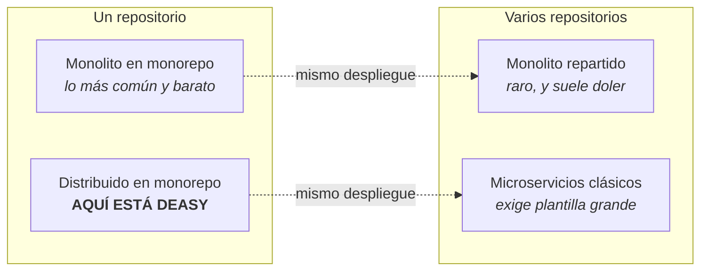
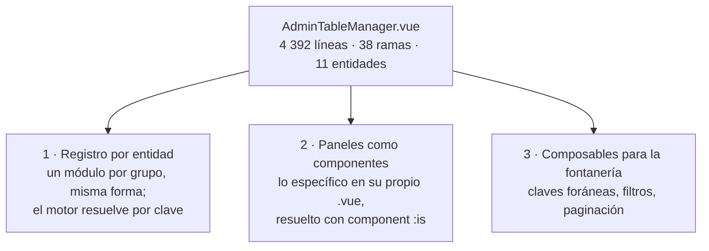

:::note[Página escrita a mano]
Esta página **no sale de `docs/arquitecturas/arquitectura-deasy.tex`**: se escribió directamente,
el 2026-08-22, midiendo el repositorio. No está en `paginas.tsv` y el troceador ya no la borra.
:::

Medido sobre `develop` en `e5f8cbe3`, con SonarQube y con lectura directa del código. Lo que aquí
se afirma con cifras se puede reproducir; lo que no lleva cifra es criterio, y está señalado.

## 1 · Monorepo no es lo mismo que monolito

Es la confusión más común del vocabulario moderno, y se disuelve al ver que cada término responde a
una pregunta distinta.

| Término | Qué decide | Pregunta que responde |
|---|---|---|
| **Monorepo** | Gobernanza del código fuente | ¿Dónde vive el código? |
| **Arquitectura monolítica** | Despliegue y ejecución | ¿Cómo se ejecuta el sistema? |

Un **monorepo** es un solo repositorio de control de versiones que contiene varios proyectos con
ciclos de vida propios. Afecta a cómo se versiona, se revisa y se atomizan los cambios; **no dice
nada sobre cómo se ejecuta el sistema**.

Una **arquitectura monolítica** despliega toda la funcionalidad como *una sola unidad*, en un
proceso, con llamadas a función en memoria entre módulos. Su contrario no es «monorepo»: es una
arquitectura **distribuida**, con módulos en procesos separados que se hablan por la red.

Los dos ejes son independientes, así que las cuatro combinaciones existen:

### Dónde está Deasy

**Monorepo: sí, y deliberado.** Un repositorio con **cuatro cadenas de herramientas
independientes** — `frontend/` con pnpm, `backend/` con npm, `docs/` con pnpm y `signer/` con pip.

**Monolito: no del todo.** El sistema se despliega como **siete contenedores**, y uno de ellos —el
firmante— es un servicio de verdad: proceso propio, *runtime* propio (Python frente a Node) y
comunicación **asíncrona por RabbitMQ y MinIO**, no por llamada a función.

:::tip[La etiqueta precisa]
Deasy es un **monorepo** que contiene un **monolito modular** (el backend Express, un despliegue con
sus módulos separados por carpetas) más **un microservicio satélite** (el firmante) integrado por
mensajería, y un **cliente SPA** servido aparte.

Eso *no* son microservicios. Un cliente web servido por Nginx no convierte a nadie en arquitectura
distribuida: es la separación cliente–servidor de toda la vida.
:::

**Por qué importa en la práctica.** «Romper el monolito» es un cambio de *despliegue*: transacciones
ACID que pasan a ser sagas, latencia de red donde había una llamada, y trazas que hay que construir.
«Separar repositorios» es un cambio de *gobernanza*: versionado independiente a cambio de perder el
cambio atómico. Confundirlos hace pagar el precio de uno esperando el beneficio del otro.

## 2 · Los seis estilos que conviven aquí

Un sistema real nunca «es» una arquitectura: aplica estilos distintos en planos distintos.

| Estilo | Dónde vive | Evidencia |
|---|---|---|
| **En capas** *(layered)* | `routes` → `controllers` → `services` → `config/postgres` | Cero violaciones medidas: 0 saltos de capa, 0 `req`/`res` filtrados a servicios |
| **Monolito modular** | `services/` en 14 subdominios | 94 ficheros · 26 779 líneas |
| **Cliente–servidor** | Vue 3 contra `/deasy/v1` tras Nginx | 162 endpoints |
| **Dirigida por eventos** | Firma (RabbitMQ + MinIO), tiempo real (Socket.IO) | `rabbitmq_http.js`, `RealtimeGateway.js` |
| **Rebanada vertical** *(feature-based)* | `modules/<dominio>/` en el frontend | 7 módulos · 148 ficheros · 45 960 líneas |
| **Dirigida por metadatos** | El CRUD de administración | `sqlTables.js` (1 014 L) + un motor único |

El sexto es el más singular: **en vez de una pantalla por entidad, la entidad se describe como datos
y un motor genérico la renderiza**. Ventaja enorme —una tabla nueva no cuesta código— y un coste
concreto que aparece más abajo.

### Cuál conviene: la que ya hay

Se evaluaron **quince arquitecturas** contra este repositorio el 2026-08-09 —monolítica, modular, en
capas, N-capas, SOA, microservicios, *serverless*, dirigida por eventos, P2P, *space-based*,
hexagonal, *clean*, *onion*, DDD, y los patrones CQRS, *Event Sourcing*, *Pipes & Filters*,
*Blackboard* y *Broker*—. **Ninguna baja la complejidad de este sistema.**

Y las tres pruebas son internas, no teóricas:

1. **El firmante ya está distribuido al máximo** y es **el fichero más complejo del repositorio**
   (`app.py`, 296 de complejidad cognitiva). Separarlo no le quitó un punto, y le añadió dos riesgos
   de seguridad que existen *únicamente* porque está fuera.
2. **El tiempo real se distribuyó y se deshizo, y salió bien.** Al colapsarlo dentro, la
   autorización se *reutiliza* en vez de duplicarse.
3. **`deasy-analytics` es el aviso**: un microservicio *sin código* lleva meses desplegado en QA y
   producción. El sobre del microservicio se paga aunque esté vacío.

:::caution[Lo que impide cualquier corte, medido]
El **45 % de las claves foráneas** cruza cualquier frontera de dominio que se dibuje; hay **ciclos
bidireccionales** entre procesos ↔ plantillas ↔ firma, así que ningún lado puede ser dueño del dato;
y de la **veintena de puntos donde se abre una transacción, ninguno cae dentro de un solo
subdominio**. Cada corte convierte una transacción ACID en una saga, sin trazas y con un mantenedor.
:::

### Qué evitar, y el criterio que lo sustituye

| Arquitectura | Veredicto | Por qué |
|---|---|---|
| **Microservicios** | evitar | Las tres pruebas de arriba. Son una solución *organizativa* a un problema de coordinación entre equipos que aquí no existe |
| **Serverless** | evitar | Firmar con pyHanko y compilar LaTeX son cargas largas con estado en disco: lo contrario de una función efímera |
| **CQRS / Event Sourcing** | evitar | Resuelven asimetría lectura/escritura a gran escala y auditoría total. No hay ni una cosa ni la otra |
| **Hexagonal / Clean / Onion** | ya la tienes | La inyección existe (`constructor(pool = getPostgresPool())`). **Sin TypeScript, un «puerto» es un comentario**: adoptarlas es reetiquetar carpetas |
| **DDD táctico** | a medias | Lo valioso ya está: el lenguaje ubicuo (el glosario del entregable) y los **diez agregados que la base dibuja** con sus `ON DELETE CASCADE` |

«No a los microservicios» no es una regla, es el resultado de un criterio: **un componente se gana
estar fuera cuando tiene *runtime* ajeno, ejecuta código externo, o carga la CPU de forma que
perjudicaría al resto** — no cuando simplemente «es otro tema». El firmante cumple los tres. El
compilador de LaTeX también, y por eso sí debe salir. Un editor web no cumple ninguno.

## 3 · Los patrones que ya usas

| Patrón | Dónde | Veredicto |
|---|---|---|
| **Registro / tabla de despacho** | `TABLE_HOOKS`, `sqlTables.js`, `allowedByAction` | El patrón estrella de este repo |
| **Command** | Pila de compensación de `saveTemplateArtifactDraft` | Bien puesto |
| **Chain of Responsibility** | *Middlewares* de Express; cadena de extractores del firmante | Bien puesto |
| **Facade / Adapter** | `httpClient.js`; `rabbitmq_http.js` | Bien puesto |
| **Singleton** | El *pool* de PostgreSQL | Legítimo aquí |
| **Observer / Pub-Sub** | `RealtimeGateway`; colas del firmante | Bien puesto |
| **Repository** | De facto en `chatStore.js` y `dossierStore.js` | A medias |
| **Unit of Work** | **Ausente** — una veintena de transacciones a mano | Hueco real |
| **State** | **Ausente, y correcto**: los estados son datos congelados | No lo metas |
| **Strategy** clásico | **Ausente** — no hay eje de variación en ejecución | No hace falta |

### El hallazgo que vale más que la tabla

Los cuatro mayores desplomes de complejidad **no los produjo ningún patrón GoF**:

| Caso | Cognitiva | Qué lo curó |
|---|---|---|
| `validateTableRules` | 99 → 0 | Sustituir condicional por registro |
| `postgres.js` | 108 → 15 | Tabla de tramos + un recorrido |
| `useAdminSubmitFlow` | 67 → 7 | Tabla + extracción |
| `saveTemplateArtifactDraft` | 164 → 21 | Extracción y, en el núcleo, **Command** |

> **La complejidad de Deasy no viene de que falte polimorfismo. Viene de duplicación y de cascadas
> de condicionales defensivos.**

`postgres.js` lo enseña mejor que ninguno: se atacó pensando «hazlo declarativo», y el hallazgo real
fue que **las dos funciones eran el mismo autómata copiado palabra por palabra**. El olor era
*código duplicado*, no *switch statements*. Un patrón habría añadido clases sin tocar la causa.

El criterio completo —con la lista de sitios donde **no** hay que meter un patrón— vive en el
repositorio, en `docs/planes/referencia/patrones-diseno.md`. No se publica aquí porque es un
documento de trabajo y cambia con cada medición.

## 4 · Con qué criterio se decide una carpeta

Hay dos criterios canónicos, y son opuestos:

- **Paquete por capa** — se agrupa por *qué tipo de cosa es*. La regla de dependencia se ve de un
  vistazo y se puede verificar; el coste es que **añadir una funcionalidad toca cinco carpetas**.
- **Paquete por funcionalidad** — se agrupa por *de qué trata*. **Lo que cambia junto vive junto**
  (principio de clausura común); el coste es que la capa deja de ser visible.

Deasy usa **los dos, en sitios distintos**:

| Parte | Criterio | Forma real |
|---|---|---|
| **backend** | Por capa arriba, por dominio dentro | `routes/` `controllers/` `middlewares/` son capas puras; dentro de `services/` se pasa a dominio |
| **frontend** | Por funcionalidad, con dos capas horizontales | `modules/<dominio>/` con sus `views`, `components`, `composables`; más `shared/` y `core/` |
| **signer** | Plano, y por eso duele | Casi todo en `app.py`; su plan de corte es por responsabilidad |
| **tests** | Colocación | El unitario junto a su módulo; solo el arnés de caracterización aparte |

> **Junta lo que cambia por la misma razón; separa lo que cambia por razones distintas.** Si al tocar
> una funcionalidad abres siempre las mismas cinco carpetas, la estructura está partida por el eje
> equivocado.

## 5 · El caso `AdminTableManager`

Es el ejemplo vivo de lo que cuesta el motor dirigido por metadatos. Medido el 2026-08-22:

| | |
|---|---|
| Líneas del fichero | **4 392** |
| Solo de plantilla | 1 157 |
| Ramas por nombre de tabla | **38** |
| Entidades distintas dentro | **11** |
| Complejidad cognitiva | 300 |

Treinta y ocho condicionales sobre `props.table.table === "…"`: `process_definition_versions` 10,
`template_artifacts` 9, `processes` 4, `units` 3, `unit_positions` 3, y seis entidades más. **Es un
motor genérico con once excepciones cosidas por dentro** — el olor que la regla del repositorio
prohíbe: *no injertes casos especiales en el camino genérico*.

### Descomponerlo sí; con clases, no

No por dogma, sino por cinco razones concretas:

1. **Las entidades son datos, no tipos.** Lo que distingue una tabla de otra vive en `sqlTables.js`
   como filas de configuración. Una jerarquía crearía un segundo sistema de tipos en paralelo, y
   cada entidad nueva habría que declararla dos veces. Es el olor de las *jerarquías paralelas*.
2. **Sin TypeScript, una clase no da nada que no dé un objeto.** No hay interfaz que el compilador
   verifique; lo que en Java sería un contrato aquí es una convención.
3. **Vue 3 con Composition API es funcional.** Las clases pelean con la reactividad: `this` no
   sobrevive a la desestructuración y los `ref` se desenvuelven en unos sitios y no en otros.
4. **La evidencia del propio repositorio**: cuatro desplomes de complejidad por tablas y extracción,
   **cero por jerarquías**.
5. **El criterio del catálogo GoF.** Un patrón exige un eje real de variación *en ejecución*. Aquí
   varía la *configuración*, que se conoce antes de arrancar: eso es una tabla.

La descomposición que sí encaja son tres movimientos, y `composables/fk/` indica que el camino ya
está empezado:

Formalmente **sí es un patrón**: es *Strategy* implementado con datos en vez de con herencia — cada
módulo de entidad es una estrategia y el registro es el selector. El motor sigue siendo genérico; lo
que cambia es que las excepciones dejan de estar cosidas por dentro.

## 6 · Cinco preguntas antes de meter un patrón

En este orden, y parando en la primera que dé «sí»:

1. **¿Es duplicación?** Compara los dos bloques de verdad, no de memoria. Aquí ha sido la respuesta
   dos veces cuando parecía otra cosa. Si lo es, extrae y para.
2. **¿Es una cascada de condicionales sobre datos?** Entonces es una **tabla**, no una jerarquía.
3. **¿Hay un eje real de variación en tiempo de ejecución?** Si nada varía al ejecutar, no hay
   patrón que aplicar.
4. **¿Tengo red?** Un patrón reorganiza el flujo de control: sin caracterización o unitarios
   delante, no se toca.
5. **¿Baja la complejidad total, o solo la reparte?** Medido: extraer una cascada llevó una función
   de 59 a 32 *pero el trozo extraído se quedó en 25*. Separar por **responsabilidad** baja el
   total; separar por **tamaño** solo lo mueve de sitio.

:::note[El límite que nada cruza]
Los tres ficheros más complejos del repositorio son componentes Vue —`HomeView`,
`AdminTableManager` y `FirmarPdf`—, y **ningún patrón GoF le hace nada a una plantilla de dos mil
líneas**. Su única cura es extraer componentes y bajar la lógica a *composables*: trabajo artesanal,
que se verifica en el navegador y no admite atajos.
:::
