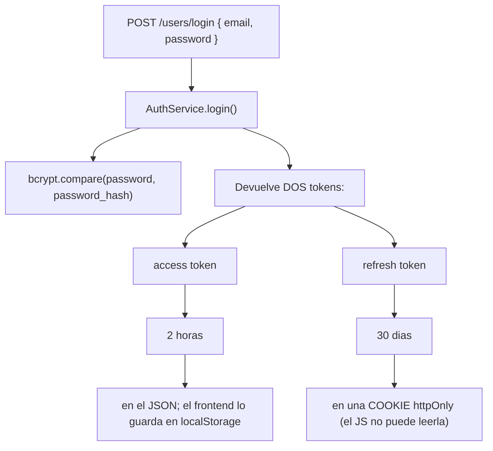
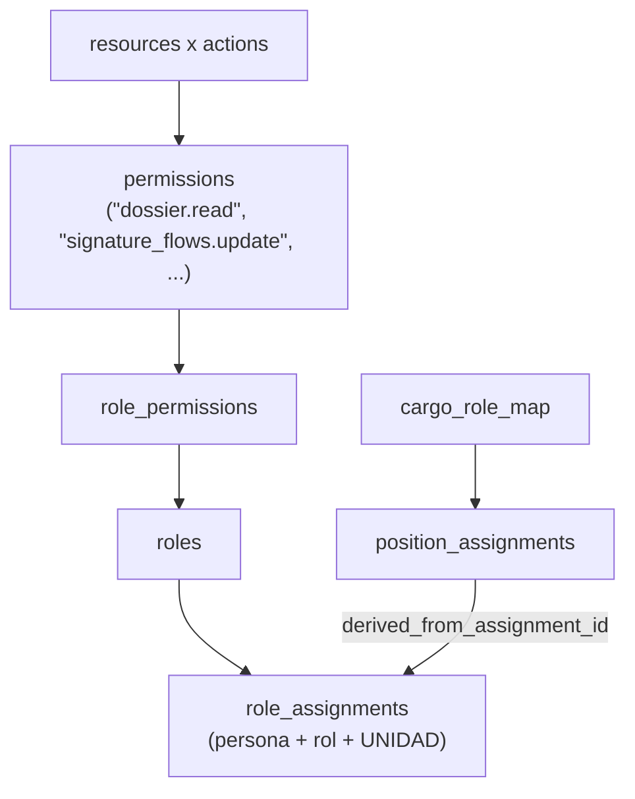

Son **dos cosas distintas** y conviene no confundirlas nunca:

- **Autenticación** = “¿quien eres?” → JWT

- **Autorización** = “¿puedes hacer esto?” → RBAC

## Autenticación (JWT)

:::tip[Por que dos tokens]

El *access token* viaja en cada petición, así que si te lo roban el daño dura poco (dos horas). El *refresh token* solo se usa para pedir uno nuevo, y al ser una cookie `httpOnly`, un script malicioso inyectado en la página **no puede leerlo** desde JavaScript. Es defensa en profundidad: dos secretos con exposiciones distintas.

:::

Detalles concretos: el access token se firma con `JWT_SECRET` y expira en `60*60*2` segundos; el refresh con `JWT_REFRESH` y expira en `60*60*24*30`. La cookie lleva `httpOnly: true` y `secure` activo salvo en modo desarrollador.

El payload del JWT es **solo `{ uid }`**. Nada de roles ni permisos dentro. Eso es deliberado: si metieras los permisos en el token, revocarle un rol a alguien no tendría efecto hasta que expirase. Aquí los permisos se resuelven **contra la base de datos en cada petición**.

La política de contrasenas vive en `backend/utils/passwordPolicy.js` (`evaluatePasswordPolicy`, exige 3 de 5 criterios) y la aplica `backend/middlewares/val_password.js`, que además *hashea en el sitio* `req.body.password` con bcrypt y salt 10 antes de llamar a `next()`.

### Se entra SÓLO por correo

Hasta el **2026-08-29** el login aceptaba también el número de documento, y la pantalla adivinaba
cuál era por si llevaba una arroba. Se quitó, y conviene saber por qué **no** fue por la razón obvia.

La consulta era incorrecta —resolvía `numero = ?` **a secas**, cuando la unicidad de un documento es
`(tipo, país, número)`, así que podía emparejar a la persona equivocada—, pero eso se arreglaba
acotándola. Lo que no se arregla es la **estabilidad**: un pasaporte se renueva **con número nuevo**,
y quien entrara con él perdería su acceso al renovarlo. Un documento es un dato que caduca; el correo
lo controla la persona y no.

De paso se fue un defecto que llevaba tiempo y no se veía: el frontend borraba del identificador todo
lo que no fuera dígito, así que el pasaporte `AB123456` viajaba como `123456` mientras el backend
esperaba `AB123456`. **El acceso por pasaporte estaba roto desde la pantalla**, y no se notaba porque
todos los documentos sembrados eran cédulas.

### «Olvidé mi correo» — y por qué pide la contraseña

`POST /users/recuperar-correo` es **público** y devuelve el correo de quien pruebe ser dueño de un
documento **con su contraseña**.

La contraseña no es un capricho: «recuérdame mi correo» y «no reveles quién está registrado» son
**opuestos**. Sin ella, cualquiera con un número de cédula —semipúblico en Ecuador— podría averiguar
si esa persona tiene cuenta. Con ella deja de ser un oráculo, y no hace falta ni limitador de
intentos ni bitácora.

:::caution[Los dos fallos son indistinguibles, también en el reloj]

«Ese documento no existe» y «esa contraseña no es» devuelven **el mismo 401 con el mismo texto**. Y
la contraseña **se compara siempre** —contra un hash señuelo si la persona no existe— porque si no,
el tiempo de respuesta delataría lo que el mensaje calla. Medido: 67 ms contra 70 ms.

:::

Quien haya olvidado **las dos cosas** no tiene camino automático: el reinicio de contraseña también
empieza pidiendo el correo. La pantalla lo dice y remite a una persona.

## Autorización (RBAC)

RBAC son las siglas de *Role-Based Access Control*, control de acceso basado en roles. El modelo es:

Trece recursos (`account`, `dossier`, `security`, `people`, `units`, `academic_terms`, `process_definitions`, `process_execution`, `templates`, `documents`, `fill_flows`, `signature_flows`, `contracts`) por cinco acciones (`read`, `create`, `update`, `delete`, `manage`) dan **65 permisos**. Y hay **13 roles**.

Dos sutilezas importantes:

1.  **Los roles son contextuales a una unidad.** Puedes ser `GestorProcesos` en la Facultad de Ingeniería y nadie en el resto de la universidad. La tabla `role_assignments` lleva `unit_id` y un `max_depth`: hasta que profundidad del subarbol organizativo se hereda el rol.

2.  **Hay roles derivados automáticamente del puesto.** La tabla `cargo_role_map` dice, por ejemplo, “el cargo DOCENTE otorga el rol GestorEjecucionProcesos”. Y un **trigger de PostgreSQL** (`trg_position_assignments_after_insert`) crea esas asignaciones con `source=’derived’` cuando alguien ocupa el puesto, y las revoca cuando lo deja. Ese mismo trigger **reasigna los entregables abiertos** al nuevo ocupante.

Los middlewares están en `backend/middlewares/rbac.js`:

| **Middleware**                    | **Que comprueba**                                                                                |
|:----------------------------------|:-------------------------------------------------------------------------------------------------|
| `loadAccessContext`               | Carga roles y permisos en `req.auth` / `req.access`; 401 si el usuario no existe o esta inactivo |
| `requirePermissions(reqs, {all})` | Que tenga el permiso (OR por defecto, AND con `{all:true}`)                                      |
| `requireAnyRole(roles)`           | Que tenga alguno de los roles indicados                                                          |
| `requireRouteUserAccess({...})`   | Que sea **el dueno** del recurso **o** tenga rol elevado, *y* además el permiso                  |
| `requireCedulaAccess({...})`      | Igual, comparando por **número de documento**. Sólo lo usa el expediente                        |
| `requirePersonAccess({...})`      | Igual, comparando por **id de persona**. La foto y el escaneo entran por aquí                   |
| `requireDossierAccess(action)`    | Azucar sintáctico sobre el anterior con `resource: "dossier"`                                    |
| `requireSqlAdminPermission(...)`  | Deduce el recurso desde `req.params.table` y la acción desde el método HTTP                      |

:::caution[Por que existe requireDossierAccess]

Por un **IDOR** real y cerrado. IDOR (*Insecure Direct Object Reference*) es el fallo donde cambiando un identificador en la URL accedes a datos que no son tuyos. Aquí el guard miraba *la tarea* en vez de *el entregable*, y un docente podia descargar el documento de otro.

:::

El catalogo canonico esta en `backend/config/rbacCatalog.js` (229 líneas) y es también la **fuente de siembra**: `SystemBootstrapService.js` lo importa para poblar roles y permisos, borrando y reescribiendo `role_permissions`. O sea que **el catálogo del código es la fuente de verdad**, no la base.

:::caution[Pero NO se resiembra en cada arranque]
Aquí ponía «en cada arranque», y es falso: `backend/index.js` solo importa `publishBaseSeedAssets`, no `initializeSystem`. La resiembra ocurre **únicamente** desde `POST /system/bootstrap/initialize` —que responde `409` si el sistema ya está instalado— y desde `npm run recover:admin`.

**Consecuencia práctica:** editar `rbacCatalog.js` y reiniciar el backend **no propaga nada**. Los permisos nuevos no llegan a la base hasta que se reinstala o se recupera el admin.
:::
