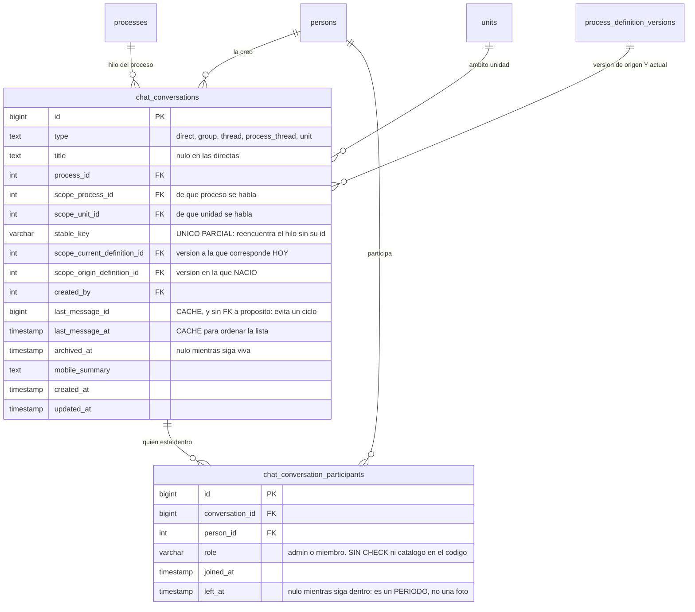
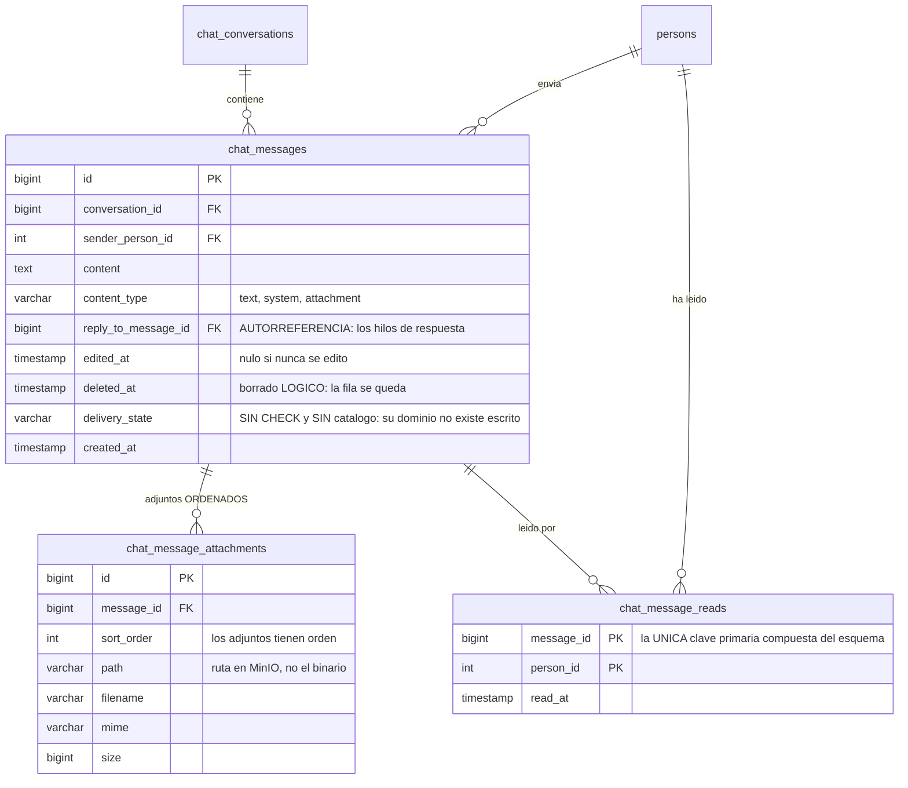
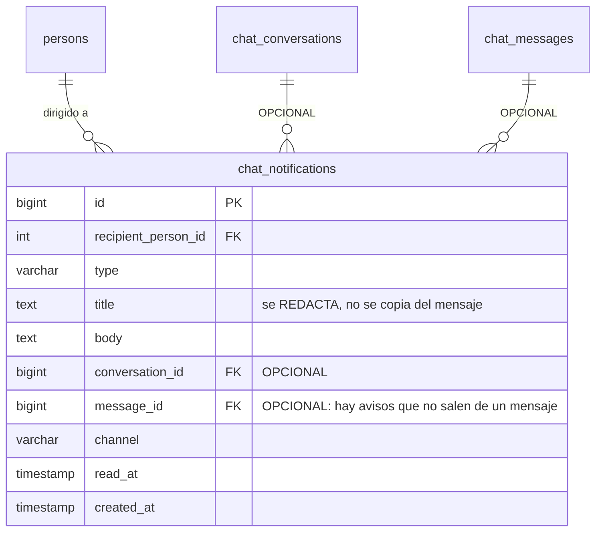

Deasy no tiene un chat aparte: **las conversaciones cuelgan de lo que se está haciendo**. Se puede
hablar directamente con alguien, en grupo, en un hilo, **en el hilo de un proceso** o **en el de una
unidad**, y ese vocabulario lo protege la base.

Son **seis tablas y 52 columnas** —la familia con más claves ajenas del complemento, 17—, y las
sostiene `services/chat/chatStore.js` con ocho servicios alrededor.

## 1 · La conversación y su ámbito

`chat_conversations` es la cabecera, y la mitad de sus columnas existen para una sola cosa: **saber a
qué se refiere el hilo y poder reencontrarlo**.

| Columna | Para qué |
|---|---|
| `type` | `direct` · `group` · `thread` · `process_thread` · `unit`, cerrado por `CHECK` |
| `process_id` | El proceso al que pertenece el hilo |
| `scope_process_id` · `scope_unit_id` | El ámbito: de qué proceso y de qué unidad se habla |
| `scope_origin_definition_id` | **De qué versión de la configuración nació** |
| `scope_current_definition_id` | **A qué versión corresponde ahora** |
| `stable_key` | La clave por la que se reencuentra |
| `last_message_id` · `last_message_at` | Caché para ordenar la lista sin tocar los mensajes |
| `archived_at` | Nulo mientras esté viva |
| `mobile_summary` | Resumen para la vista móvil |

**Las dos definiciones no son redundancia.** Una configuración de proceso se versiona y no se edita
([por qué](/modelo/proceso/)), así que el hilo de un proceso sobreviviría a su propia definición si
sólo guardara una: al versionar, o se quedaría apuntando a una versión retirada, o habría que abrir
un hilo nuevo y partir la conversación en dos. Guardando **de cuál nació** y **a cuál corresponde
hoy**, el hilo es el mismo y se sabe su historia.

Y `stable_key` es lo que permite pedir *«el hilo de este proceso en esta unidad»* sin conocer su
identificador. Lleva un índice único **parcial** —`WHERE stable_key IS NOT NULL`—, que es la forma
idiomática de PostgreSQL para la unicidad condicional y que el esquema usa **sólo dos veces**: aquí y
en `uq_signature_flow_steps_slot`. Las otras **doce** unicidades condicionales se emulan con una
columna generada más un índice único encima, que es el idioma heredado de MySQL — el mismo que usan
las tres invariantes de [empleo](/complemento/empleo/) y el jefe de unidad del organigrama.

## 2 · Quién está dentro

`chat_conversation_participants` lleva `joined_at` y **`left_at`**, y esa segunda columna es la que
convierte la tabla en un historial en vez de una foto: quien sale de una conversación no se borra, se
cierra su periodo. Es el mismo idioma que
[las tenencias](/modelo/tenencias-y-relevo/) usan para el responsable de un entregable.

`role` (20 caracteres) distingue al que administra del que sólo participa. **No tiene `CHECK`**: su
dominio no está protegido por la base ni escrito en ningún catálogo.

## 3 · Los mensajes

`chat_messages` guarda el contenido y **tres marcas temporales que no son lo mismo**: `created_at`
(cuándo se envió), `edited_at` (nulo si nunca se tocó) y `deleted_at` — **el borrado es lógico**, la
fila se queda. Un mensaje borrado que fuera respuesta de otro dejaría un hueco en el hilo si
desapareciera.

`reply_to_message_id` es una **autorreferencia**: los hilos de respuesta se modelan dentro de la
misma tabla. Es una de las cinco autorreferencias del esquema.

`content_type` sí está cerrado (`text` · `system` · `attachment`). **`delivery_state` no**, y además
**no tiene catálogo en ninguna parte del código**: su dominio no existe escrito en ningún sitio. Es
una de las columnas de estado sin `CHECK` que la auditoría del esquema dejó anotadas.

`chat_message_attachments` cuelga del mensaje con `sort_order`, así que los adjuntos tienen orden. Y
guarda `path`, no el fichero: el binario está en MinIO.

`chat_message_reads` es **la única tabla de todo el esquema con clave primaria compuesta**
—`(message_id, person_id)`— y no lleva `id` sintético. Todas las demás tablas-join de Deasy sí lo
llevan, con un índice único encima del par. Aquí no hacía falta: nadie referencia una lectura.

## 4 · Los avisos

`chat_notifications` no es «un mensaje repetido»: es lo que se **manda fuera** de la conversación.
Lleva su propio `title` y `body` —porque el aviso se redacta, no se copia—, su `channel`, y
`conversation_id` y `message_id` **opcionales**: hay avisos que no salen de ningún mensaje.

## Dos cosas del transporte que cambian cómo se lee esto

**El tiempo real es Socket.IO sobre el mismo puerto, no un broker.**
`services/realtime/RealtimeGateway.js` monta los WebSockets sobre el servidor HTTP de Express que ya
existe y **reutiliza el JWT de la aplicación**. Sustituyó a un EMQX externo. Los *rooms* mapean uno a
uno los antiguos *topics*: `user:{id}`, `conversation:{id}`, `process:{id}`.

La consecuencia práctica es que **no hay una segunda fuente de identidad**: quien no puede leer la
conversación por HTTP tampoco puede suscribirse a ella, porque lo decide el mismo
`ChatAuthorizationService`.

:::caution[Aquí había una afirmación falsa, y ya está corregida]
Hasta el 2026-08-27, [Firmas y resto del esquema](/datos/firmas-y-dominios/) decía que en el chat
`person_id`, `process_id` y `unit_id` eran **«claves foráneas lógicas sin constraint, para no
acoplar»**. Dejó de ser cierto en `TD7-c3` (2026-08-24): el catálogo devuelve **once claves foráneas
reales** de `chat_*` y `dossiers` hacia `persons`, `units`, `processes` y
`process_definition_versions`.

Y la premisa que las justificaba era falsa desde antes: `ChatAuthorizationService` ya resolvía los
permisos con `INNER JOIN` contra esas mismas tablas, así que el desacoplamiento no existía — sólo
faltaba la garantía.

**Lo único que sigue sin `constraint` es `last_message_id`**, y eso sí es deliberado:
`chat_conversations` → `chat_messages` → `chat_conversations` sería un ciclo a nivel de tabla, y el
esquema no tiene ninguno.
:::

## Los diagramas

Van en **tres**. Las seis tablas con todos sus campos salen a 2023 px, o sea letra de 10,4 px, por
debajo del mínimo de 12; en dos, el segundo se quedaba en 11,2. El corte sigue la frontera del propio
dominio: **dónde se habla**, **qué se dice** y **qué sale fuera**.

### 1 · La conversación y quién está dentro

Es la mitad que carga con el ámbito: seis de sus claves ajenas salen hacia la cadena para decir de
qué se está hablando.

### 2 · Lo que se dice

### 3 · Lo que sale fuera

El aviso tiene diagrama propio porque **no es un mensaje repetido**: es lo que se manda fuera de la
conversación, con su texto redactado aparte y su canal. Sus dos enlaces al chat son **opcionales** —
hay avisos que no salen de ningún mensaje ni de ninguna conversación.

