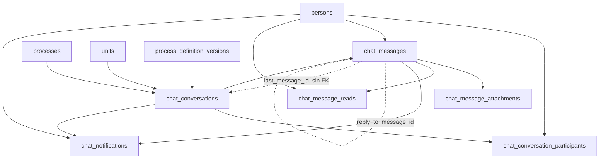

Deasy no tiene un chat aparte: **las conversaciones cuelgan de lo que se está haciendo**. Una
conversación puede ser directa entre dos personas, de un grupo, un hilo, **el hilo de un proceso** o
**el de una unidad**, y ese vocabulario lo protege la base:

```
chat_conversations.type  →  direct · group · thread · process_thread · unit
```

Son **seis tablas y 52 columnas**, y las sostiene `services/chat/chatStore.js` con ocho servicios
alrededor.

## Las seis

| Tabla | Qué guarda |
|---|---|
| `chat_conversations` | La conversación: su tipo, su ámbito, y una caché del último mensaje |
| `chat_conversation_participants` | Quién está dentro, con qué papel, desde cuándo y **hasta cuándo** (`left_at`) |
| `chat_messages` | El mensaje: contenido, tipo, a qué responde, si se editó o se borró |
| `chat_message_attachments` | Los adjuntos de un mensaje, en orden, con su ruta y su tamaño |
| `chat_message_reads` | Quién ha leído qué, y cuándo |
| `chat_notifications` | El aviso que sale de un mensaje, con su canal y si se leyó |



## Tres cosas que no son evidentes

### La conversación de un proceso se reencuentra por una clave estable

`chat_conversations.stable_key` lleva un índice único **parcial** —`WHERE stable_key IS NOT NULL`—,
que es la única vez en todo el esquema que se usa la forma idiomática de PostgreSQL para esto; en el
resto se emula con una columna generada.

Sirve para lo siguiente: el hilo de un proceso tiene que ser **el mismo** cada vez que alguien lo
abre, aunque la configuración del proceso se haya versionado por el camino. Por eso la conversación
guarda **dos** definiciones —`scope_origin_definition_id` y `scope_current_definition_id`—: de cuál
nació y a cuál corresponde ahora. Sin eso, versionar un proceso partiría su conversación en dos.

### `last_message_id` es una caché, y a propósito no lleva clave ajena

`chat_conversations` guarda `last_message_id` y `last_message_at` para poder ordenar la lista de
conversaciones sin tocar los mensajes. Es la única columna del dominio **sin `FOREIGN KEY`**, y no es
un descuido: `chat_conversations` → `chat_messages` → `chat_conversations` sería un ciclo a nivel de
tabla, y el esquema no tiene ninguno.

:::caution[Aquí había una afirmación falsa]
Hasta el 2026-08-27, [Firmas y resto del esquema](/datos/firmas-y-dominios/) decía que en el chat
`person_id`, `process_id` y `unit_id` eran **«claves foráneas lógicas sin constraint, para no
acoplar»**. Dejó de ser cierto en `TD7-c3` (2026-08-24): hoy el catálogo devuelve **once claves
foráneas reales** de `chat_*` y `dossiers` hacia `persons`, `units`, `processes` y
`process_definition_versions`.

Y la premisa que las justificaba era falsa desde antes: `ChatAuthorizationService` ya resolvía los
permisos con `INNER JOIN` contra esas mismas tablas, así que el desacoplamiento no existía — sólo
faltaba la garantía. **Lo único que sigue sin `constraint` es `last_message_id`**, por el ciclo.
:::

### El tiempo real es Socket.IO sobre el mismo puerto, no un broker

`services/realtime/RealtimeGateway.js` monta los WebSockets sobre el servidor HTTP de Express que ya
existe, y **reutiliza el JWT de la aplicación** para autenticar. Sustituyó a un broker EMQX externo.
Los *rooms* mapean uno a uno los antiguos *topics*: `user:{id}`, `conversation:{id}`,
`process:{id}`.

Que el transporte sea el mismo puerto tiene una consecuencia práctica: **no hay una segunda fuente de
identidad**. Quien no puede leer la conversación por HTTP tampoco puede suscribirse a ella, porque lo
decide el mismo `ChatAuthorizationService`.

## Un vocabulario sin proteger

`chat_messages.content_type` sí tiene `CHECK` (`text` · `system` · `attachment`), y
`chat_conversations.type` también. **`chat_messages.delivery_state` no**, y además **no tiene
catálogo en ninguna parte del código**: su dominio no existe escrito en ningún sitio. Es una de las
columnas de estado sin `CHECK` que la auditoría del esquema dejó anotadas.
