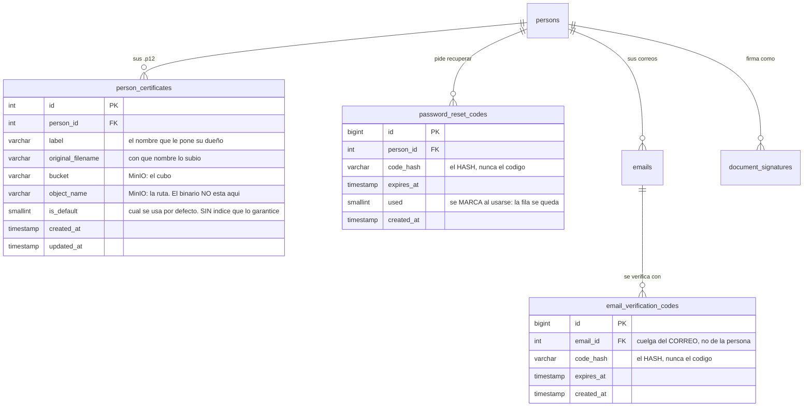

La cadena documental termina en una firma, y una firma sólo vale si **es de quien dice ser**. Estas
tres tablas son lo que sostiene esa afirmación. Son pequeñas —**20 columnas entre las tres**, la
familia más chica del complemento— y ninguna aparece en el mapa de la cadena, pero sin ellas no se
firma ni se entra.

Van juntas porque contestan la misma pregunta desde tres momentos distintos: **al firmar**
(`person_certificates`), **al declarar un correo** (`email_verification_codes`) y **al perder la
contraseña** (`password_reset_codes`).

## 1 · El certificado con el que se firma

`person_certificates` guarda los `.p12` de cada persona — el fichero que el
[microservicio de firma](/signer/) usa para estampar. Y guarda **la referencia, no el fichero**: el
binario vive en MinIO, y la tabla lleva su `bucket` y su `object_name`.

Que sea una tabla y no una columna de `persons` responde a un caso concreto: **un certificado
caduca**. El día que se renueva conviven el viejo —que firmó documentos que siguen siendo válidos, y
cuya firma hay que poder explicar— y el nuevo. Por eso hay varios por persona y por eso hay
`is_default`, que dice cuál se usa si no se pide otro.

`label` es el nombre que le pone su dueño y `original_filename` con cuál lo subió: los dos, porque
un `.p12` descargado de una entidad certificadora se llama algo ilegible y hace falta poder
distinguirlos en una lista.

Lo maneja `services/auth/UserCertificateRepository.js`, y el permiso que lo gobierna sale del
catálogo de RBAC, no de una comprobación suelta.

:::caution[«Uno por defecto» es la única invariante de esta página que NO impone la base]
En todo el esquema, «uno solo de estos por padre» se impone con una **columna generada más un índice
único** —doce veces— o con un índice único parcial —dos—. `person_certificates.is_default` no usa
ninguno: hay un índice sobre `(person_id, is_default)`, pero **no es único**.

Quien mantiene la invariante es el código, en dos sentencias
(`UserCertificateRepository.setDefault`): primero `UPDATE … SET is_default = 0 WHERE person_id = ?`,
después `UPDATE … SET is_default = 1 WHERE id = ?`. Es un leer-modificar-escribir, así que la
garantía depende de que las dos vayan en la misma transacción, no de la base.

El daño potencial es acotado, y conviene decirlo con precisión: aunque quedaran dos marcados, **la
lectura no es ambigua**, porque ordena por `is_default DESC, created_at DESC, id DESC` — gana el más
reciente. No hay fallo observado. Lo que hay es una regla que en el resto del esquema la sostiene
PostgreSQL y aquí la sostiene la aplicación.
:::

## 2 · Los dos códigos de un solo uso

Son gemelos en la forma y distintos en lo que protegen. Los dos guardan **`code_hash`, no el
código**: si la tabla se filtrara, lo que hay dentro no sirve para entrar.

| | `email_verification_codes` | `password_reset_codes` |
|---|---|---|
| Cuelga de | **`emails`** (`email_id`) | `persons` (`person_id`) |
| Prueba que | ese buzón es alcanzable y es tuyo | eres tú quien pide la contraseña |
| Caduca con | `expires_at` | `expires_at` |
| Al consumirse | **se borra la fila** | se marca `used = 1` |
| Deja rastro | no | sí |

### El detalle que cambió, y por qué importa

**`email_verification_codes` cuelga del CORREO, no de la persona.** Cambió el 2026-08-27, cuando los
correos salieron de `persons` a [su propia tabla](/modelo/organizacion/#la-persona-ya-no-lo-lleva-todo-encima),
y no es cosmético: antes la verificación era una **bandera de la persona** (`verify_email`), así que
sólo se podía tener un correo verificado y no se sabía *cuál*. Hoy cada correo se verifica por
separado, que es lo que hace posible tener el institucional y el personal y saber a cuál se puede
escribir.

Lo escribe `services/mail/saveEmailVerificationCode.js`, que **borra los códigos anteriores de ese
mismo correo antes de insertar el nuevo**. Pedir otro código invalida el que hubiera, así que nunca
hay dos vivos a la vez para el mismo buzón — es la misma garantía que daría un índice único, pero
puesta en el código.

### La asimetría que no está escrita en ningún sitio

`password_reset_codes` conserva la fila usada; `email_verification_codes` la borra. La primera deja
constancia de que hubo una recuperación —que es información de seguridad—; la segunda no deja
ninguna. Puede ser deliberado y puede ser arrastre. **No hay ninguna decisión escrita que lo
justifique**, y se anota aquí para que quien lo mire después no tenga que volver a preguntárselo.

Ninguna de las tres tablas tiene `CHECK`: no hay estados que proteger.

## El diagrama

⚠️ **Fíjate en lo que el diagrama NO tiene: una flecha del certificado a la firma.**
`document_signatures` guarda `signer_user_id` —**quién** firmó— pero **ninguna columna que diga con
qué certificado**. Comprobado contra el catálogo: sus cuatro claves ajenas van a `signature_requests`,
`document_versions`, `persons` y `signature_statuses`.

El certificado se resuelve **en el momento de firmar**, a partir de la persona y de su `is_default`.
La consecuencia es que, si alguien renueva su certificado, **las firmas viejas no saben con cuál se
estamparon**: hay que deducirlo del PDF firmado, no de la base. Para verificar una firma de hace un
año eso es justo el dato que falta.
