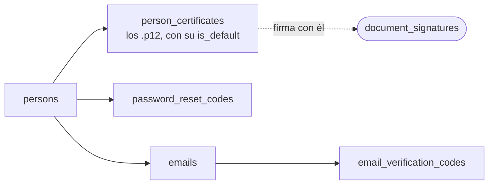

La cadena documental termina en una firma, y una firma sólo vale si **es de quien dice ser**. Estas
tres tablas son lo que sostiene esa afirmación. Son pequeñas —**20 columnas entre las tres**— y
ninguna aparece en el mapa de la cadena, pero sin ellas no se firma ni se entra.

Van juntas porque contestan la misma pregunta desde tres momentos distintos: **al firmar**
(`person_certificates`), **al declarar un correo** (`email_verification_codes`) y **al perder la
contraseña** (`password_reset_codes`).

## El certificado con el que se firma

`person_certificates` guarda los `.p12` de cada persona — el fichero que el microservicio de firma
usa para estampar. Y guarda **la referencia, no el fichero**: el binario vive en MinIO, y la tabla
lleva su `bucket` y su `object_name`.

| Columna | Qué es |
|---|---|
| `label` | El nombre que le pone su dueño, para distinguirlo de los demás |
| `original_filename` | Con qué nombre lo subió |
| `bucket` · `object_name` | Dónde está en MinIO |
| `is_default` | **Cuál se usa si no se dice otra cosa** |

Una persona puede tener **varios**: un certificado caduca, y el día que se renueva conviven el viejo
—que firmó documentos que siguen siendo válidos— y el nuevo. Por eso hay `is_default` y no una
columna en `persons`.

Lo maneja `services/auth/UserCertificateRepository.js`, y el permiso que lo gobierna sale del
catálogo de RBAC, no de una comprobación suelta.

## Los dos códigos de un solo uso

Son gemelos en la forma y distintos en lo que protegen. Los dos guardan **`code_hash`, no el
código**: si la tabla se filtrara, lo que hay dentro no sirve para entrar.

| | `email_verification_codes` | `password_reset_codes` |
|---|---|---|
| Cuelga de | **`emails`** (`email_id`) | `persons` (`person_id`) |
| Prueba que | ese buzón es alcanzable y tuyo | eres tú quien pide la contraseña |
| Caduca | `expires_at` | `expires_at` |
| Un solo uso | se **borra** al consumirse | se marca `used` |

### El detalle que cambió, y por qué importa

**`email_verification_codes` cuelga del CORREO, no de la persona.** Cambió el 2026-08-27, cuando los
correos salieron de `persons` a su propia tabla, y no es cosmético: antes la verificación era una
bandera de la *persona*, así que sólo se podía tener **un** correo verificado y no se sabía cuál. Hoy
cada correo se verifica por separado, que es lo que hace posible tener el institucional y el personal
y saber a cuál se puede escribir.

Lo escribe `services/mail/saveEmailVerificationCode.js`, que **borra los códigos anteriores de ese
mismo correo antes de insertar el nuevo**: pedir otro código invalida el que hubiera, y así no quedan
dos vivos a la vez.

:::caution[Las dos tablas no llevan `CHECK`]
Ninguna de las tres tiene un vocabulario protegido por la base — no hay estados que proteger. Lo que
sí hay es una asimetría: `password_reset_codes` conserva la fila usada (`used`) y
`email_verification_codes` la borra. La primera deja rastro de que hubo una recuperación; la segunda
no. No es un descuido conocido, pero tampoco está escrito en ningún sitio que sea deliberado.
:::

## Cómo encajan

La flecha de puntos es la única que sale de esta familia hacia la cadena, y es la que justifica que
estas tres tablas existan: [el flujo de firma](/modelo/flujo-de-firma/) llega hasta aquí a buscar con
qué firmar.
