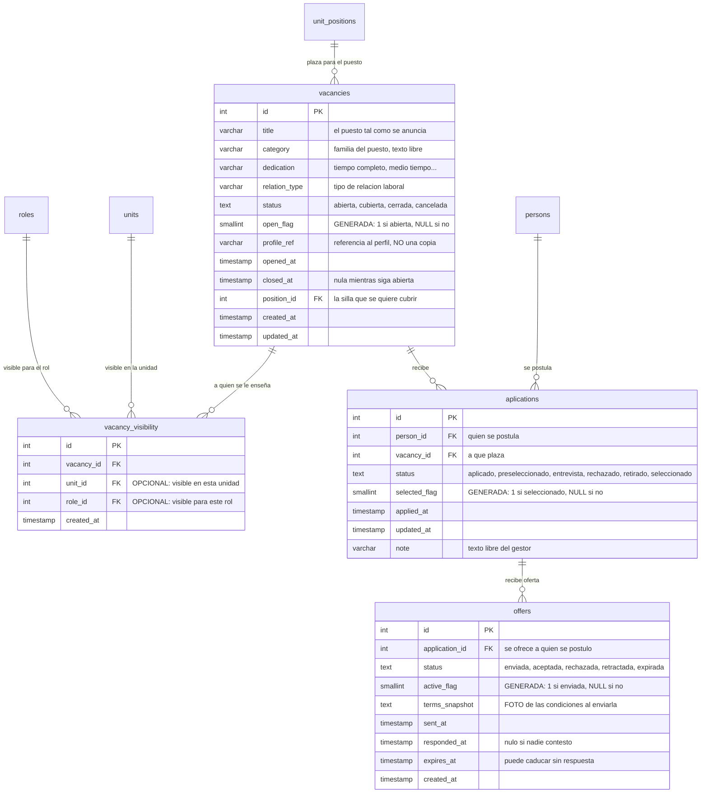
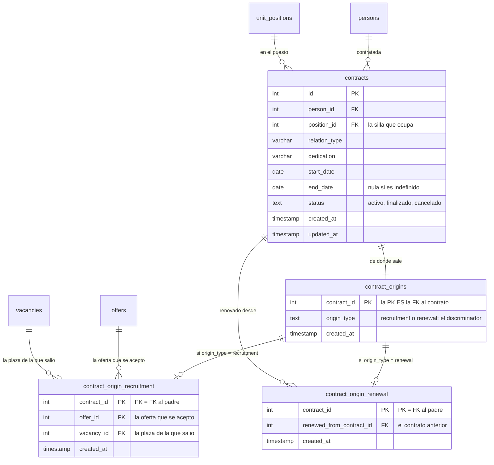

[El reparto](/modelo/reparto/) resuelve a **sillas**, y da por hecho que hay alguien sentado en ellas.
Estas ocho tablas son la respuesta a *cómo llegó a sentarse*: se abre una plaza para un puesto, la
gente se postula, a uno se le hace una oferta, y de la oferta sale un contrato que vuelve a apuntar
al mismo puesto.

:::danger[Esto está en el esquema, no en la aplicación]

De las ocho tablas de esta página, **cinco no las toca ningún código**: ni una consulta propia, ni una
entrada en el editor genérico de tablas. **No hay ninguna interfaz de contratación en Deasy hoy.**

| Tabla | Estado en el código |
|---|---|
| `vacancies` | Editor genérico · **leída** por el guard de borrado de puestos |
| `contracts` | Editor genérico · **leída** por el mismo guard |
| `vacancy_visibility` | Sólo editor genérico |
| `aplications` | **Sin código** |
| `offers` | **Sin código** |
| `contract_origins` | **Sin código** |
| `contract_origin_recruitment` | **Sin código** |
| `contract_origin_renewal` | **Sin código** |

La única vez que el resto del sistema **pregunta** por este dominio es defensiva:
`OrgStructureService.DEPENDENCIAS_DE_UN_PUESTO` comprueba, entre ocho cosas, si un puesto tiene
vacantes o contratos antes de dejar borrarlo. Lee para **negarse**; nunca escribe.

Se documenta igual, y entero, por dos motivos: el modelo está **completo y es coherente**
—vocabularios cerrados, claves ajenas, subtipos, cuatro invariantes impuestas por la base—, y hay un
rol, **`GestorContratacion`**, que en el catálogo de permisos promete gestionar *«vacantes,
postulaciones, ofertas, contratos y orígenes contractuales»*. Quien lea el esquema o el catálogo de
roles va a creer que esto funciona.

Es el hallazgo **H3** de la auditoría del modelo y sigue siendo **una decisión pendiente**: o se
implementa, o se retira del esquema y del catálogo de roles. Lo que no puede quedarse es a medias y
sin decirlo.
:::

## 1 · La plaza

`vacancies` es **la plaza abierta para un puesto concreto**. No es el puesto —eso es
`unit_positions`, y existe aunque no haya nadie buscándolo— sino la decisión de cubrirlo.

`title`, `category`, `dedication` y `relation_type` describen lo que se ofrece. `profile_ref` apunta
al perfil del puesto, que vive en el `profile` JSONB de `unit_positions`: la plaza **no copia** el
perfil, lo referencia.

`vacancy_visibility` decide **a quién se le enseña**, y es una tabla-join con una particularidad:
`unit_id` y `role_id` son **los dos opcionales**. Una fila con unidad y sin rol la enseña a toda la
unidad; con rol y sin unidad, a todos los que tengan ese rol; con las dos, a la intersección. Sin
ninguna fila, la plaza no la ve nadie.

## 2 · La postulación

`aplications` —**con una sola «p», y así está en la base**— es la persona que se presenta a la plaza.

Su `status` recorre seis estados, y son de los pocos del esquema **en castellano**. `note` es texto
libre para el gestor. `selected_flag` **no se escribe**: la calcula la base.

## 3 · La oferta

`offers` cuelga de la postulación, no de la persona ni de la plaza: se ofrece **a quien se postuló**.

Dos columnas merecen atención. `terms_snapshot` es una **foto de las condiciones ofrecidas** en el
momento de enviarla — si la plaza cambia después, la oferta enviada sigue diciendo lo que decía, que
es lo que la hace defendible. Y `expires_at` es la fecha de caducidad, distinta de `responded_at`:
una oferta puede expirar sin que nadie conteste.

## 4 · El contrato, y de dónde sale

`contracts` ata **persona + puesto** con su `relation_type`, su `dedication` y su vigencia
(`start_date` / `end_date`, esta última nula mientras sea indefinido).

Y luego está la parte más inusual del esquema entero: `contract_origins` es un **subtipo**. Una tabla
padre con un discriminador (`origin_type`, con `CHECK` de dos valores) y dos hijas que llevan **como
clave primaria la misma clave ajena al padre**:

- `contract_origin_recruitment` — el contrato viene de un proceso de selección, y apunta a **la
  oferta y la plaza** de las que salió.
- `contract_origin_renewal` — viene de **renovar** un contrato anterior, y apunta a él.

Es el **único** caso de herencia *table-per-subtype* de todo Deasy. En lo demás, cuando hay que
distinguir variantes se usa una columna con `CHECK`. Aquí no se podía: las dos ramas no guardan los
mismos datos —una apunta a una oferta, la otra a un contrato— y meterlas en la misma tabla habría
dejado la mitad de las columnas nulas siempre.

## Los cuatro vocabularios, cerrados por la base

Los cuatro son `CHECK` de PostgreSQL, no listas en JavaScript:

| Tabla | Columna | Valores admitidos |
|---|---|---|
| `vacancies` | `status` | `abierta` · `cubierta` · `cerrada` · `cancelada` |
| `aplications` | `status` | `aplicado` · `preseleccionado` · `entrevista` · `rechazado` · `retirado` · `seleccionado` |
| `offers` | `status` | `enviada` · `aceptada` · `rechazada` · `retractada` · `expirada` |
| `contracts` | `status` | `activo` · `finalizado` · `cancelado` |
| `contract_origins` | `origin_type` | `recruitment` · `renewal` |

Que estén cerrados, completos, **y sin un solo emisor** es exactamente la señal que buscaba el
barrido de la auditoría: alguien pensó este dominio a fondo y nadie lo conectó.

## Las cuatro invariantes que la base ya impone

Tres usan el **idioma de la columna generada** —una columna que vale `1` cuando la fila está en cierto
estado y `NULL` cuando no, más un índice único sobre ella—, el mismo que el organigrama usa para el
jefe de unidad. Al ser `NULL` invisible para un índice único, la restricción sólo muerde en el estado
que interesa:

| Índice | Columna generada | Qué impide |
|---|---|---|
| `uq_one_open_vacancy_per_position` | `open_flag = 1 si status='abierta'` | Que un puesto tenga **dos plazas abiertas a la vez**. Cerradas puede tener muchas |
| `uq_one_selected_per_vacancy` | `selected_flag = 1 si status='seleccionado'` | Que una plaza tenga **dos seleccionados** |
| `uq_one_active_offer_per_application` | `active_flag = 1 si status='enviada'` | Que una postulación tenga **dos ofertas vivas**. Retractar la primera es lo que deja mandar la segunda |

Y la cuarta es un índice único a secas: **`uq_application_once`** sobre `(vacancy_id, person_id)` —
nadie se postula dos veces a la misma plaza.

:::note[Lo que este dominio NO hace, y debería]

`position_assignments` —la ocupación real de un puesto, la que el reparto consulta— **no tiene
ninguna relación con `contracts`**: sus únicas claves ajenas van a `persons` y a `unit_positions`, y
no hay columna que apunte al contrato. Comprobado contra el catálogo.

O sea que hoy alguien se sienta en un puesto **sin que exista un contrato que lo justifique**, y un
contrato puede existir sin que nadie se siente. El contrato debería ser lo que *produce* la
ocupación; hoy no produce nada. Ése es el hueco de verdad, más que las cinco tablas sin código.
:::

## Los diagramas

Van en **dos**, y no por gusto: los ocho bloques con todos sus campos salen a 2066 px de ancho, o sea
letra de 10,2 px — por debajo del mínimo de 12 que este sitio se fija. Partido por la mitad natural
del dominio —**conseguir a la persona** y **contratarla**— los dos pasan.

### 1 · La plaza, quién la ve y quién se presenta

### 2 · El contrato y de dónde sale

Las tres de abajo son el **único caso de herencia por subtipos** del esquema: fíjate en que las dos
hijas llevan como **clave primaria** la misma clave ajena al padre.

