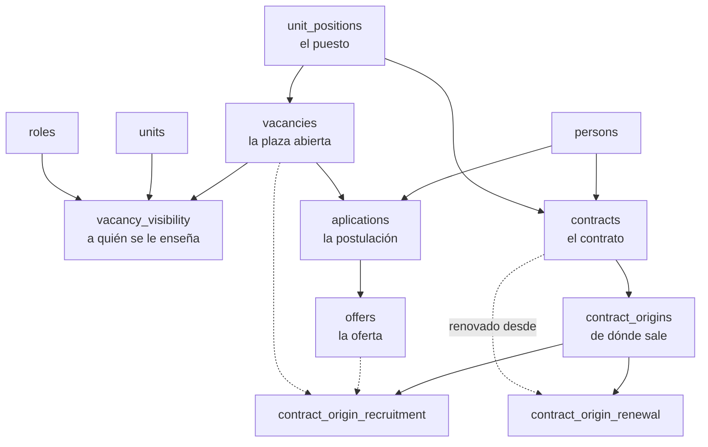

:::danger[Esto está en el esquema, no en la aplicación]

De las **ocho** tablas de esta página, **cinco no las toca ningún código**: ni una consulta propia ni
una entrada en el editor genérico de tablas. Las otras tres existen sólo a través de ese editor, sin
pantalla ni ruta propias. **No hay ninguna interfaz de contratación en Deasy hoy.**

Se documenta igual, y con la tabla de estado a la vista, por dos motivos: el modelo está **completo y
es coherente** —vocabularios cerrados, claves ajenas, subtipos—, y hay un rol,
`GestorContratacion`, que **promete gestionarlo** en el catálogo de permisos. Quien lea el esquema o
el catálogo de roles va a creer que esto funciona. No funciona.

Es el hallazgo **H3** de la auditoría del modelo, y sigue siendo **una decisión pendiente**: o el
dominio se implementa, o se retira del esquema y del catálogo de roles. Lo que no puede quedarse es a
medias y sin decirlo.
:::

| Tabla | Qué guarda | Estado en el código |
|---|---|---|
| `vacancies` | La plaza que se abre para un puesto | Editor genérico · **leída** por el guard de borrado de puestos |
| `contracts` | El contrato: persona, puesto, dedicación y vigencia | Editor genérico · **leída** por el mismo guard |
| `vacancy_visibility` | A qué unidades y roles se les enseña | Sólo por el editor genérico |
| `aplications` *(sic, una sola «p»)* | Quién se postula, y en qué punto va | **Sin código** |
| `offers` | La oferta que se le hace al seleccionado | **Sin código** |
| `contract_origins` | De dónde sale ese contrato | **Sin código** |
| `contract_origin_recruitment` | …de un proceso de selección | **Sin código** |
| `contract_origin_renewal` | …de renovar el anterior | **Sin código** |

La única vez que el resto del sistema **pregunta** por este dominio es defensiva:
`OrgStructureService.DEPENDENCIAS_DE_UN_PUESTO` comprueba, entre ocho cosas, si un puesto tiene
vacantes o contratos antes de dejar borrarlo. Lo lee para **negarse**; nunca escribe.

## La cadena que el esquema describe

La lectura es directa: **un puesto abre una plaza, la plaza recibe postulaciones, una postulación
recibe una oferta, y de la oferta sale un contrato que vuelve a apuntar al puesto.** El círculo se
cierra en `unit_positions`, que es la misma silla que usa
[el reparto](/modelo/reparto/) para decidir a quién le toca un entregable.

## Los cuatro vocabularios, y quién los protege

Los cuatro son `CHECK` de la base, no listas en JavaScript. Están **en castellano**, a diferencia de
casi todo el resto del esquema:

| Tabla | Valores admitidos |
|---|---|
| `vacancies.status` | `abierta` · `cubierta` · `cerrada` · `cancelada` |
| `aplications.status` | `aplicado` · `preseleccionado` · `entrevista` · `rechazado` · `retirado` · `seleccionado` |
| `offers.status` | `enviada` · `aceptada` · `rechazada` · `retractada` · `expirada` |
| `contracts.status` | `activo` · `finalizado` · `cancelado` |

Que estén cerrados por la base y **nadie los escriba** es exactamente la señal que buscaba el barrido
de la auditoría: un vocabulario completo, pensado, y sin un solo emisor.

## Tres reglas que la base ya impone

Las tres usan el mismo idioma que el resto del esquema —una **columna generada** que vale `1` cuando
la fila está en cierto estado y `NULL` cuando no, más un índice único sobre ella—, así que la
excepción la da PostgreSQL y no hay forma de saltársela desde el código:

- **`uq_one_open_vacancy_per_position`** — un puesto no puede tener **dos plazas abiertas a la vez**.
  Podría tener varias cerradas a lo largo del tiempo; abierta, una.
- **`uq_one_selected_per_vacancy`** — una plaza no puede tener **dos postulantes seleccionados**.
- **`uq_one_active_offer_per_application`** — a una postulación no se le puede tener **dos ofertas
  vivas** al mismo tiempo. Retractar la primera es lo que permite mandar la segunda.

Y una cuarta con un índice único a secas: **`uq_application_once`** sobre `(vacancy_id, person_id)`
— nadie se postula dos veces a la misma plaza.

## El origen del contrato: el único caso de herencia del esquema

`contract_origins` es un **subtipo**: una tabla padre con un discriminador (`origin_type`, con
`CHECK` de dos valores) y dos hijas que llevan como clave primaria la misma clave ajena al padre.

- `contract_origin_recruitment` — el contrato viene de un proceso de selección, y apunta a **la
  oferta y la plaza** de las que salió.
- `contract_origin_renewal` — viene de **renovar** un contrato anterior, y apunta a él.

Es el **único** sitio del esquema con herencia *table-per-subtype*. En todo lo demás, cuando hay que
distinguir variantes, Deasy usa una columna con `CHECK`. Aquí no se podía: las dos ramas no guardan
los mismos datos —una apunta a una oferta, la otra a un contrato— y meterlas en la misma tabla habría
dejado la mitad de las columnas nulas siempre.

:::note[Por qué esto no está en el mapa de la cadena]
La cadena va del proceso al documento firmado, y para eso necesita saber que **hay alguien sentado en
el puesto** — no cómo llegó a sentarse. Quien ocupa un puesto se registra en `position_assignments`,
que sí está en la cadena y que hoy **se rellena sin pasar por `contracts`**. Ése es precisamente el
hueco: el contrato debería ser lo que produce la ocupación, y hoy no produce nada.
:::
