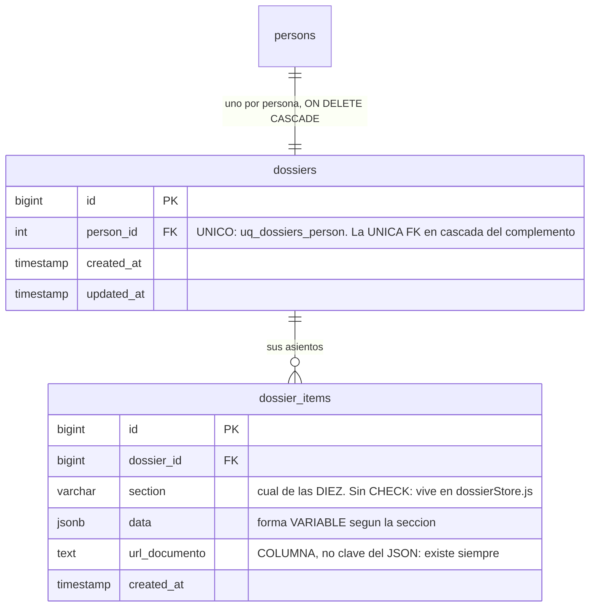

El **expediente** —el *dossier*— es el historial académico y profesional de una persona: sus títulos,
su experiencia, sus publicaciones. Son **dos tablas y diez columnas**, la familia más pequeña del
complemento, y la que más historia tiene detrás: hasta la migración **esto era MongoDB**.

## 1 · Un expediente por persona, y lo impone la base

`dossiers` no guarda casi nada: es la cabecera que existe para colgar de ella los asientos. Lo único
que aporta es una garantía, `uq_dossiers_person` sobre `person_id`: **nadie tiene dos expedientes**.

Y su clave ajena a `persons` lleva **`ON DELETE CASCADE`**, cosa que hay que leer en contexto: de las
**once** claves ajenas que el chat y el expediente tienen hacia el núcleo, **ésta es la única** con
cascada; las otras diez llevan la política por defecto. Es deliberado y dice algo del modelo: el
expediente **no tiene sentido sin su persona**, mientras que un mensaje de chat sí sobrevive como
parte de una conversación en la que participaron otros.

## 2 · El asiento, y por qué es JSONB

`dossier_items` es cada entrada del expediente: un título, un congreso, una referencia.

**`section` decide qué forma tiene `data`.** Las diez secciones no comparten estructura —un título
tiene institución y año; una ponencia tiene congreso, ciudad y fecha— y por eso el contenido va en
`data JSONB` en vez de en columnas. Modelarlas como diez tablas habría sido lo ortodoxo y también lo
peor: son datos que rellena el propio usuario y cuya forma cambia cada curso.

Las diez secciones **no son un `CHECK`**: viven en `SECTIONS`, dentro de
`backend/services/users/dossierStore.js`.

```
titulos · experiencia · referencias · formacion · certificaciones
articulos · libros · ponencias · tesis · proyectos
```

Las cinco últimas están además agrupadas como `INVESTIGACION_SECTIONS`, que es lo que da la pestaña
de investigación del perfil. En el frontend, cada sección tiene su ruta bajo `/perfil`.

**`url_documento`, en cambio, SÍ es columna** — y esa asimetría es la decisión de diseño de la tabla.
Todos los asientos tienen respaldo documental, y se consulta siempre: algo que existe en el 100 % de
las filas y se lee en el 100 % de las consultas no se esconde dentro de un blob, porque entonces no
se puede indexar ni exigir con un `NOT NULL`. Lo variable va al JSON; lo invariable, a la columna.

## 3 · Aquí había MongoDB, y se nota

Las dos «colecciones» que había se migraron a tablas con `data JSONB`, y **las colecciones de
entonces son hoy valores de la columna `section`**. La migración conservó a propósito dos cosas que
hoy parecen rarezas:

- **Los identificadores se exponen como texto**, para preservar el contrato que tenía Mongo y no
  romper al cliente que ya existía.
- **Los valores por defecto de cada sección replican exactamente** los del antiguo esquema de
  Mongoose. `titulos`, por ejemplo, nace con `pais: "Ecuador"` y `sera: "Enviado"`.

`dossier_items` es además una tabla **de sólo añadir**: no tiene `updated_at`, que es la señal por la
que se distingue un registro histórico de una entidad con estado. Corregir un asiento es borrarlo y
poner otro.

## 4 · Lo que cambió con la identidad

El expediente **enlaza por `person_id`**, y eso es nuevo. Antes de que `persons`
[repartiera su identidad](/modelo/organizacion/#la-persona-ya-no-lo-lleva-todo-encima), el expediente
se ataba a **la cédula**, y esa columna ya no existe: la cédula vive en `documentos_identidad` con su
tipo y su país emisor.

La consecuencia práctica no es de fontanería: **un extranjero con pasaporte tiene hoy expediente
igual que cualquiera**, cosa que antes no era posible porque no había dónde ponerle la cédula.

:::note[Quién puede leerlo, y el IDOR que lo cerró]
El acceso al expediente es lo que motivó `requireDossierAccess`, y detrás hay un **IDOR real y
cerrado**: el guard miraba *la tarea* en vez de *el entregable*, y un docente podía descargar el
documento de otro. El detalle, en [Autenticación y autorización](/backend/auth/).

Consecuencia que muerde al probar: **toda persona necesita el rol base `Usuario`** para ver su propio
expediente — es el rol que otorga `dossier: read, create, update`. Los roles de gestión **no lo
incluyen**, así que un `Gestor*` sin `Usuario` recibe un 403 al abrir su propia ficha.
:::

## El diagrama



La ausencia de `updated_at` en `dossier_items` no es un descuido: es **la marca de una tabla de sólo
añadir**. En Deasy, la tabla que lleva `updated_at` tiene además un trigger `set_updated_at()` que lo
mantiene; la que no lo lleva está diciendo que sus filas no se tocan una vez escritas.
