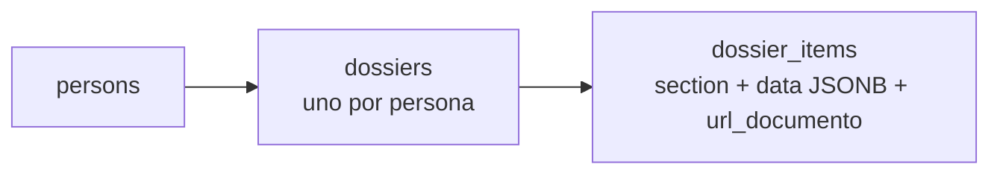

El **expediente** —el *dossier*— es el historial académico y profesional de una persona: sus títulos,
su experiencia, sus publicaciones. Son **dos tablas y diez columnas**, la familia más pequeña del
complemento, y la que más historia tiene detrás.

| Tabla | Qué guarda |
|---|---|
| `dossiers` | El expediente. **Uno por persona**, y lo impone `uq_dossiers_person` |
| `dossier_items` | Cada asiento: a qué sección pertenece, sus datos en `data JSONB`, y su `url_documento` |



## Las diez secciones

No son un `CHECK` de la base: viven en `SECTIONS`, dentro de
`backend/services/users/dossierStore.js`.

```
titulos · experiencia · referencias · formacion · certificaciones
articulos · libros · ponencias · tesis · proyectos
```

Las cinco últimas están además agrupadas como `INVESTIGACION_SECTIONS`, que es lo que da la pestaña
de investigación del perfil. En el frontend, cada sección tiene su ruta bajo `/perfil`.

## Aquí había MongoDB

Ésta es la huella más visible de la migración: `dossiers` y `dossier_items` **eran dos colecciones de
Mongo**, y las «colecciones» de entonces son hoy valores de la columna `section`. La migración
conservó a propósito dos cosas que hoy parecen rarezas:

- **Los identificadores se exponen como texto**, para no romper el contrato que tenía Mongo.
- **Los valores por defecto de cada sección replican exactamente** los del esquema de Mongoose que
  había antes (`titulos`, por ejemplo, nace con `pais: "Ecuador"`).

`data` es `JSONB` porque las diez secciones no comparten forma: un título tiene institución y año, y
una ponencia tiene congreso y ciudad. Modelarlas como diez tablas habría sido lo ortodoxo y también
lo peor: son datos que el usuario rellena y que cambian de forma cada curso.

`url_documento`, en cambio, **sí es columna**, no una clave del JSON: todos los asientos tienen
respaldo documental, y algo que existe siempre y se consulta siempre no se esconde dentro de un blob.

## Lo que cambió con la identidad

El expediente **enlaza por `person_id`**, y eso es nuevo. Antes de que `persons` repartiera su
identidad, el expediente se ataba a la **cédula**, y esa columna ya no existe: la cédula vive en
`documentos_identidad` con su tipo y su país emisor. Un extranjero con pasaporte tiene hoy expediente
igual que cualquiera, cosa que antes no era posible.

`dossiers.person_id` es además la única clave ajena del dominio con **`ON DELETE CASCADE`** hacia
`persons` — de las once que el chat y el expediente tienen hacia el núcleo, las otras diez llevan la
política por defecto. Es deliberado: el expediente **no tiene sentido sin su persona**, mientras que
un mensaje de chat sí sobrevive como parte de una conversación.

:::note[Quién puede leerlo]
El acceso al expediente es el que motivó `requireDossierAccess`, y detrás hay un **IDOR real y
cerrado**: el guard miraba *la tarea* en vez de *el entregable*, y un docente podía descargar el
documento de otro. El detalle está en [Autenticación y autorización](/backend/auth/).

Consecuencia práctica: **toda persona necesita el rol base `Usuario`** para ver su propio expediente.
Los roles de gestión no lo incluyen, así que un `Gestor*` sin `Usuario` recibe un 403 al abrir su
propia ficha.
:::
