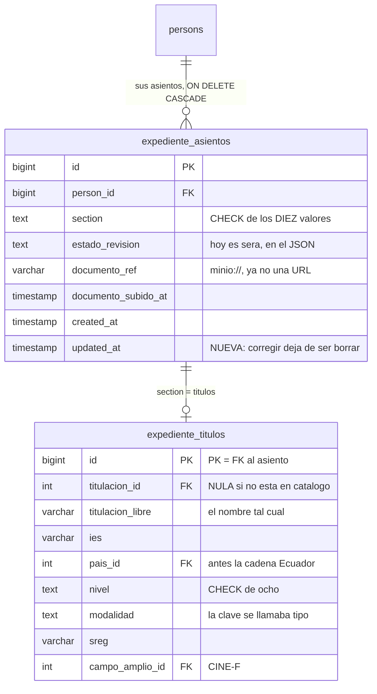
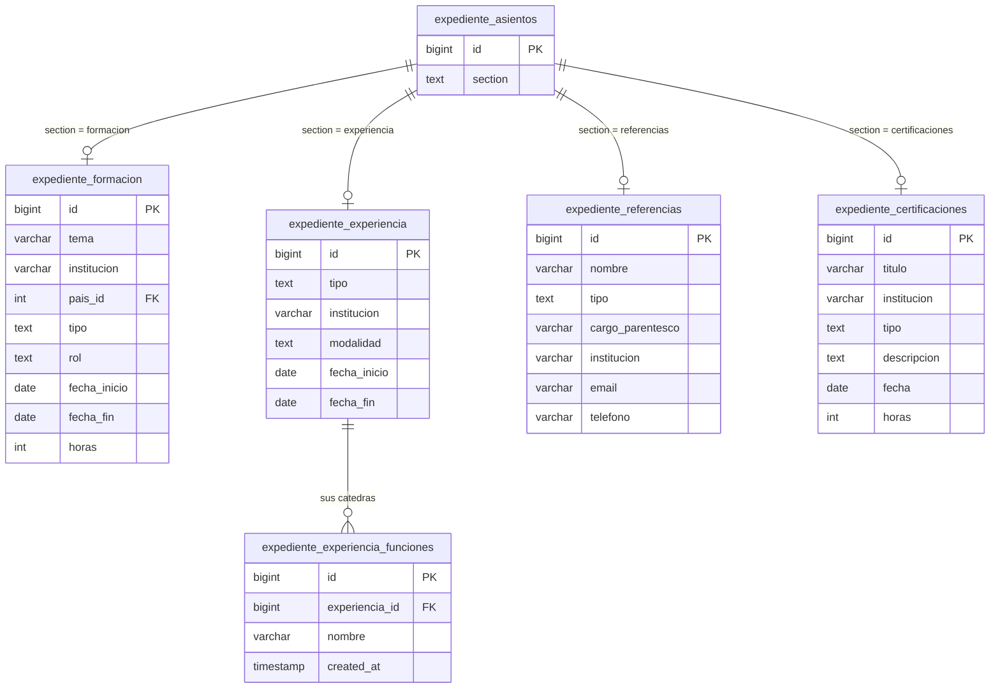
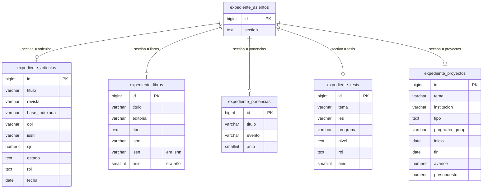
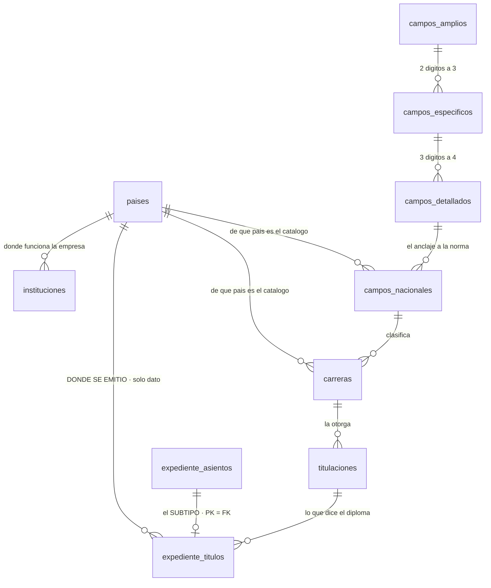
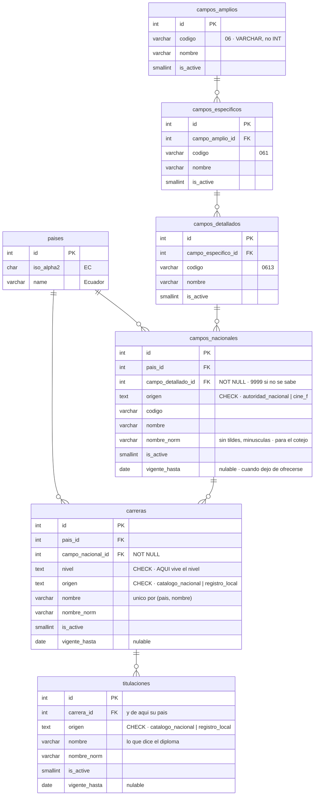
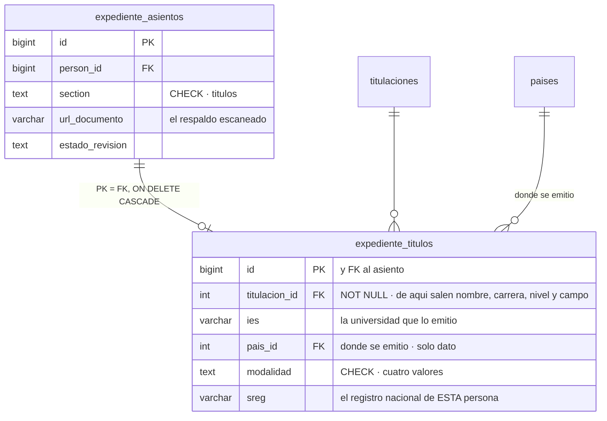
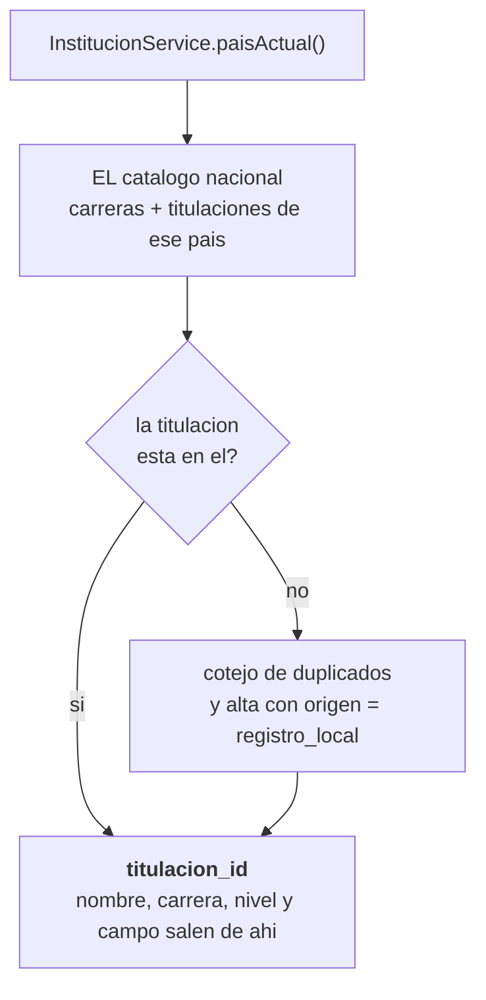
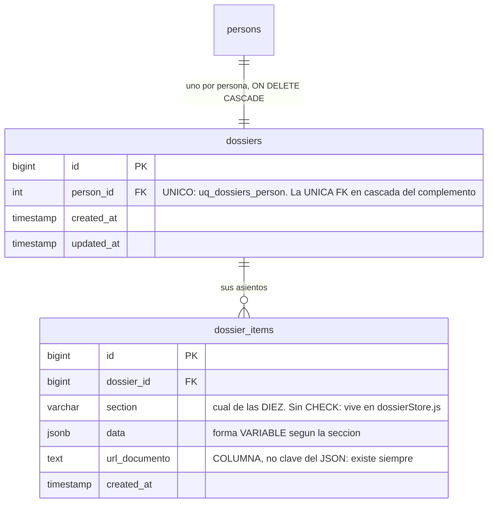

El **expediente** —el *dossier*— es el historial académico y profesional de una persona: sus títulos,
su experiencia, sus publicaciones.

:::caution[Esta página describe el modelo APROBADO, que todavía NO está en la base]
El diseño de abajo es el del **frente 18**, aprobado por el dueño y **pendiente de implementar**:
**dieciocho tablas y una vista** donde hoy hay dos y un `JSONB`. El plan, con su DDL completo y su control de
ejecución, es [`expediente-relacional-2026-09.md`](https://github.com/fresvel/deasy/blob/develop/docs/planes/expediente-relacional-2026-09.md).

**Lo que hay en la base HOY** —dos tablas, `dossiers` y `dossier_items`, con el contenido dentro de
un `JSONB`— está al final, en [«De dónde viene»](#de-dónde-viene-el-modelo-que-se-retira). Se
conserva porque es lo que el sistema contiene mientras el frente no se ejecute.
:::

## El modelo

Son **dieciocho tablas y una vista**: la espina, con una fila por asiento; **diez de sección** que
cuelgan de ella con su clave primaria siendo a la vez la ajena; la **hija** del uno-a-muchos de las
cátedras; y **seis** del catálogo académico. El `JSONB` desaparece entero, y la tabla `dossiers`
también: era una cáscara 1:1 sobre `persons` sin ni una columna propia.


El argumento con el que el modelo de hoy defiende el JSONB —*«son datos que rellena el propio usuario y
cuya forma cambia cada curso»*— **se midió contra el código el 2026-09-04 y es falso**. Las diez
formas están fijadas a mano en los formularios de Vue, con `v-model` literales: `AgregarTitulo` tiene
nueve. Añadir un campo obliga hoy a tocar el formulario **exactamente igual que obligaría a tocar una
tabla**. Se está pagando el precio del JSONB —cero integridad, ninguna consulta que entre en el
dato— sin cobrar su beneficio, que es evolucionar sin migración.

Y el precio se cobra en sitios concretos. `pais` es la cadena `"Ecuador"` mientras la tabla `paises`
tiene **232 filas con su ISO**. Ninguna consulta entra en el JSON: se lee el árbol entero y se filtra
en JavaScript. Los datos de **terceros** —nombre, correo y teléfono de quien da una referencia— viven
en un blob del que no se pueden localizar ni borrar uno a uno, que es justo lo que la LOPDP pide
poder hacer. Y el blob llevaba escondidos dos defectos que una columna habría cazado al escribirla:
la sección de libros guarda **`isnn`** donde la de artículos guarda `issn` —el mismo identificador,
dos nombres, y la errata visible en pantalla—, y hay una clave llamada literalmente **`año`**, con
`ñ`. El diseño son **17 tablas y una vista, 121 columnas y 22 claves ajenas**, con **28 restricciones
`CHECK`** donde hoy hay **cero**. Y sólo hay **3 asientos** en la base, todos de semilla: migrar es
gratis ahora y deja de serlo en cuanto el sistema entre en uso.

## 1 · La espina, y el asiento partido en dos

`expediente_asientos` deja de guardar `data` y pasa a ser **la espina**: lo que tienen los diez asientos
—de qué sección son, su respaldo escaneado, su estado de revisión y sus fechas—. El detalle va a una
tabla por sección, cuya **clave primaria ES la clave ajena** al asiento, con `ON DELETE CASCADE`: un
asiento y su detalle son la misma fila partida en dos tablas. Es el patrón que el esquema ya usa en
`contract_origins`, que deja así de ser su único caso.


```mermaid
erDiagram
  persons ||--o{ expediente_asientos : "sus asientos, ON DELETE CASCADE"
  expediente_asientos ||--o| expediente_titulos : "section = titulos"

  expediente_asientos {
    bigint id PK
    bigint person_id FK
    text section "CHECK de los DIEZ valores"
    text estado_revision "hoy es sera, en el JSON"
    varchar documento_ref "minio://, ya no una URL"
    timestamp documento_subido_at
    timestamp created_at
    timestamp updated_at "NUEVA: corregir deja de ser borrar"
  }

  expediente_titulos {
    bigint id PK "PK = FK al asiento"
    int titulacion_id FK "NULA si no esta en catalogo"
    varchar titulacion_libre "el nombre tal cual"
    varchar ies
    int pais_id FK "antes la cadena Ecuador"
    text nivel "CHECK de ocho"
    text modalidad "la clave se llamaba tipo"
    varchar sreg
    int campo_amplio_id FK "CINE-F"
  }
```

Tres cosas que ese diagrama decide y no se ven a simple vista. **`section` pasa a ser un `CHECK`**:
hoy los diez valores viven en la constante `SECTIONS` de `dossierStore.js`, así que un
`section = 'titulso'` entra sin protesta y deja el asiento huérfano. **`documento_ref` sustituye a
`url_documento`**, que guardaba una URL completa con `MINIO_PUBLIC_ENDPOINT` dentro: mover la pila
invalidaba todas las filas. Es el mismo antipatrón que el frente 14 ya corrigió en
`documentos_identidad.escaneo_ref` — y el comentario de aquella columna cita precisamente a ésta como
el ejemplo a no repetir. Y **`updated_at` cambia la naturaleza de la tabla**: deja de ser de sólo
añadir, así que corregir una tilde de un título ya no obliga a borrar el asiento con su respaldo.

## 2 · El resto del currículo

Cuatro secciones más, y **la única tabla hija de todo el modelo**: `funcion_catedra` es hoy un array
dentro del JSON, construido partiendo un textarea por comas. No es un obstáculo para salir del
JSONB — es la mejora más directa del frente, porque hoy la pregunta *«¿quién ha dado Bases de
datos?»* no se puede hacer sin leer todos los expedientes enteros.


```mermaid
erDiagram
  expediente_asientos ||--o| expediente_formacion : "section = formacion"
  expediente_asientos ||--o| expediente_experiencia : "section = experiencia"
  expediente_asientos ||--o| expediente_referencias : "section = referencias"
  expediente_asientos ||--o| expediente_certificaciones : "section = certificaciones"
  expediente_experiencia ||--o{ expediente_experiencia_funciones : "sus catedras"

  expediente_asientos {
    bigint id PK
    text section
  }

  expediente_formacion {
    bigint id PK
    varchar tema
    varchar institucion
    int pais_id FK
    text tipo
    text rol
    date fecha_inicio
    date fecha_fin
    int horas
  }

  expediente_experiencia {
    bigint id PK
    text tipo
    varchar institucion
    text modalidad
    date fecha_inicio
    date fecha_fin
  }

  expediente_experiencia_funciones {
    bigint id PK
    bigint experiencia_id FK
    varchar nombre
    timestamp created_at
  }

  expediente_referencias {
    bigint id PK
    varchar nombre
    text tipo
    varchar cargo_parentesco
    varchar institucion
    varchar email
    varchar telefono
  }

  expediente_certificaciones {
    bigint id PK
    varchar titulo
    varchar institucion
    text tipo
    text descripcion
    date fecha
    int horas
  }
```

`expediente_referencias` es la que más cambia de significado sin cambiar de forma: **son datos de un
tercero** que nunca aceptó nada aquí, y en columnas se pueden localizar y borrar uno a uno. De paso
corrige una errata que nadie había visto: la clave JSON se llama `institution`, en inglés, rodeada de
nueve claves en español. Las fechas dejan de ser cadenas —ordenar por fecha era ordenar texto— y
`tipo`, `rol` y `modalidad` pasan a tener `CHECK`.

## 3 · Las cinco de producción académica

**No son polimórficas**, aunque la sección 2 de esta página las agrupe. `AgregarInvestigacion.vue`
tiene cinco bloques hermanos bajo `v-if="form.tipoProduccion === ..."`, cada uno con su lista de
campos **cerrada y casi disjunta**: lo polimórfico es el formulario, no los datos. La documentación
las agrupó por cómo se pintan, no por cómo son.


```mermaid
erDiagram
  expediente_asientos ||--o| expediente_articulos : "section = articulos"
  expediente_asientos ||--o| expediente_libros : "section = libros"
  expediente_asientos ||--o| expediente_ponencias : "section = ponencias"
  expediente_asientos ||--o| expediente_tesis : "section = tesis"
  expediente_asientos ||--o| expediente_proyectos : "section = proyectos"

  expediente_asientos {
    bigint id PK
    text section
  }

  expediente_articulos {
    bigint id PK
    varchar titulo
    varchar revista
    varchar base_indexada
    varchar doi
    varchar issn
    numeric sjr
    text estado
    text rol
    date fecha
  }

  expediente_libros {
    bigint id PK
    varchar titulo
    varchar editorial
    text tipo
    varchar isbn
    varchar issn "era isnn"
    smallint anio "era año"
  }

  expediente_ponencias {
    bigint id PK
    varchar titulo
    varchar evento
    smallint anio
  }

  expediente_tesis {
    bigint id PK
    varchar tema
    varchar ies
    varchar programa
    text nivel
    text rol
    smallint anio
  }

  expediente_proyectos {
    bigint id PK
    varchar tema
    varchar institucion
    text tipo
    varchar programa_group
    date inicio
    date fin
    numeric avance
    numeric presupuesto
  }
```

Lo que sí las une es una **vista**, `expediente_investigacion`, con el `UNION ALL` de las cinco: la
pestaña de investigación deja de armarse en JavaScript. Y es de sólo lectura a propósito — hacerla
escribible con triggers `INSTEAD OF` daría un segundo camino de inserción que se saltaría los
`CHECK`. De los tipos, dos importan: `presupuesto` es `NUMERIC` y nunca coma flotante, porque es
dinero; y `avance` lleva un `CHECK` entre 0 y 100, que el JSON no tenía — aceptaba 350 sin inmutarse.

## 4 · El catálogo académico

**Hay UN catálogo nacional: el del país donde funciona la institución que instala Deasy.** Lo dice
`instituciones.pais_id`, y no hay otro. Un título extranjero se registra en **ese** catálogo, porque
es con esa nomenclatura con la que la institución le rinde cuentas a su regulador.

Encima está la **CINE-F (ISCED-F)** de la UNESCO —`campos_amplios`, `campos_especificos`,
`campos_detallados`, **220 filas** (12 · 58 · 150)—, que es internacional y **no lleva país**.

**Todo título del expediente sale del catálogo. No hay texto libre**, y eso es una decisión, no un
descuido: está justificada más abajo.

:::caution[Lo que `expediente_titulos.pais_id` NO es]
Es **sólo dato**: dónde se emitió el diploma. **No elige catálogo.** Deasy no guarda el catálogo de
Francia ni el de ningún otro país: guarda el suyo. Un doctorado de Lyon en una universidad
ecuatoriana se clasifica con la nomenclatura ecuatoriana.
:::

### Nivel conceptual: las tablas y sus líneas

Sin columnas, para que se vean las líneas. Es un diagrama entidad-relación en notación **pata de
gallo** (*crow's foot*):

| Extremo | Se lee |
|---|---|
| `‖` barra doble | **exactamente uno** |
| `o‖` círculo y barra | **cero o uno** |
| `o<` círculo y tres patas | **cero o muchos** |
| `‖<` barra y tres patas | uno o muchos |


```mermaid
erDiagram
  paises ||--o{ instituciones : "donde funciona la empresa"
  paises ||--o{ campos_nacionales : "de que pais es el catalogo"
  paises ||--o{ carreras : "de que pais es el catalogo"
  paises ||--o{ expediente_titulos : "DONDE SE EMITIO · solo dato"

  campos_amplios ||--o{ campos_especificos : "2 digitos a 3"
  campos_especificos ||--o{ campos_detallados : "3 digitos a 4"
  campos_detallados ||--o{ campos_nacionales : "el anclaje a la norma"

  campos_nacionales ||--o{ carreras : "clasifica"
  carreras ||--o{ titulaciones : "la otorga"

  expediente_asientos ||--o| expediente_titulos : "el SUBTIPO · PK = FK"
  titulaciones ||--o{ expediente_titulos : "lo que dice el diploma"
```

**Once claves ajenas, y ninguna nulable.** Ésa es la propiedad que hace legible el modelo: no hay
ninguna consulta que tenga que preguntar «¿y si esto viene vacío?».

| # | Desde | Hacia | Para qué |
|---|---|---|---|
| 1 | `instituciones.pais_id` | `paises` | **Ya existe.** El país donde funciona la empresa |
| 2 | `campos_especificos.campo_amplio_id` | `campos_amplios` | La jerarquía CINE-F |
| 3 | `campos_detallados.campo_especifico_id` | `campos_especificos` | La jerarquía CINE-F |
| 4 | `campos_nacionales.pais_id` | `paises` | De qué país es el catálogo |
| 5 | **`campos_nacionales.campo_detallado_id`** | `campos_detallados` | **El único anclaje a la norma** |
| 6 | `carreras.pais_id` | `paises` | De qué país es el catálogo |
| 7 | **`carreras.campo_nacional_id`** | `campos_nacionales` | **El único camino de la carrera al campo** |
| 8 | `titulaciones.carrera_id` | `carreras` | Qué carrera la otorga — **y de ahí su país** |
| 9 | `expediente_titulos.id` | `expediente_asientos` | El subtipo · `PK = FK`, `ON DELETE CASCADE` |
| 10 | `expediente_titulos.titulacion_id` | `titulaciones` | Lo que dice el diploma |
| 11 | `expediente_titulos.pais_id` | `paises` | Dónde se emitió · **sólo dato** |

Tres cosas que el dibujo dice y conviene leer despacio.

**De `instituciones` sale UNA sola línea, y va a `paises`.** No hay ninguna hacia el catálogo, y no
es un olvido: la institución no se relaciona con las carreras, **nombra el país del único catálogo
que hay**. Es lo mismo que ya hace con los documentos de identidad, donde su `pais_id` decide cuál es
el documento nacional sin que exista clave ajena entre ambos.

**Sólo una tabla apunta a `campos_detallados`, y es la línea 5.** Hubo un diseño con tres —desde el
asiento, desde la carrera y desde el campo nacional— y era redundante: si el campo nacional ya ancla
a la norma, todo lo que cuelga de él llega por ahí. Repetirlo era una dependencia transitiva, que es
la forma técnica de decir «dos sitios donde discrepar».

**La línea 11 no elige nada.** Es el error que estuvo cuatro veces en esta página: `pais_id` en el
asiento es dónde se emitió el diploma, y de ahí no cuelga ningún catálogo.

### Por qué el asiento y su título son 1 a 0..1, y no 1 a muchos

Es la pregunta correcta, porque en el dibujo se parecen. **`expediente_titulos` no es una colección
hija: es un SUBTIPO.** Su clave primaria **es** la ajena —`id BIGINT PRIMARY KEY` que además
referencia `expediente_asientos(id)`—, y una primaria es única por definición: **no caben dos filas
con el mismo `id`**. Para que fuera 1:N habría que darle una primaria propia, y entonces un asiento
sería dos títulos, que contradice lo que un asiento significa.

El **`0..1`** es porque un asiento de sección `experiencia` **no tiene** fila aquí. Cada asiento tiene
exactamente una de las diez tablas de sección, la que le marque su `section`.

Los uno-a-muchos de verdad, en este mismo dibujo, son otros: **una persona tiene muchos asientos**,
**una carrera otorga varias titulaciones** y **una titulación aparece en el expediente de muchas
personas**.

### Nivel lógico: el catálogo con sus columnas


```mermaid
erDiagram
  paises ||--o{ campos_nacionales : ""
  paises ||--o{ carreras : ""
  campos_amplios ||--o{ campos_especificos : ""
  campos_especificos ||--o{ campos_detallados : ""
  campos_detallados ||--o{ campos_nacionales : ""
  campos_nacionales ||--o{ carreras : ""
  carreras ||--o{ titulaciones : ""

  paises {
    int id PK
    char iso_alpha2 "EC"
    varchar name "Ecuador"
  }

  campos_amplios {
    int id PK
    varchar codigo "06 · VARCHAR, no INT"
    varchar nombre
    smallint is_active
  }

  campos_especificos {
    int id PK
    int campo_amplio_id FK
    varchar codigo "061"
    varchar nombre
    smallint is_active
  }

  campos_detallados {
    int id PK
    int campo_especifico_id FK
    varchar codigo "0613"
    varchar nombre
    smallint is_active
  }

  campos_nacionales {
    int id PK
    int pais_id FK
    int campo_detallado_id FK "NOT NULL · 9999 si no se sabe"
    text origen "CHECK · autoridad_nacional | cine_f"
    varchar codigo
    varchar nombre
    varchar nombre_norm "sin tildes, minusculas · para el cotejo"
    smallint is_active
    date vigente_hasta "nulable · cuando dejo de ofrecerse"
  }

  carreras {
    int id PK
    int pais_id FK
    int campo_nacional_id FK "NOT NULL"
    text nivel "CHECK · AQUI vive el nivel"
    text origen "CHECK · catalogo_nacional | registro_local"
    varchar nombre "unico por (pais, nombre)"
    varchar nombre_norm
    smallint is_active
    date vigente_hasta "nulable"
  }

  titulaciones {
    int id PK
    int carrera_id FK "y de aqui su pais"
    text origen "CHECK · catalogo_nacional | registro_local"
    varchar nombre "lo que dice el diploma"
    varchar nombre_norm
    smallint is_active
    date vigente_hasta "nulable"
  }
```

Los códigos son `VARCHAR` y no `INT` a propósito: `'06'` no es el número seis, y perder el cero a la
izquierda rompe el código. Todas llevan además `created_at` y `updated_at` con su trigger.

### Nivel lógico: el enganche con el expediente


```mermaid
erDiagram
  expediente_asientos ||--o| expediente_titulos : "PK = FK, ON DELETE CASCADE"
  titulaciones ||--o{ expediente_titulos : ""
  paises ||--o{ expediente_titulos : "donde se emitio"

  expediente_asientos {
    bigint id PK
    bigint person_id FK
    text section "CHECK · titulos"
    varchar url_documento "el respaldo escaneado"
    text estado_revision
  }

  expediente_titulos {
    bigint id PK "y FK al asiento"
    int titulacion_id FK "NOT NULL · de aqui salen nombre, carrera, nivel y campo"
    varchar ies "la universidad que lo emitio"
    int pais_id FK "donde se emitio · solo dato"
    text modalidad "CHECK · cuatro valores"
    varchar sreg "el registro nacional de ESTA persona"
  }
```

**Seis columnas, y las cinco que no son la clave son de ESTA persona**, no de la titulación: en qué
universidad la cursó, dónde se emitió el diploma, en qué modalidad y con qué número de registro. Todo
lo que es de la titulación —su nombre, su carrera, su nivel, su campo— se lee por la línea 10 y **no
se copia**.

### Por qué no hay `titulacion_libre`

Hubo una columna de texto libre para el título que no estuviera en el catálogo, y **se retira**. El
argumento que la sostenía era que una fila «NR / No registra» perdería el nombre real —un
`Diplôme d'Ingénieur` degradado a «NR»—. Es cierto, y aun así la conclusión era la equivocada.

**Lo primero: no existe el título imposible de clasificar.** La CINE-F trae comodines, y en el nivel
detallado, que es donde hacen falta:

| Comodín | Cuántos | Para qué |
|---|---:|---|
| `xx10` *sin mayor definición* | 10 | Se sabe el campo, no el detalle |
| `xx19` *no contemplado* | 10 | Existe en lo nacional y no en la norma |
| `xx88` *interdisciplinarios* | 10 | Cruza varios campos |
| **`9999 Campo desconocido`** | 1 | No se sabe nada |

**Y lo segundo: el nombre no necesitaba una columna paralela, necesitaba una fila.** Un nombre en
texto libre no se puede cotejar, ni agregar, ni deduplicar — es un segundo almacén del mismo hecho,
invisible para toda consulta que mire el catálogo.

Así que el título que no está **se da de alta**, pasa por el cotejo de duplicados y queda marcado con
`origen = 'registro_local'`. Eso dice mejor que el texto libre lo que el texto libre pretendía decir
—«esto no vino del catálogo oficial»— y encima es consultable, revisable por el admin y reutilizable
por la siguiente persona con el mismo título.

### Los DOS ejes de `origen`, que no son el mismo

Hay dos columnas llamadas `origen` y **significan cosas distintas**. Confundirlas sería el error fácil:

| Tabla | Qué distingue | Valores |
|---|---|---|
| `campos_nacionales` | Cómo llegó la **taxonomía** | `autoridad_nacional` · `cine_f` |
| `carreras` · `titulaciones` | Cómo llegó **la fila** | `catalogo_nacional` · `registro_local` |

Un campo adoptado de la norma internacional **no es** «creado por un usuario», y una carrera que
registró un usuario **no es** «la norma internacional». Son ejes ortogonales.

### Qué pasa en un país sin taxonomía nacional

Si el país donde funciona la institución no ha publicado su propia lista de campos, `campos_nacionales`
se siembra **desde la CINE-F**: 150 filas, una por campo detallado, cada una anclada a la suya y
marcada `origen = 'cine_f'`.

**Y eso no es un parche: es adopción.** El CES **adoptó** la CINE-F 2013 — de los campos específicos
de su anexo, **20 casan literalmente** con los de la norma. Un país que no publica taxonomía propia
usa la internacional, y ésa **es** su taxonomía nacional por adopción. La tabla no miente.

#### El impacto, medido

| | |
|---|---:|
| `campos_detallados` | **150** |
| `paises` sembrados | **232** |
| Techo aritmético · 150 × 232 | **34 800** |

Ese techo supone que los 232 países tengan institución **y** que ninguno tenga taxonomía propia. La
escalera real es otra:

| Escenario | Filas espejo |
|---|---:|
| **Hoy** — una institución, Ecuador, con su propia lista | **0** |
| Una institución en un país sin taxonomía | 150 |
| Diez instituciones así | 1 500 |
| Techo aritmético | 34 800 |

Para calibrar: la geografía ya sembrada son **477 filas** y la CINE-F **220**; la base entera pesa
**18 MB**.

#### Las alternativas evaluadas, y por qué pierden

| | Por qué no |
|---|---|
| **`carreras` con dos claves ajenas** (`campo_nacional_id` **o** `campo_detallado_id`, con `CHECK`) | Dependencia transitiva y bifurcación en toda consulta |
| **Anclar a la CINE-F y usar lo nacional como consulta** (tabla de alias, resuelta con `LEFT JOIN`) | **Pierde resolución, y está medido**: la lista nacional es más fina —383 campos detallados del CES frente a 150 de la norma—, así que varios nacionales caen en el mismo código y la carrera ya no sabe cuál era |
| **`campos_detallados` + una tabla de qué países lo usan** | Sólo valdría si la lista nacional fuera un **subconjunto** de la norma, y no lo es: renombra, fusiona y **añade códigos propios** |
| **Una tabla que declare si un país usa lo nacional o la CINE-F** | La granularidad está mal: la cobertura de una taxonomía nacional es **parcial y por campo**, no por país. Además el hecho ya es derivable de `origen`, y no evita las dos claves ajenas |
| **Una equivalencia en tabla aparte** en vez de la columna | Una columna `NOT NULL` garantiza «exactamente una»; una tabla no impide **cero** filas, y forzarlo pide índice único **y** trigger |
| **Una tabla `campos` con `padre_id` y un nivel** | Una jerarquía autorreferente necesita un guardián de nivel (clave ajena compuesta o trigger). Y el criterio del repo es explícito: la complejidad **se cura con tablas, no con jerarquías** |
| **Una vista que una lo nacional con lo detallado** | No se puede declarar una clave ajena contra una vista |

Lo que sí cuesta, dicho: **150 filas por país sin taxonomía propia**, y re-sembrarlas si la UNESCO
revisa la CINE-F. A cambio, una sola clave ajena, ninguna nulable y ninguna consulta con `if`.

#### Un límite conocido: los niveles superiores

`campos_nacionales` es **plano** y ancla en el detallado, así que los niveles amplio y específico
nacionales se **deducen subiendo** por la CINE-F. Eso es correcto **mientras el país adopte los dos
niveles de arriba**, que es lo que hace Ecuador.

⚠️ **Si un país divergiera en el nivel amplio, este modelo lo encajaría en un campo que no reconoce
como suyo.** La salida serían tres tablas nacionales simétricas a las tres de la norma —+2 tablas y
una siembra de tres niveles—, y no se hace ahora por una razón concreta: **no hay datos en
producción**, y este esquema no tiene ni un `ALTER`, así que añadir tablas obliga a recrear la base.
Hoy eso es gratis; el día que el sistema tenga datos reales, no.

⚠️ **Y un dato que esta página NO puede respaldar**: el plan del frente afirma que los diez campos
amplios del CES son las etiquetas españolas de la norma. **No se ha podido reproducir** con la fuente
disponible —el OCR parte los nombres largos en dos filas—, así que en el nivel amplio la coincidencia
está **sin verificar**. En el específico sí: 20 casan literalmente.

### Qué se le ofrece a quien rellena


```mermaid
flowchart TB
  I["InstitucionService.paisActual()"] --> C["EL catalogo nacional<br/>carreras + titulaciones de ese pais"]
  C --> Q{"la titulacion<br/>esta en el?"}
  Q -->|si| A["<b>titulacion_id</b><br/>nombre, carrera, nivel y campo salen de ahi"]
  Q -->|no| D["cotejo de duplicados<br/>y alta con origen = registro_local"]
  D --> A
```

El país no se resuelve con una subconsulta suelta: **sale de `InstitucionService.paisActual()`**, que
ya existe y **falla ruidosamente si hay cero o más de una institución activa** en vez de elegir la
primera en silencio.

```sql
SELECT t.id, t.nombre, c.nivel
  FROM titulaciones t
  INNER JOIN carreras c           ON c.id  = t.carrera_id
  INNER JOIN campos_nacionales cn ON cn.id = c.campo_nacional_id
  INNER JOIN campos_detallados cd ON cd.id = cn.campo_detallado_id
 WHERE c.pais_id = $1              -- el de InstitucionService.paisActual()
   AND t.is_active = 1 AND c.is_active = 1
   AND cn.is_active = 1 AND cd.is_active = 1
 ORDER BY c.nivel, t.nombre;
```

⚠️ **Los cuatro `is_active` no son celo.** `is_active` es una **convención de filtro, no una
restricción**, y no se propaga: retirar un campo nacional deja activas las carreras que cuelgan de él
y nadie se entera. Si la consulta no filtra en los cuatro niveles, el desplegable ofrece titulaciones
clasificadas con un campo retirado.

⚠️ **`pais_id` en `campos_nacionales` y `carreras` no es un selector, es la costura del
multi-inquilino** — la misma que `InstitucionService` ya documenta en su cabecera. Hoy sólo hay una
institución y por tanto un solo país sembrado; la columna existe para que el día que haya varias, la
resolución siga entrando por un único sitio.

### La variación del catálogo: qué cubre `is_active` y qué no

Un catálogo académico cambia — el CES reforma su nomenclatura, la UNESCO revisa la CINE-F. Tres
cosas, y la última es la que muerde.

**Borrar no es opción, y ya está impedido.** Ninguna clave ajena del catálogo lleva
`ON DELETE CASCADE`, así que PostgreSQL **rechaza** borrar una titulación que algún expediente
referencia. El retiro es `is_active = 0`: la fila se queda, el histórico sigue entero, deja de
aparecer en el desplegable.

**`is_active` no se propaga**, y por eso hay que filtrarlo en los cuatro niveles — está justo arriba.

**Y lo que `is_active` NO cubre es el renombrado.** `expediente_titulos` no copia el nombre: lo lee
por la clave ajena, que es lo correcto. Pero significa que **editar `titulaciones.nombre` cambia en
silencio el nombre del título de todo el que lo tenga** — y eso importa, porque el regulador registró
la denominación **vigente entonces**.

La regla es **retirar y crear, nunca renombrar**, y `vigente_hasta DATE NULL` la sostiene: dice
**cuándo** dejó de ofrecerse, que es justo lo que `is_active` no dice.

| | Coste | Qué da |
|---|---|---|
| Sólo la norma escrita | 0 | Se incumple el día que alguien corrija una tilde |
| **`is_active` + `vigente_hasta`** | 3 columnas | El retiro, y **cuándo** ocurrió |
| Versionar el catálogo, como `process_definition_versions` | Alto | Sobra: ahí una corrida se ancla a la versión vigente al dispararse, y **un título no se ejecuta** |

### Por qué el nivel vive en `carreras` y no en el asiento

**Porque el nivel es propiedad de la oferta, no de quien la cursó.** Una `Maestría en Educación` es
una maestría lo escriba quien lo escriba; con el nivel en `expediente_titulos`, la persona podía
declararla como grado y nada lo impedía.

Está **medido** en la fuente del CES: sus filas de oferta traen `oferta_tipo`
—`carreras_de_grado` · `programas_maestria` · `programas_especializacion`— **a la altura de la
carrera**, no de la titulación.

⚠️ El vocabulario del `CHECK` tiene que crecer: las dos listas del frontend suman ocho niveles y
**ninguna incluye `especializacion`**, que en la fuente del CES es el tipo de oferta más numeroso.

### Por qué `carreras` y `titulaciones` son dos tablas

Son cosas distintas: la **carrera** es lo que una universidad ofrece; la **titulación** es lo que
queda impreso en el diploma. Y la relación **no es 1:1**, aunque casi lo parezca.

Medido sobre las **617** filas de oferta de la fuente del CES: **608** carreras dan una sola
titulación, **7** dan dos y **2** dan tres. Los dos casos limpios —el resto están dañados en el
origen— son `PEDAGOGÍA DE LAS CIENCIAS EXPERIMENTALES` (*Lic. en Pedagogía de la Química y Biología*
· *Lic. en Pedagogía de la Informática*) e `HIDROLOGÍA` (*Ingeniero/a Hidrólogo/a* · *Ingeniero/a en
Ciencias del Agua*).

Un 1,5 % de excepciones **no justificaría dos tablas por sí solo**. Lo que sí lo justifica es dónde
cuelga cada cosa: la clasificación y el nivel son de la **carrera**, y colapsarlas obligaría a
repetir tres columnas en cada titulación hermana —y a que un día discreparan—.

**Y el país está en `carreras`, no en `titulaciones`.** Ahí sería redundante: se llega por
`carrera_id`. Una columna copiada que nadie sincroniza es el problema que ya tiene
`task_items.assigned_person_id`, que necesita un trigger para no mentir.

### Por qué el campo nacional apunta al detallado, y no al revés

`campos_nacionales.campo_detallado_id` es **1:N**: un campo nacional ancla a un detallado de la
CINE-F, y un detallado puede recibir varios nacionales.

La alternativa evaluada era una tabla de equivalencias **N:M con una columna `grado`** (`exacta` ·
`contenida` · `amplia` · `sin_equivalente`), porque el catálogo nacional **fusiona** campos de la
norma y **añade códigos propios**. Se descarta: **la norma ya codifica el grado en el propio
código**, y a nivel detallado, que es donde hace falta.

| Aterriza en | Qué significa |
|---|---|
| `0613` | equivalencia **exacta** |
| `0610` *sin mayor definición* | mismo campo específico, el nacional es **más ancho** |
| `0619` *no contemplado* | el nacional tiene algo que la norma **no** |
| `9999` *campo desconocido* | todavía **nadie lo ha mapeado** |

Una columna `grado` repetiría en dato lo que el código ya dice, con el riesgo de que discrepen. Y la
tabla N:M costaba construir a mano las correspondencias de los **522** campos detallados de la
fuente, sin ningún caso medido que exigiera el N:M.

También se descartó una **clave ajena polimórfica** —apuntar a amplio, específico o detallado según
encaje—: obliga a tres columnas excluyentes o a un par `tipo`+`id` sin integridad referencial, y los
comodines lo resuelven sin nada de eso.

### El cotejo de duplicados

Sin puerta, el catálogo se llena de `Ingeniería de Software`, `Ingenieria en Software` e
`ING. SOFTWARE` — y ahora que las altas locales son el único camino para un título que falta, la
puerta **deja de ser opcional**. La unicidad exacta por `(pais_id, nombre)` no basta: **son tres
cadenas distintas**.

⚠️ **La distancia de Hamming no sirve aquí**: exige cadenas de la **misma longitud**, porque compara
posición a posición. `Ingeniería Civil` e `Ingenieria Civil` ya tienen longitudes distintas, e
`Ing. Civil` no se puede ni comparar.

Lo que sí, y las tres vienen en `postgres:17`:

| Extensión | Para qué | Índice |
|---|---|---|
| **`pg_trgm`** | `similarity()` por trigramas: tolera longitudes distintas y palabras reordenadas | **GIN** — escala |
| **`unaccent`** | Quitar tildes antes de comparar. Imprescindible en español | — |
| `fuzzystrmatch` | `levenshtein()`, distancia de edición, para desempatar los finalistas | no tiene |

De ahí sale la columna `nombre_norm` de las tres tablas del catálogo: el nombre en minúsculas y sin
tildes, **materializado y con índice GIN**, porque un índice sobre `unaccent(lower(nombre))` exige
que la función sea `IMMUTABLE` y `unaccent` no lo es.

**Avisa, no impide.** `Ingeniería Civil` e `Ingeniería Vial` se parecen y son distintas, así que el
cotejo devuelve los candidatos y **decide una persona**. Va en el servicio, antes de insertar — no en
un `CHECK` ni en un trigger, que no pueden preguntar.

⚠️ Serían **las primeras extensiones del proyecto**: hoy `postgres_schema.sql` no declara ninguna.
Comprobado que las tres están disponibles y que el rol de la aplicación puede crearlas.

## 5 · Dónde está el detalle

El plan completo del frente —las decisiones con sus mediciones, el DDL comentado entero y las nueve
tareas con su control de ejecución— vive en el repositorio, en
`docs/planes/expediente-relacional-2026-09.md`. **No se publica aquí** porque es material de trabajo:
esta página describe el sistema, no el camino para llegar a él.

---

## De dónde viene: el modelo que se retira

Lo que hay **en la base ahora mismo**, y por qué se cambia. Se conserva porque es lo que el sistema
contiene mientras el frente 18 no se ejecute, y porque explica de dónde salen varias rarezas del
modelo nuevo.

### El expediente era una cabecera propia

`dossiers` no guarda casi nada: es la cabecera que existe para colgar de ella los asientos. Lo único
que aporta es una garantía, `uq_dossiers_person` sobre `person_id`: **nadie tiene dos expedientes**.

Y su clave ajena a `persons` lleva **`ON DELETE CASCADE`**, cosa que hay que leer en contexto: de las
**once** claves ajenas que el chat y el expediente tienen hacia el núcleo, **ésta es la única** con
cascada; las otras diez llevan la política por defecto. Es deliberado y dice algo del modelo: el
expediente **no tiene sentido sin su persona**, mientras que un mensaje de chat sí sobrevive como
parte de una conversación en la que participaron otros.

### El asiento y su `data JSONB`

`dossier_items` es cada entrada del expediente: un título, un congreso, una referencia.

**`section` decide qué forma tiene `data`.** Las diez secciones no comparten estructura —un título
tiene institución y año; una ponencia tiene congreso, ciudad y fecha— y por eso el contenido va en
`data JSONB` en vez de en columnas. Modelarlas como diez tablas habría sido lo ortodoxo y también lo
peor: son datos que rellena el propio usuario y cuya forma cambia cada curso.

:::danger[Ese último argumento se midió y es FALSO]
«La forma cambia cada curso» **no se sostiene**. Medido contra el código el 2026-09-04: las formas
están **fijadas a mano en los formularios de Vue**, con `v-model` literales — `AgregarTitulo` tiene
nueve. Añadir un campo obliga a tocar el formulario igual que obligaría a tocar una tabla.

Es decir: **se paga el precio del JSONB sin cobrar su beneficio**. Ésa es la razón de que el modelo
se retire, y el detalle está en la [sección 5](#5--a-dónde-va-el-expediente-sale-del-json-y-entra-en-la-base).
:::

Las diez secciones **no son un `CHECK`**: viven en `SECTIONS`, dentro de
`backend/services/users/dossierStore.js`.

```
titulos · experiencia · referencias · formacion · certificaciones
articulos · libros · ponencias · tesis · proyectos
```

Las cinco últimas están además agrupadas como `INVESTIGACION_SECTIONS`, que es lo que da la pestaña
de investigación del perfil. En el frontend, cada sección tiene su ruta bajo `/perfil`.

**`url_documento`, en cambio, SÍ es columna** — y esa asimetría es la decisión de diseño de la tabla.
Todos los asientos tienen respaldo documental, y se consulta siempre: algo que existe en el 100 % de
las filas y se lee en el 100 % de las consultas no se esconde dentro de un blob, porque entonces no
se puede indexar ni exigir con un `NOT NULL`. Lo variable va al JSON; lo invariable, a la columna.

⚠️ **El principio es correcto; lo que guarda la columna, no.** `url_documento` almacena una **URL
completa** construida con `MINIO_PUBLIC_ENDPOINT`, así que el endpoint del entorno queda **dentro del
dato**: mover la pila o cambiar de dominio invalida todas las filas. Es el mismo antipatrón que el
frente 14 ya corrigió en `documentos_identidad`, y el modelo nuevo lo unifica en `documento_ref` con
la convención `minio://<bucket>/<objeto>`.

### Aquí había MongoDB, y se nota

Las dos «colecciones» que había se migraron a tablas con `data JSONB`, y **las colecciones de
entonces son hoy valores de la columna `section`**. La migración conservó a propósito dos cosas que
hoy parecen rarezas:

- **Los identificadores se exponen como texto**, para preservar el contrato que tenía Mongo y no
  romper al cliente que ya existía.
- **Los valores por defecto de cada sección replican exactamente** los del antiguo esquema de
  Mongoose. `titulos`, por ejemplo, nace con `pais: "Ecuador"` y `sera: "Enviado"`.

`dossier_items` es además una tabla **de sólo añadir**: no tiene `updated_at`, que es la señal por la
que se distingue un registro histórico de una entidad con estado. Corregir un asiento es borrarlo y
poner otro.

### Lo que ya había cambiado con la identidad

El expediente **enlaza por `person_id`**, y eso es nuevo. Antes de que `persons`
[repartiera su identidad](/modelo/organizacion/#la-persona-ya-no-lo-lleva-todo-encima), el expediente
se ataba a **la cédula**, y esa columna ya no existe: la cédula vive en `documentos_identidad` con su
tipo y su país emisor.

La consecuencia práctica no es de fontanería: **un extranjero con pasaporte tiene hoy expediente
igual que cualquiera**, cosa que antes no era posible porque no había dónde ponerle la cédula.

:::note[Quién puede leerlo, y el IDOR que lo cerró]
El acceso al expediente es lo que motivó `requireDossierAccess`, y detrás hay un **IDOR real y
cerrado**: el guard miraba *la tarea* en vez de *el entregable*, y un docente podía descargar el
documento de otro. El detalle, en [Autenticación y autorización](/backend/auth/).

Consecuencia que muerde al probar: **toda persona necesita el rol base `Usuario`** para ver su propio
expediente — es el rol que otorga `dossier: read, create, update`. Los roles de gestión **no lo
incluyen**, así que un `Gestor*` sin `Usuario` recibe un 403 al abrir su propia ficha.
:::

### El diagrama del modelo que se retira


```mermaid
erDiagram
  persons ||--|| dossiers : "uno por persona, ON DELETE CASCADE"
  dossiers ||--o{ dossier_items : "sus asientos"

  dossiers {
    bigint id PK
    int person_id FK "UNICO: uq_dossiers_person. La UNICA FK en cascada del complemento"
    timestamp created_at
    timestamp updated_at
  }

  dossier_items {
    bigint id PK
    bigint dossier_id FK
    varchar section "cual de las DIEZ. Sin CHECK: vive en dossierStore.js"
    jsonb data "forma VARIABLE segun la seccion"
    text url_documento "COLUMNA, no clave del JSON: existe siempre"
    timestamp created_at
  }
```

La ausencia de `updated_at` en `dossier_items` no es un descuido: es **la marca de una tabla de sólo
añadir**. En Deasy, la tabla que lleva `updated_at` tiene además un trigger `set_updated_at()` que lo
mantiene; la que no lo lleva está diciendo que sus filas no se tocan una vez escritas.

⚠️ **Y ésa es justamente una de las cosas que el modelo nuevo cambia**: hoy corregir un asiento es
borrarlo y volver a ponerlo. `expediente_asientos` recupera `updated_at` con su trigger.

