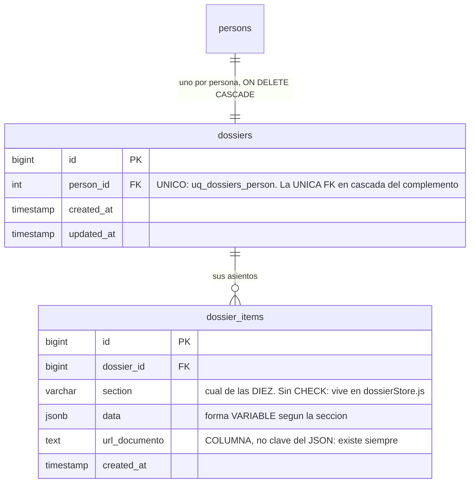
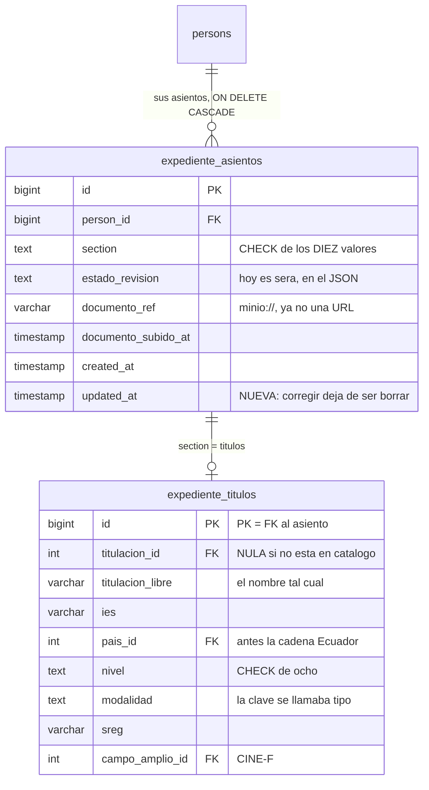
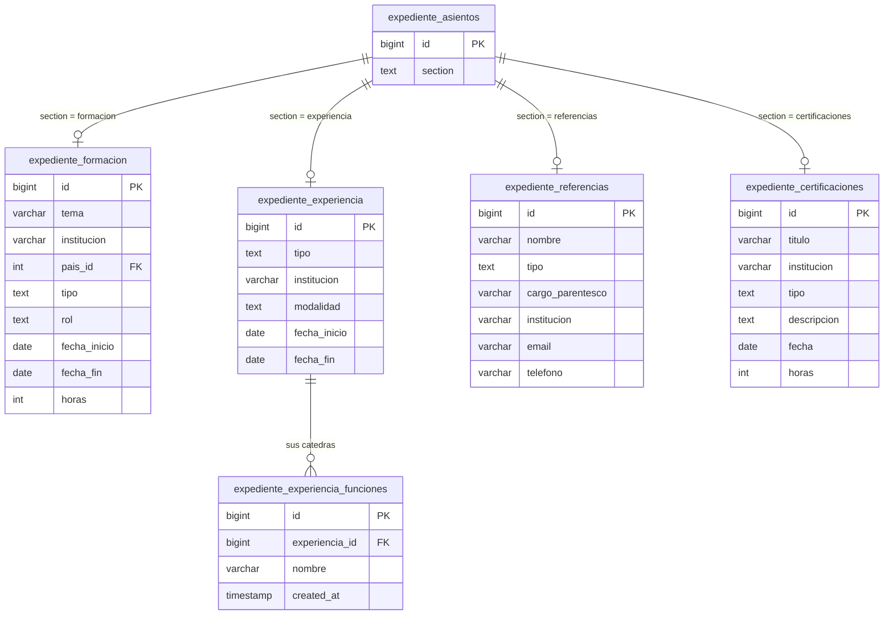
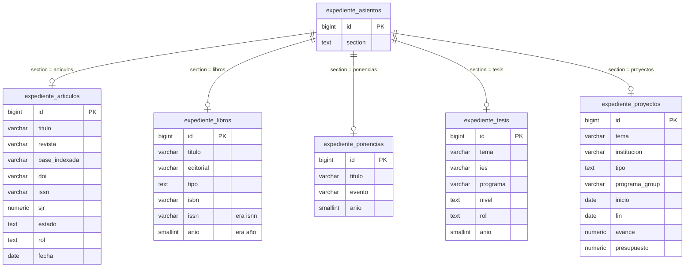
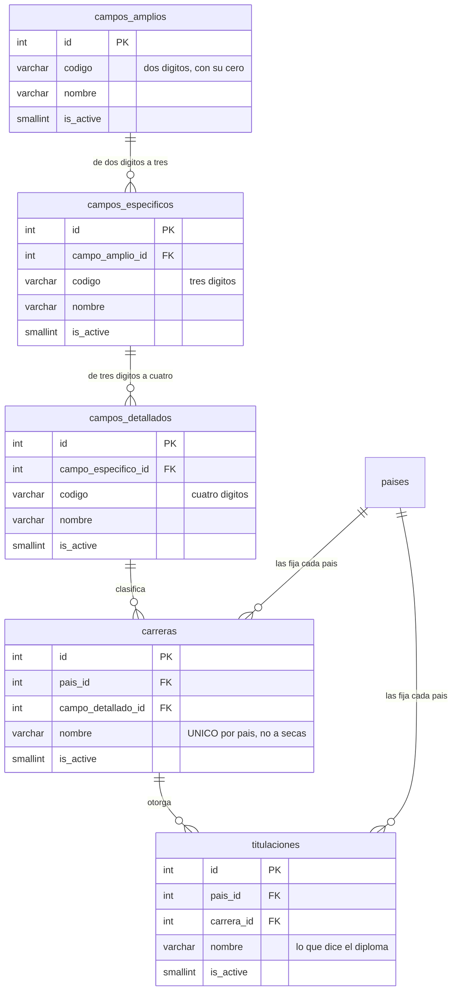

El **expediente** —el *dossier*— es el historial académico y profesional de una persona: sus títulos,
su experiencia, sus publicaciones. Son **dos tablas y diez columnas**, la familia más pequeña del
complemento, y la que más historia tiene detrás: hasta la migración **esto era MongoDB**.

## 1 · Un expediente por persona, y lo impone la base

`dossiers` no guarda casi nada: es la cabecera que existe para colgar de ella los asientos. Lo único
que aporta es una garantía, `uq_dossiers_person` sobre `person_id`: **nadie tiene dos expedientes**.

Y su clave ajena a `persons` lleva **`ON DELETE CASCADE`**, cosa que hay que leer en contexto: de las
**once** claves ajenas que el chat y el expediente tienen hacia el núcleo, **ésta es la única** con
cascada; las otras diez llevan la política por defecto. Es deliberado y dice algo del modelo: el
expediente **no tiene sentido sin su persona**, mientras que un mensaje de chat sí sobrevive como
parte de una conversación en la que participaron otros.

## 2 · El asiento, y por qué es JSONB

`dossier_items` es cada entrada del expediente: un título, un congreso, una referencia.

**`section` decide qué forma tiene `data`.** Las diez secciones no comparten estructura —un título
tiene institución y año; una ponencia tiene congreso, ciudad y fecha— y por eso el contenido va en
`data JSONB` en vez de en columnas. Modelarlas como diez tablas habría sido lo ortodoxo y también lo
peor: son datos que rellena el propio usuario y cuya forma cambia cada curso.

Las diez secciones **no son un `CHECK`**: viven en `SECTIONS`, dentro de
`backend/services/users/dossierStore.js`.

```
titulos · experiencia · referencias · formacion · certificaciones
articulos · libros · ponencias · tesis · proyectos
```

Las cinco últimas están además agrupadas como `INVESTIGACION_SECTIONS`, que es lo que da la pestaña
de investigación del perfil. En el frontend, cada sección tiene su ruta bajo `/perfil`.

**`url_documento`, en cambio, SÍ es columna** — y esa asimetría es la decisión de diseño de la tabla.
Todos los asientos tienen respaldo documental, y se consulta siempre: algo que existe en el 100 % de
las filas y se lee en el 100 % de las consultas no se esconde dentro de un blob, porque entonces no
se puede indexar ni exigir con un `NOT NULL`. Lo variable va al JSON; lo invariable, a la columna.

## 3 · Aquí había MongoDB, y se nota

Las dos «colecciones» que había se migraron a tablas con `data JSONB`, y **las colecciones de
entonces son hoy valores de la columna `section`**. La migración conservó a propósito dos cosas que
hoy parecen rarezas:

- **Los identificadores se exponen como texto**, para preservar el contrato que tenía Mongo y no
  romper al cliente que ya existía.
- **Los valores por defecto de cada sección replican exactamente** los del antiguo esquema de
  Mongoose. `titulos`, por ejemplo, nace con `pais: "Ecuador"` y `sera: "Enviado"`.

`dossier_items` es además una tabla **de sólo añadir**: no tiene `updated_at`, que es la señal por la
que se distingue un registro histórico de una entidad con estado. Corregir un asiento es borrarlo y
poner otro.

## 4 · Lo que cambió con la identidad

El expediente **enlaza por `person_id`**, y eso es nuevo. Antes de que `persons`
[repartiera su identidad](/modelo/organizacion/#la-persona-ya-no-lo-lleva-todo-encima), el expediente
se ataba a **la cédula**, y esa columna ya no existe: la cédula vive en `documentos_identidad` con su
tipo y su país emisor.

La consecuencia práctica no es de fontanería: **un extranjero con pasaporte tiene hoy expediente
igual que cualquiera**, cosa que antes no era posible porque no había dónde ponerle la cédula.

:::note[Quién puede leerlo, y el IDOR que lo cerró]
El acceso al expediente es lo que motivó `requireDossierAccess`, y detrás hay un **IDOR real y
cerrado**: el guard miraba *la tarea* en vez de *el entregable*, y un docente podía descargar el
documento de otro. El detalle, en [Autenticación y autorización](/backend/auth/).

Consecuencia que muerde al probar: **toda persona necesita el rol base `Usuario`** para ver su propio
expediente — es el rol que otorga `dossier: read, create, update`. Los roles de gestión **no lo
incluyen**, así que un `Gestor*` sin `Usuario` recibe un 403 al abrir su propia ficha.
:::

## El diagrama


```mermaid
erDiagram
  persons ||--|| dossiers : "uno por persona, ON DELETE CASCADE"
  dossiers ||--o{ dossier_items : "sus asientos"

  dossiers {
    bigint id PK
    int person_id FK "UNICO: uq_dossiers_person. La UNICA FK en cascada del complemento"
    timestamp created_at
    timestamp updated_at
  }

  dossier_items {
    bigint id PK
    bigint dossier_id FK
    varchar section "cual de las DIEZ. Sin CHECK: vive en dossierStore.js"
    jsonb data "forma VARIABLE segun la seccion"
    text url_documento "COLUMNA, no clave del JSON: existe siempre"
    timestamp created_at
  }
```

La ausencia de `updated_at` en `dossier_items` no es un descuido: es **la marca de una tabla de sólo
añadir**. En Deasy, la tabla que lleva `updated_at` tiene además un trigger `set_updated_at()` que lo
mantiene; la que no lo lleva está diciendo que sus filas no se tocan una vez escritas.
:::caution[El diseño al que va: el frente 18 — TODAVÍA NO ESTÁ EN LA BASE]
Todo lo que hay **encima** de este aviso describe el sistema **tal como funciona hoy**: dos tablas y
un `data JSONB`. Lo que sigue es un **diseño en documentación, aún sin implementar**. Mientras esta
sección exista sin su cambio de esquema, lo cierto es lo de arriba.
:::

## 5 · A dónde va: el expediente sale del JSON y entra en la base

El argumento con el que la sección 2 defiende el JSONB —*«son datos que rellena el propio usuario y
cuya forma cambia cada curso»*— **se midió contra el código el 2026-09-04 y es falso**. Las diez
formas están fijadas a mano en los formularios de Vue, con `v-model` literales: `AgregarTitulo` tiene
nueve. Añadir un campo obliga hoy a tocar el formulario **exactamente igual que obligaría a tocar una
tabla**. Se está pagando el precio del JSONB —cero integridad, ninguna consulta que entre en el
dato— sin cobrar su beneficio, que es evolucionar sin migración.

Y el precio se cobra en sitios concretos. `pais` es la cadena `"Ecuador"` mientras la tabla `paises`
tiene **232 filas con su ISO**. Ninguna consulta entra en el JSON: se lee el árbol entero y se filtra
en JavaScript. Los datos de **terceros** —nombre, correo y teléfono de quien da una referencia— viven
en un blob del que no se pueden localizar ni borrar uno a uno, que es justo lo que la LOPDP pide
poder hacer. Y el blob llevaba escondidos dos defectos que una columna habría cazado al escribirla:
la sección de libros guarda **`isnn`** donde la de artículos guarda `issn` —el mismo identificador,
dos nombres, y la errata visible en pantalla—, y hay una clave llamada literalmente **`año`**, con
`ñ`. El diseño son **17 tablas nuevas, 121 columnas y 22 claves ajenas**, con **28 restricciones
`CHECK`** donde hoy hay **cero**. Y sólo hay **3 asientos** en la base, todos de semilla: migrar es
gratis ahora y deja de serlo en cuanto el sistema entre en uso.

### 5.1 · La espina, y el asiento partido en dos

`expediente_asientos` deja de guardar `data` y pasa a ser **la espina**: lo que tienen los diez asientos
—de qué sección son, su respaldo escaneado, su estado de revisión y sus fechas—. El detalle va a una
tabla por sección, cuya **clave primaria ES la clave ajena** al asiento, con `ON DELETE CASCADE`: un
asiento y su detalle son la misma fila partida en dos tablas. Es el patrón que el esquema ya usa en
`contract_origins`, que deja así de ser su único caso.


```mermaid
erDiagram
  persons ||--o{ expediente_asientos : "sus asientos, ON DELETE CASCADE"
  expediente_asientos ||--o| expediente_titulos : "section = titulos"

  expediente_asientos {
    bigint id PK
    bigint person_id FK
    text section "CHECK de los DIEZ valores"
    text estado_revision "hoy es sera, en el JSON"
    varchar documento_ref "minio://, ya no una URL"
    timestamp documento_subido_at
    timestamp created_at
    timestamp updated_at "NUEVA: corregir deja de ser borrar"
  }

  expediente_titulos {
    bigint id PK "PK = FK al asiento"
    int titulacion_id FK "NULA si no esta en catalogo"
    varchar titulacion_libre "el nombre tal cual"
    varchar ies
    int pais_id FK "antes la cadena Ecuador"
    text nivel "CHECK de ocho"
    text modalidad "la clave se llamaba tipo"
    varchar sreg
    int campo_amplio_id FK "CINE-F"
  }
```

Tres cosas que ese diagrama decide y no se ven a simple vista. **`section` pasa a ser un `CHECK`**:
hoy los diez valores viven en la constante `SECTIONS` de `dossierStore.js`, así que un
`section = 'titulso'` entra sin protesta y deja el asiento huérfano. **`documento_ref` sustituye a
`url_documento`**, que guardaba una URL completa con `MINIO_PUBLIC_ENDPOINT` dentro: mover la pila
invalidaba todas las filas. Es el mismo antipatrón que el frente 14 ya corrigió en
`documentos_identidad.escaneo_ref` — y el comentario de aquella columna cita precisamente a ésta como
el ejemplo a no repetir. Y **`updated_at` cambia la naturaleza de la tabla**: deja de ser de sólo
añadir, así que corregir una tilde de un título ya no obliga a borrar el asiento con su respaldo.

### 5.2 · El resto del currículo

Cuatro secciones más, y **la única tabla hija de todo el modelo**: `funcion_catedra` es hoy un array
dentro del JSON, construido partiendo un textarea por comas. No es un obstáculo para salir del
JSONB — es la mejora más directa del frente, porque hoy la pregunta *«¿quién ha dado Bases de
datos?»* no se puede hacer sin leer todos los expedientes enteros.


```mermaid
erDiagram
  expediente_asientos ||--o| expediente_formacion : "section = formacion"
  expediente_asientos ||--o| expediente_experiencia : "section = experiencia"
  expediente_asientos ||--o| expediente_referencias : "section = referencias"
  expediente_asientos ||--o| expediente_certificaciones : "section = certificaciones"
  expediente_experiencia ||--o{ expediente_experiencia_funciones : "sus catedras"

  expediente_asientos {
    bigint id PK
    text section
  }

  expediente_formacion {
    bigint id PK
    varchar tema
    varchar institucion
    int pais_id FK
    text tipo
    text rol
    date fecha_inicio
    date fecha_fin
    int horas
  }

  expediente_experiencia {
    bigint id PK
    text tipo
    varchar institucion
    text modalidad
    date fecha_inicio
    date fecha_fin
  }

  expediente_experiencia_funciones {
    bigint id PK
    bigint experiencia_id FK
    varchar nombre
    timestamp created_at
  }

  expediente_referencias {
    bigint id PK
    varchar nombre
    text tipo
    varchar cargo_parentesco
    varchar institucion
    varchar email
    varchar telefono
  }

  expediente_certificaciones {
    bigint id PK
    varchar titulo
    varchar institucion
    text tipo
    text descripcion
    date fecha
    int horas
  }
```

`expediente_referencias` es la que más cambia de significado sin cambiar de forma: **son datos de un
tercero** que nunca aceptó nada aquí, y en columnas se pueden localizar y borrar uno a uno. De paso
corrige una errata que nadie había visto: la clave JSON se llama `institution`, en inglés, rodeada de
nueve claves en español. Las fechas dejan de ser cadenas —ordenar por fecha era ordenar texto— y
`tipo`, `rol` y `modalidad` pasan a tener `CHECK`.

### 5.3 · Las cinco de producción académica

**No son polimórficas**, aunque la sección 2 de esta página las agrupe. `AgregarInvestigacion.vue`
tiene cinco bloques hermanos bajo `v-if="form.tipoProduccion === ..."`, cada uno con su lista de
campos **cerrada y casi disjunta**: lo polimórfico es el formulario, no los datos. La documentación
las agrupó por cómo se pintan, no por cómo son.


```mermaid
erDiagram
  expediente_asientos ||--o| expediente_articulos : "section = articulos"
  expediente_asientos ||--o| expediente_libros : "section = libros"
  expediente_asientos ||--o| expediente_ponencias : "section = ponencias"
  expediente_asientos ||--o| expediente_tesis : "section = tesis"
  expediente_asientos ||--o| expediente_proyectos : "section = proyectos"

  expediente_asientos {
    bigint id PK
    text section
  }

  expediente_articulos {
    bigint id PK
    varchar titulo
    varchar revista
    varchar base_indexada
    varchar doi
    varchar issn
    numeric sjr
    text estado
    text rol
    date fecha
  }

  expediente_libros {
    bigint id PK
    varchar titulo
    varchar editorial
    text tipo
    varchar isbn
    varchar issn "era isnn"
    smallint anio "era año"
  }

  expediente_ponencias {
    bigint id PK
    varchar titulo
    varchar evento
    smallint anio
  }

  expediente_tesis {
    bigint id PK
    varchar tema
    varchar ies
    varchar programa
    text nivel
    text rol
    smallint anio
  }

  expediente_proyectos {
    bigint id PK
    varchar tema
    varchar institucion
    text tipo
    varchar programa_group
    date inicio
    date fin
    numeric avance
    numeric presupuesto
  }
```

Lo que sí las une es una **vista**, `expediente_investigacion`, con el `UNION ALL` de las cinco: la
pestaña de investigación deja de armarse en JavaScript. Y es de sólo lectura a propósito — hacerla
escribible con triggers `INSTEAD OF` daría un segundo camino de inserción que se saltaría los
`CHECK`. De los tipos, dos importan: `presupuesto` es `NUMERIC` y nunca coma flotante, porque es
dinero; y `avance` lleva un `CHECK` entre 0 y 100, que el JSON no tenía — aceptaba 350 sin inmutarse.

### 5.4 · El catálogo académico

Cinco tablas encadenadas. **Las tres de arriba son la norma internacional CINE-F (ISCED-F) de la
UNESCO y no llevan país** —ponérselo las volvería incomparables, que es lo contrario de para lo que
existen—; **las dos de abajo sí**, porque las fija cada país y no tienen equivalente internacional.


```mermaid
erDiagram
  campos_amplios ||--o{ campos_especificos : "de dos digitos a tres"
  campos_especificos ||--o{ campos_detallados : "de tres digitos a cuatro"
  campos_detallados ||--o{ carreras : "clasifica"
  carreras ||--o{ titulaciones : "otorga"
  paises ||--o{ carreras : "las fija cada pais"
  paises ||--o{ titulaciones : "las fija cada pais"

  campos_amplios {
    int id PK
    varchar codigo "dos digitos, con su cero"
    varchar nombre
    smallint is_active
  }

  campos_especificos {
    int id PK
    int campo_amplio_id FK
    varchar codigo "tres digitos"
    varchar nombre
    smallint is_active
  }

  campos_detallados {
    int id PK
    int campo_especifico_id FK
    varchar codigo "cuatro digitos"
    varchar nombre
    smallint is_active
  }

  carreras {
    int id PK
    int pais_id FK
    int campo_detallado_id FK
    varchar nombre "UNICO por pais, no a secas"
    smallint is_active
  }

  titulaciones {
    int id PK
    int pais_id FK
    int carrera_id FK
    varchar nombre "lo que dice el diploma"
    smallint is_active
  }
```

El enganche desde el expediente **no es obligatorio**: `expediente_titulos` admite `titulacion_id` nula
más el nombre en texto libre, con un `CHECK` que exige una de las dos. La alternativa evaluada —una
fila «NR / No registra» en el catálogo— satisface la clave ajena **y pierde el nombre real**: un
`Diplôme d'Ingénieur` francés se degradaría a «NR». Así el catálogo es preferente pero no obligatorio.

### 5.5 · Dónde está el detalle

El plan completo del frente —las decisiones con sus mediciones, el DDL comentado entero y las nueve
tareas con su control de ejecución— vive en el repositorio, en
`docs/planes/expediente-relacional-2026-09.md`. **No se publica aquí** porque es material de trabajo:
esta página describe el sistema, no el camino para llegar a él.
