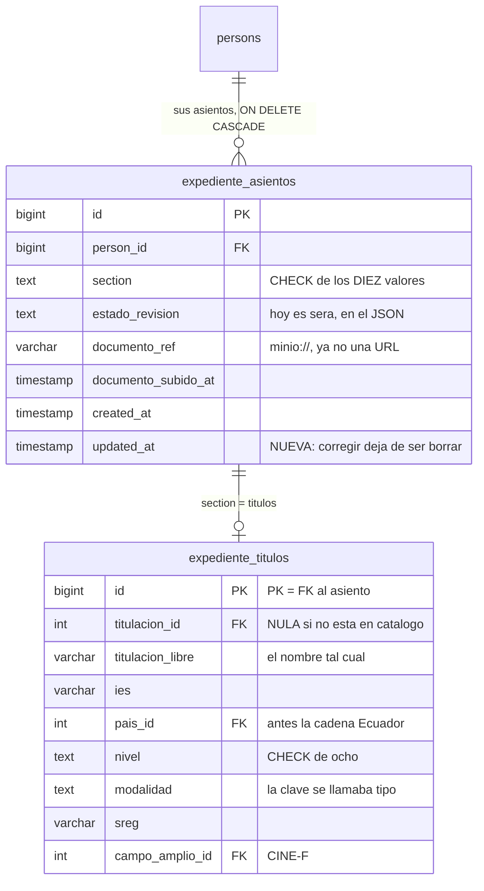
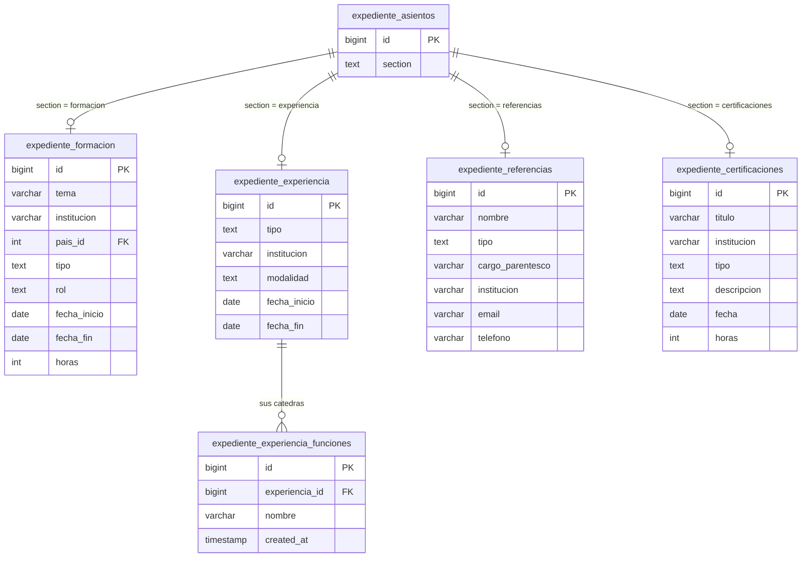
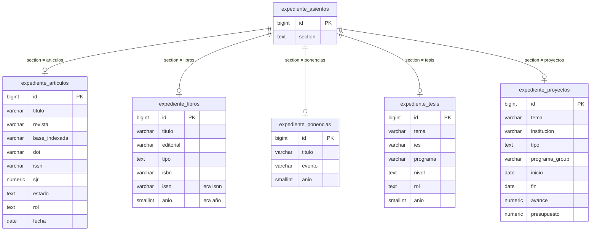
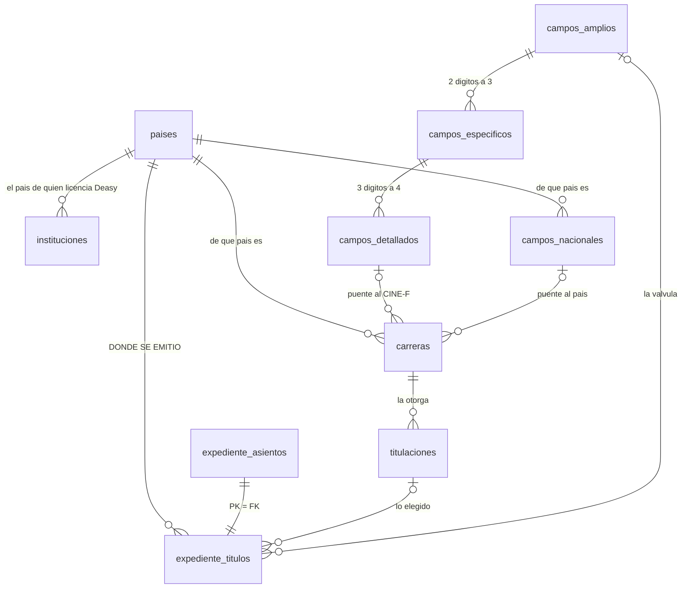
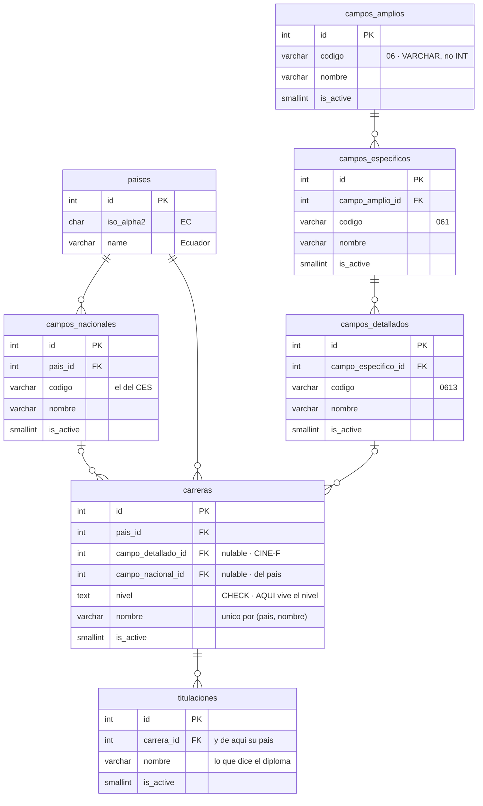
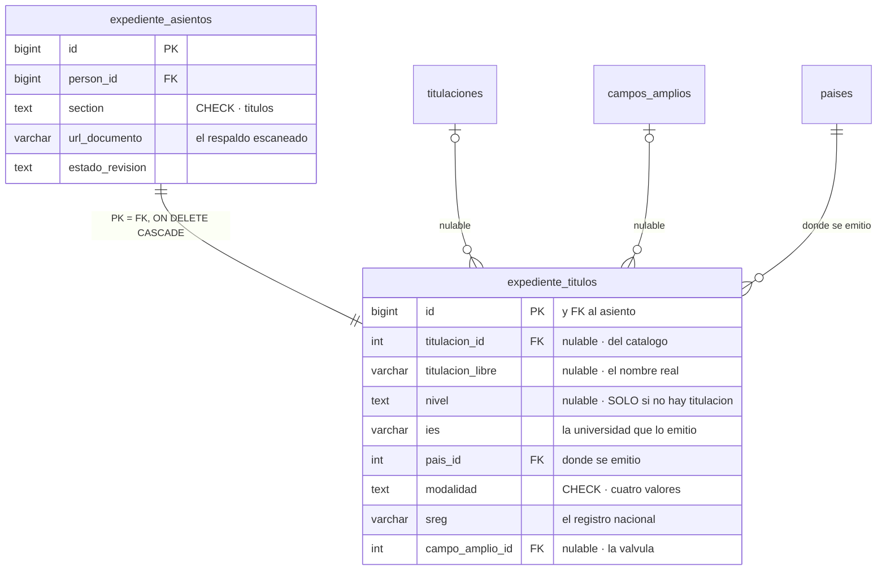
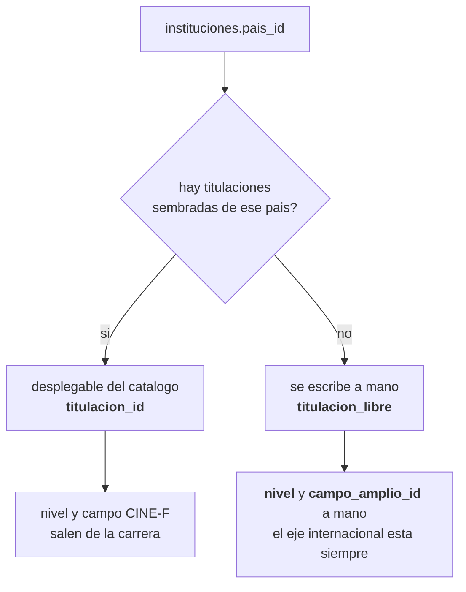
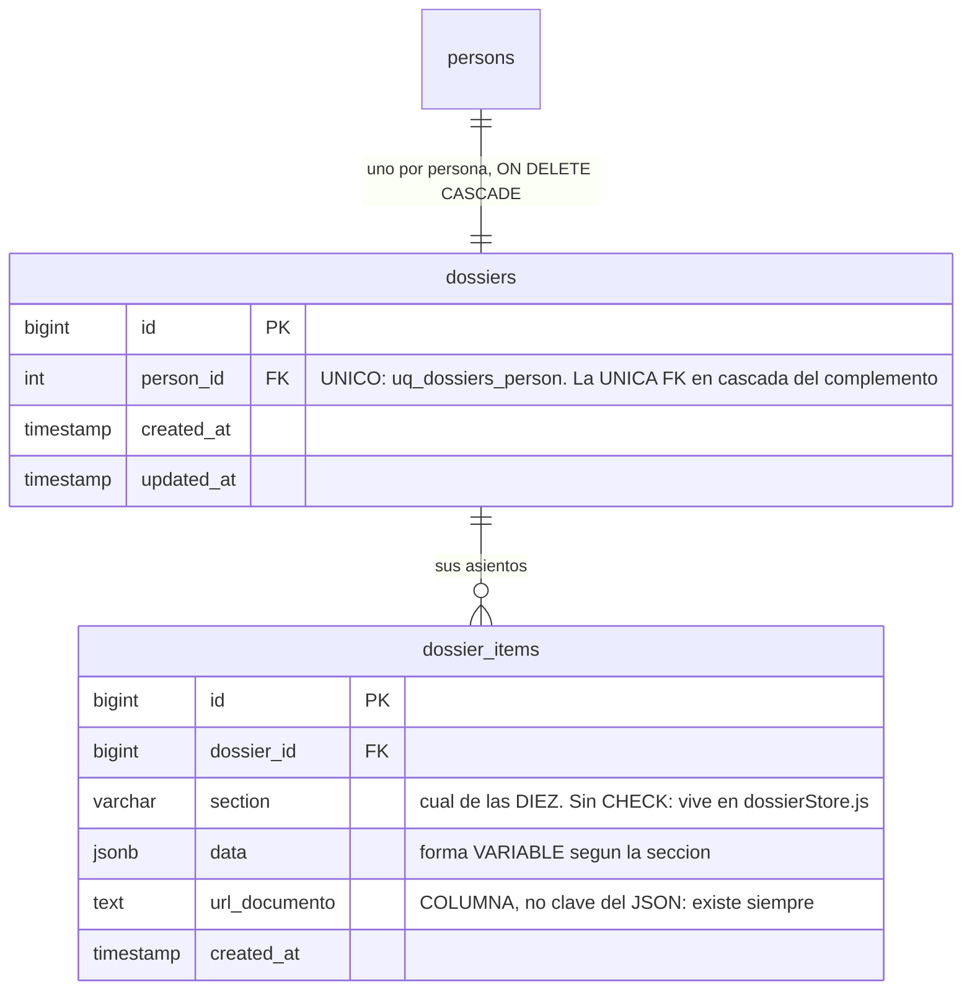

El **expediente** —el *dossier*— es el historial académico y profesional de una persona: sus títulos,
su experiencia, sus publicaciones.

:::caution[Esta página describe el modelo APROBADO, que todavía NO está en la base]
El diseño de abajo es el del **frente 18**, aprobado por el dueño y **pendiente de implementar**:
**diecisiete tablas y una vista** donde hoy hay dos y un `JSONB`. El plan, con su DDL completo y su control de
ejecución, es [`expediente-relacional-2026-09.md`](https://github.com/fresvel/deasy/blob/develop/docs/planes/expediente-relacional-2026-09.md).

**Lo que hay en la base HOY** —dos tablas, `dossiers` y `dossier_items`, con el contenido dentro de
un `JSONB`— está al final, en [«De dónde viene»](#de-dónde-viene-el-modelo-que-se-retira). Se
conserva porque es lo que el sistema contiene mientras el frente no se ejecute.
:::

## El modelo

Son **diecisiete tablas y una vista**: la espina, con una fila por asiento; **diez de sección** que
cuelgan de ella con su clave primaria siendo a la vez la ajena; la **hija** del uno-a-muchos de las
cátedras; y **cinco** del catálogo académico. El `JSONB` desaparece entero, y la tabla `dossiers`
también: era una cáscara 1:1 sobre `persons` sin ni una columna propia.


El argumento con el que el modelo de hoy defiende el JSONB —*«son datos que rellena el propio usuario y
cuya forma cambia cada curso»*— **se midió contra el código el 2026-09-04 y es falso**. Las diez
formas están fijadas a mano en los formularios de Vue, con `v-model` literales: `AgregarTitulo` tiene
nueve. Añadir un campo obliga hoy a tocar el formulario **exactamente igual que obligaría a tocar una
tabla**. Se está pagando el precio del JSONB —cero integridad, ninguna consulta que entre en el
dato— sin cobrar su beneficio, que es evolucionar sin migración.

Y el precio se cobra en sitios concretos. `pais` es la cadena `"Ecuador"` mientras la tabla `paises`
tiene **232 filas con su ISO**. Ninguna consulta entra en el JSON: se lee el árbol entero y se filtra
en JavaScript. Los datos de **terceros** —nombre, correo y teléfono de quien da una referencia— viven
en un blob del que no se pueden localizar ni borrar uno a uno, que es justo lo que la LOPDP pide
poder hacer. Y el blob llevaba escondidos dos defectos que una columna habría cazado al escribirla:
la sección de libros guarda **`isnn`** donde la de artículos guarda `issn` —el mismo identificador,
dos nombres, y la errata visible en pantalla—, y hay una clave llamada literalmente **`año`**, con
`ñ`. El diseño son **17 tablas y una vista, 121 columnas y 22 claves ajenas**, con **28 restricciones
`CHECK`** donde hoy hay **cero**. Y sólo hay **3 asientos** en la base, todos de semilla: migrar es
gratis ahora y deja de serlo en cuanto el sistema entre en uso.

## 1 · La espina, y el asiento partido en dos

`expediente_asientos` deja de guardar `data` y pasa a ser **la espina**: lo que tienen los diez asientos
—de qué sección son, su respaldo escaneado, su estado de revisión y sus fechas—. El detalle va a una
tabla por sección, cuya **clave primaria ES la clave ajena** al asiento, con `ON DELETE CASCADE`: un
asiento y su detalle son la misma fila partida en dos tablas. Es el patrón que el esquema ya usa en
`contract_origins`, que deja así de ser su único caso.


```mermaid
erDiagram
  persons ||--o{ expediente_asientos : "sus asientos, ON DELETE CASCADE"
  expediente_asientos ||--o| expediente_titulos : "section = titulos"

  expediente_asientos {
    bigint id PK
    bigint person_id FK
    text section "CHECK de los DIEZ valores"
    text estado_revision "hoy es sera, en el JSON"
    varchar documento_ref "minio://, ya no una URL"
    timestamp documento_subido_at
    timestamp created_at
    timestamp updated_at "NUEVA: corregir deja de ser borrar"
  }

  expediente_titulos {
    bigint id PK "PK = FK al asiento"
    int titulacion_id FK "NULA si no esta en catalogo"
    varchar titulacion_libre "el nombre tal cual"
    varchar ies
    int pais_id FK "antes la cadena Ecuador"
    text nivel "CHECK de ocho"
    text modalidad "la clave se llamaba tipo"
    varchar sreg
    int campo_amplio_id FK "CINE-F"
  }
```

Tres cosas que ese diagrama decide y no se ven a simple vista. **`section` pasa a ser un `CHECK`**:
hoy los diez valores viven en la constante `SECTIONS` de `dossierStore.js`, así que un
`section = 'titulso'` entra sin protesta y deja el asiento huérfano. **`documento_ref` sustituye a
`url_documento`**, que guardaba una URL completa con `MINIO_PUBLIC_ENDPOINT` dentro: mover la pila
invalidaba todas las filas. Es el mismo antipatrón que el frente 14 ya corrigió en
`documentos_identidad.escaneo_ref` — y el comentario de aquella columna cita precisamente a ésta como
el ejemplo a no repetir. Y **`updated_at` cambia la naturaleza de la tabla**: deja de ser de sólo
añadir, así que corregir una tilde de un título ya no obliga a borrar el asiento con su respaldo.

## 2 · El resto del currículo

Cuatro secciones más, y **la única tabla hija de todo el modelo**: `funcion_catedra` es hoy un array
dentro del JSON, construido partiendo un textarea por comas. No es un obstáculo para salir del
JSONB — es la mejora más directa del frente, porque hoy la pregunta *«¿quién ha dado Bases de
datos?»* no se puede hacer sin leer todos los expedientes enteros.


```mermaid
erDiagram
  expediente_asientos ||--o| expediente_formacion : "section = formacion"
  expediente_asientos ||--o| expediente_experiencia : "section = experiencia"
  expediente_asientos ||--o| expediente_referencias : "section = referencias"
  expediente_asientos ||--o| expediente_certificaciones : "section = certificaciones"
  expediente_experiencia ||--o{ expediente_experiencia_funciones : "sus catedras"

  expediente_asientos {
    bigint id PK
    text section
  }

  expediente_formacion {
    bigint id PK
    varchar tema
    varchar institucion
    int pais_id FK
    text tipo
    text rol
    date fecha_inicio
    date fecha_fin
    int horas
  }

  expediente_experiencia {
    bigint id PK
    text tipo
    varchar institucion
    text modalidad
    date fecha_inicio
    date fecha_fin
  }

  expediente_experiencia_funciones {
    bigint id PK
    bigint experiencia_id FK
    varchar nombre
    timestamp created_at
  }

  expediente_referencias {
    bigint id PK
    varchar nombre
    text tipo
    varchar cargo_parentesco
    varchar institucion
    varchar email
    varchar telefono
  }

  expediente_certificaciones {
    bigint id PK
    varchar titulo
    varchar institucion
    text tipo
    text descripcion
    date fecha
    int horas
  }
```

`expediente_referencias` es la que más cambia de significado sin cambiar de forma: **son datos de un
tercero** que nunca aceptó nada aquí, y en columnas se pueden localizar y borrar uno a uno. De paso
corrige una errata que nadie había visto: la clave JSON se llama `institution`, en inglés, rodeada de
nueve claves en español. Las fechas dejan de ser cadenas —ordenar por fecha era ordenar texto— y
`tipo`, `rol` y `modalidad` pasan a tener `CHECK`.

## 3 · Las cinco de producción académica

**No son polimórficas**, aunque la sección 2 de esta página las agrupe. `AgregarInvestigacion.vue`
tiene cinco bloques hermanos bajo `v-if="form.tipoProduccion === ..."`, cada uno con su lista de
campos **cerrada y casi disjunta**: lo polimórfico es el formulario, no los datos. La documentación
las agrupó por cómo se pintan, no por cómo son.


```mermaid
erDiagram
  expediente_asientos ||--o| expediente_articulos : "section = articulos"
  expediente_asientos ||--o| expediente_libros : "section = libros"
  expediente_asientos ||--o| expediente_ponencias : "section = ponencias"
  expediente_asientos ||--o| expediente_tesis : "section = tesis"
  expediente_asientos ||--o| expediente_proyectos : "section = proyectos"

  expediente_asientos {
    bigint id PK
    text section
  }

  expediente_articulos {
    bigint id PK
    varchar titulo
    varchar revista
    varchar base_indexada
    varchar doi
    varchar issn
    numeric sjr
    text estado
    text rol
    date fecha
  }

  expediente_libros {
    bigint id PK
    varchar titulo
    varchar editorial
    text tipo
    varchar isbn
    varchar issn "era isnn"
    smallint anio "era año"
  }

  expediente_ponencias {
    bigint id PK
    varchar titulo
    varchar evento
    smallint anio
  }

  expediente_tesis {
    bigint id PK
    varchar tema
    varchar ies
    varchar programa
    text nivel
    text rol
    smallint anio
  }

  expediente_proyectos {
    bigint id PK
    varchar tema
    varchar institucion
    text tipo
    varchar programa_group
    date inicio
    date fin
    numeric avance
    numeric presupuesto
  }
```

Lo que sí las une es una **vista**, `expediente_investigacion`, con el `UNION ALL` de las cinco: la
pestaña de investigación deja de armarse en JavaScript. Y es de sólo lectura a propósito — hacerla
escribible con triggers `INSTEAD OF` daría un segundo camino de inserción que se saltaría los
`CHECK`. De los tipos, dos importan: `presupuesto` es `NUMERIC` y nunca coma flotante, porque es
dinero; y `avance` lleva un `CHECK` entre 0 y 100, que el JSON no tenía — aceptaba 350 sin inmutarse.

## 4 · El catálogo académico

Aquí hay **dos ejes**, y confundirlos es el error fácil.

**El eje de la clasificación es internacional y NO lleva país.** Son `campos_amplios`,
`campos_especificos` y `campos_detallados`: la CINE-F (ISCED-F) de la UNESCO, **220 filas** —12 · 58 ·
150—. Existen precisamente para que un título francés y uno ecuatoriano se puedan comparar; ponerles
país las volvería incomparables, que es lo contrario de para lo que existen.

**El eje de la oferta sí lo lleva**, porque lo fija cada país y no tiene equivalente internacional:
`campos_nacionales` (en Ecuador, los del CES), `carreras` y `titulaciones`.

### Nivel conceptual: las tablas y sus líneas

Sin columnas, para que se vean las líneas. Es un diagrama entidad-relación en notación **pata de
gallo** (*crow's foot*): el extremo con tres patas es el «muchos», la barra doble es el «uno
obligatorio» y el círculo es el «cero» —es decir, la clave ajena admite nulo—.


```mermaid
erDiagram
  paises ||--o{ instituciones : "el pais de quien licencia Deasy"
  paises ||--o{ campos_nacionales : "de que pais es"
  paises ||--o{ carreras : "de que pais es"
  paises ||--o{ expediente_titulos : "DONDE SE EMITIO"

  campos_amplios ||--o{ campos_especificos : "2 digitos a 3"
  campos_especificos ||--o{ campos_detallados : "3 digitos a 4"

  campos_detallados |o--o{ carreras : "puente al CINE-F"
  campos_nacionales |o--o{ carreras : "puente al pais"
  carreras ||--o{ titulaciones : "la otorga"

  expediente_asientos ||--|| expediente_titulos : "PK = FK"
  titulaciones |o--o{ expediente_titulos : "lo elegido"
  campos_amplios |o--o{ expediente_titulos : "la valvula"
```

**Doce líneas, una por clave ajena.** Nulable quiere decir que el enganche es opcional:

| # | Desde | Hacia | Nulable | Para qué |
|---|---|---|:--:|---|
| 1 | `instituciones.pais_id` | `paises` | no | **Ya existe.** El país de quien licencia Deasy |
| 2 | `campos_especificos.campo_amplio_id` | `campos_amplios` | no | La jerarquía CINE-F |
| 3 | `campos_detallados.campo_especifico_id` | `campos_especificos` | no | La jerarquía CINE-F |
| 4 | `campos_nacionales.pais_id` | `paises` | no | De qué país es el campo |
| 5 | **`carreras.campo_detallado_id`** | `campos_detallados` | **sí** | **El puente al CINE-F** |
| 6 | **`carreras.campo_nacional_id`** | `campos_nacionales` | **sí** | **El puente al catálogo del país** |
| 7 | `carreras.pais_id` | `paises` | no | De qué país es la carrera |
| 8 | `titulaciones.carrera_id` | `carreras` | no | Qué carrera la otorga — **y de ahí sale su país** |
| 9 | `expediente_titulos.id` | `expediente_asientos` | no | El subtipo · `PK = FK`, `ON DELETE CASCADE` |
| 10 | `expediente_titulos.titulacion_id` | `titulaciones` | **sí** | Lo elegido en el desplegable |
| 11 | `expediente_titulos.pais_id` | `paises` | no | Dónde se emitió el diploma |
| 12 | `expediente_titulos.campo_amplio_id` | `campos_amplios` | **sí** | Clasificar sin titulación |

Tres cosas que el dibujo dice y conviene leer despacio.

**De `instituciones` sale UNA sola línea, y va a `paises`.** No hay ninguna hacia el catálogo, y no
es un olvido: la institución no se relaciona con las carreras, **las filtra**. Es lo mismo que ya hace
con los documentos de identidad, donde su `pais_id` decide cuál es el documento nacional sin que
exista clave ajena entre ambos.

**`carreras` tiene DOS punteros de campo —las líneas 5 y 6— y ahí está la equivalencia.**
`campo_detallado_id` da el código internacional y `campo_nacional_id` el del país, en la misma fila.
No hace falta una tabla de correspondencias entre los dos árboles: la carrera **es** la
correspondencia, un hecho concreto cada vez en lugar de un mapeo declarado en abstracto.

**La línea 11 no elige nada.** `expediente_titulos.pais_id` es dato: dónde se emitió el diploma. Quien
elige el catálogo es la línea 1, que está al otro lado del dibujo.

### Nivel lógico: el catálogo con sus columnas


```mermaid
erDiagram
  paises ||--o{ campos_nacionales : ""
  paises ||--o{ carreras : ""
  campos_amplios ||--o{ campos_especificos : ""
  campos_especificos ||--o{ campos_detallados : ""
  campos_detallados |o--o{ carreras : ""
  campos_nacionales |o--o{ carreras : ""
  carreras ||--o{ titulaciones : ""

  paises {
    int id PK
    char iso_alpha2 "EC"
    varchar name "Ecuador"
  }

  campos_amplios {
    int id PK
    varchar codigo "06 · VARCHAR, no INT"
    varchar nombre
    smallint is_active
  }

  campos_especificos {
    int id PK
    int campo_amplio_id FK
    varchar codigo "061"
    varchar nombre
    smallint is_active
  }

  campos_detallados {
    int id PK
    int campo_especifico_id FK
    varchar codigo "0613"
    varchar nombre
    smallint is_active
  }

  campos_nacionales {
    int id PK
    int pais_id FK
    varchar codigo "el del CES"
    varchar nombre
    smallint is_active
  }

  carreras {
    int id PK
    int pais_id FK
    int campo_detallado_id FK "nulable · CINE-F"
    int campo_nacional_id FK "nulable · del pais"
    text nivel "CHECK · AQUI vive el nivel"
    varchar nombre "unico por (pais, nombre)"
    smallint is_active
  }

  titulaciones {
    int id PK
    int carrera_id FK "y de aqui su pais"
    varchar nombre "lo que dice el diploma"
    smallint is_active
  }
```

Los códigos son `VARCHAR` y no `INT` a propósito: `'06'` no es el número seis, y perder el cero a la
izquierda rompe el código. Todas llevan además `created_at` y `updated_at` con su trigger.

### Nivel lógico: el enganche con el expediente


```mermaid
erDiagram
  expediente_asientos ||--|| expediente_titulos : "PK = FK, ON DELETE CASCADE"
  titulaciones |o--o{ expediente_titulos : "nulable"
  campos_amplios |o--o{ expediente_titulos : "nulable"
  paises ||--o{ expediente_titulos : "donde se emitio"

  expediente_asientos {
    bigint id PK
    bigint person_id FK
    text section "CHECK · titulos"
    varchar url_documento "el respaldo escaneado"
    text estado_revision
  }

  expediente_titulos {
    bigint id PK "y FK al asiento"
    int titulacion_id FK "nulable · del catalogo"
    varchar titulacion_libre "nulable · el nombre real"
    text nivel "nulable · SOLO si no hay titulacion"
    varchar ies "la universidad que lo emitio"
    int pais_id FK "donde se emitio"
    text modalidad "CHECK · cuatro valores"
    varchar sreg "el registro nacional"
    int campo_amplio_id FK "nulable · la valvula"
  }
```

### Por qué el nivel vive en `carreras` y no en el asiento

**Porque el nivel es una propiedad de la oferta, no de quien la cursó.** Una `Maestría en Educación`
es una maestría lo escriba quien lo escriba; si el nivel viviera en `expediente_titulos`, la persona
podría declararla como grado y nada lo impediría.

Está **medido** en la fuente del CES: sus filas de oferta traen `oferta_tipo`
—`carreras_de_grado` · `programas_maestria` · `programas_especializacion`— **a la altura de la
carrera**, no de la titulación.

Por eso el nivel está en los dos sitios, pero **nunca a la vez**, con el mismo `CHECK` de exclusión
que ya usan `titulacion_id` y `titulacion_libre`:

| Caso | `titulacion_id` | `expediente_titulos.nivel` | De dónde sale el nivel |
|---|---|---|---|
| Título del catálogo | la fila elegida | **`NULL`** | `carreras.nivel` |
| Título extranjero o no catalogado | `NULL` | **obligatorio** | lo declara quien lo registra |

⚠️ El vocabulario del `CHECK` tiene que crecer: las dos listas del frontend suman ocho niveles y
**ninguna incluye `especializacion`**, que en la fuente del CES es el tipo de oferta más numeroso.

### Por qué `carreras` y `titulaciones` son dos tablas

Son cosas distintas: la **carrera** es lo que una universidad ofrece; la **titulación** es lo que
queda impreso en el diploma. Y la relación **no es 1:1**, aunque casi lo parezca.

Medido sobre las **617** filas de oferta de la fuente del CES:

| Titulaciones por carrera | Carreras |
|---|---:|
| 1 | 608 |
| 2 | 7 |
| 3 | 2 |

Los dos casos limpios —el resto están dañados en el origen— son:

- **`PEDAGOGÍA DE LAS CIENCIAS EXPERIMENTALES`** → *Licenciado/a en Pedagogía de la Química y
  Biología* · *Licenciado/a en Pedagogía de la Informática*
- **`HIDROLOGÍA`** → *Ingeniero/a Hidrólogo/a* · *Ingeniero/a en Ciencias del Agua*

Un 1,5 % de excepciones **no justificaría dos tablas por sí solo**. Lo que sí lo justifica es dónde
cuelga cada cosa: la clasificación (líneas 5 y 6) y el nivel son de la **carrera**, y colapsarlas
obligaría a repetir tres columnas en cada titulación hermana —y a que un día discreparan—. Además
`titulaciones` es lo único a lo que apunta el expediente, y `carreras` es lo que un día apuntará la
oferta de la propia institución.

**Y el país está en `carreras` solamente.** En `titulaciones` sería redundante: se llega a él por
`carrera_id`. Una columna copiada que nadie sincroniza es exactamente el problema que ya tiene
`task_items.assigned_person_id`, que necesita un trigger para no mentir.

### Qué catálogo se le ofrece a quien rellena


```mermaid
flowchart TB
  I["instituciones.pais_id"] --> Q{"hay titulaciones<br/>sembradas de ese pais?"}
  Q -->|si| A["desplegable del catalogo<br/><b>titulacion_id</b>"]
  Q -->|no| B["se escribe a mano<br/><b>titulacion_libre</b>"]
  A --> C["nivel y campo CINE-F<br/>salen de la carrera"]
  B --> D["<b>nivel</b> y <b>campo_amplio_id</b> a mano<br/>el eje internacional esta siempre"]
```

Una sola regla, en un solo sitio, y **no es una relación del modelo sino un filtro de la consulta**:

```sql
SELECT t.id, t.nombre, c.nivel
  FROM titulaciones t
  JOIN carreras c ON c.id = t.carrera_id
 WHERE c.pais_id = (SELECT pais_id FROM instituciones LIMIT 1)
   AND t.is_active = 1 AND c.is_active = 1
 ORDER BY c.nivel, t.nombre;
```

PUCESE es Ecuador, así que se ofrecen las titulaciones del CES —**y para todos los títulos, se hayan
cursado en Quito o en Lyon**, porque es con esa nomenclatura con la que la universidad reporta a su
regulador. Una universidad colombiana licencia Deasy mañana: se cambia su país en `/admin` y se
ofrece el catálogo de Colombia, sin tocar el modelo.

**Y no existe el caso «me quedé sin clasificar»**, porque el eje que clasifica nunca dependió del
país. Sin catálogo nacional sembrado se pierde el desplegable, no la clasificación.

### El enganche desde el expediente no es obligatorio

`expediente_titulos` admite `titulacion_id` nula más el nombre en texto libre, con un `CHECK` que
exige una de las dos. La alternativa evaluada —una fila «NR / No registra» en el catálogo— satisface
la clave ajena **y pierde el nombre real**: un `Diplôme d'Ingénieur` francés se degradaría a «NR».
Así el catálogo es preferente pero no obligatorio, y además **se sabe** cuándo un título no vino de
él, que es información que la fila «NR» tampoco daría.

## 5 · Dónde está el detalle

El plan completo del frente —las decisiones con sus mediciones, el DDL comentado entero y las nueve
tareas con su control de ejecución— vive en el repositorio, en
`docs/planes/expediente-relacional-2026-09.md`. **No se publica aquí** porque es material de trabajo:
esta página describe el sistema, no el camino para llegar a él.

---

## De dónde viene: el modelo que se retira

Lo que hay **en la base ahora mismo**, y por qué se cambia. Se conserva porque es lo que el sistema
contiene mientras el frente 18 no se ejecute, y porque explica de dónde salen varias rarezas del
modelo nuevo.

### El expediente era una cabecera propia

`dossiers` no guarda casi nada: es la cabecera que existe para colgar de ella los asientos. Lo único
que aporta es una garantía, `uq_dossiers_person` sobre `person_id`: **nadie tiene dos expedientes**.

Y su clave ajena a `persons` lleva **`ON DELETE CASCADE`**, cosa que hay que leer en contexto: de las
**once** claves ajenas que el chat y el expediente tienen hacia el núcleo, **ésta es la única** con
cascada; las otras diez llevan la política por defecto. Es deliberado y dice algo del modelo: el
expediente **no tiene sentido sin su persona**, mientras que un mensaje de chat sí sobrevive como
parte de una conversación en la que participaron otros.

### El asiento y su `data JSONB`

`dossier_items` es cada entrada del expediente: un título, un congreso, una referencia.

**`section` decide qué forma tiene `data`.** Las diez secciones no comparten estructura —un título
tiene institución y año; una ponencia tiene congreso, ciudad y fecha— y por eso el contenido va en
`data JSONB` en vez de en columnas. Modelarlas como diez tablas habría sido lo ortodoxo y también lo
peor: son datos que rellena el propio usuario y cuya forma cambia cada curso.

:::danger[Ese último argumento se midió y es FALSO]
«La forma cambia cada curso» **no se sostiene**. Medido contra el código el 2026-09-04: las formas
están **fijadas a mano en los formularios de Vue**, con `v-model` literales — `AgregarTitulo` tiene
nueve. Añadir un campo obliga a tocar el formulario igual que obligaría a tocar una tabla.

Es decir: **se paga el precio del JSONB sin cobrar su beneficio**. Ésa es la razón de que el modelo
se retire, y el detalle está en la [sección 5](#5--a-dónde-va-el-expediente-sale-del-json-y-entra-en-la-base).
:::

Las diez secciones **no son un `CHECK`**: viven en `SECTIONS`, dentro de
`backend/services/users/dossierStore.js`.

```
titulos · experiencia · referencias · formacion · certificaciones
articulos · libros · ponencias · tesis · proyectos
```

Las cinco últimas están además agrupadas como `INVESTIGACION_SECTIONS`, que es lo que da la pestaña
de investigación del perfil. En el frontend, cada sección tiene su ruta bajo `/perfil`.

**`url_documento`, en cambio, SÍ es columna** — y esa asimetría es la decisión de diseño de la tabla.
Todos los asientos tienen respaldo documental, y se consulta siempre: algo que existe en el 100 % de
las filas y se lee en el 100 % de las consultas no se esconde dentro de un blob, porque entonces no
se puede indexar ni exigir con un `NOT NULL`. Lo variable va al JSON; lo invariable, a la columna.

⚠️ **El principio es correcto; lo que guarda la columna, no.** `url_documento` almacena una **URL
completa** construida con `MINIO_PUBLIC_ENDPOINT`, así que el endpoint del entorno queda **dentro del
dato**: mover la pila o cambiar de dominio invalida todas las filas. Es el mismo antipatrón que el
frente 14 ya corrigió en `documentos_identidad`, y el modelo nuevo lo unifica en `documento_ref` con
la convención `minio://<bucket>/<objeto>`.

### Aquí había MongoDB, y se nota

Las dos «colecciones» que había se migraron a tablas con `data JSONB`, y **las colecciones de
entonces son hoy valores de la columna `section`**. La migración conservó a propósito dos cosas que
hoy parecen rarezas:

- **Los identificadores se exponen como texto**, para preservar el contrato que tenía Mongo y no
  romper al cliente que ya existía.
- **Los valores por defecto de cada sección replican exactamente** los del antiguo esquema de
  Mongoose. `titulos`, por ejemplo, nace con `pais: "Ecuador"` y `sera: "Enviado"`.

`dossier_items` es además una tabla **de sólo añadir**: no tiene `updated_at`, que es la señal por la
que se distingue un registro histórico de una entidad con estado. Corregir un asiento es borrarlo y
poner otro.

### Lo que ya había cambiado con la identidad

El expediente **enlaza por `person_id`**, y eso es nuevo. Antes de que `persons`
[repartiera su identidad](/modelo/organizacion/#la-persona-ya-no-lo-lleva-todo-encima), el expediente
se ataba a **la cédula**, y esa columna ya no existe: la cédula vive en `documentos_identidad` con su
tipo y su país emisor.

La consecuencia práctica no es de fontanería: **un extranjero con pasaporte tiene hoy expediente
igual que cualquiera**, cosa que antes no era posible porque no había dónde ponerle la cédula.

:::note[Quién puede leerlo, y el IDOR que lo cerró]
El acceso al expediente es lo que motivó `requireDossierAccess`, y detrás hay un **IDOR real y
cerrado**: el guard miraba *la tarea* en vez de *el entregable*, y un docente podía descargar el
documento de otro. El detalle, en [Autenticación y autorización](/backend/auth/).

Consecuencia que muerde al probar: **toda persona necesita el rol base `Usuario`** para ver su propio
expediente — es el rol que otorga `dossier: read, create, update`. Los roles de gestión **no lo
incluyen**, así que un `Gestor*` sin `Usuario` recibe un 403 al abrir su propia ficha.
:::

### El diagrama del modelo que se retira


```mermaid
erDiagram
  persons ||--|| dossiers : "uno por persona, ON DELETE CASCADE"
  dossiers ||--o{ dossier_items : "sus asientos"

  dossiers {
    bigint id PK
    int person_id FK "UNICO: uq_dossiers_person. La UNICA FK en cascada del complemento"
    timestamp created_at
    timestamp updated_at
  }

  dossier_items {
    bigint id PK
    bigint dossier_id FK
    varchar section "cual de las DIEZ. Sin CHECK: vive en dossierStore.js"
    jsonb data "forma VARIABLE segun la seccion"
    text url_documento "COLUMNA, no clave del JSON: existe siempre"
    timestamp created_at
  }
```

La ausencia de `updated_at` en `dossier_items` no es un descuido: es **la marca de una tabla de sólo
añadir**. En Deasy, la tabla que lleva `updated_at` tiene además un trigger `set_updated_at()` que lo
mantiene; la que no lo lleva está diciendo que sus filas no se tocan una vez escritas.

⚠️ **Y ésa es justamente una de las cosas que el modelo nuevo cambia**: hoy corregir un asiento es
borrarlo y volver a ponerlo. `expediente_asientos` recupera `updated_at` con su trigger.

