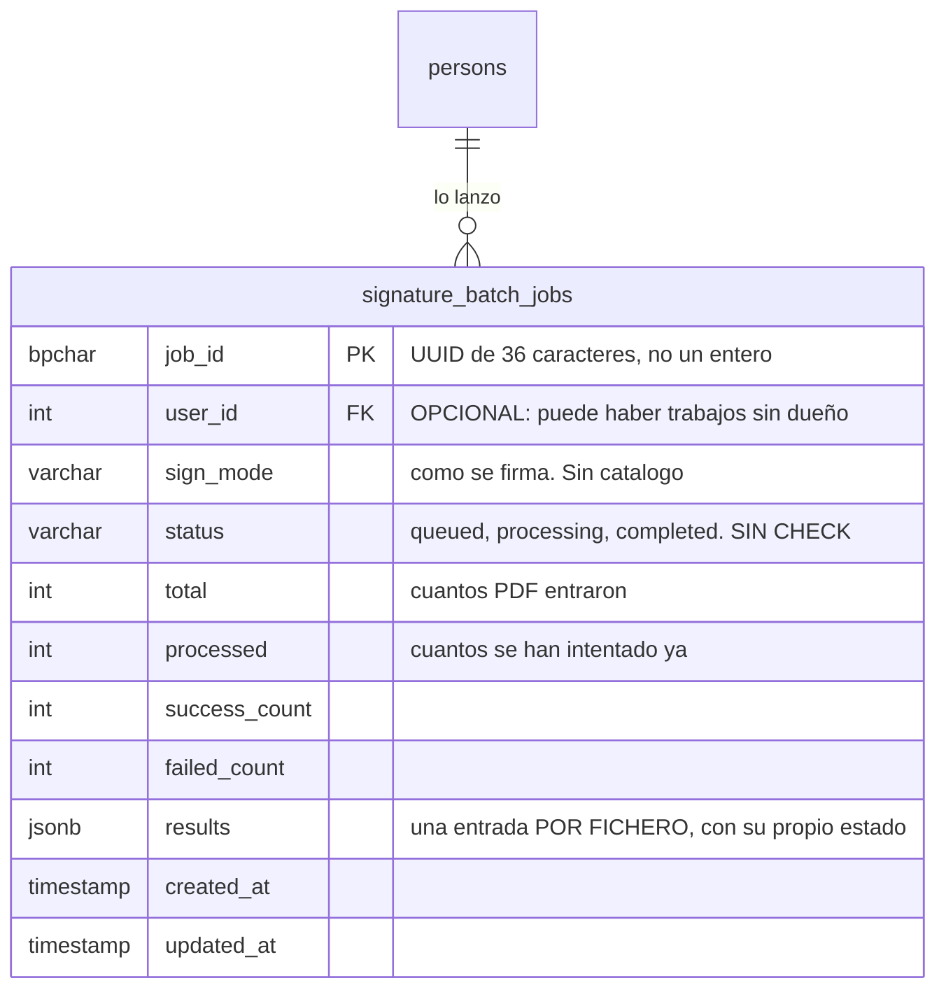

Firmar un documento es inmediato. Firmar cincuenta no: hay que descargar cada PDF, mandarlo al
[microservicio de firma](/signer/), recoger el resultado y empaquetarlo. Eso tarda minutos, así que
no puede resolverse dentro de una petición HTTP.

`signature_batch_jobs` es **la única tabla** de ese mecanismo: guarda el progreso del trabajo para
que quien lo lanzó pueda preguntar «¿por dónde va?» y para que **el trabajo sobreviva a un reinicio
del backend**. Lo maneja `services/sign/BatchSigningService.js`.

## Por qué está en la base y no en memoria

Es la decisión que explica la tabla entera, y está escrita en la cabecera del servicio: *«el estado
vive en PostgreSQL y no en memoria, para que sobreviva a un reinicio»*.

Un mapa en memoria habría bastado para el caso feliz. Pero si el backend se reinicia a mitad de un
lote de cincuenta —un despliegue, un fallo— quien lo lanzó se queda esperando una respuesta que ya
no va a llegar, y sin forma de saber cuáles se firmaron. Con la tabla, al menos, queda el recuento y
el detalle por fichero.

## Las cuatro cuentas, y por qué son cuatro

`total`, `processed`, `success_count` y `failed_count` podrían parecer redundantes —`processed` es la
suma de los otros dos— y no lo son: la barra de progreso necesita `processed / total`, y el aviso al
final necesita saber **cuántos fallaron** sin recorrer el JSON.

`results` es un `JSONB` con **una entrada por fichero**, y ahí es donde está el detalle: nace como
`{ fileName, status: "pending" }` para cada uno y va pasando por `processing` → `success` o `error`.
Es lo que permite decir *«se firmaron 48 de 50, y éstos dos fallaron»* en vez de un «error» a secas.

## Tres cosas que no son evidentes

**La clave primaria es un UUID, no un entero.** `job_id` es un `CHAR(36)` generado con
`randomUUID()`. Es una de las cinco tablas del esquema sin `id` sintético, y tiene sentido: el
identificador se lo lleva el cliente para ir preguntando, y un entero secuencial dejaría adivinar
—y consultar— el trabajo de otro.

**Se escribe con un `upsert`, no con `INSERT` y luego `UPDATE`.** El servicio usa una sola sentencia
`ON DUPLICATE KEY UPDATE`, que es sintaxis de MySQL: la traduce el adaptador de
`config/postgres.js` a `ON CONFLICT (job_id) DO UPDATE SET …`. Comprobado ejecutándolo contra la base
—inserta, actualiza y deja el valor nuevo—, que es la única forma de comprobar SQL en este
repositorio: no lo valida ni `node --check` ni ningún gate hasta que se ejecuta esa rama.

:::caution[Su vocabulario de estado no lo protege nadie]
`status` es un `VARCHAR(20)` **sin `CHECK`**, y su dominio **no existe escrito en ningún catálogo**.
Los valores que el servicio escribe son, leídos del código: `queued` al crear el trabajo,
`processing` mientras avanza, y `completed` al terminar. Los ficheros dentro de `results` usan otro
juego —`pending`, `processing`, `success`, `error`— que tampoco valida nadie, porque va dentro del
JSONB.

Es una de las columnas de estado sin protección que la auditoría del esquema dejó anotadas. Aquí
el daño potencial es menor que en otras —el único escritor es un servicio— pero significa que un
valor mal escrito no lo caza nada.
:::

**`user_id` es opcional.** Es la única clave ajena de la tabla y admite `NULL`, así que puede haber
trabajos sin dueño. Fue además una de las dos columnas que arrastraban un tipo incompatible
(`BIGINT` contra `persons.id INT`), lo que impedía declarar la clave ajena; se corrigió en `TD7-d`.

## El diagrama

La tabla no se enlaza con `document_signatures` ni con `signature_requests`: el lote es un
**mecanismo de ejecución**, no una pieza del flujo de firma. Quién firma y en qué orden lo decide
[el flujo de firma](/modelo/flujo-de-firma/); esto sólo lo ejecuta en tanda.
