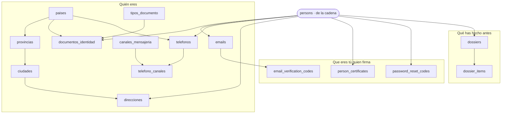
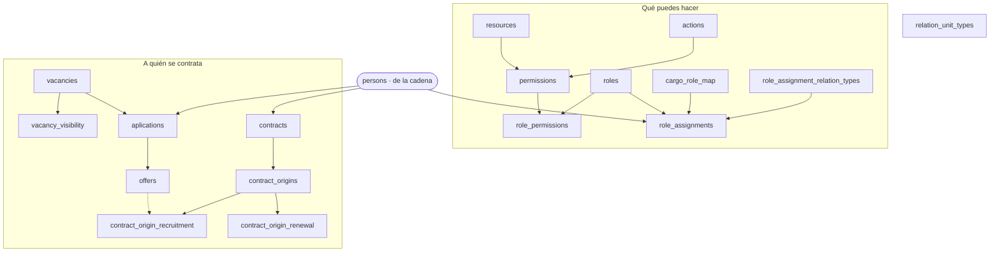
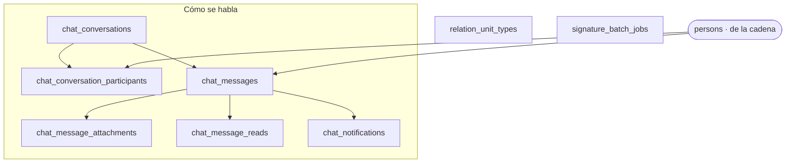

Las **39 tablas** que la cadena da por supuestas, sin sus campos, para ver la forma. Con las
[38 de la cadena](/modelo/mapa-completo/) suman las **77** del esquema: entre los dos mapas no queda
ninguna fuera.

`persons` aparece en los tres dibujos porque es de quien cuelga casi todo, pero **es de la cadena**,
no del complemento: por eso va con otra forma y no cuenta en las 39.

:::note[Por qué son TRES diagramas y no uno]
No es estética. Las seis familias son **independientes entre sí** —no hay ninguna arista que vaya de
una a otra—, y ningún motor de trazado puede apilar seis bloques que no se tocan: los pone en fila.
Medido: el mapa entero sale a **3460 px de ancho**, o sea letra de **6,1 px** en la columna, por
debajo de los 12 px que este sitio se fija como mínimo. Se probaron `LR`, `dagre` y tres afinados de
`elk`; el mejor se quedó en 10,5. Partido en tres, los tres pasan: **16 · 14 · 16 px**.
:::

## 1 · Lo que una persona *es*

Quince tablas, y todas cuelgan de `persons`. Hasta el 2026-08-27 la mayoría eran **columnas** suyas.

Dos detalles que el dibujo enseña y conviene no pasar por alto: **`email_verification_codes` cuelga
del correo, no de la persona** —por eso se puede tener verificado el institucional y no el
personal—, y el **catálogo geográfico** (`paises` → `provincias` → `ciudades`) sirve a la vez a las
direcciones, a los documentos de identidad y a los teléfonos.

Se cuentan en [La organización](/modelo/organizacion/#la-persona-ya-no-lo-lleva-todo-encima) y en
[Credenciales](/complemento/credenciales/) y [El expediente](/complemento/expediente/).

## 2 · Lo que la organización *hace* con ella

Diecisiete tablas: el permiso que la habilita y el contrato que la sienta.

⚠️ **La mitad de abajo está dibujada y no existe.** Las ocho de «a quién se contrata» tienen tablas,
claves ajenas y vocabularios cerrados, y **cinco no las toca ninguna línea de código**. Se dibujan
porque están en el esquema y porque hay un rol que las promete. El aviso completo, en
[Empleo y contratación](/complemento/empleo/); el permiso, campo a campo, en
[Permisos](/complemento/permisos/) — que además trae dos avisos propios: la unidad del rol no
gobierna nada y `max_depth` no lo lee nadie.

## 3 · Lo que se dice por el camino

Ocho tablas: la conversación, y las dos sueltas que no son de ninguna familia.

`relation_unit_types` es del organigrama —dice de qué **tipo** es el vínculo entre dos unidades— y se
cuenta en [La organización](/modelo/organizacion/). `signature_batch_jobs` tiene página propia:
[La firma en lote](/complemento/firma-en-lote/).

Las flechas que el dibujo **no** enseña son las que salen de la conversación hacia la cadena:
`chat_conversations` apunta a `processes`, a `units` y **dos veces** a
`process_definition_versions` — de dónde nació el hilo y a qué versión corresponde ahora. Eso es lo
que hace que versionar un proceso no parta su conversación en dos, y está contado en
[La conversación](/complemento/conversacion/).

## Las cifras

| | |
|---|---|
| Tablas del complemento | **39** |
| Columnas | **300** |
| Claves foráneas declaradas en ellas | **64** — 37 entre ellas, **27** hacia la cadena |
| Restricciones `CHECK` | **11** |
| Tablas de la cadena | **38** |
| **Total del esquema** | **77** |

Medidas contra el catálogo de PostgreSQL de una base recién recreada, no contra el fichero de
esquema. La razón está en [cómo leer esto](/complemento/).
