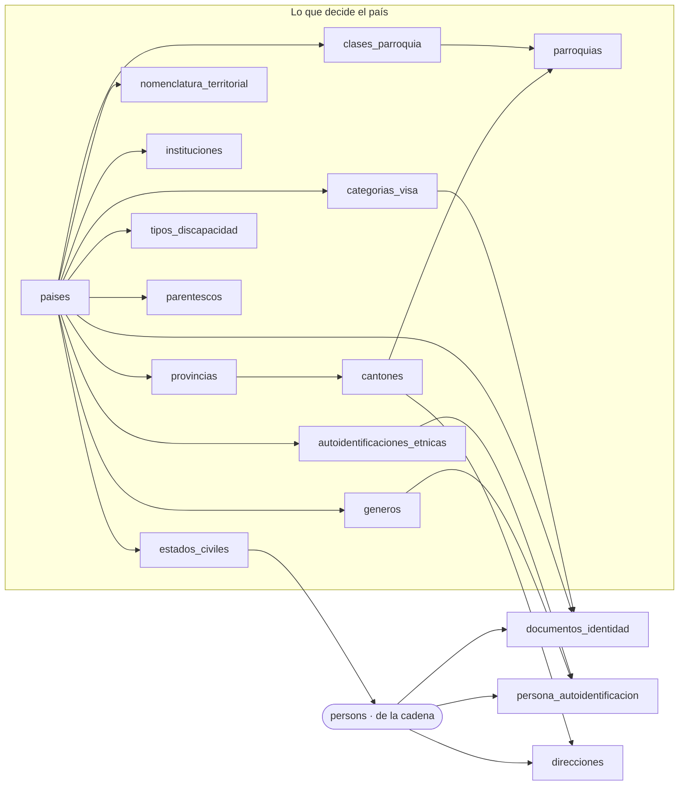
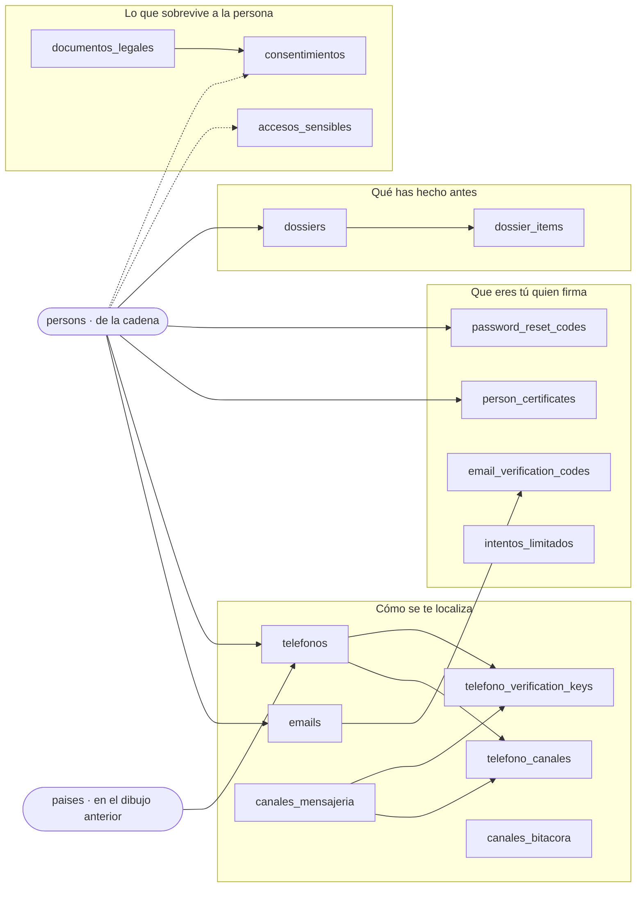
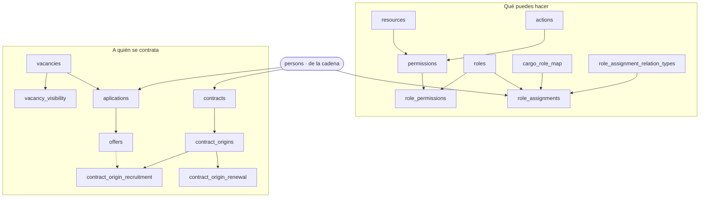
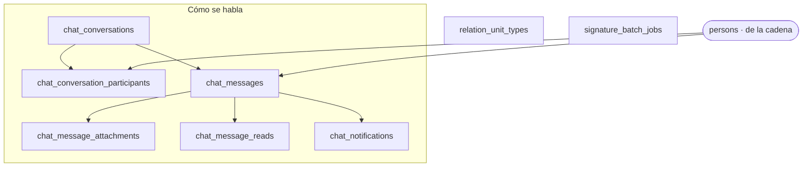

Las **55 tablas** que la cadena da por supuestas, sin sus campos, para ver la forma. Con las
[38 de la cadena](/modelo/mapa-completo/) suman las **93** del esquema, y entre los dos mapas no
queda ninguna fuera.

:::note[Recontado contra el esquema, no a ojo]
Aquí ya ponía «no queda ninguna fuera», y dejó de ser verdad cuando se añadieron tablas sin pasar
por este mapa: el 2026-09-10 faltaban **once** —siete catálogos de la persona, más
`consentimientos`, `documentos_legales`, `canales_bitacora` e `intentos_limitados`—. Se dibujaron
ese mismo día, y el recuento se rehízo con un script que cruza los nombres de los bloques mermaid de
los dos mapas con los `CREATE TABLE` de `postgres_schema.sql`: **93 de 93**. De paso destapó una
doble cuenta: `relation_unit_types` estaba dibujada en dos diagramas y contada en los dos.
:::

`persons` aparece en los cuatro dibujos porque es de quien cuelga casi todo, pero **es de la cadena**,
no del complemento: por eso va con otra forma y no cuenta en las 55. Lo mismo `paises` en el segundo
dibujo: va con esa forma porque ya está contada en el primero.

:::note[Por qué son CUATRO diagramas y no uno]
No es estética. En el dibujo, la persona, la organización y la conversación **no se tocan más que
por `persons`**, y ningún motor de trazado puede apilar bloques que no se tocan: los pone en fila.
Medido el 2026-09-10 con las 55 tablas: el mapa entero en un solo `flowchart` sale a **5295 px de
ancho**, o sea letra de **4,0 px** en la columna de 1317 px, muy por debajo de los 12 px que este
sitio se fija como mínimo.

Hasta ese día eran tres. Con las once que faltaban, el de la persona no cabía de ninguna forma: en
`TB` ya estaba en 11,5 px antes de añadirlas, y en `LR` con las 31 se quedó en 8,9. Partido en dos
—lo que decide el país y lo que la persona tiene— y medidos los cuatro en esa columna, los cuatro
pasan: **13,9 · 16 · 14 · 16 px**. Es la vista normal de la página, sin el zoom del visor.
:::

## 1 · Lo que una persona *es*

Treinta y una tablas, en dos dibujos: dieciséis en el primero y quince en el segundo. Hasta el
2026-08-27 muchas de ellas eran **columnas** de `persons`.

**Lo que decide el país**, y lo que la persona es con ello:

```mermaid
flowchart LR
  P(["persons · de la cadena"])
  subgraph PAIS["Lo que decide el país"]
    PA["paises"] --> PV["provincias"]
    PV --> CA["cantones"]
    CA --> PQ["parroquias"]
    PA --> CP["clases_parroquia"]
    CP --> PQ
    PA --> NT["nomenclatura_territorial"]
    PA --> CV["categorias_visa"]
    PA --> IN["instituciones"]
    PA --> GE["generos"]
    PA --> EC["estados_civiles"]
    PA --> AE["autoidentificaciones_etnicas"]
    PA --> TD["tipos_discapacidad"]
    PA --> PAR["parentescos"]
  end
  DI["documentos_identidad"]
  PAI["persona_autoidentificacion"]
  DIR["direcciones"]
  PA --> DI
  CV --> DI
  GE --> PAI
  AE --> PAI
  CA --> DIR
  EC --> P
  P --> DI
  P --> PAI
  P --> DIR
```

**Cómo se te encuentra, cómo se te cree y qué queda de ti:**

```mermaid
flowchart LR
  P(["persons · de la cadena"])
  PA(["paises · en el dibujo anterior"])
  subgraph LOC["Cómo se te localiza"]
    EM["emails"]
    TE["telefonos"] --> TC["telefono_canales"]
    CM["canales_mensajeria"] --> TC
    TE --> TVK["telefono_verification_keys"]
    CM --> TVK
    CB["canales_bitacora"]
  end
  subgraph CRED["Que eres tú quien firma"]
    PC["person_certificates"]
    EVC["email_verification_codes"]
    PRC["password_reset_codes"]
    IL["intentos_limitados"]
  end
  subgraph PRUEBA["Lo que sobrevive a la persona"]
    DL["documentos_legales"] --> CO["consentimientos"]
    BIT["accesos_sensibles"]
  end
  subgraph EXP["Qué has hecho antes"]
    DO["dossiers"] --> DIT["dossier_items"]
  end
  PA --> TE
  P --> EM
  P --> TE
  P --> PC
  P --> PRC
  P --> DO
  P -.-> BIT
  P -.-> CO
  EM --> EVC
```

Dos detalles que los dibujos enseñan y conviene no pasar por alto: **`email_verification_codes` cuelga
del correo, no de la persona** —por eso se puede tener verificado el institucional y no el
personal—, y el **catálogo geográfico** (`paises` → `provincias` → `cantones` → `parroquias`) sirve a la vez a las
direcciones, a los documentos de identidad y a los teléfonos.

Y **`categorias_visa` cuelga del país, no del sistema**: las categorías las define una autoridad
nacional, así que un `CHECK` —que es global por definición— no habría podido valer a la vez para
Ecuador y para Colombia. Por la misma regla cuelgan de `paises` los **cinco vocabularios de la
persona** —`generos`, `estados_civiles`, `autoidentificaciones_etnicas`, `tipos_discapacidad` y
`parentescos`—, `clases_parroquia` (cabecera, urbana o rural, que apunta `parroquias`) y
`nomenclatura_territorial`, que dice cómo se llama cada nivel en ese país.

De los cinco vocabularios, **sólo tres tienen una flecha de salida**: a `estados_civiles` la apunta
`persons` —por eso esa flecha llega a la cadena—, y a `generos` y `autoidentificaciones_etnicas`,
`persona_autoidentificacion`. **A `tipos_discapacidad` y `parentescos` no los apunta ninguna clave
ajena del esquema**, y el dibujo no se la inventa.

**`accesos_sensibles` y `consentimientos` van con línea de puntos, y es a propósito**: ninguna de las
dos lleva clave ajena a `persons`, porque la evidencia —de quién vio lo de alguien, de qué aceptó—
tiene que sobrevivir a esa persona. La única clave ajena de `consentimientos` es la que la ata a
`documentos_legales`: qué texto, en qué versión, se aceptó.

**`canales_bitacora` e `intentos_limitados` van sin ninguna línea**, y tampoco es descuido: no tienen
ni una clave ajena. La bitácora anota cada canal por el nombre con que lo devuelve el servicio de
canales —incluido `servicio`, el propio servicio, que no es una fila de `canales_mensajeria`—, y el
sujeto de un intento es, según la acción, una IP, un correo con IP o un `person_id`.

Se cuentan en [La organización](/modelo/organizacion/#la-persona-ya-no-lo-lleva-todo-encima) —que
también explica los vocabularios, lo que se acepta al registrarse, la bitácora de canales y los
intentos— y en [Credenciales](/complemento/credenciales/) y [El expediente](/complemento/expediente/).

## 2 · Lo que la organización *hace* con ella

Dieciséis tablas: el permiso que la habilita y el contrato que la sienta.

```mermaid
flowchart TB
  P(["persons · de la cadena"])
  subgraph PERM["Qué puedes hacer"]
    direction TB
    RES["resources"] --> PRM["permissions"]
    ACT["actions"] --> PRM
    PRM --> RP["role_permissions"]
    RO["roles"] --> RP
    RO --> RA["role_assignments"]
    CRM["cargo_role_map"] --> RA
    RART["role_assignment_relation_types"] --> RA
  end
  subgraph EMP["A quién se contrata"]
    direction TB
    VA["vacancies"] --> VV["vacancy_visibility"]
    VA --> AP["aplications"]
    AP --> OF["offers"]
    CT["contracts"] --> CO["contract_origins"]
    CO --> CRE["contract_origin_recruitment"]
    CO --> CRN["contract_origin_renewal"]
    OF -.-> CRE
  end
  P --> RA
  P --> AP
  P --> CT
```

⚠️ **La mitad de abajo está dibujada y no existe.** Las ocho de «a quién se contrata» tienen tablas,
claves ajenas y vocabularios cerrados, y **cinco no las toca ninguna línea de código**. Se dibujan
porque están en el esquema y porque hay un rol que las promete. El aviso completo, en
[Empleo y contratación](/complemento/empleo/); el permiso, campo a campo, en
[Permisos](/complemento/permisos/) — que además trae dos avisos propios: la unidad del rol no
gobierna nada y `max_depth` no lo lee nadie.

## 3 · Lo que se dice por el camino

Ocho tablas: la conversación, y las dos sueltas que no son de ninguna familia.

```mermaid
flowchart TB
  P(["persons · de la cadena"])
  subgraph CONV["Cómo se habla"]
    direction TB
    CC["chat_conversations"] --> CCP["chat_conversation_participants"]
    CC --> CMS["chat_messages"]
    CMS --> CMA["chat_message_attachments"]
    CMS --> CMR["chat_message_reads"]
    CMS --> CNO["chat_notifications"]
  end
  RUT["relation_unit_types"]
  SBJ["signature_batch_jobs"]
  P --> CCP
  P --> CMS
```

`relation_unit_types` es del organigrama —dice de qué **tipo** es el vínculo entre dos unidades— y se
cuenta en [La organización](/modelo/organizacion/). `signature_batch_jobs` tiene página propia:
[La firma en lote](/complemento/firma-en-lote/).

Las flechas que el dibujo **no** enseña son las que salen de la conversación hacia la cadena:
`chat_conversations` apunta a `processes`, a `units` y **dos veces** a
`process_definition_versions` — de dónde nació el hilo y a qué versión corresponde ahora. Eso es lo
que hace que versionar un proceso no parta su conversación en dos, y está contado en
[La conversación](/complemento/conversacion/).

## Las cifras

| | |
|---|---|
| Tablas del complemento | **55** |
| Columnas | **426** |
| Claves foráneas declaradas en ellas | **81** — 53 entre ellas, **28** hacia la cadena |
| Restricciones `CHECK` | **18** |
| Tablas de la cadena | **38** |
| **Total del esquema** | **93** |

Medidas el 2026-09-10 contra el catálogo de PostgreSQL de una base recién recreada desde el esquema,
no contra el fichero. La razón está en [cómo leer esto](/complemento/).
