:::note[Esta página se genera: no se edita a mano]
La escribe `scripts/docs/gen-mapa-campos.mjs` cada vez que corre `bash scripts/docs/gen-dbml.sh`,
a partir del esquema, y la puerta de CI falla si se separa de él. Una edición a mano se pierde en
la siguiente regeneración.

**La agrupación sale de [el mapa del complemento](/complemento/mapa-completo/)**: si una tabla cambia de subgrupo allí,
cambia aquí. **Los campos y las relaciones salen del esquema, sin elegir**: están todos.
:::

**55 tablas · 426 columnas · 81 claves ajenas · 11 diagramas.**

## Cómo leerla

- Cada **caja con campos** es una tabla del grupo, con **todas** sus columnas: tipo, nombre y, si
  lo es, `PK` (clave primaria), `FK` (clave ajena) o `UK` (única).
- **Cada clave ajena se dibuja una sola vez: en el diagrama de la tabla que la guarda.** Si apunta a
  una tabla de otro diagrama, esa tabla sale como **caja vacía**; sus campos están en el suyo.
- Las claves que **llegan** desde otros diagramas se listan debajo de cada uno, en un desplegable.
  Dibujarlas también hacía ilegible cualquier grupo con una tabla a la que apunta medio esquema,
  como `persons`.
- En cada línea, `||` quiere decir que la clave ajena es obligatoria y `|o` que admite nulos; `o{`
  son varias filas y `o|` como mucho una. La etiqueta es la columna que guarda la clave.
- Un subgrupo grande va en varios diagramas seguidos, y algunos se leen de izquierda a derecha:
  se decidió midiendo la letra de cada uno, para que ninguno baje de 12 px a ancho de columna.
- Para acercar, **Ctrl + rueda** sobre el diagrama, o su botón de pantalla completa.

## 1 · Lo que una persona *es*

### Lo que decide el país (1 de 2)

**7 tablas** · 55 columnas · 7 claves ajenas propias.

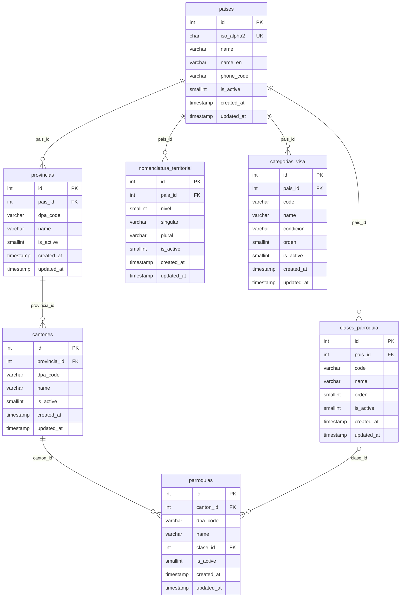

Llegan 15 claves ajenas desde otros diagramas

`autoidentificaciones_etnicas.pais_id` → `paises` · `direcciones.canton_id` → `cantones` · `direcciones.pais_id` → `paises` · `direcciones.provincia_id` → `provincias` · `documentos_identidad.categoria_visa_id` → `categorias_visa` · `documentos_identidad.pais_id` → `paises` · `estados_civiles.pais_id` → `paises` · `generos.pais_id` → `paises` · `instituciones.pais_id` → `paises` · `parentescos.pais_id` → `paises` · `persons.nacimiento_canton_id` → `cantones` · `persons.nacimiento_pais_id` → `paises` · `persons.nacionalidad_pais_id` → `paises` · `telefonos.pais_id` → `paises` · `tipos_discapacidad.pais_id` → `paises`

### Lo que decide el país (2 de 2)

**6 tablas** · 47 columnas · 6 claves ajenas propias. Apunta a `paises`, que sale como caja vacía.

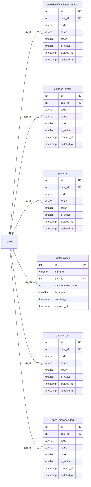

Llegan 3 claves ajenas desde otros diagramas

`persona_autoidentificacion.autoidentificacion_etnica_id` → `autoidentificaciones_etnicas` · `persona_autoidentificacion.genero_id` → `generos` · `persons.estado_civil_id` → `estados_civiles`

### Fuera de los subgrupos

**3 tablas** · 40 columnas · 10 claves ajenas propias. Apunta a `autoidentificaciones_etnicas`, `cantones`, `categorias_visa`, `generos`, `paises`, `persons`, `provincias`, que salen como caja vacía.

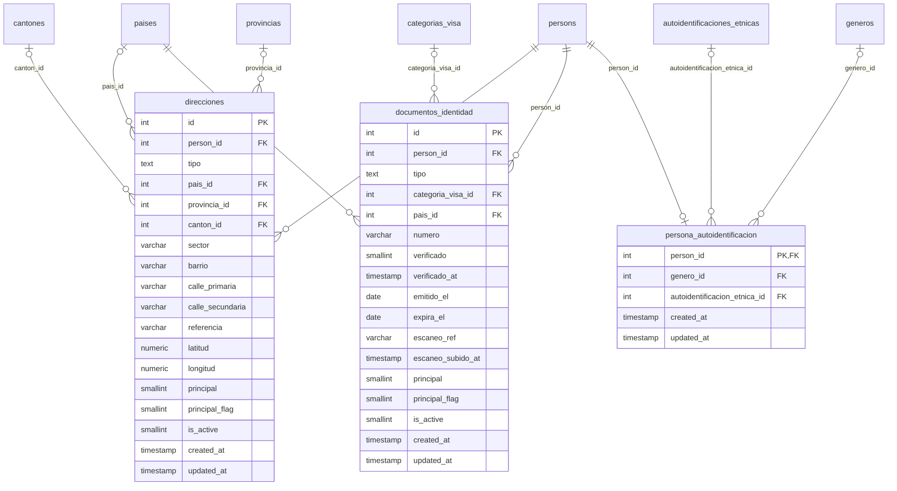

### Cómo se te localiza

**6 tablas** · 49 columnas · 7 claves ajenas propias. Apunta a `paises`, `persons`, que salen como caja vacía.

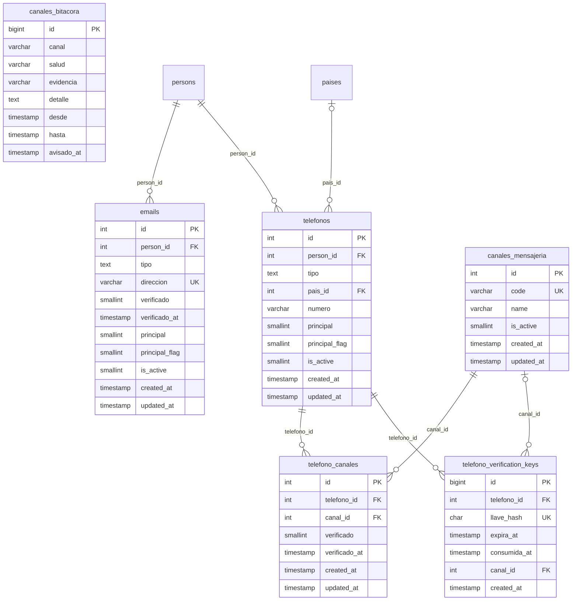

Llega 1 clave ajena desde otros diagramas

`email_verification_codes.email_id` → `emails`

### Que eres tú quien firma

**4 tablas** · 24 columnas · 3 claves ajenas propias. Apunta a `emails`, `persons`, que salen como caja vacía.

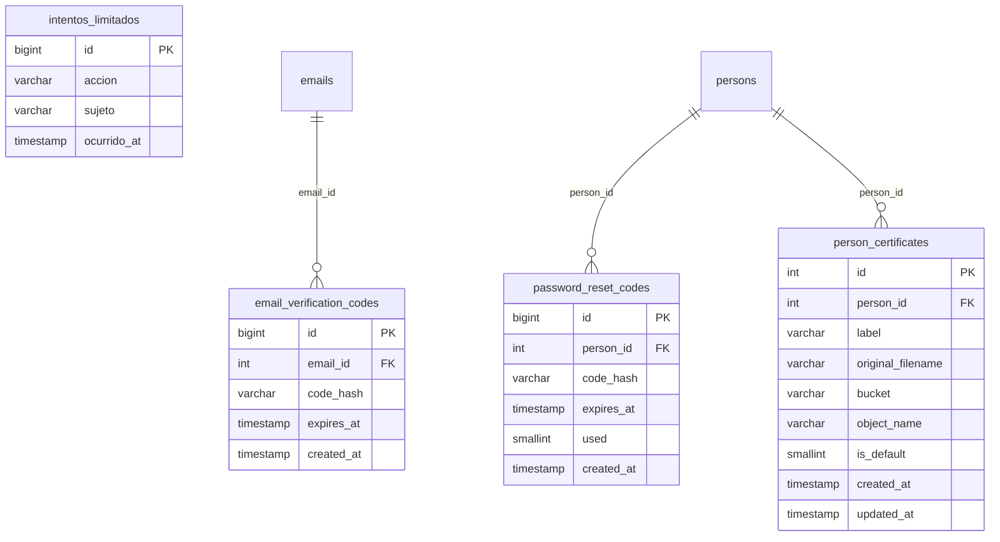

### Lo que sobrevive a la persona

**3 tablas** · 26 columnas · 1 clave ajena propia.

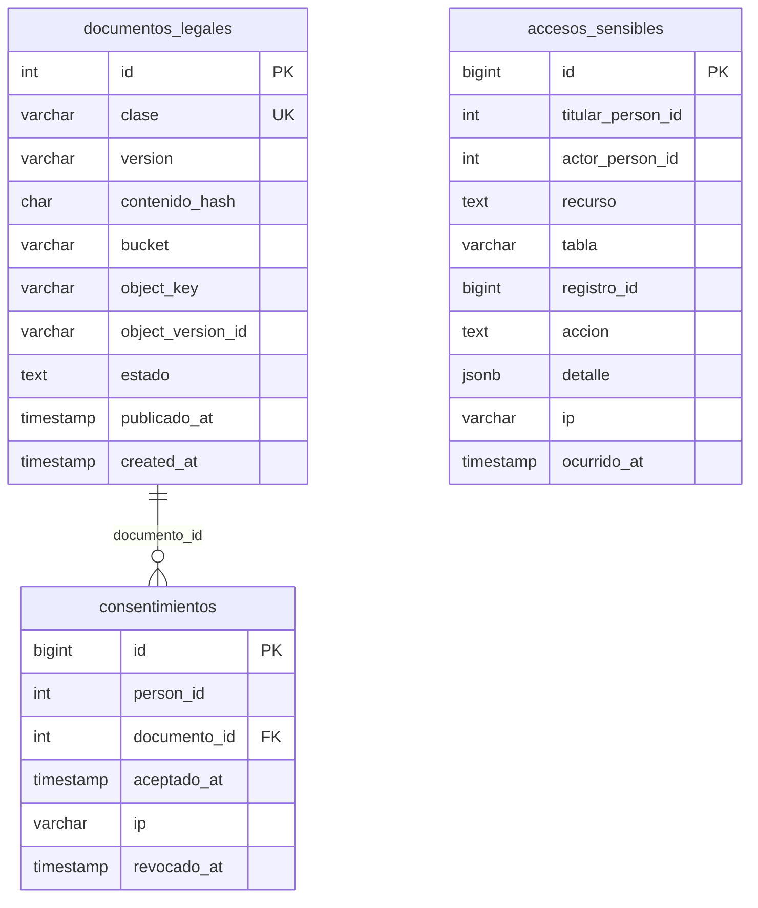

### Qué has hecho antes

**2 tablas** · 10 columnas · 2 claves ajenas propias. Apunta a `persons`, que sale como caja vacía.

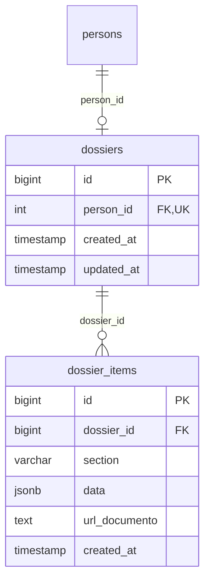

## 2 · Lo que la organización *hace* con ella

### Qué puedes hacer

**8 tablas** · 49 columnas · 12 claves ajenas propias. Apunta a `cargos`, `persons`, `position_assignments`, `relation_unit_types`, `units`, que salen como caja vacía.

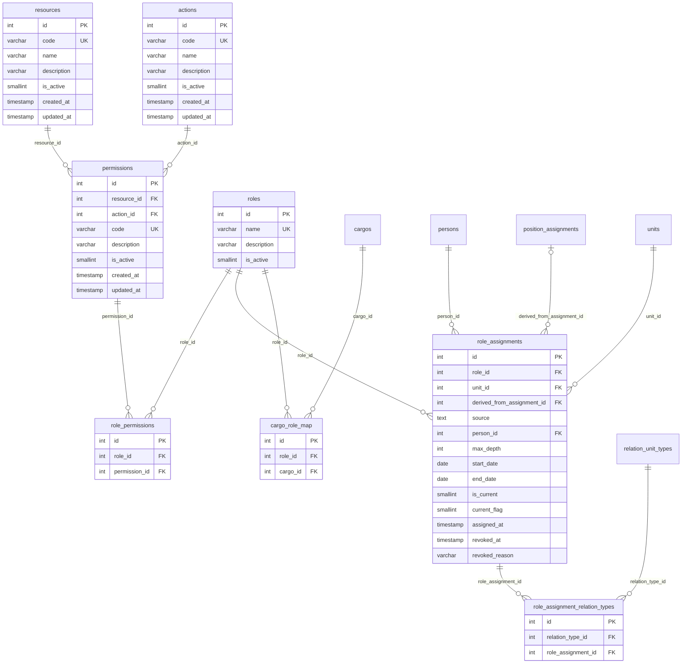

Llega 1 clave ajena desde otros diagramas

`vacancy_visibility.role_id` → `roles`

### A quién se contrata

**8 tablas** · 55 columnas · 15 claves ajenas propias. Apunta a `persons`, `roles`, `unit_positions`, `units`, que salen como caja vacía.

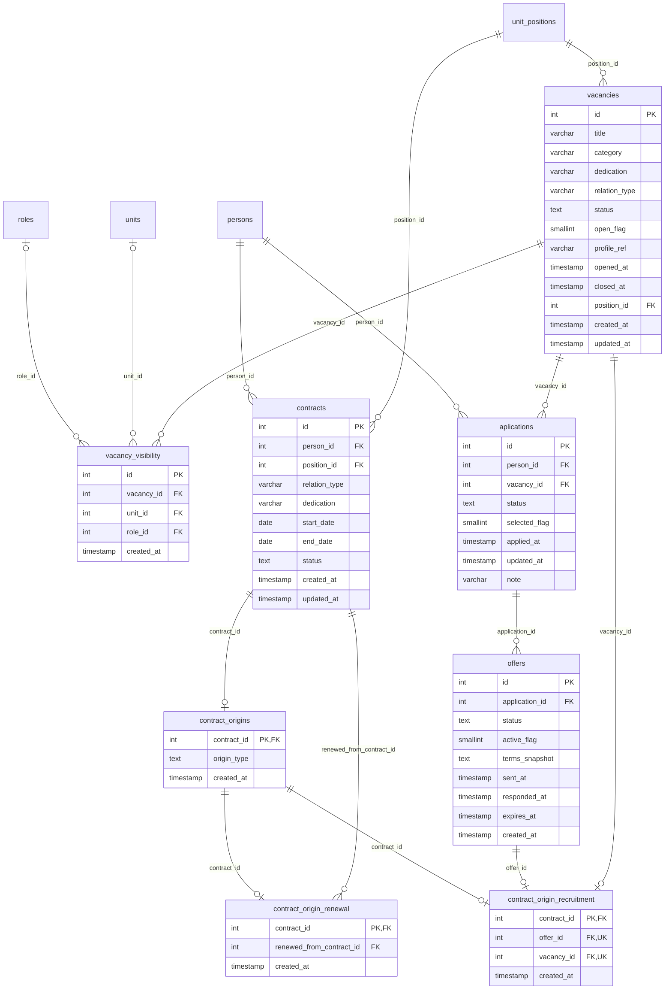

## 3 · Lo que se dice por el camino

### Cómo se habla

**6 tablas** · 52 columnas · 17 claves ajenas propias. Apunta a `persons`, `process_definition_versions`, `processes`, `units`, que salen como caja vacía.

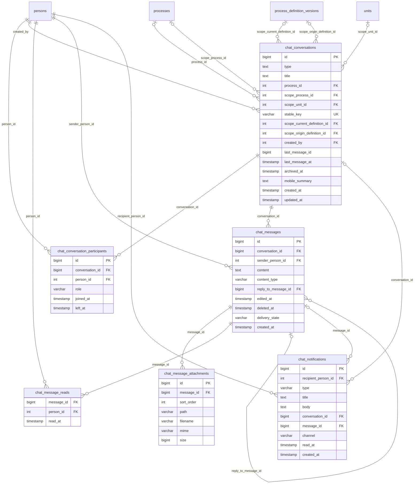

### Fuera de los subgrupos

**2 tablas** · 19 columnas · 1 clave ajena propia. Apunta a `persons`, que sale como caja vacía.

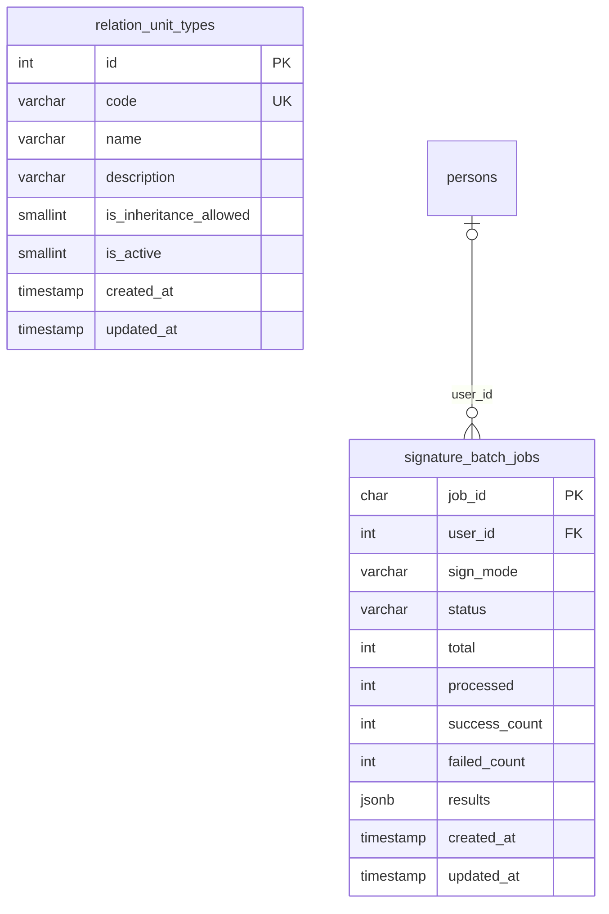

Llegan 3 claves ajenas desde otros diagramas

`fill_flow_steps.relation_type_id` → `relation_unit_types` · `role_assignment_relation_types.relation_type_id` → `relation_unit_types` · `unit_relations.relation_type_id` → `relation_unit_types`

