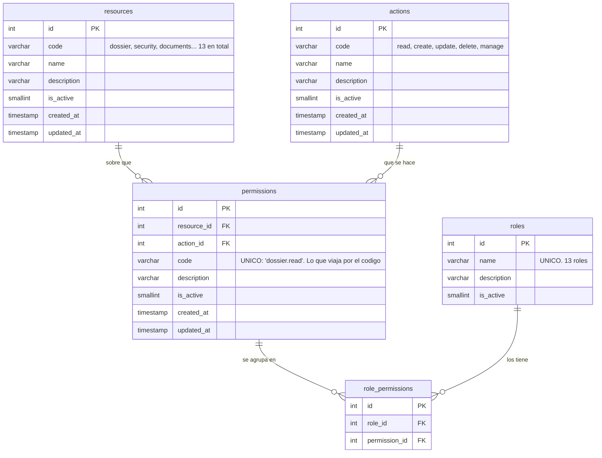
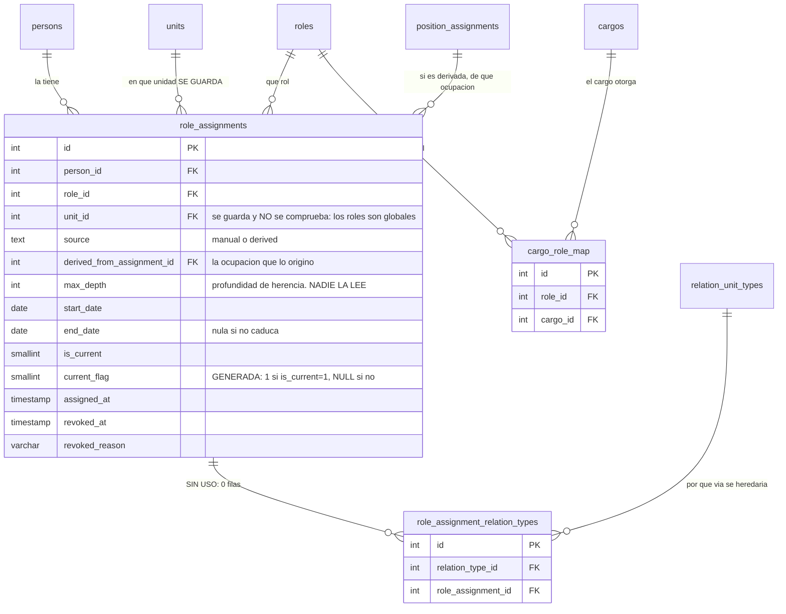

Ocho tablas y **49 columnas** que contestan una sola pregunta: *¿esta persona puede hacer esto?* Es
la familia de la que depende todo lo demás — sin ella no se firma, no se aprueba y no se ve un
expediente.

La explicación en prosa, con los middlewares y el IDOR que la moldeó, está en
[Autenticación y autorización](/backend/auth/). **Aquí van las tablas**, campo a campo, que es lo que
esa página no tiene.

## La cadena, en una frase

> **Un recurso por una acción da un permiso · los permisos se agrupan en un rol · el rol se le da a
> una persona en una unidad.**

Y hay un atajo que evita tener que dar roles a mano: **un cargo puede otorgar un rol solo**, y de eso
se encarga un trigger.

## 1 · De qué se puede hacer algo: recursos y acciones

`resources` y `actions` son dos catálogos gemelos —`id · code · name · description · is_active ·
created_at · updated_at`, idénticos— y su producto cartesiano es `permissions`.

Medido en la base sembrada: **13 recursos × 5 acciones = 65 permisos**, exactamente. No hay ni uno de
más ni uno de menos: la siembra genera la matriz completa.

Los 13 recursos son `account` · `dossier` · `security` · `people` · `units` · `academic_terms` ·
`process_definitions` · `process_execution` · `templates` · `documents` · `fill_flows` ·
`signature_flows` · `contracts`. Las 5 acciones, `read` · `create` · `update` · `delete` · `manage`.

**`manage` no es una acción más: es el comodín.** Quien tiene `X.manage` pasa cualquier comprobación
sobre `X`, porque el chequeo (`hasPermissionOrManage`) mira primero el permiso exacto y después el
`manage` del mismo recurso. Por eso `AdminSistema` tiene los 65 y no hace falta enumerarle nada.

:::note[Una unicidad declarada dos veces]
`permissions` lleva **dos** índices únicos: `uq_permissions_resource_action` sobre
`(resource_id, action_id)` y `uq_permissions_code` sobre `code`. Son redundantes — `code` se deriva
de recurso × acción (`"dossier.read"`), así que si el par es único el código también lo es.

No hace daño y hay un argumento a favor: el `code` es lo que viaja por el código de la aplicación
(`requirePermissions("dossier.read")`), y protegerlo directamente evita que un seed mal escrito meta
dos filas con el mismo texto y distinto par. Se anota porque es el único caso del esquema donde la
misma regla se declara por dos caminos.
:::

## 2 · Qué se agrupa: roles y sus permisos

`roles` es la tabla más pequeña del esquema —**cuatro columnas**: `id`, `name` único,
`description`, `is_active`— y ni siquiera lleva `created_at`.

`role_permissions` es la tabla-join, con `uq_role_permissions (role_id, permission_id)`. En la base
sembrada son **220 filas** repartidas en 13 roles:

| Rol | Permisos | Rol | Permisos |
|---|:--:|---|:--:|
| `AdminSistema` | **65** | `Auditor` | 13 |
| `GestorProcesos` | 21 | `GestorPlantillas` | 11 |
| `GestorEjecucionProcesos` | 21 | `GestorFirmas` | 11 |
| `GestorDocumental` | 16 | `GestorAcademico` · `GestorTalentoHumano` · `GestorUnidades` | 10 |
| `Usuario` | 14 | `GestorSeguridad` · `GestorContratacion` | 9 |

Dos lecturas que importan para revisar el modelo:

- **`Usuario` tiene 14 permisos, y no es el rol vacío.** Es el rol **base**: da `dossier` de lectura,
  creación y actualización, más lo operativo de Home, tareas, documentos y firmas propios. Toda
  persona lo necesita — un `Gestor*` **sin** `Usuario` recibe un 403 al abrir su propia ficha.
- **`GestorContratacion` tiene 9 permisos sobre `contracts`, y ese dominio no está implementado.** Es
  la otra cara del aviso de [Empleo y contratación](/complemento/empleo/): el permiso existe, la
  pantalla no.

## 3 · A quién y dónde: las asignaciones

`role_assignments` es la tabla con más carga del RBAC, y la única con `CHECK`:

```
source  →  manual · derived
```

`manual` es la que pone un gestor; `derived` la que crea el trigger a partir del cargo. En la base
sembrada, **68 manuales y 28 derivadas**.

Lleva vigencia propia (`start_date` / `end_date`), la marca de revocación (`revoked_at`,
`revoked_reason`) y **`derived_from_assignment_id`**, que apunta a la ocupación de puesto que la
originó — así, al dejar el puesto, se sabe exactamente qué roles hay que revocar.

Su invariante la impone la base con el idioma habitual: `current_flag` es **generada** (`1` si
`is_current = 1`, `NULL` si no) y `uq_role_assignment_current` es única sobre
`(person_id, role_id, unit_id, source, current_flag)`. En cristiano: **la misma persona no puede
tener dos veces vigente el mismo rol en la misma unidad por la misma vía** — pero sí puede tenerlo
una vez como `manual` y otra como `derived`, porque `source` entra en la clave. Eso es deliberado:
si dejas el puesto que te lo derivaba, conservas el que te dieron a mano.

## 4 · El atajo: el cargo que otorga rol

`cargo_role_map` son **dos claves ajenas y nada más** —`cargo_id`, `role_id`, con
`uq_cargo_role_map` sobre el par—. Dice cosas como *«el cargo Docente otorga el rol
GestorEjecucionProcesos»*. En la siembra hay cuatro:

| Cargo | Rol que otorga |
|---|---|
| Coordinador | `GestorProcesos` |
| Director | `GestorProcesos` |
| Docente | `GestorEjecucionProcesos` |
| Jefe | `GestorTalentoHumano` |

**Quien lo aplica no es el código: es un trigger.**
`trg_position_assignments_after_insert` crea las asignaciones con `source = 'derived'` cuando alguien
ocupa el puesto, y su gemelo de `UPDATE` las revoca cuando lo deja. Ese mismo trigger reasigna además
los entregables abiertos, cosa que se cuenta en
[Quién lo debe](/modelo/tenencias-y-relevo/).

Que viva en la base y no en JavaScript es a propósito: hay cinco caminos que insertan ocupaciones, y
parchear los cinco es exactamente como se pierde uno.

---

## Dos cosas que el modelo dice y el código no hace

Aquí es donde esta página deja de describir y empieza a avisar. Las dos están **medidas contra el
código**, no deducidas.

:::danger[1 · La unidad del rol no gobierna nada: los roles son GLOBALES]

`role_assignments.unit_id` es `NOT NULL` y `RbacService` lo carga en cada rol. Pero
**`backend/middlewares/rbac.js` no menciona la palabra `unit` ni una sola vez** —comprobado: cero
ocurrencias en todo el fichero—, y `requirePermissions` decide mirando **sólo** si la cadena del
permiso está en el conjunto plano de la persona.

La consecuencia es concreta: **ser `GestorProcesos` en la Facultad de Ingeniería te deja gestionar
procesos en toda la universidad.** La unidad se guarda, se enseña y no se comprueba.

⚠️ [Autenticación y autorización](/backend/auth/) afirma lo contrario —*«Los roles son contextuales a
una unidad. Puedes ser GestorProcesos en la Facultad de Ingeniería y nadie en el resto»*—. Como
intención del modelo es correcto; **como descripción del comportamiento actual, no**.
:::

:::danger[2 · `max_depth` se escribe y no lo lee nadie]

`role_assignments.max_depth` es `INT NOT NULL` y significa *hasta qué profundidad del subárbol
organizativo se hereda el rol*. Lo **escriben** cuatro sitios —el bootstrap, el trigger, el catálogo
genérico y el editor de tablas— y **no lo lee ninguno**: no aparece en `RbacService`, ni en los
middlewares, ni en ninguna consulta de autorización.

No hay ningún recorrido recursivo del organigrama en la resolución de permisos. La herencia por
subárbol que la columna promete **no ocurre**, lo cual es coherente con el punto anterior: si la
unidad no se comprueba, la profundidad tampoco puede.
:::

:::caution[Y una tabla que no usa nadie]
`role_assignment_relation_types` —que ataría una asignación a un tipo de relación de unidad, para
decir *«este rol se hereda por la vía orgánica pero no por la funcional»*— tiene **cero filas** en la
base sembrada y **ninguna consulta** en el backend. Sólo existe en el editor genérico de tablas.

Es la pieza que haría falta para que los dos avisos de arriba tuvieran sentido, y está vacía. Junto
con las cinco de contratación, son las tablas del esquema que describen algo que no se hizo.
:::

## Los diagramas

Van en **dos**: la definición del permiso, que es estática, y la asignación, que es la que se mueve.

### 1 · Cómo se define un permiso



### 2 · Cómo se asigna, y de dónde puede venir sola



:::note[El repliegue silencioso]
Si una persona **no tiene ninguna asignación vigente**, `RbacService` no la deja sin permisos: le
devuelve el rol `Usuario` con `source: "fallback"`. Es lo que evita que alguien recién creado se
quede sin poder ver su propia ficha — pero conviene saberlo al depurar, porque un usuario **sin
ningún rol en la base** se comporta como si tuviera `Usuario`.
:::
