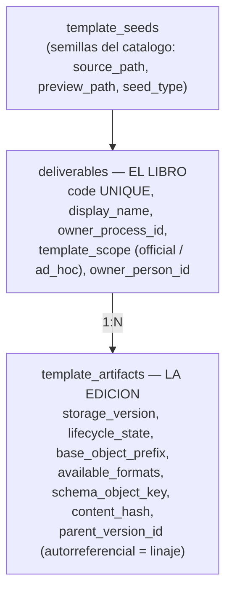

Vive en `process_definition_templates.item_mode`, es decir, **en el vinculo plantilla-proceso**, no en la plantilla. Es un matiz importante. Define *cuando* nace el entregable y *de donde sale su flujo*:

| **Modo**     | **Flujo**                                     | **Instanciación**                                                                                            | **Ejemplo**                             |
|:-------------|:----------------------------------------------|:-------------------------------------------------------------------------------------------------------------|:----------------------------------------|
| `single`     | Predefinido en la plantilla (entrega y firma) | Una instancia automática al lanzar, por cada responsable que resuelvan las reglas                            | Informe de Investigación Formativa      |
| `replicated` | Predefinido                                   | **Sin fan-out automático**: el responsable crea N replicas etiquetadas que **heredan** el flujo del original | Un requerimiento por cada docente nuevo |
| `routed`     | **Ninguno**                                   | El usuario define entrega y firma **al instanciar** (en tiempo de ejecución)                                 | Tareas ad-hoc                           |

Truco de implementación para distinguirlos en la base de datos: los flujos *de plantilla* tienen `task_item_id IS NULL`; los flujos creados en tiempo de ejecución tienen `task_item_id != NULL`. Los materializa `materializeRuntimeFlowForTaskItem`.

Las replicas son `task_items` con `origin_kind=’user_added’` enlazadas por `source_task_item_id` al original.

El **“Proceso por defecto”** (slug `default`, sembrado por el bootstrap) es un `routed` comodin para tareas ad-hoc que no pertenecen a ningun proceso (por ejemplo, “haz el informe de este evento”). El `CLAUDE.md` insiste: **no es “memorandums”**.

:::note[Resolutores de flujo autorables]

Solo `task_assignee` (“Responsable del entregable”) y `cargo_in_scope` (“Por cargo”) en plantillas *official*; `specific_person` se anade en *ad_hoc*. `document_owner`, `position` y `manual_pick` están **retirados**: ya no son una deprecación blanda de la autoría web, sino que **salieron del `CHECK`** de `fill_flow_steps.resolver_type` y `signature_flow_steps.resolver_type`, que hoy solo admite esos tres valores. El `ALTER` valida las filas existentes, así que una base con un valor retirado **no arranca**.

El criterio que los mató, y que conviene tener presente al añadir cualquier cosa a estas tablas: **lo que la web no autora, no existe**. Su único productor era el `meta.yaml`; retirado el YAML, se quedaron sin quien los escribiera.

:::

## Plantillas: el modelo “libro y ediciones”

Con UNIQUE sobre `(deliverable_id, storage_version)`. El esquema lleva comentarios explícitos: la identidad, el proceso propietario, el scope, la semilla y la persona propietaria viven en `deliverables`; `template_artifacts` guarda **solo** el estado y el almacenamiento de cada versión.

:::caution[La palabra “entregable” significa dos cosas]

En `sqlTables.js` la tabla `task_items` se etiqueta “Entregables” (la *instancia* a producir). En el esquema, `deliverables` es “el libro”: la *identidad de la plantilla*. Es una fuente real de confusión al leer el código; siempre hay que mirar el contexto.

:::

### El contenido: Jinja2 sobre LaTeX

El cuerpo del documento es un **contrato Jinja2 + LaTeX** empaquetado en MinIO, no en la base de datos. El bootstrap pública la semilla `backend/services/system/seeds/informe-general` — `schema.json`, `defaults.yaml`, `README.md` y el árbol `src/` con `main.tex.j2` y `make.sh` — y válida el pipeline: render Jinja2 con `StrictUndefined` → `pdflatex` → PDF.

**No hay `meta.yaml`**: el flujo se autora en la base, no en un YAML, desde el §0.8. Y `data.yaml` **no es un fichero de la semilla**: es un objeto de MinIO que el bootstrap escribe copiando `defaults.yaml` al prefijo del artifact (`publishBaseSeedAssets`).

La **propiedad** se expresa por el prefijo dentro de MinIO, en `base_object_prefix`: `System/...` para las plantillas curadas por el administrador, `Users/{id_de_persona}/...` para las subidas por un gestor —el id y no la cédula, porque un documento de identidad puede cambiar y la ruta de los ficheros no debe—. El pipeline de maduración documentado es:

`office` (Word/Excel/PDF subido por el gestor) ⟶ `jinja2` (curado por el administrador)

:::note[Deuda declarada]

Falta *cablear* el render Jinja2 a PDF en tiempo de ejecución: hoy el render vive en el `make.sh` de la propia semilla (utileria de línea de comandos), y el backend no lo invoca.

:::

### Ciclo de vida y versionado

`template_artifacts.lifecycle_state` admite `draft`, `published` y `retired`, y **por defecto `draft`**: una edición nace sin publicar y hay que publicarla explícitamente. El versionado es **por linaje**: una fila nueva con `storage_version` nuevo y `parent_version_id` apuntando a la anterior. `templateLifecycle.js` retira la versión publicada previa del mismo código al publicar, y válida que haya al menos un paso de entrega. Ese último requisito **se relaja para `routed`**, que por definición no autora flujo.
