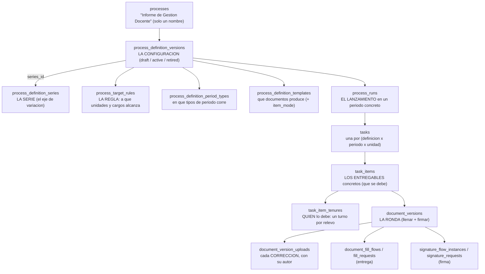

Esta es **la parte central del dominio** y la que mas cuesta al principio. La frase mnemotecnica del proyecto:

*la **serie** nombra el proceso, la **regla** reparte el proceso, el **flujo** reparte los pasos.*

## Tabla por tabla

### `processes`.

Solo identidad: `name`, `slug` único, `parent_id` autorreferencial, `is_active`. **Sin comportamiento.** Se hizo `DROP` de `unit_id`, `program_id`, `person_id` y `term_id` por vestigiales.

### `process_definition_series` — la serie.

`source_type` puede ser `unit_type`, `cargo` o `default`. Es el **eje de variación**: el mismo proceso puede tener una configuración distinta por tipo de unidad o por cargo. La función `buildProcessDefinitionVersionName` genera el nombre resultante: *“\<Proceso\> por \<Serie\>”*, salvo en `default`, que usa el nombre del proceso a secas.

### `process_definition_versions` — la configuración.

Tiene `status` (`draft`, `active`, `retired`) y vigencia (`effective_from` / `effective_to`). Dos mecanismos de integridad:

- Una **columna generada** `active_series_flag` mas un índice UNIQUE sobre `(process_id, variation_key, active_series_flag)` garantiza **a nivel de base de datos** que solo hay una versión activa por línea.

- Un **trigger** (`trg_process_definition_versions_before_update`) impide activarla si no tiene al menos una regla activa *y* un tipo de periodo, lanzando una excepción con mensaje en espanol.

:::tip[Reglas de negocio dentro de la base de datos]

Es poco habitual y merece la pena entender el porque: si la regla “no se puede activar sin reglas de alcance” viviera solo en el código, cualquier script, migración o consulta manual podría saltarsela. Al ponerla en un trigger, **es imposible dejar la base de datos en un estado inválido**, venga la escritura de donde venga.

:::

### `process_target_rules` — la regla.

Reparte el alcance con tres piezas: `unit_scope_type` (`unit_exact`, `unit_subtree`, `unit_type`, `all_units`), el `cargo_id` o `position_id` dentro de la unidad, y una `recipient_policy` (`all_matches`, `unit_head`, `exact_position`). Además `priority` y vigencia.

### `process_definition_templates` — el paquete de entregables.

Vincula configuración con plantilla: `process_definition_id` + `template_artifact_id`, mas `sort_order` y, sobre todo, `item_mode`.

### `process_runs` — la corrida.

`run_mode` (`automatic` o `manual`), `source_run_id` autorreferencial para relanzamientos, `created_by_user_id`, `reason` y `status`. Relanzar es **una corrida nueva**, no sobrescribir la anterior.

### `task_items` — el entregable concreto.

Su identidad son **tres** cosas: la tarea, la edicion de plantilla y **el puesto que lo produce**
(`responsible_position_id`, obligatorio). Si al lanzar no hay a quien dirigirse, **el entregable no se
crea** — antes nacia huerfano. `assigned_person_id` es una **cache** que escribe un trigger a partir
de las tenencias: no se edita a mano.

### `task_item_tenures` — quien lo debe, turno a turno.

Una fila por relevo, con quien, en calidad de que puesto, desde y hasta cuando. **Un solo turno
abierto por entregable**, garantizado por un indice unico parcial. Su `opened_by` guarda la causa
(`original`, `occupancy_start`, `occupancy_end`, `position_deactivated`, `reconcile`, `manual`) y su
`work_started` sella si el documento **ya llevaba trabajo** al abrirse el turno — que es lo que
distingue «releve algo intacto» de «releve algo a medias».

Sustituyo a `task_assignments` y `task_item_handovers`, retiradas el 2026-08-23: una era una foto del
reparto que ningun relevo refrescaba y la otra los mismos hechos como eventos sueltos.

### `document_versions` y `document_version_uploads` — la ronda y sus correcciones.

`document_versions.version` es la **ronda** (un intento completo de llenar y firmar), y cada subida
del archivo dentro de esa ronda es una fila de `document_version_uploads` con su **autor**. La
etiqueta legible (`version_label`) la calcula la base. Antes «version» significaba las dos cosas a la
vez y no se sabia quien habia producido el documento — solo quien habia adjuntado las evidencias.

### `tasks`.

Con un UNIQUE sobre `(process_definition_id, term_id, normalized_scope_unit_id)` — donde la última es una columna generada `COALESCE(scope_unit_id, 0)` — que garantiza **idempotencia del lanzamiento**: lanzar dos veces no duplica tareas.
