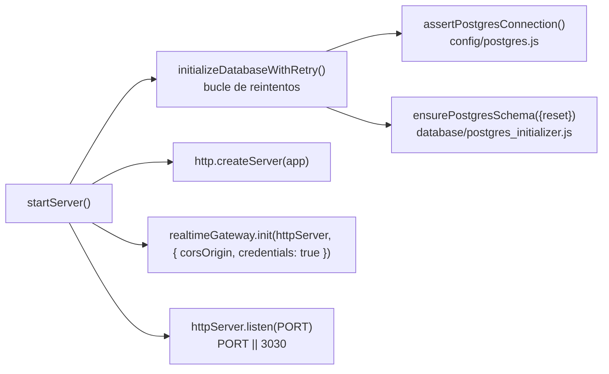

Monta los middlewares en este orden exacto:

| **\#** | **Que monta**               | **Detalle**                                                           |
|:-------|:----------------------------|:----------------------------------------------------------------------|
| 0      | `import "dotenv/config"`    | primera línea del fichero                                             |
| 1      | `app.set("trust proxy", 1)` | va detras de nginx                                                    |
| 2      | `app.use(cors(...))`        | envuelto en un middleware propio; loguea el origen en *cada* petición |
| 3      | `app.use(express.json())`   | parser JSON global                                                    |
| 4      | `app.use(cookieParser())`   | necesario para la cookie `refreshToken`                               |
| 5      | `app.get("/health")`        | llama a `assertPostgresConnection()`; 200 o 503                       |
| 6      | Swagger UI                  | en `/deasy/docs`                                                      |
| 7      | `/deasy/docs.json`          | el JSON crudo del spec                                                |
| 8      | Los 14 routers              | ver tabla anterior                                                    |
| 9      | `express.static("public")`  | la carpeta `backend/public/` esta vacia                               |

El arranque (`startServer()`) hace, en secuencia:

Los reintentos se parametrizan con `DB_INIT_MAX_ATTEMPTS` (20), `DB_INIT_RETRY_DELAY_MS` (3000) y `DB_RESET_SCHEMA_ON_START`. Si se agotan los reintentos, **el backend no aborta**: loguea el fallo y sigue escuchando.

:::note[Que NO se conecta al arrancar]

RabbitMQ no abre conexion (se usa su API HTTP bajo demanda). MinIO construye el cliente al importar el modulo, pero no crea buckets al arrancar. El bot de WhatsApp solo se inicializa por petición explícita. Y Swagger se configura con `apis: []`, o sea que **no** escanea anotaciones JSDoc: todo el spec es un objeto estático en `backend/config/swagger/definition.js` (581 líneas).

:::
