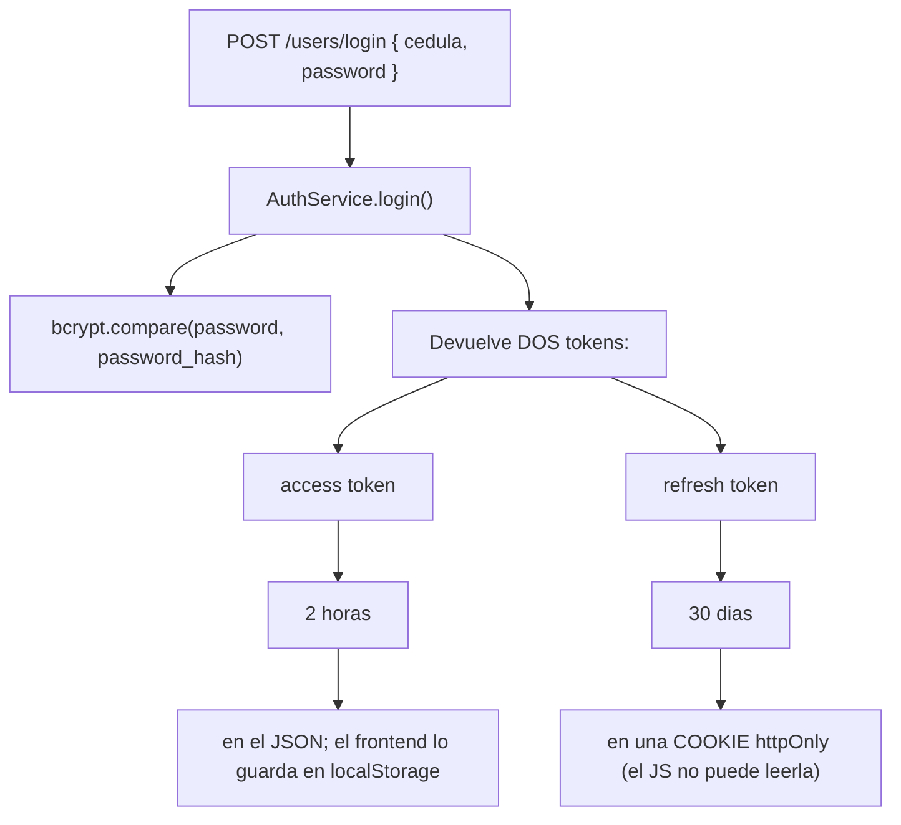
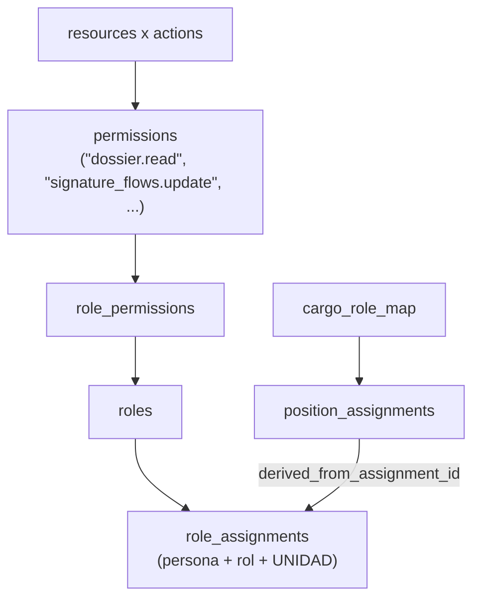

Son **dos cosas distintas** y conviene no confundirlas nunca:

- **Autenticación** = “¿quien eres?” → JWT

- **Autorización** = “¿puedes hacer esto?” → RBAC

## Autenticación (JWT)

:::tip[Por que dos tokens]

El *access token* viaja en cada petición, así que si te lo roban el daño dura poco (dos horas). El *refresh token* solo se usa para pedir uno nuevo, y al ser una cookie `httpOnly`, un script malicioso inyectado en la página **no puede leerlo** desde JavaScript. Es defensa en profundidad: dos secretos con exposiciones distintas.

:::

Detalles concretos: el access token se firma con `JWT_SECRET` y expira en `60*60*2` segundos; el refresh con `JWT_REFRESH` y expira en `60*60*24*30`. La cookie lleva `httpOnly: true` y `secure` activo salvo en modo desarrollador.

El payload del JWT es **solo `{ uid }`**. Nada de roles ni permisos dentro. Eso es deliberado: si metieras los permisos en el token, revocarle un rol a alguien no tendría efecto hasta que expirase. Aquí los permisos se resuelven **contra la base de datos en cada petición**.

La política de contrasenas vive en `backend/utils/passwordPolicy.js` (`evaluatePasswordPolicy`, exige 3 de 5 criterios) y la aplica `backend/middlewares/val_password.js`, que además *hashea en el sitio* `req.body.password` con bcrypt y salt 10 antes de llamar a `next()`.

## Autorización (RBAC)

RBAC son las siglas de *Role-Based Access Control*, control de acceso basado en roles. El modelo es:

Trece recursos (`account`, `dossier`, `security`, `people`, `units`, `academic_terms`, `process_definitions`, `process_execution`, `templates`, `documents`, `fill_flows`, `signature_flows`, `contracts`) por cinco acciones (`read`, `create`, `update`, `delete`, `manage`) dan **65 permisos**. Y hay **13 roles**.

Dos sutilezas importantes:

1.  **Los roles son contextuales a una unidad.** Puedes ser `GestorProcesos` en la Facultad de Ingeniería y nadie en el resto de la universidad. La tabla `role_assignments` lleva `unit_id` y un `max_depth`: hasta que profundidad del subarbol organizativo se hereda el rol.

2.  **Hay roles derivados automáticamente del puesto.** La tabla `cargo_role_map` dice, por ejemplo, “el cargo DOCENTE otorga el rol GestorEjecucionProcesos”. Y un **trigger de PostgreSQL** (`trg_position_assignments_after_insert`) crea esas asignaciones con `source=’derived’` cuando alguien ocupa el puesto, y las revoca cuando lo deja. Ese mismo trigger **reasigna los entregables abiertos** al nuevo ocupante.

Los middlewares están en `backend/middlewares/rbac.js`:

| **Middleware**                    | **Que comprueba**                                                                                |
|:----------------------------------|:-------------------------------------------------------------------------------------------------|
| `loadAccessContext`               | Carga roles y permisos en `req.auth` / `req.access`; 401 si el usuario no existe o esta inactivo |
| `requirePermissions(reqs, {all})` | Que tenga el permiso (OR por defecto, AND con `{all:true}`)                                      |
| `requireAnyRole(roles)`           | Que tenga alguno de los roles indicados                                                          |
| `requireRouteUserAccess({...})`   | Que sea **el dueno** del recurso **o** tenga rol elevado, *y* además el permiso                  |
| `requireCedulaAccess({...})`      | Igual, pero comparando por cédula                                                                |
| `requireDossierAccess(action)`    | Azucar sintáctico sobre el anterior con `resource: "dossier"`                                    |
| `requireSqlAdminPermission(...)`  | Deduce el recurso desde `req.params.table` y la acción desde el método HTTP                      |

:::caution[Por que existe requireDossierAccess]

Por un **IDOR** real y cerrado. IDOR (*Insecure Direct Object Reference*) es el fallo donde cambiando un identificador en la URL accedes a datos que no son tuyos. Aquí el guard miraba *la tarea* en vez de *el entregable*, y un docente podia descargar el documento de otro.

:::

El catalogo canonico esta en `backend/config/rbacCatalog.js` (229 líneas) y es también la **fuente de siembra**: `SystemBootstrapService.js` lo importa para poblar roles y permisos en la base de datos, borrando y reescribiendo `role_permissions` en cada arranque. O sea que **el catalogo del código es la fuente de verdad**, no la base de datos.
