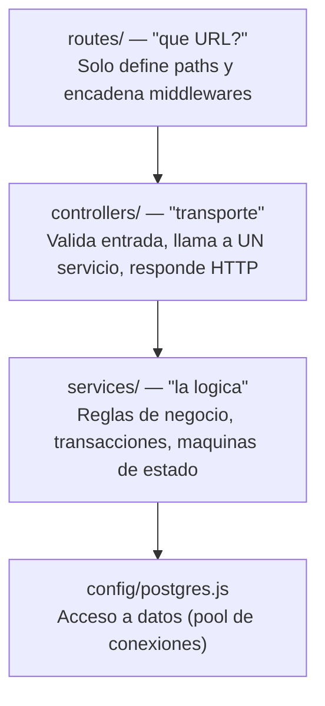

Es la pieza mas grande: unas 30.000 líneas de JavaScript **ESM** (`import` y `export`, no `require`), Express 5, sin ORM.

## Las capas y la regla no negociable del proyecto

El fichero `CLAUDE.md` del repositorio lo dice sin rodeos: **“Los controllers son transporte, no lógica”**. Si un controller pasa de unas 40 líneas o abre una transacción, hay que extraer un servicio. Esto no siempre se ha respetado — hay infractores historicos como `user_controler.js` con 1.513 líneas — y están catalogados como deuda tecnica en `docs/planes/referencia/calidad-y-medicion.md`.

### Que hay dentro de cada capa

- **`routes/`**: 14 ficheros planos (`user_router.js`, `sign_router.js`, `admin_router.js`, `chat_router.js`, `dossier_router.js`, etc.). Todos cuelgan del prefijo `/deasy/v1`.

- **`controllers/`**: 8 subcarpetas por dominio (`users/`, `admin/`, `sign/`, `chat/`, `tareas/`, `system/`, `whatsapp/`, `empresa/`), 27 ficheros en total.

- **`services/`**: 18 subcarpetas, unos 66 ficheros. Aquí están los dominios reales: `admin/` (con sub-subcarpetas `kernel/`, `crud/`, `templates/`, `processes/`, `org/`, `generation/`), `auth/`, `chat/`, `documents/`, `sign/`, `system/`, `tasks/`, `users/`, `mail/`, `storage/`, `realtime/`, `infrastructure/`, `whatsapp/`, `external/`.

- **`database/`**: solo dos ficheros — `postgres_initializer.js` y `postgres_schema.sql`. No es una capa de repositorios, es el arranque del esquema.

Un detalle de diseno elegante en `services/admin/`: la carpeta `kernel/` **no importa a nadie** y todos importan de ella. Nada apunta “hacía arriba”. Eso evita dependencias circulares, que en JavaScript producen errores dificilisimos de diagnosticar en tiempo de ejecución.

### Inventario de routers

| **Router**                 | **Montaje**       | **Líneas** | **Autenticación**                                        |
|:---------------------------|:------------------|:-----------|:---------------------------------------------------------|
| `user_router.js`           | `/users`          | 318        | mixta (login y create son públicos)                      |
| `admin_router.js`          | `/admin`          | 32         | `authMiddleware` + `loadAccessContext` a nivel de router |
| `sql_admin_router.js`      | `/admin/sql`      | 139        | hereda del padre + `requireSqlAdminPermission`           |
| `sign_router.js`           | `/sign`           | 93         | por ruta                                                 |
| `dossier_router.js`        | `/dossier`        | 85         | `authMiddleware` + `loadAccessContext`                   |
| `chat_router.js`           | `/chat`           | 53         | `authMiddleware` (sin RBAC)                              |
| `whatsapp_router.js`       | `/whatsapp`       | 25         | **ninguna**                                              |
| `tarea_router.js`          | `/tarea`          | 15         | solo en `/supervised-stuck`                              |
| `reset_password_router.js` | `/reset-password` | 14         | pública                                                  |
| `notification_router.js`   | `/notifications`  | 12         | `authMiddleware`                                         |
| `email_router.js`          | `/email`          | 9          | pública                                                  |
| `program_router.js`        | `/program`        | 9          | **ninguna**                                              |
| `unit_router.js`           | `/units`          | 9          | **ninguna**                                              |
| `system_router.js`         | `/system`         | 9          | pública (bootstrap)                                      |

:::note[Duplicaciones reales]

`program_router.js` y `unit_router.js` son *identicos*: ambos exponen `getPrograms` y `createProgram` del mismo controlador. Y `notification_router.js` duplica dos endpoints que ya están en `chat_router.js`.

:::
