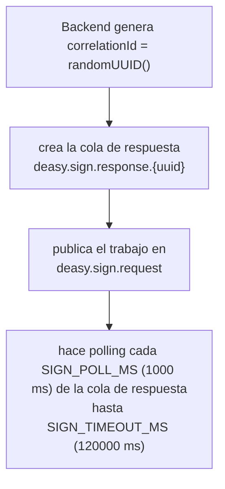

Hay una decisión de diseno explícita: **no hay un middleware de error global**. Cada controller hace su propio `catch`:

``` javascript
catch (error) {
  res.status(error.statusCode ?? 500).json({ message: error.message });
}
```

`backend/errors/HttpError.js` define la clase y las fabricas: `notFound()` (404), `forbidden()` (403), `conflict()` (409), `badRequest()` (400). El comentario de cabecera del fichero dice literalmente que *“un error SIN statusCode sigue siendo un 500 — y eso esta bien”*.

Aparte, `backend/errors/sqlErrors.js` traduce los códigos SQLSTATE de PostgreSQL a mensajes humanos: `23505` (violación de UNIQUE) da “ya existe una persona con esa cédula”. Y lo hace comparando por **nombre de constraint** (`error.constraint`), no buscando subcadenas en el mensaje, que es frágil y se rompe al cambiar de idioma o de versión.

Un cuarto elemento: `backend/middlewares/uploadError.js` traduce los siete códigos de error de `multer` a mensajes en espanol y **oculta el mensaje si es un 5xx**. Se monta con `router.use(handleUploadError)` *después* de las rutas, en tres routers (`user_router`, `dossier_router`, `sign_router`). Existe porque sin el, Express devolvia HTML con el stack trace completo, incluidas las rutas absolutas dentro del contenedor.

## Integraciones externas

### RabbitMQ, con sorpresa

Aunque `amqplib` figura en `package.json`, **no se usa en ningun sitio**. Toda la comunicación va por la **API HTTP de gestion** de RabbitMQ (`backend/services/infrastructure/rabbitmq_http.js`). El patron es **RPC con polling**:



Las tres colas: `deasy.sign.request`, `deasy.sign.validate.request` y el prefijo `deasy.sign.response`. No hay consumidores persistentes en el backend: el consumidor real es el microservicio signer.

### MinIO: siete buckets

| **Bucket**           | **Variable de entorno**     | **Contenido**             |
|:---------------------|:----------------------------|:--------------------------|
| `deasy-templates`    | `MINIO_TEMPLATES_BUCKET`    | plantillas y semillas     |
| `deasy-documents`    | `MINIO_DOCUMENTS_BUCKET`    | documentos generados      |
| `deasy-dossier`      | `MINIO_DOSSIER_BUCKET`      | respaldos del CV personal |
| `deasy-spool`        | `MINIO_SPOOL_BUCKET`        | area temporal de firma    |
| `deasy-chat`         | `MINIO_CHAT_BUCKET`         | adjuntos del chat         |
| `deasy-users`        | `MINIO_USERS_BUCKET`        | fotos de perfil           |
| `deasy-certificates` | `MINIO_CERTIFICATES_BUCKET` | certificados `.p12`       |

La lista canonica esta en `backend/scripts/lib/reset_targets.mjs`.

### Socket.IO (tiempo real)

`services/realtime/RealtimeGateway.js` (179 líneas) esta montado sobre el **mismo servidor HTTP** que Express, en el path `/socket.io`. Sustituyo a un broker MQTT (EMQX).

- **Autenticación**: con **el mismo JWT** que la API, leido de `socket.handshake.auth.token`. Al cliente siempre se le dice “Token inválido”; el motivo real va al log.

- **Rooms** (mapeo uno a uno de los antiguos topics MQTT): `user:{personId}` (join automático), `conversation:{id}`, `process:{id}`.

- **Eventos entrantes**: `conversation:subscribe`, `conversation:unsubscribe`, `process:subscribe`, `process:unsubscribe`, todos con callback de confirmación. La suscripción **reutiliza la autorización REST**, no la reimplementa.

- **Eventos salientes**: `chat.message.created` y `chat.notification.created`.

### Correo, WhatsApp y servicios ecuatorianos

`backend/lib/mailer.js` son once líneas de `nodemailer` con el host SMTP **escrito a fuego** en el código. El bot de WhatsApp (`services/whatsapp/WhatsAppBot.js`, 272 líneas) usa `whatsapp-web.js` sobre Puppeteer headless y muestra el QR de vinculación por terminal; se inicializa manualmente y sus seis endpoints **no llevan autenticación**. Y `services/external/webservices_ec.js` válida cédulas y números ecuatorianos contra un servicio externo.
