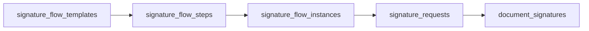

`signature_flow_steps` soporta **múltiples firmantes por paso** (columna `signers` de tipo JSONB) con quorum configurable vía `approval_mode`:

- `and`: firman **todos** los del paso.

- `or`: basta **cualquiera**.

- `at_least`: un mínimo de N, indicado en `required_signers_min`.

La columna `anchor_refs` (JSONB) **es un fósil**: no tiene productor ni consumidor. El escritor la serializa siempre como `[]` y el lector la devuelve tal cual; ningún formulario le pone un valor y ningún render la mira. Quien decide **dónde se dibuja la firma** es la columna `slot` del paso, que el cuerpo Jinja2 embebe como `{{ signatures.<slot>.token }}`. Su gemela en el lado de entrega es `fill_flow_steps.field_refs`, con el mismo problema.

Los catalogos de estado se siembran en el propio esquema: `signature_statuses` (`firmado`, `fallido`, `invalido`, `cancelado`) y `signature_request_statuses` (`pendiente`, `en_progreso`, `completado`, `rechazado`, `cancelado`).

### El flujo de firma en lote

| **Endpoint**                      | **Función**                                               |
|:----------------------------------|:----------------------------------------------------------|
| `POST /sign/`                     | Firma individual                                          |
| `POST /sign/validate`             | Validación de un PDF ya firmado                           |
| `POST /sign/batch`                | **Retirado** — devuelve error y redirige a `/batch/start` |
| `POST /sign/batch/start`          | Arranca el trabajo asincrono (hasta 30 PDFs)              |
| `GET /sign/batch/:jobId`          | Estado del trabajo                                        |
| `GET /sign/batch/:jobId/download` | Descarga el ZIP con los resultados                        |

El estado se persiste en `signature_batch_jobs` (clave `job_id`, mas `status`, `total`, `processed`, `success_count`, `failed_count` y `results` JSONB), con un comentario revelador en el esquema: *“persistido para sobrevivir reinicios del backend (antes vivia en un Map en memoria)”*.

Separación de responsabilidades: `BatchSigningService.js` gestiona el ciclo del trabajo y el bucle en segundo plano, pero **no** decide donde se guarda el PDF ni habla con el firmante — eso es de `PdfSigningService.js`, que llama documento a documento. El ZIP se empaqueta con `/usr/bin/zip` (ruta absoluta a propósito).

Además del PDF, cada documento del lote lleva metadatos de contexto (`signatureRequestId`, `documentVersionId`, `processName`, `unitLabel`, `termName`, `stepName`), que es lo que permite persistir la evidencia del flujo de trabajo y no limitarse a firmar ficheros sueltos.

## El dossier (ex-MongoDB)

El dossier es el CV o expediente personal: titulos, experiencia, publicaciones. Antes vivia en MongoDB; ahora son **dos tablas**:

- `dossiers`: la raiz, UNIQUE por `person_id`, con la `cedula` desnormalizada e indexada.

- `dossier_items`: `dossier_id` (con borrado en cascada) + `section` + **`data` JSONB** + `url_documento`.

Se conservo la flexibilidad de documento usando JSONB. La justificación esta en el comentario del esquema: *“documento heterogeneo (CV con secciones) accedido siempre como árbol completo por cédula”*.

Las antiguas “colecciones” de Mongo son ahora valores de `section`: `titulos`, `experiencia`, `referencias`, `formacion`, `certificaciones`, `articulos`, `libros`, `ponencias`, `tesis`, `proyectos`.

Por compatibilidad, los `_id` se exponen como **String** para preservar el contrato que tenía Mongo, y los valores por defecto de cada sección replican exactamente los del antiguo esquema de Mongoose.

## Los demas dominios de tablas

### Identidad y personas

`persons` (con `cedula`, `email` y `token` únicos, `password_hash`, `status`), `person_certificates` (los `.p12` en MinIO, con `is_default`), `email_verification_codes`, `password_reset_codes`.

### Organización, unidades y puestos

`unit_types`, `units`, `relation_unit_types`, `unit_relations`, `cargos`, `unit_positions`, `position_assignments`. Dos garantias elegantes por columna generada:

- `unit_positions.head_flag` garantiza **un solo jefe por unidad**.

- `position_assignments.current_flag` garantiza **un solo ocupante actual por puesto**.

Y una vista, `unit_org_levels`, que con una CTE recursiva sobre `unit_relations` calcula el nivel organizativo, la unidad raiz y las unidades de nivel 2 y 3 de cada unidad.

Como subdominio propio esta la **contratación**: `vacancies`, `aplications`, `offers`, `contracts`, `contract_origins` (con herencia por tabla) y `vacancy_visibility`.

### Entregables, tareas y documentos

`tasks`, `task_items`, `task_assignments`, `task_item_handovers` (bitacora de traspaso de responsable), `documents` (1:1 con `task_items`), `document_versions` (con `version` de tipo `DECIMAL(4,1)`), `document_attachments` y `document_workflow_observations` (observaciones, devoluciones y rechazos).

### Chat y notificaciones

`chat_conversations` (con tipos `direct`, `group`, `thread`, `process_thread`, `unit`), `chat_conversation_participants`, `chat_messages`, `chat_message_attachments`, `chat_message_reads` y `chat_notifications`.

:::note[Decisión de diseno explícita]

En el dominio de chat, `person_id`, `process_id` y `unit_id` son **claves foraneas logicas sin constraint**, “para no acoplar”. Y `last_message_id` tampoco lleva FK, para evitar un ciclo de dependencias entre tablas.

:::

### Auditoria

**No existe una tabla de auditoria general** (nada de `audit_log` o `bitacora`). La trazabilidad es **especifica por dominio**: `task_item_handovers` para los traspasos, `document_workflow_observations` para devoluciones, `role_assignments.revoked_at` y `revoked_reason` para revocaciones, `signature_batch_jobs.results` para el resultado por fichero, y `created_at` / `updated_at` con trigger `set_updated_at()` en la mayoria de tablas.
