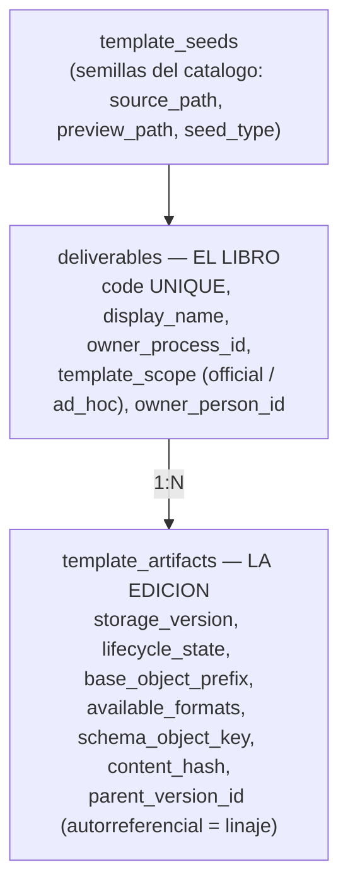

Vive en `process_definition_templates.item_mode`, es decir, **en el vinculo plantilla-proceso**, no en la plantilla. Es un matiz importante. Define *cuando* nace el entregable y *de donde sale su flujo*:

| **Modo**     | **Flujo**                                     | **Instanciación**                                                                                            | **Ejemplo**                             |
|:-------------|:----------------------------------------------|:-------------------------------------------------------------------------------------------------------------|:----------------------------------------|
| `single`     | Predefinido en la plantilla (entrega y firma) | Una instancia automática al lanzar, por cada responsable que resuelvan las reglas                            | Informe de Investigación Formativa      |
| `replicated` | Predefinido                                   | **Sin fan-out automático**: el responsable crea N replicas etiquetadas que **heredan** el flujo del original | Un requerimiento por cada docente nuevo |
| `routed`     | **Ninguno**                                   | El usuario define entrega y firma **al instanciar** (en tiempo de ejecución)                                 | Tareas ad-hoc                           |

Truco de implementación para distinguirlos en la base de datos: los flujos *de plantilla* tienen `task_item_id IS NULL`; los flujos creados en tiempo de ejecución tienen `task_item_id != NULL`. Los materializa `materializeRuntimeFlowForTaskItem`.

Las replicas son `task_items` con `origin_kind=’user_added’` enlazadas por `source_task_item_id` al original.

El **“Proceso por defecto”** (slug `default`, sembrado por el bootstrap) es un `routed` comodin para tareas ad-hoc que no pertenecen a ningun proceso (por ejemplo, “haz el informe de este evento”). El `CLAUDE.md` insiste: **no es “memorandums”**.

:::note[Resolutores de flujo autorables]

Solo `task_assignee` (“Responsable del entregable”) y `cargo_in_scope` (“Por cargo”) en plantillas *official*; `specific_person` se anade en *ad_hoc*. Están **deprecados en la autoria web** `document_owner`, `position` y `manual_pick`: siguen en el ENUM por legado.

:::

:::caution[document_owner NO esta retirado: sigue vivo]

Es el resolver **mas usado** de la base de dev. La fase P1.4 retiro el atajo del *proceso por defecto* (`SystemBootstrapService.js`), pero dejo el de `BASE_META_YAML` — un `meta.yaml` escrito a mano como literal de código unas 250 líneas mas arriba, **en el mismo fichero**. Y además **se auto-replica**: `createTemplateArtifactVersion` copia los objetos de MinIO en binario, así que cada versión nueva lo hereda.

**No lo des por muerto sin consultar `fill_flow_steps`.** El plan para retirarlo es el frente 0 de `docs/planes/plan-maestro-2026-08.md`.

:::

## Plantillas: el modelo “libro y ediciones”

Con UNIQUE sobre `(deliverable_id, storage_version)`. El esquema lleva comentarios explícitos: la identidad, el proceso propietario, el scope, la semilla y la persona propietaria viven en `deliverables`; `template_artifacts` guarda **solo** el estado y el almacenamiento de cada versión.

:::caution[La palabra “entregable” significa dos cosas]

En `sqlTables.js` la tabla `task_items` se etiqueta “Entregables” (la *instancia* a producir). En el esquema, `deliverables` es “el libro”: la *identidad de la plantilla*. Es una fuente real de confusión al leer el código; siempre hay que mirar el contexto.

:::

### El contenido: Jinja2 sobre LaTeX

El cuerpo del documento es un **contrato Jinja2 + LaTeX** empaquetado en MinIO, no en la base de datos. El bootstrap pública la semilla `backend/services/system/seeds/informe-general` con `schema.json`, `meta.yaml`, `data.yaml`, `main.tex.j2` y `make.sh`, y válida el pipeline: render Jinja2 con `StrictUndefined` → `pdflatex` → PDF.

La **propiedad** se expresa por el prefijo dentro de MinIO, en `base_object_prefix`: `System/...` para las plantillas curadas por el administrador, `Users/{cedula}/...` para las subidas por un gestor. El pipeline de maduración documentado es:

`office` (Word/Excel/PDF subido por el gestor) ⟶ `jinja2` (curado por el administrador)

:::note[Deuda declarada]

Falta *cablear* el render Jinja2 a PDF en tiempo de ejecución: hoy `render_seed.py` es utileria de línea de comandos, y el backend no lo invoca.

:::

### Ciclo de vida y versionado

`template_artifacts.lifecycle_state` admite `draft`, `published` y `retired` (por defecto `published`). El versionado es **por linaje**: una fila nueva con `storage_version` nuevo y `parent_version_id` apuntando a la anterior. `templateLifecycle.js` retira la versión publicada previa del mismo código al publicar, y válida que haya al menos un paso de entrega. Ese último requisito **se relaja para `routed`**, que por definición no autora flujo.
