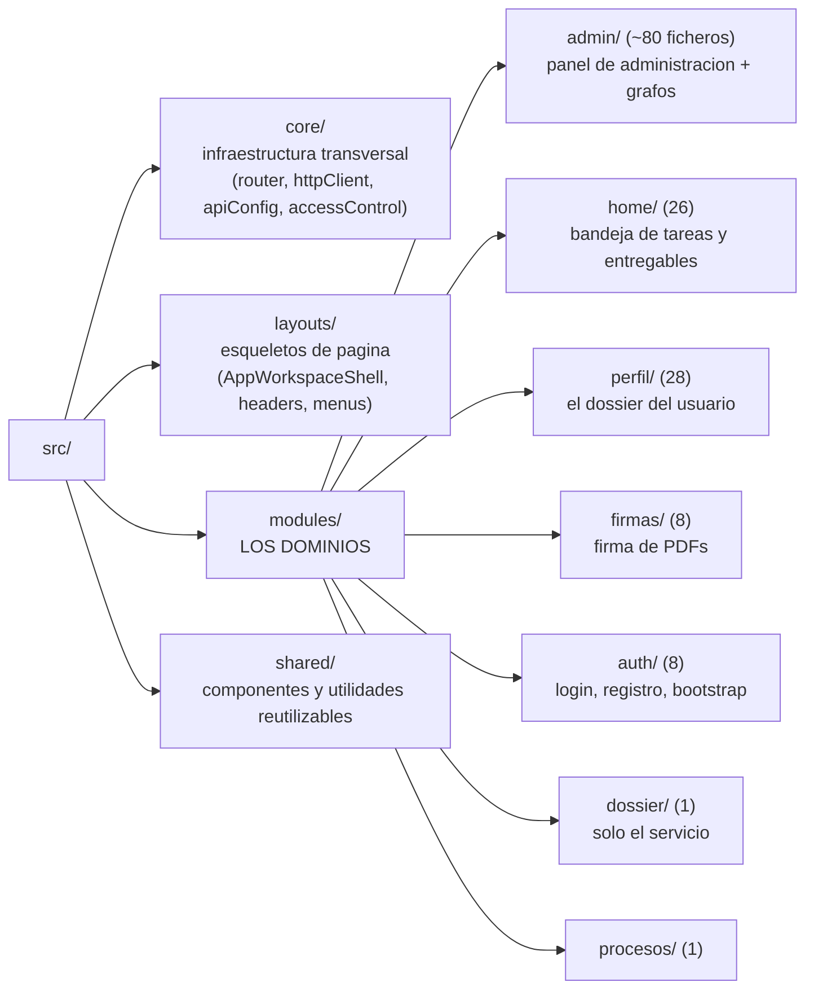

**Vue 3 + Vite 8 + vue-router 5 + Tailwind v4 + Vitest**, sin TypeScript. 216 ficheros en `src/`: 126 `.vue`, 87 `.js` y **18 `.css`** — el CSS no es un fichero, es un sistema de diseño repartido en 18 modulos por familia dentro de `shared/styles/`, encadenados por `index.css`, que es lo unico que importa `main.js`. **El orden de esos `@import` es parte del diseno y no es alfabetico**: en CSS dos reglas de la misma especificidad se resuelven por orden de aparicion, asi que `overrides.css` va el ultimo a proposito.

## Organización: modular por dominio



:::note[Lo que NO existe]

No hay carpeta `src/assets/` (los estaticos viven en `frontend/public/`), ni `src/views/` ni `src/components/` de nivel raiz: todo esta bajo `modules/` y `shared/`. Y el **chat no es un modulo**: vive como widget compartido en `shared/components/widgets/WorkspaceChatLauncher.vue`.

:::

## El arranque

`src/main.js` tiene 569 bytes y hace lo mínimo: crea la app, registra globalmente un único componente (`font-awesome-icon`), importa los dos CSS globales, marca el entorno local en un atributo del DOM, y monta el router.

`App.vue` solo tiene dos cosas: un `<router-view :key="route.fullPath">` y un `SessionExpiryModal` global gobernado por `useSessionMonitor`.

Sobre Vite: no hay `server.proxy` — el proxy es nginx, externo. El alias `@` apunta a `src`. Y de Tailwind v4 **no hay `tailwind.config.js` ni `postcss.config.js`**: se usa el plugin de Vite mas directivas dentro del propio CSS. El `@import "tailwindcss"` vive en `shared/styles/tokens.css`, que es tambien donde se declara la paleta con `@theme` — en v4 el tema **es** CSS. (Este parrafo apuntaba a `shared/styles/tailwind.css`, que no existe.)

## Estado: no hay Pinia ni Vuex

Esto sorprende viniendo de cualquier tutorial de Vue. El patron real es de tres capas:

1.  **Composables que poseen su propio estado.** Una función `useXxx()` declara sus `ref` y los devuelve. Ejemplo: `useFlowBuilder.js` tiene seis `ref` propios y solo recibe tres dependencias inyectadas. Los comentarios documentan una migración deliberada desde el antipatron “recibir refs ajenos y escribirlos”.

2.  **La sesión vive en `localStorage`**: la clave `token` (el JWT) y `user` (el usuario serializado como JSON). Las escribe `AuthService.js` y las limpia `clearAuthData()` de `core/utils/tokenUtils.js`.

3.  **Eventos del `window` como bus informal**: `"dossier-updated"`, `"workspace-chat:context-updated"`, `"workspace-chat:open-process"`.

:::caution[Consecuencia real que hay que conocer]

Como el usuario esta en `localStorage` y no en un store reactivo, **los cambios de sesión no propagan por Vue**. De ahi el truco `<router-view :key="route.fullPath">` en `App.vue`, que fuerza a remontar el componente entero en cada navegación.

:::

## La capa HTTP

`src/core/services/httpClient.js` es una instancia *propia* de axios (no el singleton global; el comentario del fichero lo documenta como corrección de un bug de orden de imports) con **un solo interceptor de request**, que anade `Authorization: Bearer <localStorage.token>` si no viene ya puesta.

:::caution[No hay interceptor de response]

Es decir, **no hay refresh automático ante un 401**. El refresh es manual y explícito: `useSessionMonitor.js` hace polling cada 60 segundos y, cinco minutos antes de que expire el JWT, abre `SessionExpiryModal.vue`, que llama a `/users/refresh-token` con `withCredentials: true` (para que viaje la cookie `refreshToken`). Si falla, cierra sesión.

:::

Las URLs se construyen en `src/core/config/apiConfig.js`, que expone un objeto `API_ROUTES` con unas 110 entradas (unas son cadenas, otras funciones):

``` javascript
const API_PORT = import.meta.env.VITE_API_PORT || "3030";
const RAW_API_BASE_URL = String(import.meta.env.VITE_API_BASE_URL || "").trim();
const API_BASE_URL = RAW_API_BASE_URL || `${protocol}//${hostname}:${API_PORT}`;
export const API_PREFIX = `${NORMALIZED_API_BASE_URL}/deasy/v1`;   // -> "/api/deasy/v1"
```

Regla documentada en el propio fichero: *“en `frontend/src` no se importa `axios` a pelo”*. Y no se fija `baseURL` a propósito: todas las llamadas pasan la URL completa construida desde `apiConfig`.

Hay 17 ficheros de servicio, todos clases con métodos asincronos sobre `httpClient`. El mas grande es `core/services/ProcessDefinitionPanelService.js` (16,5 KB).

## El router y sus guards

Todo en **un solo fichero**: `src/core/router/index.js`. Doce rutas de primer nivel mas ocho hijas bajo `/perfil`. **Sin lazy-loading**: todas las vistas se importan estaticamente (el `import()` diferido solo se usa para los dos grafos de admin).

El `router.beforeEach` hace, en este orden:

1.  Consulta el estado de bootstrap del sistema (¿esta instalado?). Si el modo no es `normal`, limpia la sesión y fuerza `/setup`. Si la llamada falla, avisa por consola y **deja pasar** (que el backend este caido no bloquea el enrutado).

2.  Si no hay token válido y la ruta es privada, limpia la sesión y va a `/`.

3.  Si el usuario es administrador y la ruta tiene `meta.blockedForAdmin`, redirige a `/admin`.

4.  Comprueba `meta.requiresProcessManagementAccess` y `meta.requiresAdminAccess`.

:::tip[Por que se usa meta y no nombres de ruta]

Porque vue-router **hereda el `meta` a las rutas hijas**. `/perfil` tiene ocho hijas (`formacion`, `experiencia`, `referencias`, `capacitacion`, `certificacion`, `investigacion`, `certificados-firma`...). Marcando solo el padre con `blockedForAdmin: true`, las ocho quedan protegidas automáticamente. Si se comprobara por nombre de ruta, habría que acordarse de anadir cada hija nueva a una lista.

:::

Las rutas públicas son `/`, `/register`, `/recover-password`, `/terminos` y `/setup`. La ruta `/logout` no tiene componente: solo un `beforeEnter` que llama al backend, limpia y devuelve `/`.

:::note[Coste a tener en cuenta]

El guard hace una petición HTTP (el estado de bootstrap) antes de *cada* navegación, sin cache.

:::

`src/core/utils/accessControl.js` es un **espejo declarado** de `RbacService.js` del backend: `hasAnyRole`, `hasPermission` (donde `AdminSistema` pasa todo), `canAccessResource(resource, action)` con respaldo a `.manage`, y un mapa de unas 50 tablas a su recurso RBAC.

:::caution[El RBAC del frontend es solo cosmetico]

Sirve para *ocultar botones* y no ensenar opciones que van a fallar. La autorización real la hace **siempre** el backend. Nunca confies en un control de acceso que corre en el navegador del usuario: es código que el usuario controla.

:::
