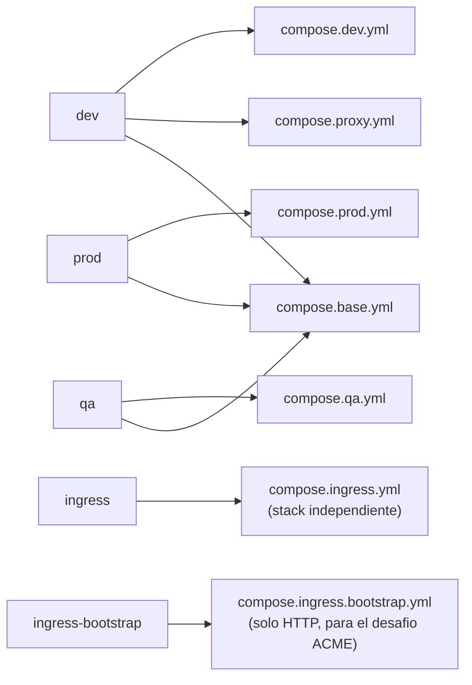

## Docker: base mas overlays

En vez de un `docker-compose.yml` por entorno (duplicando todo), hay **un fichero base y un overlay** que lo modifica:



:::tip[Que es un “overlay” de compose]

Docker Compose permite pasar varios `-f`. Los ficheros se **fusionan** en orden: lo que define el segundo pisa o completa lo del primero. Así, el base declara los servicios y sus variables comunes, y cada overlay solo dice lo que cambia (puertos, si se construye la imagen o se descarga, montajes de código, políticas de reinicio). Evita mantener cuatro ficheros casi identicos que se desincronizan.

:::

Consecuencia concreta: `qa` y `prod` **no cargan** `compose.proxy.yml`, así que no tienen `nginx-proxy`; su entrada pública es el stack `ingress`, separado y compartido.

### Diferencias por entorno

|                    | **dev**                                         | **qa / prod**                                                               |
|:-------------------|:------------------------------------------------|:----------------------------------------------------------------------------|
| Imagenes de la app | se **construyen** localmente (`Dockerfile.dev`) | se **descargan** de GHCR con `pull_policy: always`                          |
| Código             | **bind mount** (editas y se recarga)            | dentro de la imagen                                                         |
| Proxy              | `nginx-proxy` en el propio stack                | un stack `ingress` separado                                                 |
| Puertos del proxy  | 8088 / 8443                                     | el ingress pública 80 / 443                                                 |
| PostgreSQL         | 5432                                            | 15432 (qa) / 25432 (prod)                                                   |
| MinIO              | 9000 / 9001                                     | 9100 / 9101 y 9200 / 9201                                                   |
| Buckets            | `deasy-*`                                       | `deasy-qa-*` y `deasy-prod-*`                                               |
| PAdES-LTA          | desactivado                                     | **activado en prod**                                                        |
| Endurecimiento     | —                                               | `no-new-privileges`, `read_only` en frontend, `tmpfs`, healthchecks propios |

:::caution[RabbitMQ solo se pública en dev, y atado a 127.0.0.1]

El comentario del compose explica el motivo: la interfaz de gestion de RabbitMQ **muestra el cuerpo de los mensajes**, y ahi viaja `certPassword`, la contrasena del certificado de firma. En qa y prod los puertos no se publican en absoluto.

:::

### Los servicios del fichero base

| **Servicio**      | **Imagen**              | **Notas**                                                                  |
|:------------------|:------------------------|:---------------------------------------------------------------------------|
| `postgres`        | `postgres:17`           | healthcheck `pg_isready`; único motor de datos                             |
| `rabbitmq`        | `rabbitmq:3-management` | healthcheck `rabbitmq-diagnostics ping`                                    |
| `minio`           | `minio/minio:...`       | `server /data --console-address ":9001"`                                   |
| `minio-bootstrap` | `minio/mc:...`          | perfil `storage-init`; crea los buckets y hace `mc mirror` de las semillas |
| `backend`         | sin imagen en base      | la define cada overlay                                                     |
| `frontend`        | sin imagen en base      | idem                                                                       |
| `signer`          | sin imagen en base      | `SIGNER_PORT=4000`, `SIGMAKER_DIR=/opt/sigmaker`                           |
| `analytics`       | sin imagen en base      | perfil `workers`; hoy es un marcador de posición                           |

## `scripts/docker-env.sh`: la interfaz comun

Es **la única forma correcta** de tocar el stack. Todo lo que va después del entorno se reenvia literalmente a `docker compose`:

``` bash
bash scripts/docker-env.sh dev up -d --build
bash scripts/docker-env.sh dev logs -f backend
bash scripts/docker-env.sh dev ps
bash scripts/docker-env.sh dev exec -T backend npm run test:unit
bash scripts/docker-env.sh dev down
```

Resuelve el fichero `.env` correcto (con `DEASY_ENV_FILE` como gancho para apuntar al `.runtime` en despliegues), válida que existan todos los ficheros antes de invocar nada, exporta `DEASY_CONTAINER_ENV_FILE` y hasta convierte rutas si detecta `cygpath` en Windows.

:::caution[Regla del proyecto]

*“Builds y tests deben correr dentro de los contenedores vía `scripts/docker-env.sh`, no con npm o npx en el host”*. Y al **anadir dependencias al frontend** hay que instalar **dentro del contenedor**: el volumen de `node_modules` sombrea el de la imagen, así que un `pnpm install` en el host **no se ve** dentro.

:::

### Los demas scripts operativos

| **Script**                   | **Que hace**                                                                                                                                                                                   |
|:-----------------------------|:-----------------------------------------------------------------------------------------------------------------------------------------------------------------------------------------------|
| `apply-env.sh`               | Motor comun de despliegue. Aplica el tag de imagen, crea la red externa si falta, limpia contenedores antiguos que retengan los puertos 80/443, y levanta el stack. Soporta `DEASY_DRY_RUN=1`. |
| `deploy-env.sh`              | Envoltorio fino que llama a `apply-env.sh` en modo `gh-actions`. Es lo que ejecuta el workflow por SSH.                                                                                        |
| `server-pull-deploy.sh`      | Modo *server-pull*: exige rama correcta y árbol limpio, hace `git pull --ff-only` y despliega.                                                                                                 |
| `_backend_db_exec.sh`        | Libreria compartida. Para producción exige un fichero de aprobación **dentro del repo e ignorado por git**.                                                                                    |
| `reset-db.sh`                | Resetea solo la base de datos dentro del contenedor.                                                                                                                                           |
| `reset-system.sh`            | Reset completo a instalación virgen: base + almacenamiento, recicla backend y signer, y **recarga nginx** (porque el proxy de dev cachea la IP del backend).                                   |
| `rabbitmq-migrar-usuario.sh` | Crea el usuario real de RabbitMQ y **después borra `guest`**. Idempotente.                                                                                                                     |
| `bootstrap-ingress-cert.sh`  | Emite el certificado público con certbot (ver mas abajo).                                                                                                                                      |
| `signer-coverage.sh`         | Genera el informe de cobertura de Python para Sonar, reescribiendo las rutas para que las resuelva.                                                                                            |
