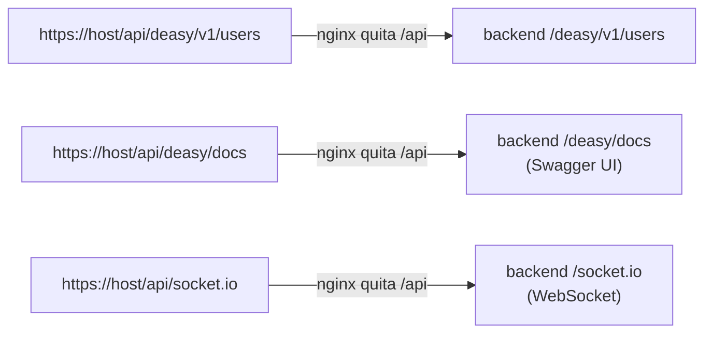

## Mecanica de plantillas

**No existe un directorio `nginx/conf.d/` en el repositorio.** Los tres directorios `*-conf.d/` se montan como `/etc/nginx/templates`, y el entrypoint oficial de la imagen `nginx` aplica `envsubst` a cada `*.template` generando los `.conf` finales. De ahi que las plantillas usen variables `${VAR}` literales.

## Desarrollo

`nginx/app-conf.d/default.conf.template`: un `server_name _` que no discrimina.

``` bash
location = /api   { return 301 /api/; }
location /api/    { proxy_pass http://${BACKEND_UPSTREAM}/; }
location /        { proxy_pass http://${FRONTEND_UPSTREAM}; }
```

:::tip[La barra final del proxy_pass]

Es la diferencia entre que funcione y que no. Con `proxy_pass http://backend:3030/;` (con barra), nginx **sustituye** la parte que casó (`/api/`) por la barra, así que `/api/deasy/v1/users` llega al backend como `/deasy/v1/users`. *Sin* la barra final, la ruta se pasaria integra y el backend recibiria `/api/deasy/v1/users`, que no tiene ninguna ruta registrada: 404.

:::

El puerto 80 sirve solo tres cosas: `/healthz`, el desafio ACME (`/.well-known/acme-challenge/`) y una redirección 301 a HTTPS.

## Producción y QA

`nginx/ingress-conf.d/default.conf.template` es un **ingress compartido** que reparte **por cabecera `Host`**: `fresvel.com` y `www.fresvel.com` van a prod, `qa.fresvel.com` va a qa. Un cuarto bloque `default_server` devuelve **404** a cualquier Host no reconocido. Aquí la reescritura se hace con `rewrite ^/api/(.*)$ /$1 break;`.

Detalle importante: los upstreams se asignan a **variables** junto con `resolver 127.0.0.11 ipv6=off valid=10s`. Eso fuerza a nginx a **re-resolver el DNS de Docker cada 10 segundos** en vez de cachear la IP al arrancar. Es justo el problema que sufre el proxy de dev (resolución estática), y por eso `reset-system.sh` tiene que recargarlo tras reciclar el backend.

## Rutas efectivas

nginx **solo conoce dos prefijos**: `/api/` y `/`. Todo lo demas son rutas internas de Express:



El upgrade a WebSocket funciona gracias a las cabeceras `Upgrade` y `Connection` y al `map $http_upgrade $connection_upgrade` definido en `nginx/nginx.conf`.

## Certificados y ACME

- `nginx/certs/dev/` y `nginx/certs/qa/`: **autofirmados versionados** en git (generables con `nginx/scripts/generate-self-signed.sh`).

- `nginx/certs/public/`: **no versionado**; ahi deja `scripts/bootstrap-ingress-cert.sh` el certificado de Let’s Encrypt.

- `nginx/acme/`: el *webroot* del desafio HTTP-01; montado de solo lectura en proxy e ingress, y de **lectura-escritura** en el bootstrap, para que certbot pueda escribir el fichero de reto.

:::tip[Por que existe un “ingress-bootstrap”]

Let’s Encrypt verifica que controlas el dominio pidiendote colocar un fichero en `http://tudominio/.well-known/acme-challenge/xxx`. Pero el ingress normal solo escucha en HTTPS con un certificado... que aun no tienes. Es el problema del huevo y la gallina. La solución: un nginx mínimo, **solo HTTP**, que sirve el reto; se emite el certificado, se copia, se baja el bootstrap y se levanta el ingress definitivo.

:::
