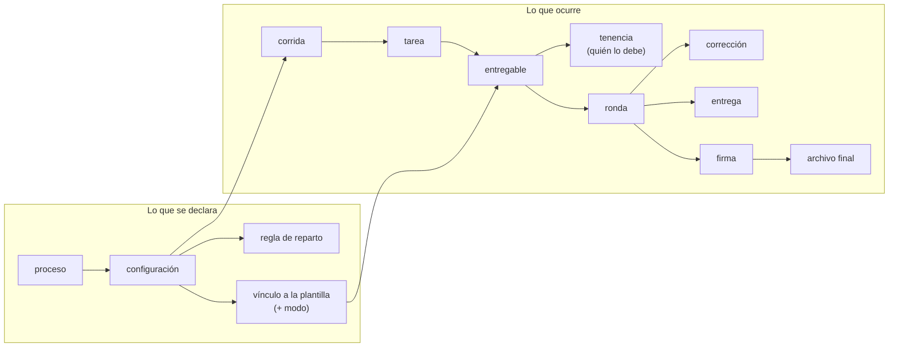
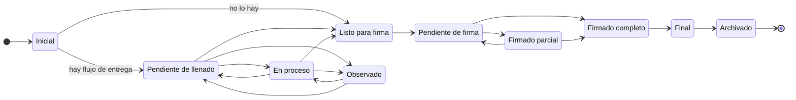

Las otras páginas de datos explican **áreas**: el [motor de procesos](/explicacion/datos-motor-de-procesos),
los [modos y plantillas](/explicacion/datos-modos-y-plantillas), las
[firmas y el resto de dominios](/explicacion/datos-firmas-y-dominios). Esta explica el **recorrido**:
cómo se llega de «esta universidad tiene un proceso» a «este documento existe, lo hizo esta persona y
lo firmaron estas otras».

El detalle de cada columna está en [Campos de la cadena proceso → documento](/referencia/campos-proceso-documento),
que se genera del catálogo de PostgreSQL.

## Las dos mitades, y por qué confundirlas cuesta

El modelo tiene dos mitades y separarlas es la mitad de entenderlo.

**Lo que se declara**: la universidad dice qué procesos existen, quién debe participar, qué documentos
hay que producir y con qué plantilla. Es una descripción; no ha pasado nada todavía.

**Lo que ocurre**: llega un periodo, el proceso se dispara, aparecen tareas con nombre y apellido,
alguien rellena un documento, otros lo firman.

La frontera es exacta: **declarar no crea trabajo**. El trabajo aparece en un momento concreto —el
disparo— y a partir de ahí queda anclado a la versión de la declaración vigente entonces.

:::tip[Por qué las declaraciones se versionan en vez de editarse]

Si una configuración activa se pudiera editar, un documento a medio firmar cambiaría de reglas
mientras lo firman. Por eso tanto las configuraciones (`process_definition_versions`) como las
ediciones de plantilla (`template_artifacts`) nacen, se activan y se retiran, pero **no se modifican
en su sitio**. Lo retirado no se borra: es el registro de cómo se hacían las cosas entonces.

:::

## 1 · La siembra: de qué parte un sistema vacío

El arranque con datos de ejemplo no siembra datos sueltos: **construye el ejemplo mínimo completo de
la cadena**, y por eso es el mejor sitio para empezar. Hace siete cosas, y cada una es un eslabón:

1. Crea un **proceso** («Proceso por defecto», el cajón de las tareas que no pertenecen a ningún
   proceso formal).
2. Le da una **serie** — el criterio por el que se reparte.
3. Le da una **configuración activa** — la versión concreta de sus reglas.
4. Publica una **semilla** — el paquete base del que nacen las plantillas.
5. Crea el **entregable y su primera edición publicada**.
6. **Vincula** la configuración con esa edición, en modo abierto.
7. Crea el periodo **«Permanente»** y una regla que alcanza a todas las unidades.

## 2 · La organización: la silla y quien se sienta en ella

Antes de que haya procesos tiene que haber una universidad, y aquí está la distinción que gobierna
todo el sistema de responsabilidades: **la silla y su ocupante son cosas distintas**.

| | Qué es | Tabla |
|---|---|---|
| **Unidad** | Una parte de la institución. Se relacionan formando el organigrama, y la relación tiene tipo propio | `units`, `unit_relations` |
| **Cargo** | Un rol genérico («Decano»). Catálogo; no pertenece a ninguna unidad | `cargos` |
| **Puesto** | **La silla**: este cargo en esta unidad, con su número de plaza. Existe aunque nadie la ocupe | `unit_positions` |
| **Ocupación** | Una persona sentada en esa silla durante un periodo | `position_assignments` |

**Solo puede haber una ocupación vigente por silla**, y no es una costumbre del código: un índice
único parcial lo hace imposible.

:::note[Por qué importa la separación]

Los documentos se le deben **al puesto**, no a la persona. Cuando alguien deja el cargo, lo que debía
no desaparece ni queda huérfano: pasa a quien ocupe esa silla después. Toda la mecánica de relevos se
apoya en esto.

:::

Un campo que sorprende: **`persons.token`** son diez caracteres únicos por persona, y no son de
seguridad. Son **la marca que se escribe dentro del PDF** para que el firmador sepa en qué página y
en qué coordenadas estampar su firma. Es el hilo que une la organización con la firma.

## 3 · El reparto: a quién le toca cuando esto se dispare

Una configuración no sabe a quién dirigirse. Eso lo dicen las **reglas**, y cada una responde dos
preguntas **por separado**, que es lo que les da su potencia:

- **¿Hasta dónde llega?** — `unit_exact`, `unit_subtree`, `unit_type` o `all_units`.
- **¿A quién de ahí dentro?** — `all_matches`, `unit_head` o `exact_position`.

Combinándolas se expresa casi cualquier cosa. *«A los coordinadores de todas las carreras»* es
alcance por tipo de unidad más política «todos los que encajen» con el cargo Coordinador.

:::caution[El resultado de una regla son sillas, no personas]

Una regla se resuelve a una lista de **puestos**; quién esté sentado se mira en ese momento. Si la
silla está vacía **el entregable no se crea**, en vez de crearse huérfano. Es deliberado: un
documento que nadie debe no es trabajo pendiente, es basura que ensucia los informes.

:::

## 4 · El entregable concreto: qué se debe, y quién lo debe

Al dispararse el proceso aparecen la **corrida** (el acto de lanzamiento, idempotente por
configuración y periodo), las **tareas** (una por destino alcanzado) y los **entregables concretos**.

La identidad de un entregable son **tres** cosas: qué tarea, qué edición de plantilla, y **qué silla
lo produce**. Esa tercera pata es obligatoria y es el ancla de todo lo demás.

Y «quién lo debe» no es un dato fijo: es una **sucesión de turnos** en `task_item_tenures`. Cada
turno guarda quién, en calidad de qué silla, desde cuándo y hasta cuándo, **y por qué se abrió**:

`original` · `occupancy_start` · `occupancy_end` · `position_deactivated` · `reconcile` · `manual`

Esa lista es, en sí misma, el mapa de todas las formas en que puede cambiar un responsable. Solo el
traspaso `manual` registra **quién** lo provocó: en los automáticos no lo hizo nadie.

:::caution[Hasta dónde llega el relevo automático]

El traspaso automático funciona **mientras el documento no haya entrado en fase de firma**. Un
documento que ya está siendo firmado no cambia de dueño sin que alguien lo decida. Esa frontera está
escrita **en dos sitios a la vez** —en el código y dentro de los triggers— y hay una prueba que
compara los dos y falla si se separan.

:::

`task_items.assigned_person_id` **es una caché**, no el dato: la escribe un trigger a partir de las
tenencias. En el editor genérico es de solo lectura.

:::tip[Una regla de negocio escondida en dos columnas generadas]

`task_items` tiene dos columnas que nadie escribe ni lee desde el código —
`process_definition_template_key` y `responsible_position_key`—. No son copias de seguridad: son
**generadas**, y valen el identificador original **solo si el entregable lo creó el proceso**; en los
añadidos por una persona valen vacío.

Existen para que el índice único `uq_task_items_defined_target` sobre
`(tarea, vínculo, puesto)` **se aplique únicamente a lo que genera el proceso**. El efecto es la
regla que se buscaba: **el disparo no puede crear dos veces el mismo entregable para la misma silla,
pero una persona sí puede crear tantas réplicas como necesite** — porque los vacíos no chocan entre
sí en un índice único.

Es el mismo idioma que `head_flag` (un solo jefe por unidad), `current_flag` (una sola ocupación
vigente) y `normalized_scope_unit_id` (idempotencia del lanzamiento). Cuatro reglas de negocio que
**no viven en el código**: las impone la base y no se pueden saltar.

:::

## 5 · El documento: rondas y correcciones

«Versión» significaba dos cosas y mezclarlas costaba caro. Hoy son dos niveles:

- Una **ronda** (`document_versions.version`) es un intento completo del ciclo: rellenar y firmar. Si
  el documento sale observado y hay que rehacerlo, empieza la ronda 2.
- Una **corrección** (`document_version_uploads.minor`) es cada subida del archivo dentro de esa
  ronda, **con su autor**.

La etiqueta legible la calcula la base; nadie la escribe.

Una ronda guarda **tres rutas distintas** y no son redundantes: el archivo **de trabajo** (raíz del
entregable, con carpetas numeradas por ronda y corrección), el archivo **final** (firmado y cerrado)
y los **datos** rellenados, con su huella.

:::note[La asimetría que motivó el cambio]

Los anexos (`document_attachments`) **siempre** registraron quién los subió. El documento principal
**no**: se sabía quién adjuntó la evidencia pero no quién había producido el informe. Partir la
versión en rondas y correcciones es lo que lo resolvió.

:::

## 6 · Entrega y firma: la misma estructura, dos veces

Los dos flujos tienen **la misma forma**: una cabecera, una lista de pasos ordenados, una instancia
pegada a la ronda y una solicitud por paso. Y la cabecera puede colgar de **tres sitios**, que es lo
que hace posibles los tres modos:

| Cuelga de | Qué significa | Prioridad |
|---|---|---|
| La **edición de plantilla** | El flujo de la plantilla, válido para todos sus usos | La más baja |
| El **vínculo** | El flujo particular de un proceso concreto | Tapa al anterior |
| El **entregable concreto** | El flujo definido sobre la marcha (modo abierto) | **Gana a los dos** |

Un paso no nombra a una persona: nombra **una forma de encontrarla** y la resuelve en el momento —
`task_assignee` (el responsable vigente, que sobrevive a los relevos), `cargo_in_scope` (por cargo
dentro de un ámbito) o `specific_person` (solo en entregables personales). Y como una forma puede
encontrar a varias, el paso declara qué hacer entonces.

La firma añade dos cosas propias:

- **El modo de aprobación** — `and` (firman todos), `or` (basta uno) o `at_least` (un mínimo).
  Permite modelar un consejo que aprueba por mayoría sin nombrar a nadie.
- **El hueco** (`slot`) — el sitio físico en el papel. La maqueta escribe ahí el `token` del
  firmante; al compilar queda impreso en el PDF; y al firmar, **el firmador busca ese texto, encuentra
  su página y sus coordenadas y estampa la firma exactamente ahí**. Por eso nadie coloca la firma a
  mano.

:::danger[Un punto frágil: la lista libre de firmantes]

`signature_flow_steps.signers` es un JSONB que **no valida nada** y **manda sobre** la columna
`resolver_type`, que sí está validada. Un paso antiguo puede traer por ahí una forma de resolución
retirada; si el código dejara de contemplarla, **ese paso no lo firmaría nadie y en silencio**. Está
registrado como **defecto 1.19**, con su plan: filtrar y migrar, en ese orden.

:::

## 7 · El cierre, y lo que se dijo por el camino

Cuando todos los pasos de firma se completan, la ronda queda firmada, se sella el archivo final y el
entregable pasa a su estado terminal.

Por el camino se dicen cosas, y todas viven en `document_workflow_observations`: guarda **en qué
fase** se dijo (revisión o firma), **de qué solicitud concreta** salió, y **si se resolvió**, quién y
cuándo. Una observación no es un comentario: es algo que hay que cerrar.

:::note[No existe un campo «Para:»]

El destinatario **se deriva del flujo de firma**: es a quien va dirigido el último paso. Como un
envío sin flujo se rechaza, el dato siempre está. Un «Para:» escrito a mano podría contradecir a
quien realmente firma.

:::

## Los estados, y cuáles protege la base

No todas las listas de estados están protegidas igual, y la diferencia importa.

| Qué describe | ¿La base lo impone? |
|---|---|
| Configuración · edición · corrida · modo del vínculo · origen del entregable · causa del turno · resolutor · solicitud de entrega | **Sí**, con `CHECK` |
| Solicitud y resultado de firma | Son **tablas de catálogo**, ampliables sin tocar el esquema |
| **Documento** (`task_items.document_status`) · **ronda** (`document_versions.status`) · **tarea** (`tasks.status`) | **No.** Viven solo en el código |

Los once estados del documento y sus transiciones permitidas:

Desde casi cualquier punto se puede **Cancelar** o **Archivar**. El relevo automático alcanza hasta
«Listo para firma» inclusive.

## Lo que hoy no cierra

El modelo se sostiene y este recorrido no encuentra un agujero estructural. Pero hay cinco puntos
abiertos, y **cuatro esperan una decisión del dueño**, no más trabajo técnico. Se siguen en el plan
de la capa de datos del repositorio (`docs/planes/plan_data/`), fase **D7** del frente 9:

| | Qué pasa |
|---|---|
| `TD7-a` | Publicar una edición nueva retira la anterior y **deja configuraciones activas apuntando a la retirada, en silencio**. Reproducido y medido |
| `TD7-b` | Un proceso puede lanzarse con una edición todavía en borrador: el lanzamiento **no mira `lifecycle_state`** |
| `TD7-e` | Los estados de documento, ronda y tarea **no están declarados en la base** |
| `TD7-k2` | Desactivar un puesto **no cierra su ocupación** |
| **1.19** | La lista libre de firmantes, arriba. Planificado, no necesita decisión |
