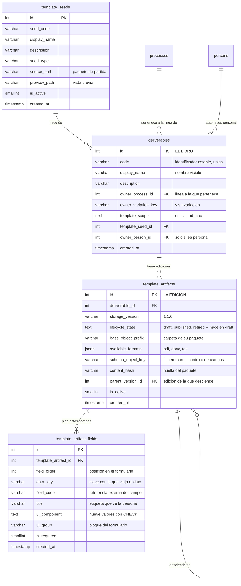

Aquí vive la distinción que más confusión causa si no se nombra bien, así que la nombro con una
metáfora y la sostengo toda la página.

Un **entregable** (`deliverables`) es el *título del libro*: «Informe general de actividades». Es la
identidad de la cosa que hay que producir. No tiene formato, ni campos, ni maqueta — solo nombre
(`code`, `display_name`, `description`), a quién pertenece (`owner_process_id` +
`owner_variation_key`, la línea proceso/variación) y de qué semilla nació (`template_seed_id`).

Una **edición** (`template_artifacts`) es *una impresión concreta* de ese libro: la v1.0.0, la
v1.1.0. Ahí sí está todo lo material: dónde vive su paquete de archivos (`base_object_prefix`), qué
formatos ofrece (`available_formats`), dónde está el contrato de campos (`schema_object_key`) y cuál
es su huella de contenido (`content_hash`).

## Cómo se encadenan y cómo se publican

Las ediciones se encadenan: cada una sabe de cuál desciende (`parent_version_id`, una clave ajena a
la propia tabla). Y tienen el mismo ciclo de tres estados que las configuraciones de proceso
—`lifecycle_state` con `draft`, `published` y `retired`— con la misma regla: **una sola publicada por
entregable**. Publicar una edición retira automáticamente la anterior.

Dos cosas que la base sí impone: `lifecycle_state` tiene un `CHECK` con esos tres valores y **nace
en `draft` por defecto**, para que un `INSERT` despistado deje una fila que el control de activación
rechaza en vez de una plantilla publicada que nunca pasó por él. Y `uq_template_artifacts_storage`
impide repetir `storage_version` dentro del mismo entregable.

:::caution[Una asimetría que conviene conocer]

La regla «una sola configuración activa por línea» **la impone la base**: `active_series_flag` es una
columna generada y `uq_process_definition_one_active_series` la vuelve imposible de violar. La regla
«una sola edición publicada» **solo la sostiene el código** — `retirePriorPublishedSiblings()`, en
`backend/services/admin/templates/templateArtifact.js`, que retira las hermanas publicadas dentro de
la misma transacción en la que publica la nueva.

Comprobado sobre el esquema vigente: hay **ocho** columnas-bandera generadas que respaldan un índice
único parcial de este tipo —en `unit_positions`, `position_assignments`, `vacancies`, `aplications`,
`offers`, `role_assignments`, `process_definition_versions` y `task_item_tenures`— y **ninguna está
en `template_artifacts`**.

:::

Publicar además tiene una puerta: si la edición no se usa **solo** en modo `routed`, se exige que
tenga al menos un paso de flujo de entrega definido, y si no lo tiene la publicación falla. Las
`routed` se saltan esa comprobación porque no autoran flujo: lo definen al instanciarse.

## El ámbito: oficial o personal

Un entregable declara en `template_scope` si es **oficial** (`official`) —de la institución— o
**personal** (`ad_hoc`), creado por alguien para su propio uso, y entonces `owner_person_id` dice
quién.

El ámbito no es decorativo: **decide qué resolutores puede usar el flujo que se autora sobre sus
ediciones**. En `official` solo se admiten `task_assignee` («el responsable del entregable») y
`cargo_in_scope` («por cargo»); `ad_hoc` añade `specific_person`, o sea nombrar a una persona
concreta. La lista vive en `WEB_FILL_RESOLVER_TYPES_BY_SCOPE`
(`backend/services/admin/templates/workflows.js`), y por debajo el `CHECK` de
`fill_flow_steps.resolver_type` admite exactamente esos tres valores y ninguno más.

## Los campos: qué le van a pedir a quien lo rellene

Una edición declara sus campos en `template_artifact_fields`, **una fila por campo**: su orden
(`field_order`), la clave con la que viaja el dato (`data_key`), su referencia externa
(`field_code`), la etiqueta que ve la persona (`title`), qué control se pinta (`ui_component`), en
qué bloque del formulario va (`ui_group`) y si es obligatorio (`is_required`).

`ui_component` tiene `CHECK` con **nueve** valores: `text`, `richtext`, `textarea`, `number`,
`switch`, `date`, `date_expression`, `select` y `hidden`.

:::note[Por qué filas y no un JSONB]

Estos campos vivieron hasta hace poco **solo como fichero** (`schema.json` en MinIO). Pasaron a
tabla por tres motivos medidos, y el tercero es el que descarta la alternativa del `JSONB`: **un
`CHECK` no cubre una columna JSONB**. Con `ui_component` como columna, los nueve componentes son una
restricción de la base; dentro de un JSONB serían para siempre una promesa de JavaScript.

`uq_template_artifact_fields_key` hace estructural lo que antes era un `Set` en memoria: dos campos
con el mismo `data_key` dentro de una edición ya no pueden coexistir. Y la clave ajena es
`ON DELETE CASCADE` —a diferencia de las cabeceras de flujo— porque un campo tiene exactamente un
portador y no significa nada sin su edición.

:::

## La semilla: de dónde nacen las plantillas

Una **semilla** (`template_seeds`) es un paquete de partida del catálogo: su código (`seed_code`),
su tipo (`seed_type`), la ruta del paquete (`source_path`) y una vista previa opcional
(`preview_path`). Cuando se crea un entregable nuevo se elige de qué semilla nace, y esa semilla
aporta la maqueta y el contrato de campos inicial. Es lo que evita empezar de cero cada vez.

