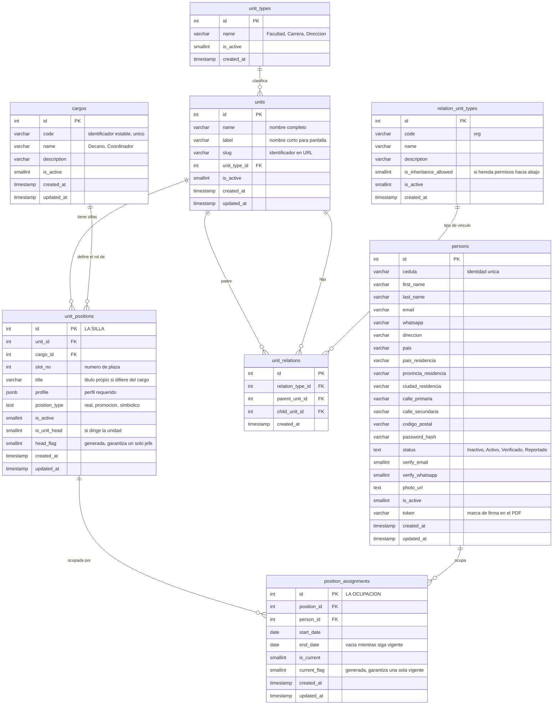

Antes de que haya procesos tiene que haber una universidad. Deasy la modela con una distinción que es
la clave de todo el sistema de responsabilidades: **la silla y quien está sentado en ella son cosas
distintas**.

## Las cuatro piezas

| | Qué es | Tabla |
|---|---|---|
| **Unidad** | Una parte de la institución: una facultad, una carrera, una dirección | `units` |
| **Cargo** | Un rol genérico («Decano», «Coordinador de carrera»). Catálogo; no pertenece a ninguna unidad | `cargos` |
| **Puesto** | **La silla**: *este* cargo *en esta* unidad, con su número de plaza. Existe aunque nadie la ocupe | `unit_positions` |
| **Ocupación** | Una persona sentada en esa silla durante un periodo | `position_assignments` |

Las unidades se relacionan entre sí formando el organigrama, y esa relación **tiene tipo propio**
(`relation_unit_types`): la orgánica —código `org`, la que siembra el propio esquema— es la jerárquica
de toda la vida, pero puede haber otras. Cada tipo declara además si **hereda permisos hacia abajo**
(`is_inheritance_allowed`).

Un puesto se identifica por `(unit_id, cargo_id, slot_no)` —«Coordinador de carrera, plaza 1, de la
Carrera de Sistemas»— y lleva un `position_type` cerrado por `CHECK` a `real`, `promocion` o
`simbolico`.

Una ocupación tiene fecha de inicio y, cuando la persona se va, fecha de fin. **Solo puede haber una
ocupación vigente por silla**, y eso no es una costumbre del código: lo impone la base y no se puede
saltar.

:::note[Por qué importa esta separación]

Porque los documentos se le deben **al puesto**, no a la persona. Cuando alguien deja el cargo, lo que
debía no desaparece ni se queda huérfano: pasa a quien ocupe esa silla después. Toda la mecánica de
relevos se apoya en esto — el ancla de un entregable es `task_items.responsible_position_id`, que es
obligatoria.

:::

## Reglas de negocio que no viven en el código

Deasy repite un mismo idioma: una **columna generada** que vale algo solo en un caso y `NULL` en el
resto, más un índice único sobre ella. Como los `NULL` no chocan entre sí en un índice único, el
índice restringe *solo* el caso que interesa.

En esta página el idioma aparece dos veces:

- `unit_positions.head_flag` + `uq_unit_head` — **un solo jefe por unidad**.
- `position_assignments.current_flag` + `uq_position_current` — **una sola ocupación vigente por
  silla**.

:::tip[El idioma se usa nueve veces, no cuatro]

El esquema vigente lo repite en nueve índices únicos: los dos de arriba, más una vacante abierta por
puesto, un seleccionado por vacante, una oferta enviada por postulación, una asignación de rol vigente
por `(persona, rol, unidad, origen)`, una configuración activa por `(proceso, variación)`, un
entregable definido por proceso por `(tarea, vínculo, puesto)` y **un solo turno abierto por
entregable** (`uq_task_item_tenure_current`).

Aparte va `tasks.normalized_scope_unit_id`, que también es columna generada pero de la otra variante
—`COALESCE(scope_unit_id, 0)`, nunca nula— y sirve para la **idempotencia del lanzamiento**.

:::

Hay una tercera invariante en el organigrama que no usa ese idioma sino un índice único a secas:
`uq_unit_relations_child_type` sobre `(child_unit_id, relation_type_id)`. Dicho en cristiano, **una
unidad tiene como mucho un padre por tipo de relación**: el organigrama orgánico es un árbol, no un
grafo cualquiera.

## El diagrama, con todos sus campos

:::note[Un campo que sorprende]

`persons.token` son diez caracteres únicos por persona (`VARCHAR(10) NOT NULL UNIQUE`). No son de
seguridad: son **la marca que se escribe dentro del PDF** para que el firmador sepa exactamente en qué
página y en qué coordenadas estampar la firma de esa persona. Es el hilo que une la organización con
la firma.

:::
