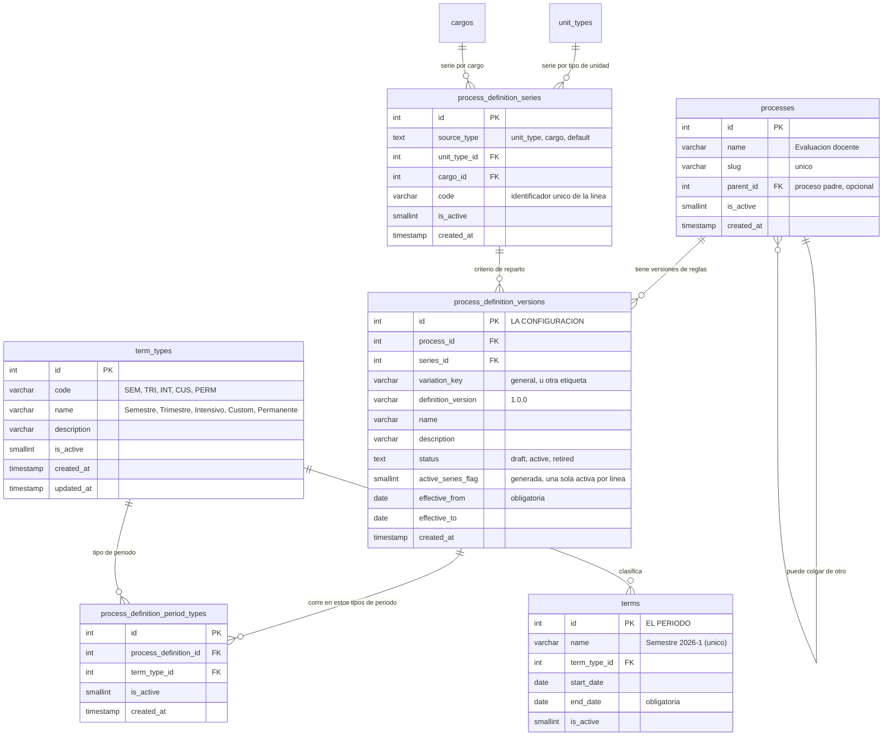

Un **proceso** (`processes`) es apenas un nombre: «Evaluación docente», «Informe semestral». No
contiene reglas. Puede colgar de otro proceso —`parent_id` es autorreferencial—, formando un árbol.

Las reglas viven un piso más abajo, en la **configuración** (`process_definition_versions`). Y aquí
está la primera decisión de diseño importante: **una configuración no se edita, se versiona**. Cuando
cambian las reglas nace una versión nueva y la anterior se retira. La retirada no se borra: se queda
como registro de cómo se hacían las cosas entonces.

Cada configuración tiene tres estados, cerrados por un `CHECK`: `draft` mientras se prepara, `active`
cuando rige, y `retired` cuando la sustituyó otra. **Solo puede haber una activa por proceso y
variación**, y de nuevo es la base quien lo garantiza: la columna generada `active_series_flag` más el
índice único `uq_process_definition_one_active_series` sobre
`(process_id, variation_key, active_series_flag)` lo hacen imposible.

:::caution[Dónde se impone cada mitad de «no se edita, se versiona»]

Son dos mecanismos distintos, y conviene no confundirlos.

**La base** impone la unicidad de la activa (índice), y **un trigger**
(`trg_process_definition_versions_before_update`) impide pasar a `active` una configuración que no
tenga al menos una regla de alcance activa *y* un tipo de periodo activo — con mensaje de error en
español.

**El servicio** impone la inmutabilidad: `ensureDraftDefinitionContext` rechaza tocar las reglas, los
vínculos a plantilla o los tipos de periodo de una configuración que no esté en `draft`. Eso no está
en el esquema, así que una escritura directa a la base sí podría saltárselo.

:::

## Las tres coordenadas de una configuración

Una configuración no se identifica solo por su proceso. Lleva tres coordenadas más, y cada una
responde a una pregunta distinta:

- **La serie** (`process_definition_series`) — por qué criterio se reparte este proceso. Su
  `source_type` está cerrado a `unit_type`, `cargo` o `default`, y su `code` es único. La serie es
  también lo que **da nombre** a la configuración: `buildProcessDefinitionVersionName` produce
  *«\<Proceso\> por \<Serie\>»*, salvo en `default`, donde el nombre es el del proceso a secas —porque
  ahí no hay eje de variación.
- **La variación** (`variation_key`) — una etiqueta libre que permite tener configuraciones distintas
  del mismo proceso conviviendo. Por defecto vale `general`.
- **La vigencia** (`effective_from`, obligatoria, y `effective_to`, opcional) — desde cuándo rige y
  hasta cuándo.

Junto a ellas va `definition_version`, la etiqueta de versión de las reglas (`1.0.0` en la que siembra
el arranque). El trío `(proceso, variación, versión)` es único.

## El tiempo: periodos y tipos de periodo

Los procesos ocurren dentro de un **periodo** (`terms`): «Semestre 2026-1». Cada periodo es de un
**tipo** (`term_types`), y una configuración declara en qué tipos de periodo corre
(`process_definition_period_types`, una fila por tipo).

El esquema siembra cinco tipos de periodo, y no son los que se supondrían:

| Código | Nombre | Para qué |
|---|---|---|
| `SEM` | Semestre | Periodo académico semestral |
| `TRI` | Trimestre | Periodo académico trimestral |
| `INT` | Intensivo | Periodo académico intensivo |
| `CUS` | Custom | Periodo operativo personalizado |
| `PERM` | Permanente | Periodo **centinela** de todos los tiempos |

:::note[Corrección respecto al borrador de este artículo]

El borrador hablaba de tipos «semestral, anual, permanente» y ponía «Año 2026» como ejemplo de
periodo. **No existe un tipo anual**: los cinco son los de la tabla de arriba, sembrados con `id` fijo
por `postgres_schema.sql`. Lo que se puede es crear un `terms` de tipo `CUS` que dure un año.

:::

El tipo **`PERM`** merece mención aparte: sobre él cuelga el periodo «Permanente» que crea el
arranque, y es lo que permite que existan tareas sueltas que no esperan a que empiece un semestre. El
bootstrap **falla en voz alta** si no encuentra ese tipo.

Un detalle del esquema que sorprende al consultarlo: `terms.name` es **único** y `end_date` es
**obligatoria**. No hay periodos sin final; el «Permanente» lo resuelve con una fecha lejana, no con
un `NULL`.

## El diagrama

