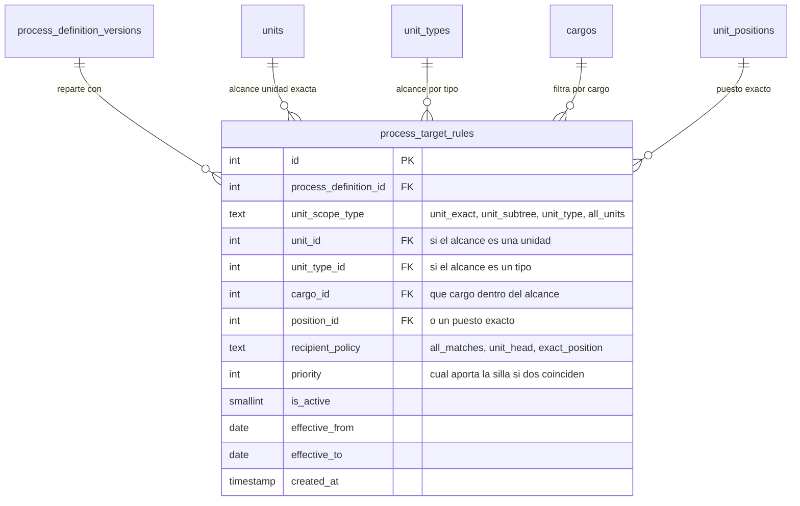

Una configuración por sí sola no sabe a quién dirigirse. Eso lo dicen las **reglas de reparto**
(`process_target_rules`), y son la pieza que convierte «este proceso existe» en «a estas cuarenta
personas les va a tocar».

## Dos preguntas, dos columnas

Cada regla responde dos preguntas **por separado**, y esta separación es la que le da toda su potencia.
Las dos columnas están cerradas por `CHECK`:

| Pregunta | Columna | Valores admitidos |
|---|---|---|
| **¿Hasta dónde llega?** | `unit_scope_type` | `unit_exact` · `unit_subtree` · `unit_type` · `all_units` |
| **¿A quién de ahí dentro?** | `recipient_policy` | `all_matches` · `unit_head` · `exact_position` |

Combinando las dos se expresa casi cualquier cosa. *«A los coordinadores de todas las carreras»* es
alcance `unit_type` (Carrera) más política `all_matches` filtrando por el cargo Coordinador. *«Al
decano de esta facultad»* es alcance `unit_exact` más política `unit_head`.

Tres detalles de la resolución que no se ven en la declaración:

- **`unit_subtree` baja solo por la relación orgánica.** El recorrido recursivo filtra
  `relation_unit_types.code = 'org'`; los otros tipos de relación no cuentan como «lo que cuelga de».
- **`unit_head` no inventa sustituto.** Si una unidad del alcance no tiene jefatura marcada, esa unidad
  se queda fuera de la regla. Elegir «el primero de la lista» es exactamente el fallo que esa decisión
  vino a cerrar.
- **`exact_position` se queda con una sola fila**, la del `position_id` declarado. Si la política es
  `exact_position` y no hay `position_id`, la regla no alcanza a nadie.

Una configuración puede tener varias reglas. Llevan **prioridad** (`priority`) y **vigencia propia**
(`effective_from` / `effective_to`), así que una regla puede entrar o salir sin tocar la configuración
entera. En el disparo solo se leen las reglas con `is_active = 1` cuya vigencia se solape con el
periodo.

:::caution[La prioridad desempata sillas, no personas]

El lanzamiento recorre las reglas ordenadas por `priority ASC, id ASC` y va acumulando puestos
**deduplicados por `position_id`**: si dos reglas alcanzan la misma silla, la que la aporta es la de
prioridad más baja en número, y la segunda no vuelve a añadirla. El desempate es por puesto, no por
persona — el borrador de este artículo decía «cuando dos alcanzan a la misma persona», y no es así:
una persona con dos sillas alcanzadas recibe **dos** entregables.

:::

## El resultado de una regla son sillas, no personas

Una regla se resuelve a una lista de **puestos** (`unit_positions` activos, en unidades activas).
Quién esté sentado en cada uno se mira en ese momento, y se mira con un `LEFT JOIN` contra
`position_assignments`: **un puesto vacío sigue siendo un destino válido**.

Conviene ser exacto sobre qué pasa en cada caso, porque el borrador de este artículo lo resumía de una
forma que hoy no se sostiene:

| Situación | Qué ocurre al lanzar |
|---|---|
| Ninguna regla alcanza ningún puesto | El lanzamiento termina con `no_assignees` y **no crea ni tarea ni entregable** |
| La regla alcanza un puesto **ocupado** | Se crea el entregable con `responsible_position_id` y `assigned_person_id` |
| La regla alcanza un puesto **vacío** | Se crea igual, anclado al puesto, con `assigned_person_id` en `NULL` — y su primer turno en `task_item_tenures` nace **sin persona**, que es como se representa el abandono |

:::note[Lo que sí desapareció: el entregable sin puesto]

Hasta el 2026-08-23 existía un camino de respaldo (`ensureTaskItemsForTask`) que, cuando la regla no
encontraba a nadie, creaba el entregable **sin puesto responsable**: nacía sin nadie que respondiera de
él, no aparecía en la lista de nadie, y ahí se quedaba — mientras la misma respuesta del lanzamiento ya
declaraba `has_assignees: false`. Ese respaldo se retiró, y con él `responsible_position_id` pasó a ser
`NOT NULL`. El aviso sigue saliendo, y es el que hay que atender: lo que falta es una regla de alcance
o un puesto ocupado, no un entregable huérfano.

:::

Un último recorte que conviene tener presente: en el disparo automático **solo las plantillas
vinculadas en modo `single` generan entregable**. Las de modo `replicated` y `routed` esperan a que una
persona las instancie.

## El diagrama

