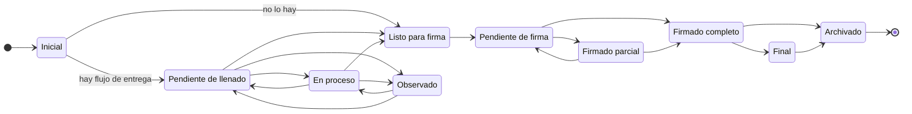

El sistema maneja varias listas de estados y **no todas están protegidas igual**. Esa diferencia es lo
primero que hay que tener claro, así que va explícita.

## Qué protege la base y qué no

| Qué describe | Columna | Valores | ¿`CHECK` en la base? |
|---|---|---|---|
| Configuración | `process_definition_versions.status` | `draft` · `active` · `retired` | **Sí** |
| Edición de plantilla | `template_artifacts.lifecycle_state` | `draft` · `published` · `retired` | **Sí** |
| Ámbito del entregable | `deliverables.template_scope` | `official` · `ad_hoc` | **Sí** |
| Corrida | `process_runs.status` | `pending` · `active` · `completed` · `cancelled` | **Sí** |
| Modo del vínculo | `process_definition_templates.item_mode` | `single` · `replicated` · `routed` | **Sí** |
| Origen del entregable | `task_items.origin_kind` | `process_defined` · `user_added` | **Sí** |
| Causa del turno | `task_item_tenures.opened_by` | `original` · `occupancy_start` · `occupancy_end` · `position_deactivated` · `reconcile` · `manual` | **Sí** |
| Cómo se encuentra a quien entrega o firma | `resolver_type` en los dos flujos | `task_assignee` · `cargo_in_scope` · `specific_person` | **Sí**, pero solo en la columna: el JSONB `signers` se salta esta protección |
| Ámbito del paso | `unit_scope_type` en los dos flujos | `unit_exact` · `unit_subtree` · `unit_type` · `all_units` · `context_exact` | **Sí** |
| Elección del paso de entrega | `fill_flow_steps.selection_mode` | `auto_one` · `auto_all` · `manual` | **Sí** |
| Elección del paso de firma | `signature_flow_steps.selection_mode` | los mismos, por convenio | **No.** Es la asimetría que delata la deuda |
| Instancia de entrega | `document_fill_flows.status` | `pending` · `in_progress` · `approved` · `rejected` · `cancelled` | **Sí** |
| Solicitud de entrega | `fill_requests.status` | los cinco anteriores más `returned` | **Sí** |
| Solicitud y resultado de firma | `signature_request_statuses` · `signature_statuses` | catálogos de 5 y 4 códigos | **Son tablas**, consultables y ampliables sin tocar el esquema |
| **Documento** | `task_items.document_status` | **11 valores** | **No.** Solo en el código |
| **Ronda** | `document_versions.status` | **12 valores** | **No.** Solo en el código |
| **Tarea** | `tasks.status` | `pendiente` · `en_proceso` · `completada` · `cancelada` | **No.** Una sola lista, en `config/sqlTables.js` |
| **Lote de firma** | `signature_batch_jobs.status` | por defecto `queued` | **No** |

Esas cuatro últimas son las que se siguen como `TD7-e`: **cuatro columnas de estado sin `CHECK`**, no
las ocho que se contaron en su día. La decisión pendiente es cuáles bajan su dominio a la base.

:::note[La tarea sí tiene vocabulario conocido, aunque la base no lo imponga]

Conviene no exagerar el caso de `tasks.status`. Su lista existe, es **una sola** y está **escrita una
sola vez**: `backend/config/sqlTables.js:266` la declara como las `options` del `select` del editor
genérico, con `pendiente` de valor por defecto. Lo que falta no es unificarla — es **bajarla al
esquema**, donde la columna es un `VARCHAR(30)` sin `CHECK`.

El frontend no la repite: `shared/utils/estadoTono.js` tiene un mapa de **presentación** —qué tono y
qué etiqueta en castellano le toca a cada código—, no una segunda declaración del dominio. Y lo pinza
un test (`estadoTono.test.js:177`), así que si la lista cambiara en el backend y no allí, salta.

Y lo peligroso de esta zona ya está cerrado: hasta el 2026-08-23 había además una
`task_items.status` con **cero escritores** —se quedaba en `pendiente` para siempre— que siete sitios
leían con dos vocabularios que no compartían ni un literal. El filtro del relevo **no excluía nada**,
así que todo entregable era reasignable para siempre, firmado incluido. Se retiró, y lo pendiente se
lee ahora del documento.

De ese retiro **queda un fósil**: `estadoTono.js:504` sigue registrando `"task_items.status"` en el
mapa de columnas, y `estadoTono.test.js:178` lo pinza. Es inofensivo —esa columna ya no llega nunca
del backend, así que la entrada no se consulta— pero es exactamente el tipo de resto que conviene
barrer al pasar por esta tabla.

:::

## Dos vocabularios, y uno se deriva del otro

La ronda y el documento **no comparten lista**, y confundirlos es el error fácil porque nueve de sus
valores se llaman igual. La ronda es la más detallada; el documento es su proyección:

| Estado de la ronda (`document_versions.status`) | Estado del documento (`task_items.document_status`) |
|---|---|
| `Borrador` | `Inicial` |
| `Pendiente de llenado` | `Pendiente de llenado` |
| `En llenado` | `En proceso` |
| `En revisión de llenado` | `En proceso` |
| `Observado` | `Observado` |
| `Listo para firma` | `Listo para firma` |
| `Pendiente de firma` | `Pendiente de firma` |
| `Firmado parcial` | `Firmado parcial` |
| `Firmado completo` | `Firmado completo` |
| `Final` | `Final` |
| `Archivado` | `Archivado` |
| `Cancelado` | `Cancelado` |

Doce arriba, once abajo: `En llenado` y `En revisión de llenado` colapsan en `En proceso`.

**La dirección importa**: quien avanza es la ronda. Al mover su estado se valida la transición contra
la matriz de la ronda, se escribe, y **acto seguido se deriva y se escribe el del documento**.
`task_items.document_status` no se escribe por su cuenta — se llama así, y no `status`, precisamente
para que no se confunda con la columna sin escritores que se retiró.

Los dos vocabularios normalizan dos valores heredados: `rechazado` se lee como `Observado` y
`aprobado` como `Final`.

## El recorrido del documento

Estos son los once estados del documento y el orden en que puede moverse. No es un adorno: es una
máquina de estados real, con transiciones permitidas y prohibidas, que hoy vive únicamente en el
código.

**`Archivado` es alcanzable desde todos los estados** salvo desde sí mismo y desde `Cancelado`.
**`Cancelado` casi**: es alcanzable desde todos menos desde `Firmado completo`, `Final` y `Archivado`
— un documento ya firmado del todo no se cancela, se archiva. Los dos se omiten del diagrama por no
llenarlo de flechas.

:::caution[Terminal no es «sin salida», y derivarlo salió mal]

Los estados terminales —donde ya no queda trabajo— son **`Final`, `Archivado` y `Cancelado`**, y la
lista es **explícita a propósito**. Se intentó derivarla del grafo como «estado del que no sale
ninguna transición», y eso da `Archivado` y `Cancelado` pero **deja fuera `Final`**, que sí tiene
salida hacia `Archivado` aunque el documento esté terminado. Con esa derivación, **todo documento
acabado habría seguido contando como pendiente**.

«Sin salidas» es una propiedad del grafo; «ya no hay trabajo» es una propiedad del negocio, y no
coinciden.

:::

## Dónde se corta el relevo automático

El traspaso automático de responsable alcanza hasta **`Listo para firma` inclusive**. En cuanto el
documento entra en `Pendiente de firma` deja de moverse solo: a partir de ahí hay gente convocada con
solicitudes abiertas a su nombre, y cambiarles el responsable por debajo es confuso. `Listo para
firma` todavía entra porque significa que el llenado terminó, no que se haya convocado a nadie.

Esa lista de cinco estados está escrita **en dos sitios a la vez** —en el código, como
`DOCUMENT_RELAYABLE_STATUSES`, y dentro de los triggers del esquema, porque el SQL no puede leer una
constante de JavaScript—. La duplicación no se vigila sola: la vigila una prueba unitaria que **lee el
fichero del esquema** y compara las dos listas.

Como en el caso anterior, tampoco se deriva: podría escribirse como «ni en fase de firma ni terminal»,
pero eso son dos propiedades del grafo y esto es una regla de negocio. El día que alguien añada un
estado nuevo tiene que decidir a mano de qué lado cae.
