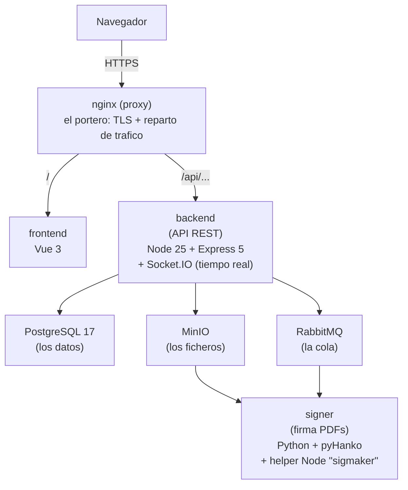
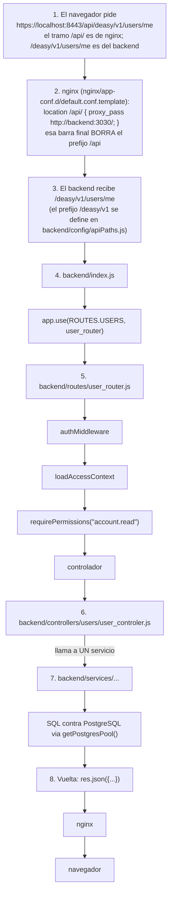

## Que es Deasy (el problema de negocio)

Antes de la arquitectura, el **para que**. Deasy es una plataforma de la **PUCE Sede Esmeraldas** para gestionar los **tramites documentales recurrentes** de la universidad: informes de gestion docente, requerimientos, informes de investigación formativa, memorandos, etc.

Hoy, sin Deasy, esos tramites viven en Word y PDF por correo: nadie sabe quien debe entregar que, en que periodo, ni quien falta por firmar. Deasy modela cuatro cosas:

| **Pregunta**        | **Como la modela**                                                                   |
|:--------------------|:-------------------------------------------------------------------------------------|
| ¿Quien?             | Organigrama: unidades → puestos → personas ocupandolos                               |
| ¿Que?               | Plantillas de documento, versionadas                                                 |
| ¿Cuando?            | Periodos academicos (`terms`)                                                        |
| ¿Con que recorrido? | Flujos de *entrega* (quien llena y revisa) y de *firma* (quien firma y en que orden) |

Y encima de todo eso, **firma electronica real** (PAdES, con certificados `.p12` de las autoridades certificadoras ecuatorianas: Security Data, ICERT y Firmasegura).

## Vista de pajaro: ocho piezas en contenedores

Todo el sistema esta **dockerizado**. No hay un “servidor” monolitico, sino ocho procesos que se hablan por red.

Traducción de cada pieza para alguien que empieza:

- **nginx**: el “portero” del edificio. Es lo único expuesto a internet. Termina el HTTPS (descifra) y, según la URL, manda la petición al frontend o al backend. También es lo que permite que el frontend llame a `/api/...` sin problemas de CORS.

- **frontend**: la aplicación web (Vue 3). En producción es HTML, JS y CSS estático servido por un nginx pequenito dentro de su propia imagen.

- **backend**: la API. Recibe peticiones HTTP, decide que se puede hacer, guarda en PostgreSQL, sube ficheros a MinIO y encola trabajos de firma en RabbitMQ.

- **PostgreSQL**: la base de datos relacional. **Es el único motor de datos**: MariaDB y MongoDB fueron retirados. Veras comentarios “ex-MongoDB” en el código; son cicatrices de esa migración.

- **MinIO**: almacenamiento de objetos compatible con S3. Los PDFs, plantillas, fotos de perfil y certificados **no** se guardan en la base de datos ni en el disco del backend: van aquí, en *buckets* (contenedores de primer nivel).

- **RabbitMQ**: una cola de mensajes. Sirve para que el backend le pida al signer “firma este PDF” **sin quedarse bloqueado** esperando.

- **signer**: microservicio Python que hace la firma criptografica real.

- **analytics**: hoy es un marcador de posición (`CMD ["sleep","infinity"]`), no hace nada.

:::tip[Por que esa separación importa]

Si la firma se hiciera dentro del backend, un PDF de 200 páginas bloquearia el servidor para todos los usuarios mientras se procesa. Al ponerlo detras de una cola, el backend delega el trabajo pesado y sigue atendiendo peticiones normalmente.

:::

## El recorrido completo de una petición

Esto es lo que mas ayuda a orientarse en un repositorio nuevo. Sigue una petición desde el clic del usuario hasta la respuesta:

Ese es el noventa por ciento del sistema. Todo lo demas son variaciones sobre este mismo esqueleto.
