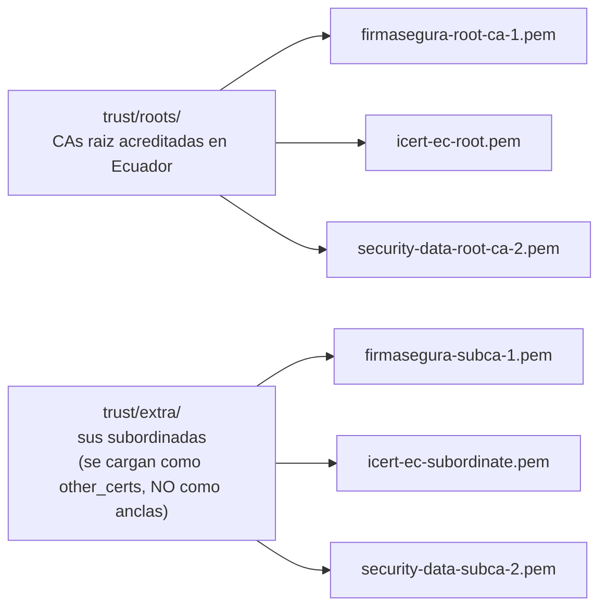

Es la pieza mas especializada del sistema: Python 3.14 mas **pyHanko**, la biblioteca de firma de PDF.

## Arquitectura interna

`signer/app.py` (1.545 líneas) arranca **dos cosas a la vez**:

``` python
rabbit_thread = threading.Thread(target=start_rabbit_worker, daemon=True)
rabbit_thread.start()      # <- el camino REAL de produccion
start_http_server()        # <- solo para depurar (POST /sign, /validate, GET /health)
```

El worker de RabbitMQ escucha dos colas (`deasy.sign.request` y `deasy.sign.validate.request`) con `prefetch_count=1`: **un trabajo a la vez**, para no saturar la memoria con PDFs grandes. Ante cualquier excepción, registra el error, duerme 5 segundos y reintenta la conexion en un bucle infinito.

Un detalle de higiene: la URL de conexion pasa por `redact_amqp_url()` antes de aparecer en los logs, sustituyendo la contrasena por asteriscos.

## El flujo completo de una firma, paso a paso

1.  El frontend llama a `/api/deasy/v1/sign/...`

2.  El backend genera un `correlationId`, crea la cola de respuesta `deasy.sign.response.<uuid>`, pública el trabajo y entra en polling.

3.  El signer recibe el mensaje y **válida el payload**: exige `signType`, `minioPdfPath`, `stampText`, `finalPath`, `minioCertPath` y `certPassword`; `signType` debe ser `coordinates` o `token`.

4.  Crea un directorio temporal con permisos `0700` **fuera de `/tmp`** — porque ahi se desempaqueta el certificado `.p12` descifrado.

5.  Descarga de MinIO el PDF y el certificado.

6.  Abre el `.p12` y **rechaza el trabajo si el certificado esta expirado o aun no es válido**, con mensajes explícitos en espanol.

7.  Si el PDF **ya tiene firmas embebidas**, salta el paso de limpieza con Ghostscript — aplanarlo destruiria las firmas existentes.

8.  Resuelve donde firmar: coordenadas explícitas, o busca un **token de texto** dentro del PDF con `pdfplumber` (`find_marker.py` recorre las palabras de cada página y devuelve sus posiciones).

9.  **Llama a Node** para generar la imagen del sello (ver sección siguiente).

10. Por cada coordenada, pyHanko crea un campo `sig_<uuid>` e inserta la firma: PAdES, SHA-256, con sellado de tiempo opcional. Con varias firmas, **cada iteración parte del PDF firmado anterior** (firmas encadenadas).

11. Válida la firma resultante contra el contexto de confianza construido desde `signer/trust/`, y aborta salvo tolerancia explícita en el payload.

12. Sube el PDF firmado a MinIO, reemplazando `minioPdfPath`, y también a `finalPath` si es distinto.

13. Pública el resultado en la cola de respuesta; el backend, que estaba haciendo polling, lo recoge.

14. Al salir del bloque `with`, **todo el material temporal se borra**, incluido el `.p12`.

## `sigmaker/`: por que hay Node dentro de un servicio Python

Porque la imagen del sello (QR + nombre del firmante + logo de la PUCE + fecha) se genera con las bibliotecas `canvas` y `qrcode` de Node, mejores para eso que las alternativas de Python. Python lo invoca como subproceso:

``` python
subprocess.run(["node", SIGMAKER_DIR + "/cli.mjs",
                stamp_png, stamp_text, final_path, logo_path], check=True)
```

El QR codifica **la URL pública del documento firmado**, para que quien reciba el PDF impreso pueda verificarlo escaneandolo. La fecha se calcula en la zona horaria `America/Guayaquil` y el PNG se escribe con fondo transparente.

Por eso el `docker/signer/Dockerfile` instala `nodejs` y `npm` dentro de una imagen Python, y hace un `npm install` separado en `/opt/sigmaker`.

## `trust/`: la cadena de confianza



El contexto de validación se construye con `allow_fetching=True` y `revocation_mode="soft-fail"`.

:::tip[Por que “raiz” y “subordinada” van en sitios distintos]

Una *ancla de confianza* (trust anchor) es un certificado que decides creer sin demostración: es el final de la cadena. Las subordinadas, en cambio, son eslabones intermedios: hay que *poder verificarlas* contra una raiz, no confiar en ellas por decreto. Si metieras una subordinada como ancla, aceptarias como válida una cadena que en realidad no llega a ninguna raiz acreditada.

:::

## Los OIDs ecuatorianos: 500 líneas de `app.py`

Casi un tercio del fichero esta dedicado a **extraer la cédula y el nombre del firmante** de los certificados, porque **cada emisor ecuatoriano usa OIDs propietarios distintos**:

| **Emisor**    | **Prefijo de OID**        |
|:--------------|:--------------------------|
| Security Data | `1.3.6.1.4.1.37746.3.*`   |
| ICERT         | `1.3.6.1.4.1.43745.1.3.*` |
| Firmasegura   | `1.3.6.1.4.1.61305.3.*`   |

No hay estandar comun: hay que conocer los tres. Además se leen por **dos vias distintas** (`cryptography` y `asn1crypto` sobre el TBS crudo) porque ninguna cubre todos los casos.

## Pruebas del signer

Todas en `signer/tests/`, con `unittest` de la biblioteca estandar (no hay pytest en la imagen). **266 métodos `test_`** repartidos en nueve ficheros:

| **Fichero**                      | **Casos** | **Que fija**                                              |
|:---------------------------------|:----------|:----------------------------------------------------------|
| `test_certificate_parsing.py`    | 72        | DN, extensiones, cédula: quien firmo                      |
| `test_signing_flow.py`           | 36        | Caja del sello, offset del modo token, firmas encadenadas |
| `test_payload_validation.py`     | 34        | Orden de guards y mensajes de error                       |
| `test_pdf_metadata.py`           | 33        | Lectura del diccionario `/Sig`, fechas                    |
| `test_transport.py`              | 24        | Servidor HTTP y publicación por RabbitMQ                  |
| `test_validation_report.py`      | 21        | Forma exacta del informe que consume el frontend          |
| `test_plumbing.py`               | 20        | MinIO, material de confianza, Ghostscript, temporales     |
| `test_certificate_extensions.py` | 17        | Las dos fuentes de extensiones, con certificados reales   |
| `test_certificate_loading.py`    | 9         | Carga del PKCS#12 y guards de vigencia                    |

Como apoyo hay `tests/dobles.py` (objetos “pato” que solo exponen lo que `app.py` consulta) y `tests/herramientas.py`, que **no son pruebas**: miden complejidad ciclomatica y anidamiento vía AST.

:::note[Los conteos no cuadran entre si]

`signer/README.md` dice 224 casos, `requirements-dev.txt` y `sonar-project.properties` dicen 229, y el conteo real hoy es 266. Los documentos van por detras del código.

:::
