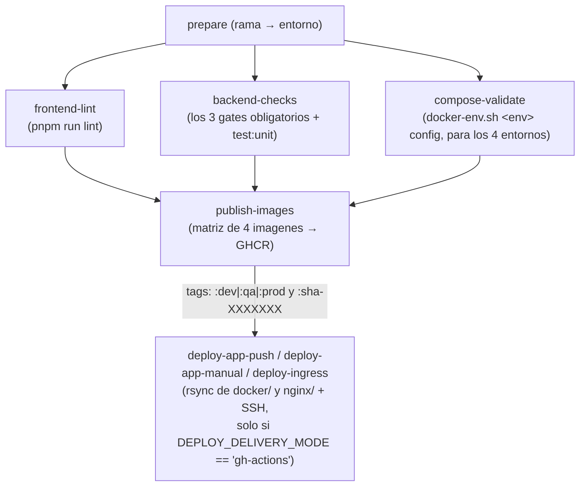

### `cd-multienv.yml`: ocho jobs

Mapeo de ramas: `develop` → dev (pública imagenes, **no despliega**); `qa` → qa; `main` → prod. El trabajo se hace en `develop`; `main` es la rama de producción.

El `rsync` solo sube `docker/`, `nginx/` (excluyendo `certs/`) y cuatro scripts. El fichero de variables reales llega como secreto de GitHub y se vuelca en `docker/.env.<env>.runtime` en el servidor.

### Las tres puertas del backend

El backend **no tiene lint**, pero `CLAUDE.md` declara tres comprobaciones **obligatorias**, y desde
el **2026-08-26** las tres corren en el job `backend-checks` —en `push` y en `pull_request` a
`develop`, `qa` y `main`, así que bloquean—. Antes solo corría la primera.

| Gate | Qué rotura caza |
|---|---|
| `check:imports` | Un símbolo movido sin su `import`. `node --check` **no lo ve** —es sintaxis válida— y el módulo carga; revienta en tiempo de llamada. Así estuvieron rotos tres semanas cuatro `ReferenceError` |
| `check:sql-comments` | Un backtick dentro de un comentario `--` de SQL. El SQL vive en plantillas de JavaScript, así que el backtick **cierra la plantilla**: con suerte lo caza `node --check` señalando la línea equivocada; sin suerte el fichero compila y el SQL sale **truncado en ejecución** |
| `check:sql-aliases` | Un alias cuyo `JOIN` ya no está. `ti.id` huérfano es sintaxis perfecta para todos menos para PostgreSQL, que responde `missing FROM-clause entry` **en tiempo de llamada** |

⚠️ **Las tres comparten la propiedad que las hace imprescindibles: ninguna de las roturas que
detectan impide arrancar el backend.** El SQL es una cadena de texto hasta que se ejecuta esa rama
concreta. Sin estas puertas, la señal llega en producción — y llegó: cuatro `UPDATE … INNER JOIN …
SET` (sintaxis de MySQL que PostgreSQL rechaza) dejaron `POST /sign/fill-requests/:id/return` roto
**para todo el mundo durante meses**.

Los dos de SQL están **a techo cero**: `check:sql-aliases` mira 442 consultas en 200 ficheros.

### Dos modos de entrega

- **Push**: GitHub Actions entra por SSH y despliega.

- **Pull**: unidades systemd en el servidor (`deploy/systemd/deasy-server-pull@.timer`) que cada **15 minutos** hacen `git pull` y redespliegan (`OnBootSec=5m`, `OnUnitActiveSec=15m`, `Persistent=true`).

El segundo modo existe para servidores **sin IP pública estable**, donde GitHub no puede iniciar la conexion.

### Los dos workflows de documentación

Hay **cuatro** workflows, no dos. Los otros dos vigilan la documentación, que hasta el 2026-08-11
era la única capa del repositorio **sin ninguna puerta**:

| Workflow | Qué bloquea |
|---|---|
| `docs-dbml.yml` | Regenera el DBML y los ocho diagramas desde el esquema y falla si hay deriva (`gen-dbml.sh --check`). Es lo que impide que `postgres_schema.sql` y el modelo publicado se separen |
| `docs-links.yml` | Tres jobs: enlaces a **ficheros** del repo con lychee `--offline`; enlaces a **rutas de página** del sitio con `check-enlaces-internos.mjs`; y las URLs externas, semanal y sin bloquear |

⚠️ Los dos son necesarios porque miran cosas distintas y **ninguno cubre lo del otro**: lychee
excluye `docs/src/**` a propósito —sus enlaces son rutas, no ficheros— y el build de Astro solo
valida los `slug` del `sidebar`, así que un enlace a una ruta que no existe construye **en verde**.

### `sonar.yml`: solo manual, y en verde si falta configuración

Se dispara solo con `workflow_dispatch`. Un primer paso *guard* comprueba si existen los secretos `SONAR_HOST_URL` y `SONAR_TOKEN`; si faltan, escribe una explicación en el resumen del workflow y **termina en verde**.

:::note[La razon documentada]

El SonarQube del proyecto esta autoalojado en `localhost:9002` y **un runner de GitHub no puede alcanzarlo**. Poner el análisis en el workflow de push lo dejaria en rojo para siempre, lo que entrena a todo el mundo a ignorar los fallos de CI. Sonar en CI esta pendiente de una decisión de infraestructura (publicarlo con TLS o migrar a SonarCloud), no de código.

:::

## SonarQube: como esta montado

| **Pieza** | **Donde**                                                                                                                                    |
|:----------|:---------------------------------------------------------------------------------------------------------------------------------------------|
| Stack     | `scripts/sonar/compose.yml` — SonarQube *community* + PostgreSQL 16, puerto **9002**                                                         |
| Lanzador  | `scripts/sonar/scan.sh` — `sonar-scanner-cli` dockerizado                                                                                    |
| Config    | `sonar-project.properties` — `projectKey=deasy`; fuentes `backend`, `frontend/src`, `signer`, `scripts`, con los tests **declarados aparte** |
| CI        | `.github/workflows/sonar.yml`                                                                                                                |

:::caution[Cuatro cosas que cuestan una medición entera]

1.  **Regenera los DOS informes de cobertura antes de escanear.** Si no, Sonar lee los de la corrida anterior **sin quejarse**. Y si las rutas `SF:` del lcov no son relativas a la raiz del repo, los descarta **en silencio** y la cobertura vuelve a cero.

2.  **Al consultar la API, filtra con `resolved=false`.** Por defecto incluye las cerradas y las *won’t fix*, y los conteos salen inflados.

3.  **El escaneo se procesa después de subirse.** Consultar metricas justo al terminar devuelve las viejas: espera a que la tarea diga `SUCCESS`.

4.  **No toques `sonar.projectVersion`.** Mueve el periodo de New Code y tira la serie histórica, que es el único termometro fiable que hay.

:::

:::note[Marcar no es arreglar]

Los falsos positivos se marcan en Sonar con justificación; hay varios que **no** hay que “corregir”. Sonar rastrea la incidencia por el **hash de la línea**: un renombrado puro conserva la marca, pero reescribir la línea la pierde.

:::
