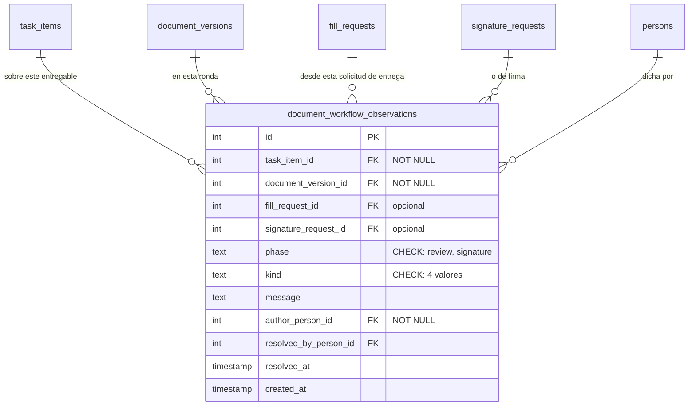

Cuando todos los pasos de firma se completan, ocurren **tres cosas en cadena**, y la primera sorprende
por lo literal que es:

1. La ronda llega a **`Firmado completo`**.
2. Se sella el archivo final: `final_file_path = working_file_path`. No se produce un archivo nuevo —
   se congela el puntero al que había.
3. La ronda pasa a **`Final`**, y de ahí el entregable deriva su propio estado terminal:
   `task_items.document_status` se escribe a partir del estado de la ronda, no aparte.

Esa derivación es la regla general del sistema y está explicada en
[Los vocabularios de estado](/modelo/vocabularios-de-estado): **el estado del documento no
se escribe a mano, se deriva del de la ronda**.

## Lo que se dijo por el camino

Un documento rara vez llega derecho. Por el camino se dicen cosas: una observación de quien revisa, el
motivo por el que se devolvió, el motivo del rechazo, una nota interna. Todo eso vive en una sola
tabla, `document_workflow_observations`, y está bien pensada por tres motivos:

- Guarda **en qué fase** se dijo, en `phase`, cerrado por `CHECK`: `review` o `signature`.
- Guarda **de qué solicitud concreta** salió — `fill_request_id` o `signature_request_id`, ambos
  opcionales, porque no toda observación nace de una solicitud.
- Guarda **si se resolvió**, quién y cuándo (`resolved_by_person_id`, `resolved_at`). Una observación
  no es solo un comentario: es algo que hay que cerrar.

El `kind` también está cerrado por `CHECK`: `observation`, `return_reason`, `rejection_reason` e
`internal_note`. Y el anclaje es doble y obligatorio: toda observación apunta a la vez al entregable
(`task_item_id`) y a la ronda (`document_version_id`), las dos columnas `NOT NULL`.

:::note[No existe un campo «Para:», y tampoco se deriva uno]

No hay campo de destinatario, y es deliberado: un «Para:» escrito a mano podría contradecir a quien
realmente firma. `target_person_id` existió hasta el 2026-08-23 y se retiró — medido antes de
borrarlo: **2 observaciones, cero con destinatario**, el frontend no lo pintaba en ningún sitio, y
salía del cuerpo de la petición **sin validar**, así que como fuente de acceso habría sido una vía de
escalada: dar permiso nombrando a alguien.

Lo que sí garantiza que el dato existe es que **un envío sin flujo se rechaza** con un 400: los modos
`routed` y libre lo exigen.

Se llegó a planificar *derivar* el destinatario en el servidor —«es a quien va dirigido el último paso
de firma»— y **se descartó por decisión del dueño**: habría reconstruido en el servidor un dato que la
pantalla deja de enseñar. Lo que se ve es el flujo, no un destinatario.

:::

