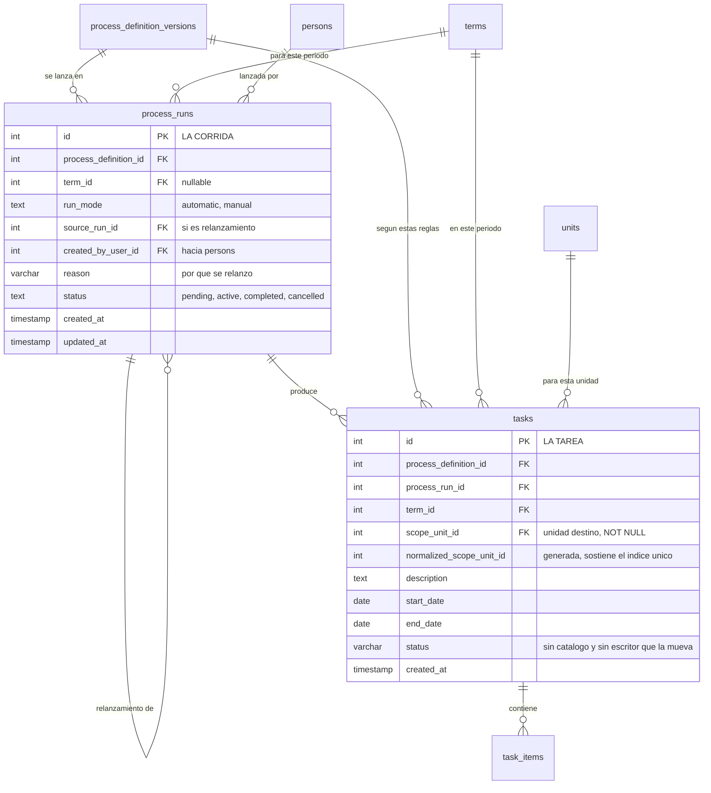

Hasta aquí no ha pasado nada: todo lo anterior son reglas esperando. El disparo es el instante en que
el sistema toma una configuración activa, la cruza con un periodo, aplica sus reglas de reparto y
**materializa trabajo con nombre y apellido**.

Produce tres cosas encadenadas:

- Una **corrida** (`process_runs`) — el acto de lanzamiento. Guarda quién lo lanzó
  (`created_by_user_id`, hacia `persons`), si fue automático o a mano (`run_mode`), por qué
  (`reason`) y si viene de relanzar otra corrida anterior (`source_run_id`).
- Una **tarea** (`tasks`) por cada unidad alcanzada — «esta configuración, en este periodo, para esta
  unidad». La tarea es el sobre; todavía no es el documento.
- Un **entregable concreto** (`task_items`) por cada vínculo en modo `single` y por cada puesto que
  deba producirlo.

## La idempotencia, que es lo que evita duplicar el trabajo de media universidad

El disparo es idempotente en los tres niveles, y cada uno lo consigue de una manera distinta:

| Nivel | Qué lo protege | Dónde |
|---|---|---|
| Corrida | se reutiliza la corrida `active` de (configuración, periodo) si ya existe | `ensureProcessRun()`, en código |
| Tarea | índice único `uq_tasks_definition_term_scope (process_definition_id, term_id, normalized_scope_unit_id)` | en la base |
| Entregable | índice único `uq_task_items_defined_target (task_id, process_definition_template_key, responsible_position_key)` | en la base |

`normalized_scope_unit_id` es una columna **generada** (`COALESCE(scope_unit_id, 0)`) que existe solo
para que ese índice funcione. Hoy es casi redundante: `scope_unit_id` pasó a `NOT NULL` el
2026-08-23, porque los dos escritores de tareas —el lanzamiento y la tarea ad hoc— la rellenan
siempre.

:::note[Relanzar no repite: crea una corrida nueva]

Cuando el lanzamiento se pide con relanzamiento y ya hay una corrida activa para esa configuración y
ese periodo, pasan tres cosas en orden: la corrida vieja se marca `completed`, se abre una nueva con
`source_run_id` apuntando a la anterior, y **las tareas existentes se repuntan a la corrida nueva**
(`UPDATE tasks SET process_run_id = …`). Es decir, se conserva el trabajo y se distingue la segunda
vuelta de la primera; no se duplican tareas.

:::

## Sin puestos no hay entregable

Si las reglas de alcance no encuentran ningún puesto para una configuración, el lanzamiento devuelve
`no_assignees` y **no crea nada**. Es un cambio de comportamiento del 2026-08-23: antes existía un
respaldo (`ensureTaskItemsForTask`) que creaba el entregable igual, sin puesto responsable, de modo
que nacía sin nadie que respondiera de él —y en la misma respuesta el lanzamiento ya declaraba
`has_assignees: false`—. Ese respaldo se retiró, y con él `task_items.responsible_position_id` pudo
pasar a `NOT NULL`.

El aviso sigue saliendo igual, y es el que hay que atender: si un proceso no encuentra a quién
dirigirse, lo que falta es una regla de alcance o un puesto ocupado, no un entregable huérfano.

## Lo que `tasks` dejó de guardar

Tres columnas murieron el 2026-08-23 y conviene saberlo porque aparecen en documentación antigua:

- `created_by_user_id` — estaba vacía en 12 de 13 tareas: el lanzamiento automático no la rellenaba,
  y quien lanza una corrida ya consta en `process_runs`. En la tarea ad hoc el dato vive más fino, en
  `task_items.created_by_person_id`.
- `responsible_position_id` — no era un responsable: el lanzamiento la ponía como el puesto de menor
  `slot_no` de la unidad, determinista pero arbitrario, y sus lecturas se unían con `unit_positions`
  solo **para sacar la unidad**, que ya estaba al lado en `scope_unit_id`. El responsable de verdad
  vive en `task_items.responsible_position_id`, uno por entregable.
- `comments_thread_ref` — fósil sin lecturas ni escrituras; los comentarios viven en
  `document_workflow_observations`.

:::caution[`tasks.status` existe, pero no avanza]

Es `VARCHAR(30) NOT NULL DEFAULT 'pendiente'` y **no tiene catálogo declarado en la base**: ningún
`CHECK` la cubre. Sus dos escritores —el lanzamiento y la tarea ad hoc— la insertan literalmente como
`'pendiente'`, y **no hay un solo `UPDATE` en el backend que la mueva**. Lo que de verdad avanza es
el estado del documento, en `task_items.document_status`.

Es exactamente el mismo diagnóstico que retiró `task_items.status`. Si vas a apoyarte en el estado de
algo, apóyate en el del documento.

:::

