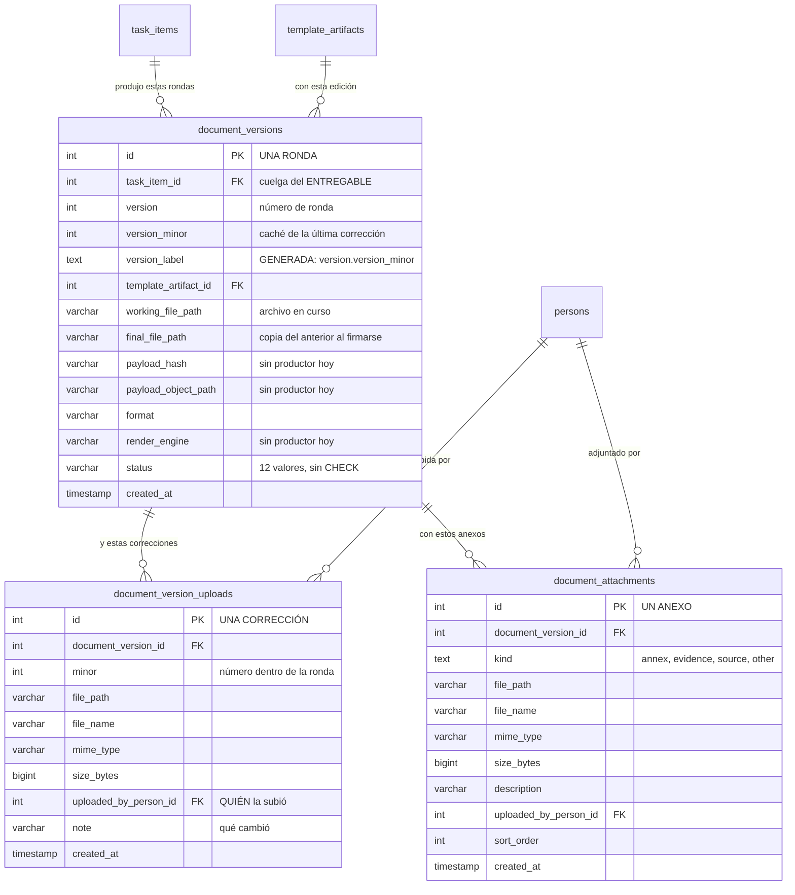

Aquí aparece lo que se produce de verdad. Y tiene **dos niveles**, porque «versión» significaba dos
cosas distintas y mezclarlas costaba caro.

Una **ronda** es un intento completo del ciclo: rellenar y firmar. Si el documento sale observado y
hay que rehacerlo desde el principio, empieza la ronda 2. Es un entero, y está en
`document_versions.version`.

Una **corrección** es cada vez que se sube el archivo dentro de la misma ronda. Vive en
`document_version_uploads`, se numera dentro de la ronda (`minor`) y guarda su archivo, su tamaño,
su tipo y —esto es lo importante— **quién la subió** (`uploaded_by_person_id`).

Juntas dan una etiqueta legible, `2.3`, y esa etiqueta **la calcula la base sola**:
`version_label` es una columna generada (`version::text || '.' || version_minor::text`). Nadie la
escribe, y es de tipo texto a propósito, porque `1.10` tiene que poder existir y como número sería
`1.1`.

:::note[Por qué el número era un entero disfrazado de decimal]

`version` fue `DECIMAL(4,1)` hasta el 2026-08-23, y el número **mentía**: la `0.1` y la `0.2`
parecían dos correcciones del mismo documento y eran **dos rondas completas** — la primera cancelada
entera y la segunda empezando de cero. Además el decimal daba para **un solo dígito**: a la décima
corrección chocabas contra el `2.0`, que significa otra cosa.

Hoy cada dígito dice lo suyo: `1 → 2` es una ronda nueva con su llenado y su firma; `1.0 → 1.1` es
una corrección del archivo dentro de la misma ronda.

:::

## Cuelga del entregable, no de un documento

`document_versions.task_item_id` apunta **directamente al entregable**. Hasta el 2026-08-23 había una
tabla `documents` en medio, en relación 1:1 estricta con `task_items` —un solo `INSERT` en todo el
backend, siempre con `task_item_id`— y **sin una sola columna propia**: las suyas eran copias,
derivadas o fósiles. Era un salto de mesa que no aportaba ningún hecho, y desapareció.

Un índice único, `uq_document_versions` sobre `(task_item_id, version)`, impide que un entregable
tenga dos veces la misma ronda.

## Cómo nace una ronda, y con qué

La ronda 1 se crea con **cuatro columnas** y nada más: el entregable, el número `1`, la edición de
plantilla y el estado `Borrador`. Todo lo demás —las rutas de archivo, el formato, la huella— nace
`NULL` y se va llenando (o no) por el camino.

## Los tres caminos que puede tomar un archivo

Una ronda declara tres rutas distintas, y conviene saber cuál está viva:

| Columna | Qué es | Quién la escribe |
|---|---|---|
| `working_file_path` | **El archivo de trabajo**, el que se está editando ahora. Es la raíz del entregable; debajo cuelgan las carpetas numeradas de cada ronda y, dentro, las de cada corrección | La subida del archivo |
| `final_file_path` | **El archivo final**, firmado y cerrado | Un solo sitio, y no es un archivo nuevo: al completarse la firma se copia literalmente `final_file_path = working_file_path` |
| `payload_object_path` · `payload_hash` | **Los datos** del formulario y su huella, para detectar si cambiaron | **Nadie, hoy** |

:::caution[Las columnas de datos están declaradas, pero no las llena nadie]

`payload_object_path`, `payload_hash` y `render_engine` **no tienen productor**. Los dos escritores
de la tabla son el lanzamiento —que no las lista en su `INSERT`— y el reinicio de flujo, que se
limita a copiar el valor de la ronda anterior. Resultado: nacen `NULL` y se copia el `NULL` de ronda
en ronda. Medido sobre una base recién sembrada para `payload_object_path` y `render_engine`: **0 de
3 filas con valor**.

No se retiran porque son **superficie publicada** —están expuestas en el CRUD genérico y sus nombres
aparecen en tres goldens—, así que soltarlas es un cambio de contrato, no una limpieza. Y en el caso
de `render_engine` puede que lo que falte no sea una retirada, sino su primer productor.

:::

## Los anexos

Aparte del documento en sí, una ronda puede llevar **anexos** (`document_attachments`): evidencias,
fuentes, otros documentos de apoyo. Cada uno con su tipo —`annex`, `evidence`, `source` u `other`,
cerrados por `CHECK`—, su `sort_order` y quién lo subió.

:::note[La asimetría que motivó partir la versión en dos]

Los anexos **siempre** registraron `uploaded_by_person_id`. El documento principal **no lo hacía**:
se sabía quién adjuntó la evidencia pero no quién había producido el informe.

El matiz importa: en el almacenamiento no se perdía nada —el nombre del objeto lleva sello de tiempo
y UUID, así que cada subida escribe un objeto nuevo—; lo que se perdía era **el puntero**.
`working_file_path` guarda el archivo vigente y se sobrescribe en cada subida, de modo que los
ficheros anteriores quedaban huérfanos, no borrados.

Se descartó guardar el historial como JSON dentro de `document_versions`, y no por motivos teóricos:
este repositorio ya tiene un JSONB de ese tipo —`signature_flow_steps.signers`— y es un agujero
abierto y documentado. Ver [El flujo de firma](/modelo/flujo-de-firma).

:::

El estado de la ronda tiene **su propio vocabulario**, distinto del estado del documento, y el
segundo se deriva del primero. Está en
[Los vocabularios de estado](/modelo/vocabularios-de-estado).
