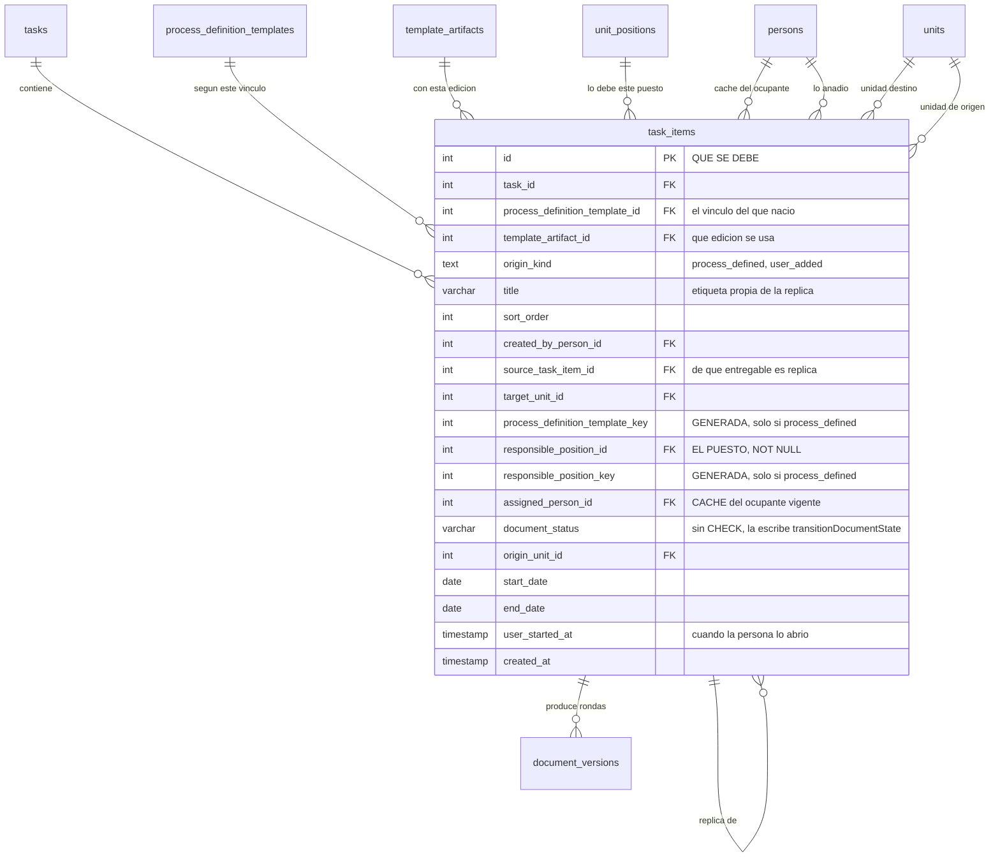

Esta es la tabla central del sistema (`task_items`), y también la que más cambió en agosto de 2026.
Un **entregable concreto** responde a la pregunta *«qué documento se debe»*, y su identidad son tres
cosas juntas: **qué tarea, qué vínculo de plantilla, y qué puesto lo produce**.

Esa tercera pata —el puesto responsable— es obligatoria (`responsible_position_id INT NOT NULL`) y es
el ancla de todo lo demás. Es lo durable: un puesto sobrevive a quien lo ocupa, y es el punto por el
que enganchan los cuatro caminos de relevo. **No puede haber un entregable sin puesto responsable**;
si al disparar el proceso no hay a quién dirigirse, el entregable sencillamente no se crea.

:::note[El «Para:» no existe]

`target_position_id` y `target_person_id` vivieron aquí hasta el 2026-08-23. Eran el destinatario —a
quién iba **dirigido** el documento— y no hay que confundirlos con quien lo **produce**: son receptor
y emisor, no dos nombres del mismo dato.

Se retiraron porque el destinatario es derivable: quien firma al final es a quien va dirigido, y un
envío **exige** su flujo, así que ese dato siempre está. Guardarlo aparte era mantener a mano un
resumen del flujo que además podía mentir: el cliente lo calculaba como «el primer firmante», así que
con dos pasos nombraba al aprobador intermedio.

:::

## De dónde puede venir un entregable

Un entregable nace de una de dos formas, y lo dice `origin_kind`, que tiene `CHECK` con dos valores:

- **`process_defined`** — lo creó el disparo, a partir de un vínculo en modo `single`. Es el valor por
  defecto.
- **`user_added`** — lo añadió una persona: una réplica en modo `replicated`, o una tarea suelta en
  modo `routed`. Guarda quién lo añadió (`created_by_person_id`) y, si es una copia, de cuál desciende
  (`source_task_item_id`).

## Tres campos que hay que leer con cuidado

### `assigned_person_id` es una caché, no el dato

Dice quién es hoy el responsable, pero **su único escritor es el trigger
`trg_task_item_tenures_sync`**, que la deriva de la tenencia abierta (la página siguiente). En el
editor genérico es de solo lectura: para cambiar de responsable existe el traspaso, no un `UPDATE`.

No se retiró la columna porque tiene decenas de referencias y está en los dos caminos calientes —el
motor de acceso y el panel—, donde metería un `JOIN`. Lo que se retiró es la posibilidad de que se
desincronice: antes la escribían cuatro sitios.

### `document_status` es el estado que sí avanza

`VARCHAR(30) NOT NULL DEFAULT 'Inicial'`. Se llama así y no `status` **a propósito**:
`task_items.status` vivió aquí hasta el 2026-08-23 y se retiró por no tener escritores —se quedaba en
`'pendiente'` para siempre mientras siete sitios la leían con dos vocabularios que no compartían ni
un literal—. Reutilizar el nombre invitaría a confundirlas.

Su lista de valores válidos **vive en el código, no en la base**: no hay `CHECK`. La escribe
`transitionDocumentState()`, derivándola del estado de la versión del documento.

### Las columnas `_key` son generadas, y sostienen una regla de negocio

`process_definition_template_key` y `responsible_position_key` **no son copias de seguridad**: son
columnas `GENERATED ALWAYS AS … STORED` que valen el identificador original *solo si*
`origin_kind = 'process_defined'`, y `NULL` si lo añadió una persona.

Existen para que `uq_task_items_defined_target (task_id, process_definition_template_key,
responsible_position_key)` se aplique **únicamente a lo que genera el proceso**. En PostgreSQL los
`NULL` no chocan entre sí en un índice único, y de ahí sale el efecto, que es una regla de negocio
real:

> **El disparo no puede crear dos veces el mismo entregable para el mismo puesto, pero una persona sí
> puede crear tantas réplicas como necesite.**

## Qué cuelga de aquí

Desde el 2026-08-23 **`document_versions` cuelga directamente de `task_items`**
(`document_versions.task_item_id`, con `ON DELETE CASCADE`). En medio había una tabla `documents`, en
relación 1:1 estricta con el entregable —un solo `INSERT` en todo el backend y siempre con
`task_item_id`— y **sin una sola columna propia**: `owner_person_id` era copia del responsable,
`title` se escribía y nadie la leía, `comments_thread_ref` era un fósil, `status` era derivada, y
`origin_unit_id` una caché. Las dos últimas se mudaron aquí y las tres primeras se retiraron.

También cuelgan de aquí las tenencias (`task_item_tenures`, `ON DELETE CASCADE`), que son la página
siguiente.

