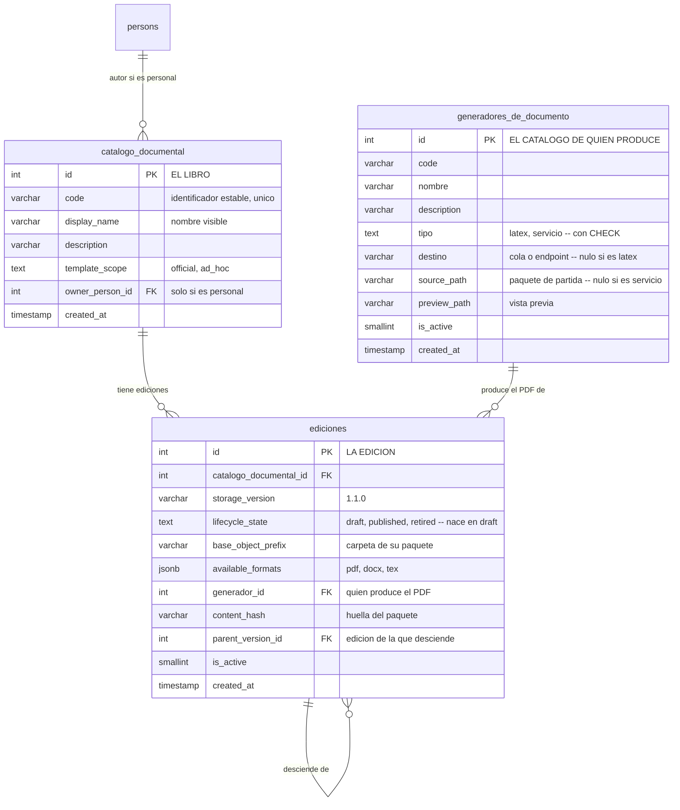

Aquí vive la distinción que más confusión causa si no se nombra bien, así que la nombro con una
metáfora y la sostengo toda la página.

Un **entregable** (`catalogo_documental`) es el *título del libro*: «Informe general de actividades». Es la
identidad de la cosa que hay que producir. No tiene formato, ni campos, ni maqueta — solo nombre
(`code`, `display_name`, `description`) y, si es un entregable personal, quién lo creó
(`owner_person_id`). **De qué semilla nació ya no se guarda aquí**: desde el 2026-10-04 lo que se
guarda es quién produce su PDF, y cuelga de la **edición** (`ediciones.generador_id`), no
del nombre.

**A qué línea de proceso sirve no está escrito aquí**, y desde el 2026-10-04 tampoco en ninguna otra
columna: lo dice el **vínculo** de su edición en `vinculos`, que sabe a qué
configuración está enlazada, y la configuración sabe su proceso y su variación. Hasta esa fecha
`catalogo_documental` llevaba dos columnas con la respuesta copiada —`owner_process_id` y
`owner_variation_key`—; ninguna de las 33 consultas que leen la tabla las seleccionaba, y su único
lector en todo el sistema era un guardia que comprobaba que coincidieran con el vínculo. Se
retiraron las tres cosas.

Que un entregable sirva **a una sola línea** sigue siendo la regla, y ahora la impone la base en vez
de ese guardia: el disparador `trg_pdt_linea_unica`, explicado en
[El vínculo](/modelo/vinculo). Cubre más que el guardia, porque también vigila el clon, los scripts
de siembra y un `INSERT` a mano.

Una **edición** (`ediciones`) es *una impresión concreta* de ese libro: la v1.0.0, la
v1.1.0. Ahí sí está todo lo material: dónde vive su paquete de archivos (`base_object_prefix`), qué
formatos ofrece (`available_formats`), cuál es su huella de contenido (`content_hash`) y **quién
produce su PDF** (`generador_id`).

## Cómo se encadenan y cómo se publican

Las ediciones se encadenan: cada una sabe de cuál desciende (`parent_version_id`, una clave ajena a
la propia tabla). Y tienen el mismo ciclo de tres estados que las configuraciones de proceso
—`lifecycle_state` con `draft`, `published` y `retired`— con la misma regla: **una sola publicada por
entregable**. Publicar una edición retira automáticamente la anterior.

Dos cosas que la base sí impone: `lifecycle_state` tiene un `CHECK` con esos tres valores y **nace
en `draft` por defecto**, para que un `INSERT` despistado deje una fila que el control de activación
rechaza en vez de una plantilla publicada que nunca pasó por él. Y `uq_ediciones_storage`
impide repetir `storage_version` dentro del mismo entregable.

:::caution[Una asimetría que conviene conocer]

La regla «una sola configuración activa por línea» **la impone la base**: `active_series_flag` es una
columna generada y `uq_process_definition_one_active_series` la vuelve imposible de violar. La regla
«una sola edición publicada» **solo la sostiene el código** — `retirePriorPublishedSiblings()`, en
`backend/services/admin/templates/templateArtifact.js`, que retira las hermanas publicadas dentro de
la misma transacción en la que publica la nueva.

Comprobado sobre el esquema vigente: hay **ocho** columnas-bandera generadas que respaldan un índice
único parcial de este tipo —en `unit_positions`, `position_assignments`, `vacancies`, `aplications`,
`offers`, `role_assignments`, `process_definition_versions` y `task_item_tenures`— y **ninguna está
en `ediciones`**.

:::

Publicar además tiene una puerta: si la edición no se usa **solo** en modo `routed`, se exige que
tenga al menos un paso de flujo de entrega definido, y si no lo tiene la publicación falla. Las
`routed` se saltan esa comprobación porque no autoran flujo: lo definen al instanciarse.

## El ámbito: oficial o personal

Un entregable declara en `template_scope` si es **oficial** (`official`) —de la institución— o
**personal** (`ad_hoc`), creado por alguien para su propio uso, y entonces `owner_person_id` dice
quién.

El ámbito no es decorativo: **decide qué resolutores puede usar el flujo que se autora sobre sus
ediciones**. En `official` solo se admiten `task_assignee` («el responsable del entregable») y
`cargo_in_scope` («por cargo»); `ad_hoc` añade `specific_person`, o sea nombrar a una persona
concreta. La lista vive en `WEB_FILL_RESOLVER_TYPES_BY_SCOPE`
(`backend/services/admin/templates/workflows.js`), y por debajo el `CHECK` de
`participantes_declarados.resolver_type` admite exactamente esos tres valores y ninguno más.

## Los campos: qué le van a pedir a quien lo rellene

Los campos de una edición viven en **un fichero**, no en una tabla: el `schema.json` del paquete de
MinIO, dentro de `base_object_prefix`. Lo escribe el editor de `/admin` y lo relee el mismo editor.

:::caution[Aquí había una tabla, y se retiró]

Hubo un `template_artifact_fields` con una fila por campo (`field_order`, `data_key`, `field_code`,
`title`, `ui_component`, `ui_group` y una bandera de obligatoriedad). Nació para ser el esqueleto de un generador que
emitiera el Jinja2 con los tokens de firma ya colocados, uniendo `field_code` con
`participantes_declarados.slot`.

Se retiró en el frente 23 porque **ese generador no se construyó**, y la tabla se quedó sin ningún
consumidor: su único lector en todo el sistema era el código que copiaba sus filas a la versión
siguiente. Existía para copiarse a sí misma. Con ella se fue `ediciones.schema_object_key`,
que era `base_object_prefix` + `schema.json` — un valor derivable, y por tanto una tercera forma de
decir lo mismo. Hoy esa clave se deriva al leer.

**El día que un generador tenga que decirle a la web qué preguntar, ese contrato hará falta** — pero
será otro diseño, no esta tabla de vuelta: colgará del **generador** (uno por servicio, estable) y
no de cada edición de cada plantilla.

:::

## El generador: quién produce el PDF

El catálogo `generadores_de_documento` dice **quién produce** cada tipo de documento, y cada edición
declara el suyo en `generador_id`. Su `tipo` tiene `CHECK` con dos valores y parte el catálogo en dos
mitades excluyentes:

- **`latex`** — trae un paquete de partida en MinIO (`source_path`): un proyecto LaTeX+Jinja2
  completo que se copia entero al crear una plantilla, con su maqueta y su `schema.json`. No llama a
  nadie, así que su `destino` es nulo. Es lo que antes se llamaba «la semilla».
- **`servicio`** — un servicio programado que devuelve el PDF, al que se llama por su `destino`
  (nombre de cola o URL de endpoint). No trae paquete, así que su `source_path` es nulo.

:::note[La semilla no murió: dejó de ser EL mecanismo]

Esta tabla se llamaba `template_seeds` y significaba otra cosa: «la semilla», el esqueleto LaTeX que
**todo** documento tenía que copiar. De ese camino sólo se construyó la copia —no hay renderizador,
ni formulario de llenado, ni editor de campos—, así que exigía escribir `.tex.j2` para definir
cualquier documento. El frente 23 lo desacopló: el llenado web lo harán servicios programados caso a
caso, y la semilla LaTeX se queda como **el primer generador del catálogo**, no como el único camino.

:::

