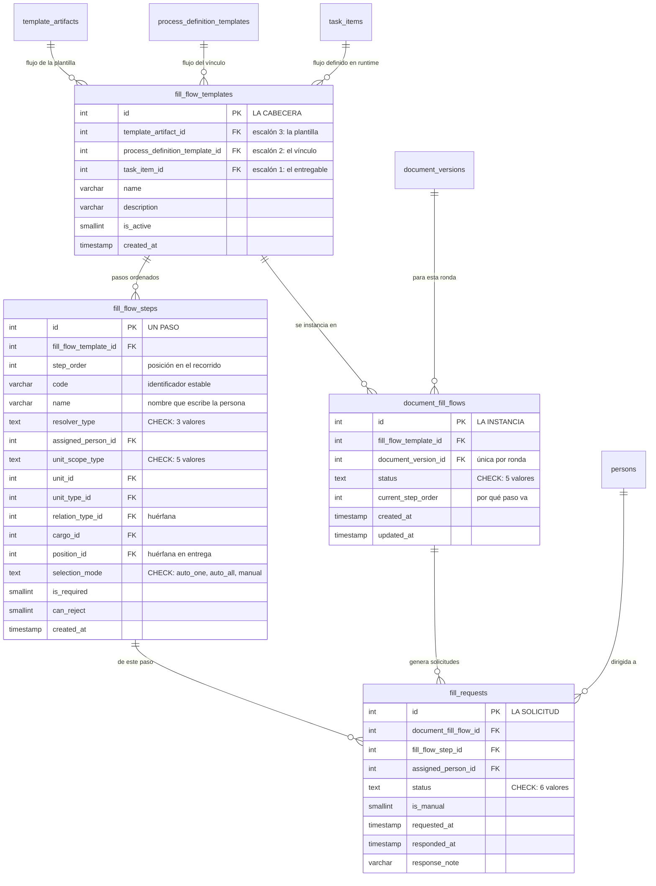

Antes de que un documento llegue a firmas puede tener que pasar por varias manos: quien lo redacta,
quien lo revisa, quien lo aprueba. Eso es el **flujo de entrega**.

Se declara en dos piezas: una **cabecera** (`fill_flow_templates`) que le da nombre, y una lista de
**pasos ordenados** (`fill_flow_steps`).

## La cabecera cuelga de tres sitios, y no son excluyentes

La cabecera tiene tres columnas portadoras, y es lo que hace posibles los tres modos de emisión:

| Portador | Qué flujo es |
|---|---|
| `template_artifact_id` | El flujo **autorado en la edición de plantilla**, compartido por todas las configuraciones donde esté enlazada |
| `process_definition_template_id` | El flujo particular **de un vínculo**: esa plantilla en ese proceso configurado |
| `task_item_id` | El flujo **definido en runtime** sobre un entregable concreto, en modo `routed` |

:::caution[Los tres portadores pueden estar rellenos a la vez, y por eso la prioridad no es «qué columna tiene valor»]

Aquí **no hay ningún `CHECK`** que los haga excluyentes, y no es un olvido: las filas de runtime
llevan hoy **los dos primeros a la vez**, porque `task_item_id` discrimina al productor pero el
vínculo sigue siendo su contexto.

Por eso el resolutor no busca «la columna que esté rellena»: baja **tres escalones por prioridad**
—entregable, vínculo, plantilla— y **cada escalón exige `NULL` en los portadores de los escalones
anteriores**. Sin ese `IS NULL`, el flujo privado de un envío se le serviría a cualquier otro
entregable del mismo vínculo.

:::

El primer escalón que encuentre algo activo, manda. Una cabecera colgada del vínculo **gana a la de
la plantilla aunque sea más vieja**.

## Cómo dice un paso a quién le toca

Un paso no nombra a una persona: nombra **una forma de encontrarla**, y la resuelve en el momento.
`resolver_type` está cerrado por `CHECK` y admite exactamente tres valores:

- **`task_assignee`** — el responsable del entregable, quien tenga el turno abierto en ese instante.
  Es el valor por defecto en la entrega, y el que sobrevive a los relevos.
- **`cargo_in_scope`** — por cargo dentro de un ámbito: «el decano de la facultad a la que pertenece
  esto».
- **`specific_person`** — una persona concreta. La base lo admite, pero el formulario solo lo ofrece
  en plantillas de ámbito personal (*ad hoc*), no en las oficiales.

El ámbito lo dice `unit_scope_type`, también cerrado por `CHECK`: `unit_exact`, `unit_subtree`,
`unit_type`, `all_units` y `context_exact` —la unidad del propio documento—.

Y como una forma puede encontrar a varias personas, el paso declara qué hacer entonces en
`selection_mode`: `auto_one` (elegir una), `auto_all` (mandárselo a todas) o `manual` (que alguien
elija a mano). También declara si es obligatorio (`is_required`) y si puede devolver el documento
(`can_reject`).

:::note[Seis resolutores retirados, y el criterio que los mató]

`document_owner`, `position`, `manual_pick`, `context_subtree` y `context_ancestor_type` salieron del
catálogo, y `specific_person` quedó gobernado por el ámbito del formulario. El criterio fue **lo que
la web no autora, no existe**: el `meta.yaml` era el único sitio del que podían salir, y al retirarlo
se quedaron sin productor.

Dos columnas de `fill_flow_steps` quedaron huérfanas por eso y se conservan por estar expuestas en el
CRUD genérico: `relation_type_id`, cuyo único lector era la rama `context_ancestor_type`, y
`position_id`, cuyo único lector era el `case "position"`. Medido sobre una base recién sembrada:
**0 filas con valor** en la primera.

Ojo con una asimetría: la gemela de firma **sí** lee `position_id`, porque allí el resolutor puede
venir del JSONB `signers`, que ningún `CHECK` cubre.

:::

## Cuando el documento echa a andar

Al ponerse en marcha, el flujo declarado se convierte en una **instancia** (`document_fill_flows`)
pegada a la ronda concreta, que lleva la cuenta de por qué paso va en `current_step_order`. Un índice
único sobre `document_version_id` garantiza **una sola instancia de entrega por ronda**.

Cada paso genera una o varias **solicitudes** (`fill_requests`) dirigidas a una persona. Aquí los
estados **sí están cerrados por `CHECK`**, y en inglés:

| Tabla | Estados admitidos |
|---|---|
| `document_fill_flows.status` | `pending` · `in_progress` · `approved` · `rejected` · `cancelled` |
| `fill_requests.status` | `pending` · `in_progress` · `approved` · `rejected` · `returned` · `cancelled` |

La solicitud guarda además `is_manual` —si a esa persona la eligieron a mano—, cuándo se pidió,
cuándo se respondió y una nota de respuesta.

El [flujo de firma](/modelo/flujo-de-firma) tiene esta misma estructura, con dos añadidos
propios.
