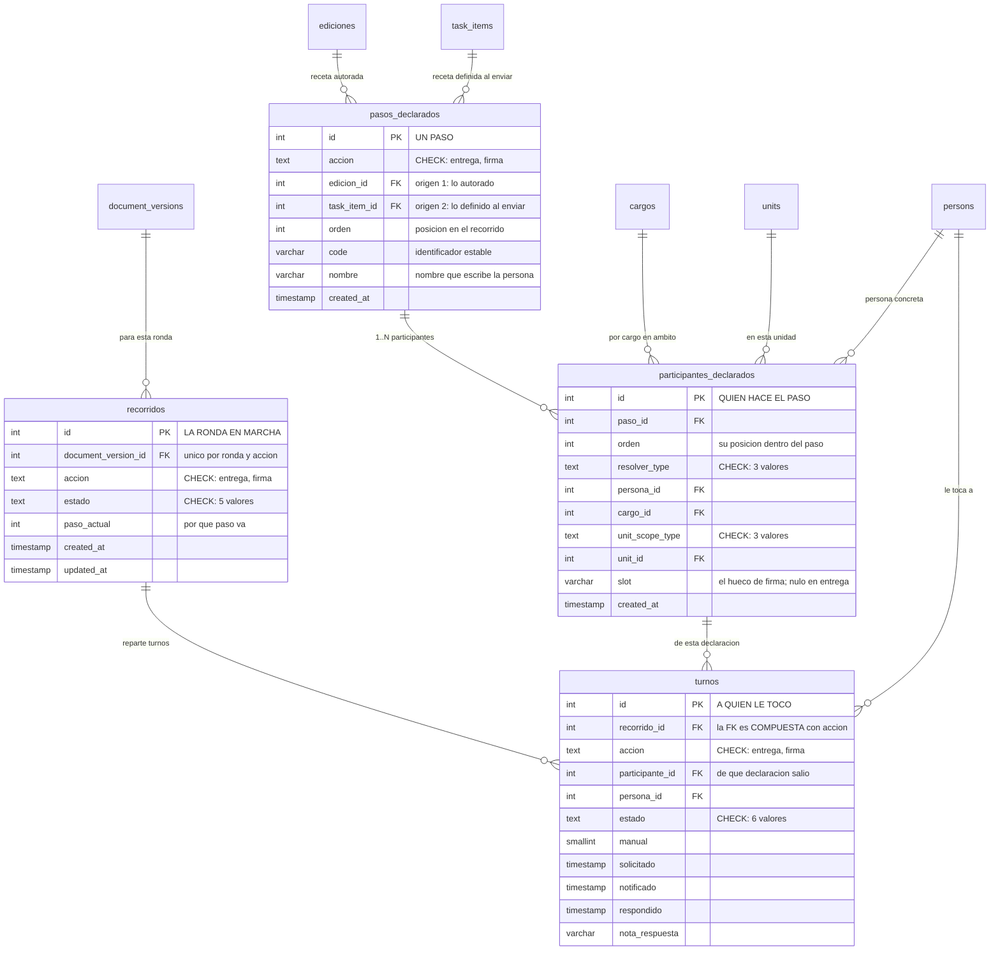

Antes de que un documento quede cerrado puede tener que pasar por varias manos: quien lo redacta,
quien lo revisa, quien lo aprueba, quien lo firma. Eso es el **recorrido**.

:::note[Eran dos capítulos, y es uno]

Hasta el **2026-10-09** esto se contaba dos veces —«el flujo de entrega» y «el flujo de firma»— con
dos juegos de cuatro tablas cada uno, simétricos columna por columna. Eran el mismo mecanismo: lo
único que cambia entre entregar y firmar es **la acción que se pide**. El capítulo siguiente,
[la firma](/modelo/flujo-de-firma/), cuenta ya sólo lo que la firma tiene de propio.

:::

El recorrido se cuenta en dos mitades, y conviene no mezclarlas:

| | Qué es | Tablas |
|---|---|---|
| **La receta** | lo que alguien DECLARA que hay que hacer | `pasos_declarados` · `participantes_declarados` |
| **La ejecución** | la ronda en marcha, y a quién le tocó | `recorridos` · `turnos` |

## La receta: un paso lleva su propio origen

Un **paso** (`pasos_declarados`) tiene una `accion` —`entrega` o `firma`—, un `orden`, y un origen.
El origen son dos columnas **excluyentes**:

| Portador | Qué receta es |
|---|---|
| `edicion_id` | la receta **autorada en la edición de plantilla**, compartida por todas las configuraciones donde esté enlazada |
| `task_item_id` | la receta **definida al enviar** un entregable concreto, en modo `routed` |

Lo exige la base con un `CHECK` que cuenta cuántos van rellenos y pide **exactamente uno**. Ni los
dos a la vez, ni ninguno — un paso sin origen no lo encontraría nadie.

El resolutor baja **dos escalones por prioridad**: primero la receta del entregable, después la de la
edición. Si el entregable tiene la suya, manda, y la de la edición ni se mira.

:::note[Y ya no hay cabecera que buscar]

Cada lado tenía una **cabecera** (`fill_flow_templates`, `signature_flow_templates`) que le daba
nombre y de la que colgaban los pasos. De sus siete columnas sólo se leían dos —`id` e `is_active`—:
`name` se escribía y no se consultaba nunca, y `description` no la tocaba nadie. Resolver la receta
costaba dos consultas: la cabecera y luego sus pasos.

Hubo además un **tercer portador**, `vinculo_id`, y murió antes: nadie lo escribía, la puerta de
publicación lo excluía explícitamente —así que un recorrido colgado del vínculo no podía publicar
nada— y era justo lo que hacía imposible el `CHECK`, porque las filas de runtime llevaban dos
portadores a la vez.

Un vínculo sigue alcanzando su receta, pero **a través de la edición que enlaza**. Y eso tiene una
consecuencia que conviene saber: desenlazar una plantilla de una configuración **no borra su
receta**, porque la receta nunca fue del vínculo.

:::

## Cómo dice un paso a quién le toca

Un paso no nombra a una persona: nombra **una forma de encontrarla**, y la resuelve en el momento.
Eso lo declara cada **participante** (`participantes_declarados`), y un paso tiene de uno a N: la
entrega pide a una, la firma puede pedir a varias.

`resolver_type` está cerrado por `CHECK` y admite exactamente tres valores:

- **`task_assignee`** — el responsable del entregable, quien tenga el turno abierto en ese instante.
  Es el que sobrevive a los relevos.
- **`cargo_in_scope`** — por cargo dentro de un ámbito: «el decano de la facultad a la que pertenece
  esto».
- **`specific_person`** — una persona concreta. La base lo admite, pero el formulario sólo lo ofrece
  en plantillas de ámbito personal (*ad hoc*), no en las oficiales.

El ámbito lo dice `unit_scope_type`, también cerrado por `CHECK`, y son **tres**: `unit_exact` —la
unidad escrita en el participante—, `context_exact` —la del propio documento— y `all_units`, que no
acota.

:::note[De seis resolutores a tres, de seis ámbitos a tres, y el criterio que los mató]

El criterio es del dueño y sigue vigente: **lo que la web no autora, no existe**.

`document_owner`, `position`, `manual_pick` y los ámbitos `context_subtree` y
`context_ancestor_type` salieron del `CHECK` cuando el `meta.yaml` —su único productor— desapareció.
Pero **sobrevivieron un año más en el código**, y eso es lo interesante: el lado de la firma guardaba
sus firmantes en un JSONB que ningún `CHECK` cubría, así que un valor retirado podía llegar por ahí
y borrar sus ramas habría dejado el paso **sin firmante y en silencio**. Era el defecto 1.19.

Con los participantes **en filas**, el valor retirado no se puede ni insertar, y las ramas se fueron.
Con ellos cayeron `unit_subtree` y `unit_type` —que ninguna pantalla producía— y `relation_type_id`,
`position_id` y `unit_type_id`, cuyos únicos lectores eran esas ramas.

:::

:::caution[Y tres columnas más que parecían funcionalidad]

| Columna | Qué se midió |
|---|---|
| `selection_mode` | sus tres valores se fueron. `auto_one` era «quédate con UNO», implementado como `ORDER BY person_id` + quedarse el primero: o sea **el id más bajo**, que no es una regla de negocio. `manual` no lo podía crear ninguna pantalla. Con los dos fuera quedaba un valor, y una columna con un valor no es una columna |
| `is_required` | sus dos valores no eran «obligatorio / opcional». Con `1` el recorrido no abre y lo dice; con `0` abría y el paso quedaba **aparcado** esperando a alguien que nadie podía resolver — un bloqueo silencioso y más tarde. Queda el comportamiento de `1` para todo paso |
| `can_reject` | **derivada y muerta**: se escribía como `orden > 1` en tres sitios y no la leía nadie. Había tres reglas para la misma idea y ninguna era la otra: la columna, el guard (que no mira ni el orden ni la columna) y el frontend (que decide por `resolver_type`) |

:::

## Cuando el documento echa a andar

Al ponerse en marcha, la receta se convierte en un **recorrido** (`recorridos`) pegado a la ronda
concreta, que lleva su estado y por qué paso va en `paso_actual`. Un índice único sobre
`(document_version_id, accion)` garantiza **un solo recorrido de cada acción por ronda**.

Cada participante del paso genera uno o varios **turnos** (`turnos`) dirigidos a una persona. Y un
turno apunta al **participante** que lo produjo, no sólo al paso: así se sabe de qué declaración
salió, que es lo que permite distinguir los tres turnos de un paso con tres firmantes.

Los estados están cerrados por `CHECK`, y son **un vocabulario** para los dos lados y los dos
niveles (ver [los vocabularios de estado](/modelo/vocabularios-de-estado/)):

| Tabla | Estados admitidos |
|---|---|
| `recorridos.estado` | `pendiente` · `en_progreso` · `completado` · `rechazado` · `cancelado` |
| `turnos.estado` | los cinco anteriores más `devuelto`, que **sólo existe en la entrega** — y un `CHECK` lo impone |

El turno guarda además `manual` —si a esa persona la eligieron a mano—, cuándo se pidió, cuándo se
notificó, cuándo se respondió y una nota de respuesta.

:::note[La acción está en las DOS tablas, y es a propósito]

`turnos` repite la `accion` de su recorrido porque **la clave ajena es compuesta**:
`(recorrido_id, accion)` referencia a `(id, accion)`. Es lo que impide que un turno diga una acción
distinta de la de su recorrido — y lo necesita el `CHECK` de `devuelto`, que tiene que poder verla.

:::

```mermaid
erDiagram
  ediciones ||--o{ pasos_declarados : "receta autorada"
  task_items ||--o{ pasos_declarados : "receta definida al enviar"
  pasos_declarados ||--o{ participantes_declarados : "1..N participantes"
  cargos ||--o{ participantes_declarados : "por cargo en ambito"
  units ||--o{ participantes_declarados : "en esta unidad"
  persons ||--o{ participantes_declarados : "persona concreta"
  document_versions ||--o{ recorridos : "para esta ronda"
  recorridos ||--o{ turnos : "reparte turnos"
  participantes_declarados ||--o{ turnos : "de esta declaracion"
  persons ||--o{ turnos : "le toca a"

  pasos_declarados {
    int id PK "UN PASO"
    text accion "CHECK: entrega, firma"
    int edicion_id FK "origen 1: lo autorado"
    int task_item_id FK "origen 2: lo definido al enviar"
    int orden "posicion en el recorrido"
    varchar code "identificador estable"
    varchar nombre "nombre que escribe la persona"
    timestamp created_at
  }
  participantes_declarados {
    int id PK "QUIEN HACE EL PASO"
    int paso_id FK
    int orden "su posicion dentro del paso"
    text resolver_type "CHECK: 3 valores"
    int persona_id FK
    int cargo_id FK
    text unit_scope_type "CHECK: 3 valores"
    int unit_id FK
    varchar slot "el hueco de firma; nulo en entrega"
    timestamp created_at
  }
  recorridos {
    int id PK "LA RONDA EN MARCHA"
    int document_version_id FK "unico por ronda y accion"
    text accion "CHECK: entrega, firma"
    text estado "CHECK: 5 valores"
    int paso_actual "por que paso va"
    timestamp created_at
    timestamp updated_at
  }
  turnos {
    int id PK "A QUIEN LE TOCO"
    int recorrido_id FK "la FK es COMPUESTA con accion"
    text accion "CHECK: entrega, firma"
    int participante_id FK "de que declaracion salio"
    int persona_id FK
    text estado "CHECK: 6 valores"
    smallint manual
    timestamp solicitado
    timestamp notificado
    timestamp respondido
    varchar nota_respuesta
  }
```

Lo que la **firma** añade sobre esto —el hueco en el papel y el segundo eje del resultado— está en
[el capítulo siguiente](/modelo/flujo-de-firma/).
