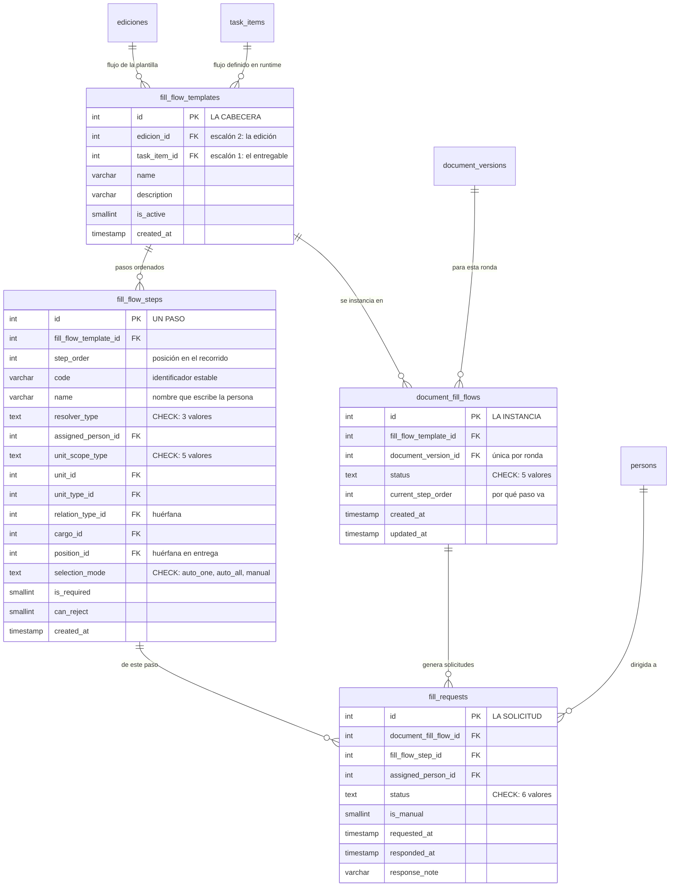

Antes de que un documento llegue a firmas puede tener que pasar por varias manos: quien lo redacta,
quien lo revisa, quien lo aprueba. Eso es el **flujo de entrega**.

Se declara en dos piezas: una **cabecera** (`fill_flow_templates`) que le da nombre, y una lista de
**pasos ordenados** (`fill_flow_steps`).

## La cabecera cuelga de uno de dos sitios, y sólo de uno

La cabecera tiene dos columnas portadoras, y son **excluyentes**:

| Portador | Qué flujo es |
|---|---|
| `edicion_id` | El flujo **autorado en la edición de plantilla**, compartido por todas las configuraciones donde esté enlazada |
| `task_item_id` | El flujo **definido en runtime** sobre un entregable concreto, en modo `routed` |

Lo exige la base con un `CHECK` que cuenta cuántos portadores van rellenos y pide **exactamente
uno**. Ni los dos a la vez, ni ninguno — una cabecera sin ancla no la encontraría nadie, porque el
resolutor pregunta por un portador.

El resolutor baja **dos escalones por prioridad** —primero el entregable, después la edición— y el
primero que encuentre algo activo manda. El escalón de la edición exige además `task_item_id IS
NULL`: sin esa guarda, el flujo privado de un envío se le serviría a cualquier otro entregable.

:::note[Hubo un tercer portador, `vinculo_id`, y murió]

Era «el flujo particular de un vínculo»: esa plantilla en ese proceso configurado. Se retiró
después de medirlo tres veces, y las tres decían lo mismo:

- **nadie lo escribía** desde que se retiró el sincronizador que proyectaba el `meta.yaml` de cada
  plantilla sobre sus vínculos;
- **la puerta de publicación lo excluía** con un `vinculo_id IS NULL` explícito, así que un flujo
  colgado del vínculo no podía publicar nada — era un recorrido que no llegaba a usarse;
- las únicas filas que existían las ponía la **siembra de datos de ejemplo**, a través del editor
  genérico de `/admin`.

Y ese tercer portador era justo lo que hacía imposible el `CHECK`: las filas de runtime llevaban
`vinculo_id` **y** `task_item_id` a la vez, así que los tres no eran excluyentes. Con dos, lo son.

Un vínculo sigue alcanzando su recorrido, pero **a través de la edición que enlaza**. Y eso tiene
una consecuencia que conviene saber: desenlazar una plantilla de una configuración **ya no borra su
recorrido**, porque el recorrido nunca fue del vínculo.

:::

## Cómo dice un paso a quién le toca

Un paso no nombra a una persona: nombra **una forma de encontrarla**, y la resuelve en el momento.
`resolver_type` está cerrado por `CHECK` y admite exactamente tres valores:

- **`task_assignee`** — el responsable del entregable, quien tenga el turno abierto en ese instante.
  Es el valor por defecto en la entrega, y el que sobrevive a los relevos.
- **`cargo_in_scope`** — por cargo dentro de un ámbito: «el decano de la facultad a la que pertenece
  esto».
- **`specific_person`** — una persona concreta. La base lo admite, pero el formulario solo lo ofrece
  en plantillas de ámbito personal (*ad hoc*), no en las oficiales.

El ámbito lo dice `unit_scope_type`, también cerrado por `CHECK`: `unit_exact`, `unit_subtree`,
`unit_type`, `all_units` y `context_exact` —la unidad del propio documento—.

Y como una forma puede encontrar a varias personas, el paso declara qué hacer entonces en
`selection_mode`: `auto_one` (elegir una), `auto_all` (mandárselo a todas) o `manual` (que alguien
elija a mano). También declara si es obligatorio (`is_required`) y si puede devolver el documento
(`can_reject`).

:::note[Seis resolutores retirados, y el criterio que los mató]

`document_owner`, `position`, `manual_pick`, `context_subtree` y `context_ancestor_type` salieron del
catálogo, y `specific_person` quedó gobernado por el ámbito del formulario. El criterio fue **lo que
la web no autora, no existe**: el `meta.yaml` era el único sitio del que podían salir, y al retirarlo
se quedaron sin productor.

Dos columnas de `fill_flow_steps` quedaron huérfanas por eso y se conservan por estar expuestas en el
CRUD genérico: `relation_type_id`, cuyo único lector era la rama `context_ancestor_type`, y
`position_id`, cuyo único lector era el `case "position"`. Medido sobre una base recién sembrada:
**0 filas con valor** en la primera.

Ojo con una asimetría: la gemela de firma **sí** lee `position_id`, porque allí el resolutor puede
venir del JSONB `signers`, que ningún `CHECK` cubre.

:::

## Cuando el documento echa a andar

Al ponerse en marcha, el flujo declarado se convierte en una **instancia** (`document_fill_flows`)
pegada a la ronda concreta, que lleva la cuenta de por qué paso va en `current_step_order`. Un índice
único sobre `document_version_id` garantiza **una sola instancia de entrega por ronda**.

Cada paso genera una o varias **solicitudes** (`fill_requests`) dirigidas a una persona. Los estados
están cerrados por `CHECK`, y son **los mismos que en firma** desde el 2026-10-08: un vocabulario,
en español, para los dos lados y los dos niveles (ver [los vocabularios de
estado](/modelo/vocabularios-de-estado/)).

| Tabla | Estados admitidos |
|---|---|
| `document_fill_flows.status` | `pendiente` · `en_progreso` · `completado` · `rechazado` · `cancelado` |
| `fill_requests.status` | los cinco anteriores más `devuelto`, que **sólo existe en la entrega** |

La solicitud guarda además `is_manual` —si a esa persona la eligieron a mano—, cuándo se pidió,
cuándo se respondió y una nota de respuesta.

```mermaid
erDiagram
  ediciones ||--o{ fill_flow_templates : "flujo de la plantilla"
  task_items ||--o{ fill_flow_templates : "flujo definido en runtime"
  fill_flow_templates ||--o{ fill_flow_steps : "pasos ordenados"
  fill_flow_templates ||--o{ document_fill_flows : "se instancia en"
  document_versions ||--o{ document_fill_flows : "para esta ronda"
  document_fill_flows ||--o{ fill_requests : "genera solicitudes"
  fill_flow_steps ||--o{ fill_requests : "de este paso"
  persons ||--o{ fill_requests : "dirigida a"

  fill_flow_templates {
    int id PK "LA CABECERA"
    int edicion_id FK "escalón 2: la edición"
    int task_item_id FK "escalón 1: el entregable"
    varchar name
    varchar description
    smallint is_active
    timestamp created_at
  }
  fill_flow_steps {
    int id PK "UN PASO"
    int fill_flow_template_id FK
    int step_order "posición en el recorrido"
    varchar code "identificador estable"
    varchar name "nombre que escribe la persona"
    text resolver_type "CHECK: 3 valores"
    int assigned_person_id FK
    text unit_scope_type "CHECK: 5 valores"
    int unit_id FK
    int unit_type_id FK
    int relation_type_id FK "huérfana"
    int cargo_id FK
    int position_id FK "huérfana en entrega"
    text selection_mode "CHECK: auto_one, auto_all, manual"
    smallint is_required
    smallint can_reject
    timestamp created_at
  }
  document_fill_flows {
    int id PK "LA INSTANCIA"
    int fill_flow_template_id FK
    int document_version_id FK "única por ronda"
    text status "CHECK: 5 valores"
    int current_step_order "por qué paso va"
    timestamp created_at
    timestamp updated_at
  }
  fill_requests {
    int id PK "LA SOLICITUD"
    int document_fill_flow_id FK
    int fill_flow_step_id FK
    int assigned_person_id FK
    text status "CHECK: 6 valores"
    smallint is_manual
    timestamp requested_at
    timestamp responded_at
    varchar response_note
  }
```

El [flujo de firma](/modelo/flujo-de-firma) tiene esta misma estructura, con dos añadidos
propios.
