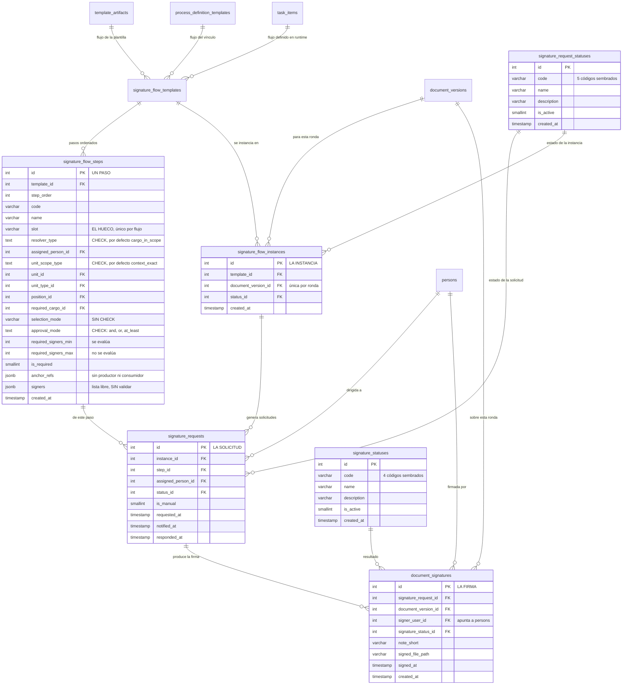

El flujo de firma tiene **la misma estructura que el de entrega** —cabecera colgada de tres
portadores, pasos ordenados, instancia pegada a la ronda y solicitudes— y las mismas tres formas de
encontrar a quien le toca. Si leíste [la página anterior](/modelo/flujo-de-entrega), esta
es la misma película con dos añadidos importantes.

Los tres escalones de resolución son idénticos: `task_item_id` (runtime), luego
`process_definition_template_id` (el vínculo), luego `template_artifact_id` (la plantilla), cada uno
exigiendo `NULL` en los anteriores.

:::note[Dos valores por defecto que sí cambian]

`signature_flow_steps` nace con `resolver_type = 'cargo_in_scope'` y
`unit_scope_type = 'context_exact'`, mientras su gemela de entrega nace con `task_assignee` y
`unit_exact`. Tiene sentido: lo normal es que el documento lo rellene su responsable y lo firme un
cargo de la unidad del documento.

Y hay una asimetría que no es de diseño sino deuda: `fill_flow_steps.selection_mode` está cerrado por
`CHECK`; `signature_flow_steps.selection_mode` es un `VARCHAR(20)` **sin `CHECK`**. Esa asimetría es
justo lo que se sigue en `TD7-e`.

:::

## Añadido uno: varios firmantes en un paso, y qué basta

Un paso de firma declara su **modo de aprobación** en `approval_mode`, cerrado por `CHECK`:

| Valor | Qué significa |
|---|---|
| `and` | Tienen que firmar **todos**. Es el valor por defecto |
| `or` | Basta con que firme **uno cualquiera** |
| `at_least` | Tienen que firmar **al menos N** |

Eso permite modelar un consejo que aprueba por mayoría sin necesitar nombres.

:::caution[El mínimo se evalúa; el máximo no]

El paso guarda `required_signers_min` y `required_signers_max`, pero **solo el primero entra en la
decisión**. El máximo se escribe, se versiona, se proyecta al panel y se lee al hidratar el paso —
pero **no llega al resumen que decide si un paso está completo**, que solo lleva el modo de aprobación
y el mínimo. No cierra ni abre ningún paso.

:::

## Añadido dos: el hueco físico en el papel

Aquí es donde encaja el `token` de la persona, y es la parte del modelo que más cuesta ver porque
cruza tres mundos: la base, la maqueta del documento y el firmador.

Un paso de firma tiene un **hueco** (`slot`): un nombre estable para «la firma del revisor», «la
firma del aprobador». La cadena completa es esta:

1. `persons.token` son **diez caracteres únicos** por persona, guardados limpios en la base.
2. La maqueta genera Jinja que embebe en ese hueco el token del firmante resuelto:
   `{{ signatures.<slot>.token }}`.
3. Al enviarlo al servicio de firma, el token se envuelve: `aB3xKp9mQr` viaja como `!-aB3xKp9mQr-!`.
4. Compilado el documento, esa marca queda **impresa en el PDF como texto**.
5. Al firmar, el firmador **busca ese texto dentro del PDF, encuentra su página y sus coordenadas y
   estampa la firma exactamente ahí**.

Por eso nadie tiene que colocar la firma a mano: la posición ya viaja dentro del documento. Con un
matiz — el servicio admite **dos modos**, `token` y `coordinates`; lo anterior describe el primero.

:::note[Un slot repetido eran dos firmantes compartiendo un token, y respondía 200]

El slot se acuñaba por posición (`firma_${order}`), así que insertar un paso en medio le daba el slot
que otro firmante ya tenía. Medido contra la base: insertar un paso en el orden 2 de una plantilla
con tres pasos dejaba **dos filas con `slot = firma_2`** y la petición respondía **200** — en
silencio, y con valor legal.

Hoy la unicidad tiene dos capas y las dos hacen falta: la autoría la valida con un 422 legible, y la
base la impone con `uq_signature_flow_steps_slot`, un índice único parcial sobre `(template_id, slot)`
`WHERE slot IS NOT NULL`. El índice es el que cubre a los **otros dos escritores** —el flujo de
runtime y la copia de versionado—, que la validación de autoría no toca. Es parcial porque las filas
de flujo de entrega no tienen slot, y un slot ausente no es una colisión.

:::

:::danger[El punto frágil: la lista libre de firmantes]

El paso guarda además una lista de firmantes en JSONB (`signers`). Esa lista **no la valida nadie** y
**manda sobre** `resolver_type`, que sí está cerrado por `CHECK`. Significa que un paso antiguo puede
traer por ahí una forma de resolución ya retirada, y si el código dejara de contemplarla, ese paso
**no lo firmaría nadie, y en silencio**. La copia de versionado lo propaga verbatim.

Por eso hay dos `case` legados —`document_owner` y `position`— que **no se pueden borrar todavía**:
hacerlo dejaría el paso resolviéndose por el `default` sin cargo. Está registrado como **defecto
1.19**, y el orden de cierre es filtrar **y** migrar, en ese orden. Ver
[Lo que hoy no cierra](/modelo/lo-que-no-cierra).

Hay un tercer JSONB en la tabla, `anchor_refs`, que es un contrato **sin productor ni consumidor**.

:::

## Los estados de firma son catálogo, no lista fija

A diferencia del resto del sistema, aquí los estados viven en **tablas propias** que se pueden
consultar y ampliar sin tocar el esquema. Hay dos catálogos distintos y conviene no confundirlos:

| Tabla | Qué describe | Códigos sembrados |
|---|---|---|
| `signature_request_statuses` | Cómo va **la solicitud** | `pendiente` · `en_progreso` · `completado` · `rechazado` · `cancelado` |
| `signature_statuses` | Cómo salió **la firma en sí** | `firmado` · `fallido` · `invalido` · `cancelado` |

`signature_flow_instances.status_id` apunta al **primero** de los dos: la instancia reutiliza el
catálogo de la solicitud.

Y al final la **firma en sí** queda registrada en `document_signatures`: quién firmó, con qué
resultado, cuándo, y en qué archivo quedó el documento ya firmado. Un detalle del nombre:
`signer_user_id` apunta a `persons` — el `user` es un fósil de la tabla `users`, que ya no existe.

