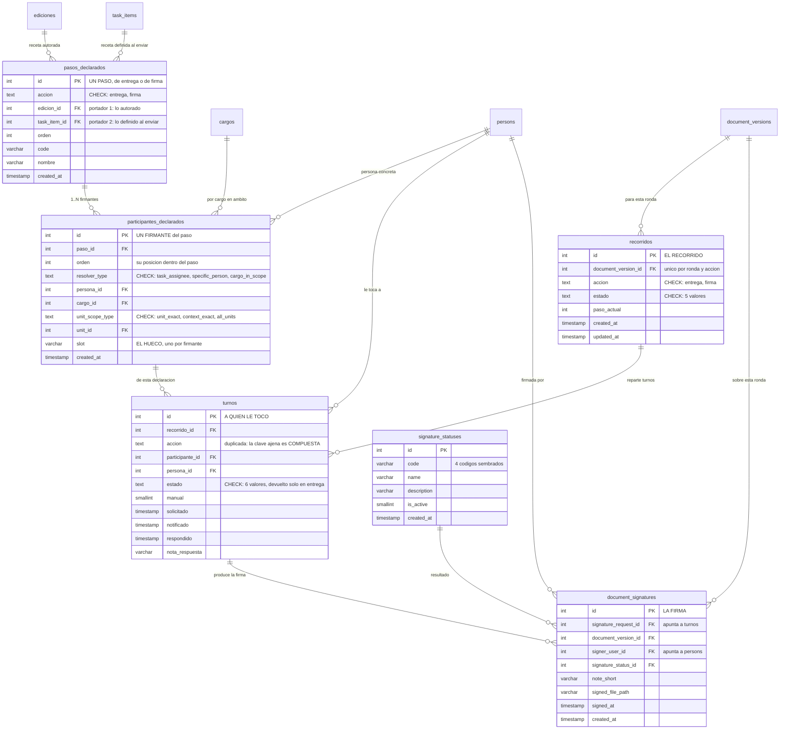

El flujo de firma tiene **la misma estructura que el de entrega** —cabecera colgada de uno de dos
portadores, pasos ordenados, instancia pegada a la ronda y solicitudes— y las mismas tres formas de
encontrar a quien le toca. Si leíste [la página anterior](/modelo/flujo-de-entrega), esta
es la misma película con dos añadidos importantes.

Los dos escalones de resolución son idénticos: primero `task_item_id` (el recorrido definido al
enviar), después `edicion_id` (el autorado en la edición), y el segundo exige `task_item_id IS NULL`.
Su `CHECK` es el mismo: exactamente un portador relleno. El tercer portador que hubo —el del
vínculo— murió igual aquí que allí, y el porqué está contado en esa página.

:::caution[La EJECUCIÓN de la firma ya no vive aquí — y con ella se fue media página]

Desde el **2026-10-08** lo que se pone en marcha es un **recorrido** (`recorridos`) con sus **turnos**
(`turnos`), las dos tablas unificadas que sirven igual a la entrega y a la firma.
`signature_flow_instances` y `signature_requests` **siguen existiendo** y esta sección las describe,
pero ya no las escribe ni las lee nadie: se retiran en el paso siguiente.

Y aquí el cambio va más allá del nombre de la tabla, porque los **firmantes pasaron a filas**:

- un paso de firma tiene **1..N participantes declarados** (`participantes_declarados`), cada uno con
  su forma de encontrar a alguien y **su propio hueco** en el papel;
- eso cierra el **defecto 1.19** —la lista libre en JSONB que mandaba sobre columnas con `CHECK`—, y
  con él se fueron los dos resolutores legados y cuatro de los seis ámbitos;
- y el **cupo** (`approval_mode`, `required_signers_min`/`_max`) se retiró entero: se firma el cupo
  completo. El porqué está más abajo.

:::

:::note[Dos valores por defecto que sí cambian]

El paso de firma nacía con `resolver_type = 'cargo_in_scope'` y `unit_scope_type = 'context_exact'`,
mientras su gemelo de entrega nacía con `task_assignee` y `unit_exact`. Tiene sentido: lo normal es
que el documento lo rellene su responsable y lo firme un cargo de la unidad del documento.

La conversión a filas **reproduce esos dos valores por lado**, y no es un descuido: mientras las dos
formas convivan, la nueva tiene que decir lo mismo que la vieja o la comprobación cruzada marcaría una
diferencia que no lo es. Para `specific_person` el ámbito es inerte de todos modos —el resolutor
devuelve la persona sin mirarlo—, así que unificarlos es una limpieza del paso siguiente.

Había además una asimetría que era deuda: `fill_flow_steps.selection_mode` estaba cerrado por `CHECK`
y el de firma era un `VARCHAR(20)` **sin `CHECK`**. Se cerró quitando la columna en los dos lados: sus
tres valores se fueron (`auto_one` era «el id más bajo», `manual` no lo creaba ninguna pantalla), y una
columna con un solo valor no es una columna.

:::

## Añadido uno: varios firmantes en un paso

Un paso de firma puede pedir **varias firmas**, y desde el **2026-10-08** las pide como lo que son:
**una fila por firmante** en `participantes_declarados`, con su resolutor, su ámbito y su hueco. Un
paso con tres firmantes son tres filas, y el `orden` de cada una dice en qué posición va.

**Un paso está aprobado cuando firman todos los suyos.** No hay modo que elegir.

:::caution[Hubo un «cupo», y se retiró entero]

El paso declaraba un **modo de aprobación** (`approval_mode`: `and` · `or` · `at_least`) con un mínimo
y un máximo. Las tres columnas se fueron, y conviene saber por qué, porque desde fuera parecía una
funcionalidad:

- `required_signers_max` **ya estaba muerto**: se escribía, se versionaba, se proyectaba al panel y se
  leía al hidratar el paso, pero **no llegaba al resumen que decide si un paso está completo**. No
  cerraba ni abría nada.
- `or` **producía basura medible**: al cerrar el paso con una firma, las solicitudes hermanas **seguían
  abiertas**, se listaban en el espacio de trabajo de quienes no firmaron y al pincharlas respondían
  «no pertenece al paso actual». `at_least` tenía el mismo defecto con un umbral.
- y el cupo existía porque **el conjunto de firmantes era indeterminado** —un cargo con ámbito amplio
  resolvía a N personas desconocidas de antemano—. Eso es justo lo que se quitó: los firmantes son
  filas declaradas.

El constructor de flujos en runtime sólo emitía `and`. Si algún día hace falta «basta uno», la forma
determinista es la **prelación** entre los participantes de un paso, y el `orden` ya está puesto.

:::

## Añadido dos: el hueco físico en el papel

Aquí es donde encaja el `token` de la persona, y es la parte del modelo que más cuesta ver porque
cruza tres mundos: la base, la maqueta del documento y el firmador.

**Cada firmante** tiene un **hueco** (`slot`): un nombre estable para «la firma del revisor», «la
firma del aprobador». La cadena completa es esta:

1. `persons.token` son **diez caracteres únicos** por persona, guardados limpios en la base.
2. La maqueta genera Jinja que embebe en ese hueco el token del firmante resuelto:
   `{{ signatures.<slot>.token }}`.
3. Al enviarlo al servicio de firma, el token se envuelve: `aB3xKp9mQr` viaja como `!-aB3xKp9mQr-!`.
4. Compilado el documento, esa marca queda **impresa en el PDF como texto**.
5. Al firmar, el firmador **busca ese texto dentro del PDF, encuentra su página y sus coordenadas y
   estampa la firma exactamente ahí**.

Por eso nadie tiene que colocar la firma a mano: la posición ya viaja dentro del documento. Con un
matiz — el servicio admite **dos modos**, `token` y `coordinates`; lo anterior describe el primero.

:::caution[El hueco era del PASO, y con varios firmantes eso era un fallo que estalla al firmar]

Hasta el **2026-10-08** el `slot` era una columna del paso: **uno** para todo el paso. Con N firmantes,
la maqueta imprimía el token del primero (`signers[0]`) y **los demás no tenían marca en el papel** —
el firmador lanzaba `Token marker '<token>' not found in PDF`.

El hueco bajó al **participante**, que es de quien es: un hueco es un sitio físico con el token de
**una** persona. El primero conserva el del paso y los demás se derivan de él (`firma_1`, `firma_1_2`,
`firma_1_3`), y que no se repita dentro del documento lo impone un disparador.

:::

:::note[Un slot repetido eran dos firmantes compartiendo un token, y respondía 200]

El slot se acuñaba por posición (`firma_${order}`), así que insertar un paso en medio le daba el slot
que otro firmante ya tenía. Medido contra la base: insertar un paso en el orden 2 de una plantilla
con tres pasos dejaba **dos filas con `slot = firma_2`** y la petición respondía **200** — en
silencio, y con valor legal.

Hoy la unicidad tiene dos capas y las dos hacen falta: la autoría la valida con un 422 legible, y la
base la impone con `uq_signature_flow_steps_slot`, un índice único parcial sobre `(template_id, slot)`
`WHERE slot IS NOT NULL`. El índice es el que cubre a los **otros dos escritores** —el flujo de
runtime y la copia de versionado—, que la validación de autoría no toca. Es parcial porque las filas
de flujo de entrega no tienen slot, y un slot ausente no es una colisión.

:::

:::tip[El punto frágil era la lista libre de firmantes, y se cerró el 2026-10-08]

El paso guardaba la lista de firmantes en un JSONB (`signers`) que **no validaba nadie** y que
**mandaba sobre** `resolver_type`, la columna que sí está cerrada por `CHECK`. Un paso antiguo podía
traer por ahí una forma de resolución ya retirada, y si el código dejaba de contemplarla, ese paso
**no lo firmaría nadie, y en silencio**. La copia de versionado lo propagaba verbatim. Era el
**defecto 1.19**.

Se cerró **a filas**, que era el orden que el plan decía —filtrar y migrar—: los firmantes viven en
`participantes_declarados`, con el mismo `CHECK` que tenía la columna del paso, así que el valor
retirado **no se puede ni insertar**. Con eso se fueron los dos `case` legados (`document_owner` y
`position`) y cuatro de los seis ámbitos (`unit_subtree`, `unit_type`, `context_subtree`,
`context_ancestor_type`), que no eran ramas muertas por descuido: eran la única defensa contra un
valor que la base no podía rechazar.

El efecto más concreto está **fuera** del camino de firma: el disparador del relevo tenía dos
`UPDATE`, y el de firma llevaba una guarda defensiva —«si el JSONB menciona `specific_person`, ante la
duda no se mueve»— que existía exactamente por esto. Hoy es **un** `UPDATE` sin guarda.

Queda un tercer JSONB en la tabla, `anchor_refs`, que es un contrato **sin productor ni consumidor**.

:::

## Los estados de firma son catálogo, no lista fija

Aquí hay **dos cosas distintas** que se confundían con facilidad, y una de ellas dejó de ser una
tabla el 2026-10-08:

| Dónde | Qué describe | Valores |
|---|---|---|
| `turnos.estado` y `recorridos.estado` | Cómo va **el turno** de quien firma y cómo va el recorrido | `pendiente` · `en_progreso` · `completado` · `rechazado` · `cancelado`, cerrados por `CHECK` (`devuelto` es sólo de la entrega) |
| `signature_statuses` | Cómo salió **la firma en sí** | `firmado` · `fallido` · `invalido` · `cancelado`, en una tabla de catálogo |

El estado de la solicitud era un catálogo propio, `signature_request_statuses`, y se retiró: es el
mismo concepto que el del lado de entrega, así que hoy es el mismo `CHECK` y el mismo vocabulario.
El porqué, con lo que costaba la indirección, está en
[los vocabularios de estado](/modelo/vocabularios-de-estado/).

**El de `signature_statuses` sí sigue siendo una tabla**, y no por inercia: es el resultado de una
operación criptográfica, no el turno de una persona.

Y al final la **firma en sí** queda registrada en `document_signatures`: quién firmó, con qué
resultado, cuándo, y en qué archivo quedó el documento ya firmado. Un detalle del nombre:
`signer_user_id` apunta a `persons` — el `user` es un fósil de la tabla `users`, que ya no existe.

**Los dos ejes importan, y no son redundantes.** El turno dice si alguien respondió; esta tabla dice
si la firma **vale**. Un turno `completado` cuya última firma salió `invalido` o `fallido` cuenta como
**rechazo**, no como paso dado: por eso el recorrido de firma se lee siempre cruzando las dos.

Desde el 2026-10-08 `document_signatures.signature_request_id` apunta a **`turnos`**. La columna
conserva su nombre —la lee el firmador y viaja en la API— y lo que referencia es el turno de firma: es
literalmente el enganche entre los dos ejes.

```mermaid
erDiagram
  ediciones ||--o{ pasos_declarados : "receta autorada"
  task_items ||--o{ pasos_declarados : "receta definida al enviar"
  pasos_declarados ||--o{ participantes_declarados : "1..N firmantes"
  cargos ||--o{ participantes_declarados : "por cargo en ambito"
  persons ||--o{ participantes_declarados : "persona concreta"
  document_versions ||--o{ recorridos : "para esta ronda"
  recorridos ||--o{ turnos : "reparte turnos"
  participantes_declarados ||--o{ turnos : "de esta declaracion"
  persons ||--o{ turnos : "le toca a"
  turnos ||--o{ document_signatures : "produce la firma"
  document_versions ||--o{ document_signatures : "sobre esta ronda"
  persons ||--o{ document_signatures : "firmada por"
  signature_statuses ||--o{ document_signatures : "resultado"

  pasos_declarados {
    int id PK "UN PASO, de entrega o de firma"
    text accion "CHECK: entrega, firma"
    int edicion_id FK "portador 1: lo autorado"
    int task_item_id FK "portador 2: lo definido al enviar"
    int orden
    varchar code
    varchar nombre
    timestamp created_at
  }
  participantes_declarados {
    int id PK "UN FIRMANTE del paso"
    int paso_id FK
    int orden "su posicion dentro del paso"
    text resolver_type "CHECK: task_assignee, specific_person, cargo_in_scope"
    int persona_id FK
    int cargo_id FK
    text unit_scope_type "CHECK: unit_exact, context_exact, all_units"
    int unit_id FK
    varchar slot "EL HUECO, uno por firmante"
    timestamp created_at
  }
  recorridos {
    int id PK "EL RECORRIDO"
    int document_version_id FK "unico por ronda y accion"
    text accion "CHECK: entrega, firma"
    text estado "CHECK: 5 valores"
    int paso_actual
    timestamp created_at
    timestamp updated_at
  }
  turnos {
    int id PK "A QUIEN LE TOCO"
    int recorrido_id FK
    text accion "duplicada: la clave ajena es COMPUESTA"
    int participante_id FK
    int persona_id FK
    text estado "CHECK: 6 valores, devuelto solo en entrega"
    smallint manual
    timestamp solicitado
    timestamp notificado
    timestamp respondido
    varchar nota_respuesta
  }
  document_signatures {
    int id PK "LA FIRMA"
    int signature_request_id FK "apunta a turnos"
    int document_version_id FK
    int signer_user_id FK "apunta a persons"
    int signature_status_id FK
    varchar note_short
    varchar signed_file_path
    timestamp signed_at
    timestamp created_at
  }
  signature_statuses {
    int id PK
    varchar code "4 codigos sembrados"
    varchar name
    varchar description
    smallint is_active
    timestamp created_at
  }
```

:::note[El diagrama de arriba es el modelo NUEVO]

Las cuatro tablas que esta página describe en prosa —`signature_flow_templates`,
`signature_flow_steps`, `signature_flow_instances` y `signature_requests`— **siguen en el esquema** y
el editor genérico todavía las muestra, pero ya no las escribe ni las lee el camino de firma. El
diagrama dibuja lo que de verdad gobierna hoy; el paso siguiente del frente las retira y entonces esta
página se queda sólo con esto.

:::
