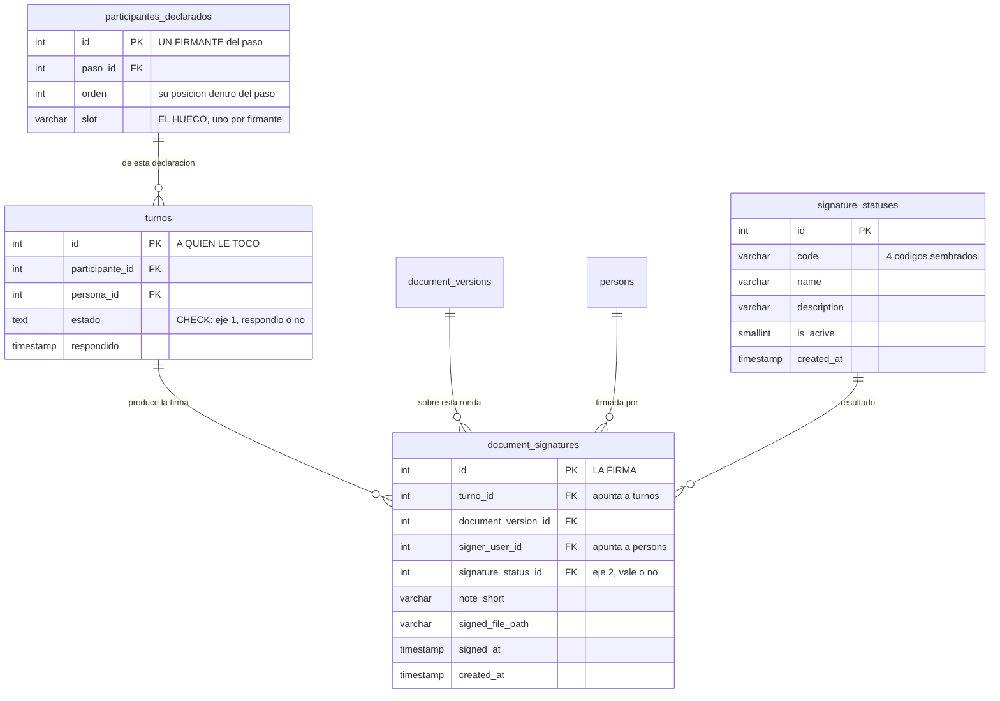

La firma **es un recorrido**, con la misma receta y la misma ejecución que la entrega: pasos
ordenados con sus participantes, un recorrido en marcha y sus turnos. Todo eso está en
[el capítulo anterior](/modelo/flujo-de-entrega/) y no se repite aquí.

Lo que la firma tiene de propio son **dos cosas**, y las dos importan:

1. **el hueco en el papel** — una firma no es un visto bueno, es una marca en un sitio concreto del
   PDF;
2. **si la firma vale** — responder no es firmar bien, y son dos ejes distintos.

:::note[Hasta el 2026-10-09 esto era un capítulo simétrico del anterior]

Y esa simetría era el problema: dos juegos de cuatro tablas, columna por columna, para el mismo
mecanismo. Lo que había aquí de más —una cabecera propia, un cupo de firmantes, una lista libre de
firmantes en JSONB— se fue, y el porqué de cada pieza está contado abajo porque explica el modelo de
hoy.

:::

## El hueco físico en el papel

Aquí es donde encaja el `token` de la persona, y es la parte del modelo que más cuesta ver porque
cruza tres mundos: la base, la maqueta del documento y el firmador.

**Cada firmante** tiene un **hueco** (`participantes_declarados.slot`): un nombre estable para «la
firma del revisor», «la firma del aprobador». La cadena completa es esta:

1. `persons.token` son **diez caracteres únicos** por persona, guardados limpios en la base.
2. La maqueta genera Jinja que embebe en ese hueco el token del firmante resuelto:
   `{{ signatures.<slot>.token }}`.
3. Al enviarlo al servicio de firma, el token se envuelve: `aB3xKp9mQr` viaja como `!-aB3xKp9mQr-!`.
4. Compilado el documento, esa marca queda **impresa en el PDF como texto**.
5. Al firmar, el firmador **busca ese texto dentro del PDF, encuentra su página y sus coordenadas y
   estampa la firma exactamente ahí**.

Por eso nadie tiene que colocar la firma a mano: la posición ya viaja dentro del documento. Con un
matiz — el servicio admite **dos modos**, `token` y `coordinates`; lo anterior describe el primero.

Los participantes de un paso de **entrega** no tienen hueco: `slot` queda nulo, y eso no es una
carencia. Entregar no deja marca en el papel.

:::caution[El hueco era del PASO, y con varios firmantes eso estalla al firmar]

Hasta el **2026-10-08** el `slot` era una columna del paso: **uno** para todo el paso. Con N
firmantes, la maqueta imprimía el token del primero y **los demás no tenían marca en el papel** — el
firmador lanzaba `Token marker '<token>' not found in PDF`. No era una ambigüedad de diseño: era un
fallo que estalla al firmar.

El hueco bajó al **participante**, que es de quien es: un hueco es un sitio físico con el token de
**una** persona. El primero conserva el del paso y los demás derivan el suyo añadiendo su orden.

:::

:::note[Un hueco repetido eran dos firmantes compartiendo un token, y respondía 200]

El slot se acuñaba por posición, así que insertar un paso en medio le daba el que otro firmante ya
tenía. Medido contra la base: insertar un paso en el orden 2 de una plantilla con tres pasos dejaba
**dos filas con el mismo slot** y la petición respondía **200** — en silencio, y con valor legal.

Hoy la unicidad tiene dos capas y las dos hacen falta: la autoría la valida con un 422 legible, y la
base la impone con un disparador. Es un disparador y no un índice porque el ámbito de la regla
**cruza dos tablas**: el hueco es del participante y el origen es del paso. El índice cubre a los
**otros dos escritores** —la receta de runtime y la copia de versionado—, que la validación de
autoría no toca.

:::

## Responder no es firmar bien: los dos ejes

El **turno** dice si alguien respondió. `document_signatures` dice si la firma **vale**. Son dos
hechos distintos y se guardan aparte:

| Dónde | Qué describe | Valores |
|---|---|---|
| `turnos.estado` | cómo va **el turno** de quien firma | `pendiente` · `en_progreso` · `completado` · `rechazado` · `cancelado`, cerrados por `CHECK` (`devuelto` es sólo de la entrega) |
| `signature_statuses` | cómo salió **la firma en sí** | `firmado` · `fallido` · `invalido` · `cancelado`, en una tabla de catálogo |

**Y la combinación manda.** Un turno `completado` cuya última firma salió `invalido` o `fallido
cuenta como **rechazo**, no como paso dado — por eso el recorrido de firma se lee siempre cruzando
las dos. Si sólo se mirara el turno, una firma técnicamente rota cerraría el paso igual que una
buena.

`signature_statuses` **sí sigue siendo una tabla**, y no por inercia: es el resultado de una
operación criptográfica, no el turno de una persona. El estado de **a quién le toca** era también un
catálogo propio —`signature_request_statuses`— y dejó de serlo: es el mismo concepto que en la
entrega, así que hoy es el mismo `CHECK` y el mismo vocabulario (ver
[los vocabularios de estado](/modelo/vocabularios-de-estado/)).

La **firma en sí** queda registrada en `document_signatures`: quién firmó, con qué resultado, cuándo
y en qué archivo quedó el documento ya firmado. Dos detalles de nombre:

- `signer_user_id` apunta a `persons` — el `user` es un fósil de la tabla `users`, que ya no existe;
- `turno_id` apunta a **`turnos`**, y es literalmente el enganche entre los dos ejes. Se llamó
  `signature_request_id` hasta el 2026-10-09, por la tabla `signature_requests` que ya no existe.

## Un paso puede pedir varias firmas

Y las pide como lo que son: **una fila por firmante**, con su resolutor, su ámbito y su hueco. Un
paso con tres firmantes son tres participantes, y el `orden` de cada uno dice en qué posición va.

**Un paso está aprobado cuando firman todos los suyos.** No hay modo que elegir.

:::caution[Hubo un «cupo», y se retiró entero]

El paso declaraba un modo de aprobación (`approval_mode`: `and` · `or` · `at_least`) con un mínimo y
un máximo. Las tres columnas se fueron, y conviene saber por qué, porque desde fuera parecía una
funcionalidad:

- `required_signers_max` **ya estaba muerto**: se escribía, se versionaba, se proyectaba al panel y
  se leía al hidratar el paso, pero **no llegaba al resumen que decide si un paso está completo**;
- `or` **producía basura medible**: al cerrar el paso con una firma, los turnos hermanos **seguían
  abiertos**, se listaban en el espacio de trabajo de quienes no firmaron y al pincharlos respondían
  «no pertenece al paso actual». `at_least` tenía el mismo defecto con un umbral;
- y el cupo existía porque **el conjunto de firmantes era indeterminado** —un cargo con ámbito amplio
  resolvía a N personas desconocidas de antemano—. Eso es justo lo que se quitó.

El constructor de recorridos en runtime sólo emitía `and`. Si algún día hace falta «basta uno», la
forma determinista es la **prelación** entre los participantes de un paso, y el `orden` ya está
puesto.

:::

:::tip[El punto frágil era la lista libre de firmantes, y se cerró]

Los firmantes vivían en un JSONB (`signers`) que **no validaba nadie** y que **mandaba sobre**
`resolver_type`, la columna que sí estaba cerrada por `CHECK`. Un paso antiguo podía traer por ahí una
forma de resolución ya retirada, y si el código dejaba de contemplarla, ese paso **no lo firmaría
nadie, y en silencio**. La copia de versionado lo propagaba verbatim. Era el **defecto 1.19**.

Se cerró **a filas**: los firmantes son participantes, con el mismo `CHECK` que tenía la columna del
paso, así que el valor retirado **no se puede ni insertar**. Con eso se fueron los dos resolutores
legados y cuatro de los seis ámbitos, que no eran ramas muertas por descuido: eran la única defensa
contra un valor que la base no podía rechazar.

El efecto más concreto está **fuera** del camino de firma: el disparador del relevo tenía dos
`UPDATE`, y el de firma llevaba una guarda defensiva —«si el JSONB menciona una persona concreta, ante
la duda no se mueve»— que existía exactamente por esto. Hoy es **un** `UPDATE` sin guarda.

:::

```mermaid
%% parcial — de `participantes_declarados` y `turnos` se dibujan SOLO las columnas que importan
%% firmando: el hueco en el papel y el eje de si la firma vale. Las dos tablas son del RECORRIDO y
%% ahi estan completas: [el recorrido del documento](/modelo/flujo-de-entrega/) y el mapa con todos
%% los campos. Dibujarlas enteras aqui repetiria once columnas para que se vieran dos.
erDiagram
  participantes_declarados ||--o{ turnos : "de esta declaracion"
  turnos ||--o{ document_signatures : "produce la firma"
  document_versions ||--o{ document_signatures : "sobre esta ronda"
  persons ||--o{ document_signatures : "firmada por"
  signature_statuses ||--o{ document_signatures : "resultado"

  participantes_declarados {
    int id PK "UN FIRMANTE del paso"
    int paso_id FK
    int orden "su posicion dentro del paso"
    varchar slot "EL HUECO, uno por firmante"
  }
  turnos {
    int id PK "A QUIEN LE TOCO"
    int participante_id FK
    int persona_id FK
    text estado "CHECK: eje 1, respondio o no"
    timestamp respondido
  }
  document_signatures {
    int id PK "LA FIRMA"
    int turno_id FK "apunta a turnos"
    int document_version_id FK
    int signer_user_id FK "apunta a persons"
    int signature_status_id FK "eje 2, vale o no"
    varchar note_short
    varchar signed_file_path
    timestamp signed_at
    timestamp created_at
  }
  signature_statuses {
    int id PK
    varchar code "4 codigos sembrados"
    varchar name
    varchar description
    smallint is_active
    timestamp created_at
  }
```
